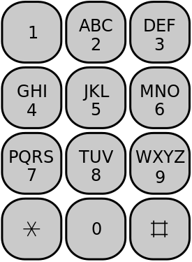

:skip-front-matter:

= Problem: Autocomplete

Questions? Feel free to head to https://www.reddit.com/r/cs50[CS50 on Reddit], http://cs50.stackexchange.com[CS50 on StackExchange], the `#cs50ap` channel on https://cs50x.slack.com[CS50x Slack] (after signing up), or the https://www.facebook.com/groups/cs50[CS50 Facebook group].

==  Objectives

* Begin to explore more complex data structures
* Test your comfort with pointers
* Test your comfort with recursion

== Academic Honesty

This course's philosophy on academic honesty is best stated as "be reasonable." The course recognizes that interactions with classmates and others can facilitate mastery of the course's material. However, there remains a line between enlisting the help of another and submitting the work of another. This policy characterizes both sides of that line.

The essence of all work that you submit to this course must be your own. Collaboration on problems is not permitted (unless explicitly stated otherwise) except to the extent that you may ask classmates and others for help so long as that help does not reduce to another doing your work for you. Generally speaking, when asking for help, you may show your code or writing to others, but you may not view theirs, so long as you and they respect this policy's other constraints. Collaboration on quizzes and tests is not permitted at all. Collaboration on the final project is permitted to the extent prescribed by its specification.

Below are rules of thumb that (inexhaustively) characterize acts that the course considers reasonable and not reasonable. If in doubt as to whether some act is reasonable, do not commit it until you solicit and receive approval in writing from your instructor. If a violation of this policy is suspected and confirmed, your instructor reserves the right to impose local sanctions on top of any disciplinary outcome that may include an unsatisfactory or failing grade for work submitted or for the course itself.

=== Reasonable

* Communicating with classmates about problems in English (or some other spoken language).
* Discussing the course's material with others in order to understand it better.
* Helping a classmate identify a bug in his or her code, such as by viewing, compiling, or running his or her code, even on your own computer.
* Incorporating snippets of code that you find online or elsewhere into your own code, provided that those snippets are not themselves solutions to assigned problems and that you cite the snippets' origins.
* Reviewing past years' quizzes, tests, and solutions thereto.
* Sending or showing code that you've written to someone, possibly a classmate, so that he or she might help you identify and fix a bug.
* Sharing snippets of your own solutions to problems online so that others might help you identify and fix a bug or other issue.
* Turning to the web or elsewhere for instruction beyond the course's own, for references, and for solutions to technical difficulties, but not for outright solutions to problems or your own final project.
* Whiteboarding solutions to problems with others using diagrams or pseudocode but not actual code.
* Working with (and even paying) a tutor to help you with the course, provided the tutor does not do your work for you.

=== Not Reasonable

* Accessing a solution to some problem prior to (re-)submitting your own.
* Asking a classmate to see his or her solution to a problem before (re-)submitting your own.
* Decompiling, deobfuscating, or disassembling the staff's solutions to problems.
* Failing to cite (as with comments) the origins of code, writing, or techniques that you discover outside of the course's own lessons and integrate into your own work, even while respecting this policy's other constraints.
* Giving or showing to a classmate a solution to a problem when it is he or she, and not you, who is struggling to solve it.
* Looking at another individual's work during a quiz or test.
* Paying or offering to pay an individual for work that you may submit as (part of) your own.
* Providing or making available solutions to problems to individuals who might take this course in the future.
* Searching for, soliciting, or viewing a quiz's questions or answers prior to taking the quiz.
* Searching for or soliciting outright solutions to problems online or elsewhere.
* Splitting a problem's workload with another individual and combining your work (unless explicitly authorized by the problem itself).
* Submitting (after possibly modifying) the work of another individual beyond allowed snippets.
* Submitting the same or similar work to this course that you have submitted or will submit to another.
* Using resources during a quiz beyond those explicitly allowed in the quiz's instructions.
* Viewing another's solution to a problem and basing your own solution on it.

== Assessment

Your work on this problem set will be evaluated along four axes primarily.

Scope::
 To what extent does your code implement the features required by our specification?
Correctness::
 To what extent is your code consistent with our specifications and free of bugs?
Design::
 To what extent is your code written well (i.e., clearly, efficiently, elegantly, and/or logically)?
Style::
 To what extent is your code readable (i.e., commented and indented with variables aptly named)?

To obtain a passing grade in this course, all students must ordinarily submit all assigned problems unless granted an exception in writing by the instructor.

== Getting Started

Start off by opening up CS50 IDE and then type 

[source,bash]
----
update50
----

within a terminal window to make sure your workspace is up-to-date. Next, navigate to your `workspace/chapterA` directory and execute the following:

[source,bash]
----
wget http://docs.cs50.net/2016/ap/problems/autocomplete/autocomplete.zip
----

Unzip that directory and navigate inside your newly created `autocomplete` directory. If you list the contents of your directory, you should see the following:

[source,bash]
----
Makefile  autocomplete.c  autocomplete.h  large.txt  small.txt  trie.c  trie.h
----

Make sure to watch the following shorts before you trie... err, __try__ this problem. Here are Doug and Kevin on tries:

video::TRg9DQFu0kU[youtube]

video::NKr6gWcXkIM[youtube]

And here are Zamyla and Doug for a quick refresher on recursion:

video::t4MSwiqfLaY[youtube]

video::VrrnjYgDBEk[youtube]

All right, here we go!

== History Lesson

Back in the days before smartphones, sending a text message actually used to be comparatively quite the ordeal. Though you may not pay much attention to them anymore, have you noticed that on telephones the number keys also have several letters on them?

For instance, on the above layout the digit `2` apparently also represents the letters `A`, `B`, and `C`.footnote:[The letters were primarily used as a mnemonic device, generally for business who wished to have a phone number that was memorable for their customers. A somewhat commonly-known example of this even today in the United States and Canada would be the phone number 1-800-356-9377, better known as __1-800-FLOWERS__.] And these letters formed the first standard that cell phone manufacturers settled on for inputting letters in text messages. If you wanted to type an `A` you pressed the `2` key once. If you wanted to type an `S` you pressed the `7` key four times. If you wanted to type an `N` followed by an `O`, you pressed the `6` key twice, waited for the `N` to be locked in, then pressed the `6` key three more times.

Needless to say, sending a text message was quite a bit slower.

Another method soon became quite common, known as the __Text on 9 Keys__ standard (T9). When sending a text message using T9, you would hit each number key you needed to hit as if it was the only letter on that key, and the software would algorithmically determine the most likely word you were trying to type. For example, if you wanted to type the word `HELLO`, you would enter `43556` on your mobile device. If you wanted to type the word `COMPUTER`, you would enter `26678837`. T9 was pretty smart, too; if you mistyped a key (for instance typing `36678837` instead), it would still algorithmically determine that you probably meant `COMPUTER` instead of, say `DOMPUTER` or `FOMPUTER`.

This was quite a bit faster, but not without its own issues. The most common problem was that a number of pairs of words have exactly the same set of key presses. For instance, if `42637` was entered, did the sender mean `GAMES` or `HANDS`? Unlike more modern devices, which usually consider context, T9 simply made a guess. Depending on the cell phone being used, there was then either an option to cycle through a list of words with the same T9 code to find the one intended, or in the worst case the user would have to revert to the "old school" method, turning T9 off temporarily to manually punch in the word one letter at a time.

Now, of course, smartphones just pull up a miniature version of a standard QWERTY (or local equivalent) keyboard, and rely on a large built-in dictionary and context from words previously typed to anticipate the word presently being entered, automatically completing your thoughts for you.footnote:[Don't worry, the singularity is probably still a while off. Probably.]

Autocompletion. Hey, that sounds like a fun problem to tackle!

== Trie This

The goal of this problem is to implement a form of autocompletion via the command line, relying upon a dictionary of words that we provide which have been meaningfully (and deliberately!) organized into a familiar data structure, the **trie**. By properly navigating that trie, it is possible to find all words in the dictionary beginning with a particular set of letters. (Perhaps Doug and Kevin's videos above can inspire you as to how one might do this!)

For example, if we run our finished `autocomplete` using the dictionary file called `large.txt`, searching for all words that begin with the string `help`, we should see output like the following (wherein underlined text represents user input):

[source,bash,subs=quotes]
----
username@ide50:~/workspace/chapterA/autocomplete $ [underline]#./autocomplete large.txt help#
help
helped
helper
helpers
helpful
helpfully
helpfulness
helping
helpless
helplessly
helplessness
helpmann
helpmate
helpmeet
helps
----

Those are all the words in the chosen dictionary file (`large.txt`) that start with the letters `help`. For those interested in learning more about Linux commands, the utility `grep` (globally search a regular expression and print) also can do this. If you

[source,bash]
----
grep ^help[a-z]* large.txt
----

you should see an identical list of words. An explanation of how `grep` works and what a regular expression (such as `^help[a-z]pass:[*]`) is, however, goes well beyond the scope of this course!

How should you start? We'd recommend perusing what we've already done for you!

First take a peek at `trie.h`, where we've defined a few globals and constants for this problem. We give you, for instance, defined constants for the maximum length of a word (`LENGTH`), the default dictionary if the user does not provide one (`DICTIONARY`), the number of children each node of the trie has (`CHILDREN`), and the ASCII value of the apostrophe character (`APOSTROPHE`). We also define what each node of the trie looks like, and globally define a pointer to the root of the trie we'll construct. Lastly, we provide prototypes for a few functions.

Now open up `trie.c`, which is where we provide the implementation for those function we've prototyped in `trie.h`. The `load` function opens up a dictionary text file and loads it into a trie data structure for you, setting up all the pointers and everything. (Phew!) The `map` function simply determines what index of the `children` array in each node that a letter corresponds to. For example, `A` and `a` map to 0, `B` and `b` map to 1, and so on. Because apostrophes are also a valid character, they map to the final element in that array, 26 (`CHILDREN - 1`). Notice the use of the ternary operator (`?:`) here; we've deliberately included it to show you how it can simply a more complex conditional branching structure and make code look quite a bit more elegant.

Make sure you understand how `load` works, as you'll have to use the information we store there later!

Now head over to `autocomplete.c`. Note that we've also set up `main` and dealt with managing the command line arguments for you. But it does seem as though we've neglected to complete the implementation of two important functions: `autocomplete` and `unload`! Note also that `main` has been configured to ultimately return what `autocomplete` returns, so if (when) you implement any error checking, you should have `autocomplete` return a nonzero value (as we typically have `main` return when something has gone awry) or, if you get all the way to the end, you should probably have `autocomplete` return 0! 

You are also in charge of unloading the trie, freeing all the memory we kindly malloced for you over in `trie.c`. 

== Recursing the Heavens

Recall from the shorts that whenever you need to index through a trie, you must do it recursively. As a result, you may find it most helpful to write some helper functions for both `autocomplete` and `unload`, as the declarations for each that we provide atop `autocomplete.c` should not be altered.

To make debugging via `gdb` easier, we've included a smaller dictionary, `small.txt`. To run the program with this smaller file, simply use `small.txt` as the second command line argument, after `./autocomplete` and before the letters you want to use as the basis for your autocompletion.

== A Trieing Experience

When all is said and done, your program should:

* Output all the words in the dictionary that start with the provided letters.
** You may not assume that the provided letters will be only either lowercase letters or the apostrophe character, and accordingly should be prepared to detect and deal with that error.
* Correctly recognize, and inform the user, if there are no words that start with the given letters, without the program crashing.
* Have no memory leaks and no memory usage errors when run through `valgrind`.

Be certain that at no point in your work on this problem that you modify either `trie.c` or `trie.h` (though you are welcome and indeed encouraged to look through those two files!). All of your work should be on making changes to either `autocomplete.c` and/or `autocomplete.h`.

To play with the staff's solution, feel free to run

[source,bash]
----
~cs50/chapterA/autocomplete
----

This was Autocomplete.
