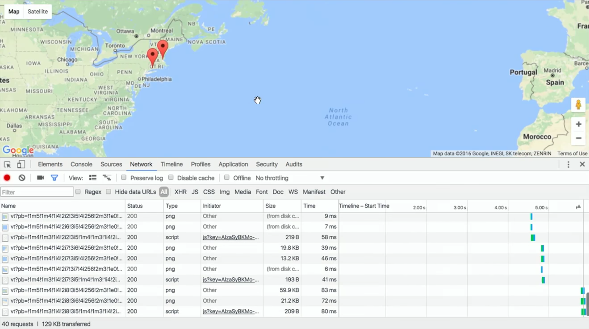

---
---
:author: Cheng Gong

= Week 10

[t=0m0s]
== Last Time

* We introduced SQL, a language we used to talk to databases and store and change data for the long-term.
* With that, we were able to complete a back-end, a web server that could actually respond to requests dynamically.

[t=1m0s]
== JavaScript Basics

* Today we'll learn one final language, JavaScript, that's more similar to C than Python, but the biggest difference now is how that code is run.
* Previously, our code was run on our own machines, but now the code we write in JavaScript will be run in the client, or user's, browser.
* JavaScript can also be used to write programs that run on servers, but we'll focus on its client-side applications.
* An example of what JavaScript can do is change the color of, or move, elements on a webpage when you hover over them, giving the page some interactivity.
* We'll quickly look at syntax:
+
[source, javascript]
----
function foo(bar, baz)
{
    ...
}
----
** Functions are declared with the word `function`, and require curly braces.
+
[source, javascript]
----
do
{
    ...
}
while (true);

while (true)
{
    ...
}

for (var i = 0; i < 50; i++)
{
    ...
}

for (var key in object)
{
    ...
}
----
** Loops are quite similar to those in C, and variables are loosely typed like they are in Python, with `var` as the keyword to declare them. And `true` and `false` are lowercased.
** Keys in objects can also be iterated over with `var key in object`.
+
[source, javascript]
----
i < 50

x < y

if (x < y)
{
    ...
}
else if (x > y)
{
    ...
}
else
{
    ...
}
----
** Boolean expressions and conditions, too, are the same as those in C.
+
[source, javascript]
----
var numbers = [4, 8, 15, 16, 23, 42];
----
** Arrays can also be declared, but we don't specify the type of variable that we'll store.
+
[source, javascript]
----
var quote = {
    name: 'Netflix, Inc.',
    price: 123.30,
    symbol: 'NFLX'
};
----
** Objects, like dictionaries in Python, have key-value pairs, that we can access.
** And for strings, single and double quotes are also both usable, as long as they are opened and closed the same way.
* JSON, JavaScript Object Notation, is a format for storing data in a hierarchy, and that looks like this:
+
[source, javascript]
----
{
    "name": "Netflix, Inc.",
    "price": 123.30,
    "symbol": "NFLX"
}
----

[t=1m0s]
== Events and DOM

* If we think back to our example of a simple HTML page, we can recall that the structure of this page can be represented by a tree:
+
image::dom.png[alt="HTML Document Object Model", width=800]
** With JavaScript, we can write code to change this tree after the browser has downloaded the HTML file and displayed it to the user.
* For example, there could be code running that waits for more data from the server, and adds a new node to the page when there is a new message or email from the server.
* So it turns out that JavaScript can "listen" for a lot of events, such as:
** `click`
** `mousedown`
** `mouseup`
** `mouseover`
** `drag`
** `keypress`
** `load`
** `unload`
** `change`
** `submit`
** `focus`
** `touchmove`
** `...`
* In JavaScript, multiple events can happen at the same time and unpredictably, so we can have event listeners that call functions when certain events are triggered, such as when the user clicks on an element.
* We'll need a few more features from JavaScript in our toolbox:
** Anonymous functions, functions that aren't named, will be more useful, especially if we only need to refer to them once.
** Callbacks, functions that are "called back" when an event happens. An event handler, or the function that an event listener calls when an event happens, is an example of a callback.
** Ajax, a technology that allows us to get more information from the server, after the original page has loaded.
* So we'll start with some examples:
+
[source, html]
----
<!DOCTYPE html>

<html>
    <head>
        
        <title>dom0</title>
    </head>
    <body>
        <form id="demo" onsubmit="greet(); return false;">
            <input id="name" placeholder="Name" type="text"/>
            <input type="submit"/>
        </form>
    </body>
</html>
----
** First, we created a `form` with an `id` of `demo`, and placed some ``input``s inside it. In particular, we have a `text` `input` with the `id` `name`.
** Then, in the `head` of the page, we use the `script` tag to indicate that we are including some JavaScript code, and declare a function `greet`.
** `greet` will then create an alert box with the `alert` function. But we've only declared the function here, and not called it. `alert` is one of many built-in functions of browsers that we can use, and find out more about, by reading online documentation.
** `document.getElementById` is also an object built into JavaScript that we can use, where `document` is the top-most node in the tree of the DOM, and we can call the `getElementById` method on that object to get an element in the document by its `id`. Then once we have the element, in this case the input box with `id` of `name`, we get its `value` and put that into the argument to `alert`, so it will be displayed in the alert box.
** In the `form` tag, we specify that `greet()` will be called when the `onsubmit` event occurs (which is when the user clicks the submit button), and then `return false;`, which tells the browser to not do anything else with the form.
* We can factor out our JavaScript code a little:
+
[source, html]
----
<!DOCTYPE html>

<html>
    <head>
        <title>dom1</title>
    </head>
    <body>
        <form id="demo">
            <input id="name" placeholder="Name" type="text"/>
            <input type="submit"/>
        </form>
        
    </body>
</html>
----
** Now we have assigned an anonymous function to the `onsubmit` property of the element `demo`, so when the user tries to submit the form, the code inside the function will be executed.
* We can define the function, but that's not necessary since we only need to refer to it once:
+
[source, javascript]
----
...
function greet()
{
    alert('hello, ' + document.getElementById('name').value + '!');
}

document.getElementById('demo').onsubmit = greet;
----
* Like in Python, there are libraries in JavaScript we can use. One such popular library is jQuery, which gives us more convenient ways to write:
+
[source, html]
----
<!DOCTYPE html>

<html>
    <head>
        
        
        <title>dom2</title>
    </head>
    <body>
        <form id="demo">
            <input id="name" placeholder="Name" type="text"/>
            <input type="submit"/>
        </form>
  </body>
</html>
----
** First, we need to include the jQuery library, with the `src` attribute in a `script` tag, much like an `import` or `include`.
** Then we need a line of code, `$(document).ready(function() {`, that ensures that the code inside only runs when the entire document has loaded.
** Inside, we use `$('\#demo')` to select the element with the ID `demo`. `$` is used to call the jQuery library, and `#` indicates the ID of some element. Then `submit` is used to attach an anonymous function as the event handler to the `submit` event. This time, the function takes an argument `event` that has information about the event.
** When that function is called, in the `alert` we use `$('#name').val()` to get the value of the input again. Finally, we use `event.preventDefault();` like `return false;`, to keep the browser from doing anything else with the form.
* In our previous example, if we had not used jQuery and `$(document).ready), we would have issues:
+
[source, html]
----
<!DOCTYPE html>

<html>
    <head>
        
        <title>dom1</title>
    </head>
    <body>
        <form id="demo">
            <input id="name" placeholder="Name" type="text"/>
            <input type="submit"/>
        </form>
    </body>
</html>
----
** The browser also reads this page from top to bottom, so if we tried to attach a function to the `onsubmit` event of the element with ID `demo`, the browser wouldn't be able to find it and not attach the function.
* We can resolve that with this, where the code inside only runs after the window has loaded:
+
[source, javascript]
----
...
window.onload = function() {
    document.getElementById('demo').onsubmit = function() {
        alert('hello, ' + document.getElementById('name').value + '!');
        return false;
    };
}
...
----

[t=2m0s]
== Form Validation

* Now we can implement something more useful, form validation on the client-side before any data is sent to the server. This is useful because, while our server should still check the data it receives, the user experience will be better since validation on the client-side is faster and doesn't require sending the data to the server, waiting for a response, and being sent to some other page.
* We have a basic form again:
+
[source, html]
----
<!DOCTYPE html>

<html>
    <head>
        <title>form0</title>
    </head>
    <body>
        <form action="/register" method="get">
            <input name="email" placeholder="Email" type="text"/>
            <input name="password" placeholder="Password" type="password"/>
            <input name="confirmation" placeholder="Password (again)" type="password"/>
            <input name="agreement" type="checkbox"/> I agree
            <input type="submit" value="Register"/>
        </form>
    </body>
</html>
----
* Let's validate this form with what we know now:
+
[source, html]
----
<!DOCTYPE html>

<html>
    <head>
        <title>form1</title>
    </head>
    <body>
        <form action="/register" id="registration" method="get">
            <input name="email" placeholder="Email" type="text"/>
            <input name="password" placeholder="Password" type="password"/>
            <input name="confirmation" placeholder="Password (again)" type="password"/>
            <input name="agreement" type="checkbox"/> I agree
            <input type="submit" value="Register"/>
        </form>
        
   </body>
</html>
----
** First, we get the `form` element by giving it an `id` of `registration`, and getting it by that ``id``.
** Then, when that `form` is submitted, we check each item in it, and if the values are empty or invalid, we show an alert box. Notice that our single quote inside the single quotes was escaped with `\'`.
** Finally, if nothing is wrong, then our function can `return true;`, and the browser will try to submit the form.
* The `register` route is just a simple Flask app that returns the following:
+
[source, html]
----
<!DOCTYPE html>

<html>
    <head>
        <title>register</title>
    </head>
    <body>
        You are registered!  (Well, not really.)
    </body>
</html>
----
* And we can write the exact same code like this with jQuery, which is longer in this case:
+
[source, html]
----
<!DOCTYPE html>

<html>
    <head>
        
        
        <title>form2</title>
    </head>
    <body>
        <form action="/register" id="registration" method="get">
            <input name="email" placeholder="Email" type="text"/>
            <input name="password" placeholder="Password" type="password"/>
            <input name="confirmation" placeholder="Password (again)" type="password"/>
            <input name="agreement" type="checkbox"/> I agree
            <input type="submit" value="Register"/>
        </form>
    </body>
</html>
----
* We could write our own code to validate forms with a nicer user experience, but there are many freely available libraries that solve similar problems that we can use.
* One such library is called Bootstrap, which we can include at the top by including the URLs of the source code for its CSS and JS files. We also include a library that has support for form validation on top of Bootstrap:
+
[source, html]
----
<!DOCTYPE html>

<html>
    <head>

        <link href="https://maxcdn.bootstrapcdn.com/bootstrap/3.3.7/css/bootstrap.min.css" rel="stylesheet"/>
        
        

        <!-- http://1000hz.github.io/bootstrap-validator/ -->
        

        <title>form3</title>

    </head>
    <body>
        

            <form action="/register" data-toggle="validator" id="registration" method="get">
                

                    <label for="email" class="control-label">Email</label>
                    <input class="form-control" id="email" required type="text"/>
                    

                

                

                    <label for="email" class="control-label">Password</label>
                    <input class="form-control" data-minlength="8" id="password" required type="password"/>
                    

                

                

                    <label for="confirmation" class="control-label">Password (again)</label>
                    <input class="form-control" data-match="#password" data-match-error="passwords don't match" id="confirmation" required type="password"/>
                    

                

                

                    

                        <label>
                            <input data-error="checkbox unchecked" id="agreement" required type="checkbox"/> I agree
                        </label>
                        

                    

                

                

                    <button class="btn btn-default" type="submit">Register</button>
                

            </form>
        

    </body>
</html>
----
** With this library, we don't even need to write our own JavaScript, but rather mark each input in our form with attributes like `required` and `data-error` to indicate the error message. Then the library will use these attributes to determine what inputs are valid. By reading documentation, we can figure out how to use features of this library, and others.
* With higher-level languages, we tend to get more and more features that others have built, which we can then reuse ourselves to build more interesting projects, without having to write every single detail ourselves.

[t=3m0s]
== Fun Features

* One fun feature that can be made with JavaScript is the blinking text, or even scrolling text:
+
[source, html]
----
<!DOCTYPE html>

<html>
    <head>
        
        
        <title>blink</title>
    </head>
    <body>
        

            hello, world
        

    </body>
</html>
----
** We'll use CSS to make our text bold and centered, but JavaScript to make our `div` alternatively visible and hidden, using it to change the CSS of that `div`.
** And we'll also use `window.setInterval`, built-in to browsers, to call that function every so often. Notice that we pass in `blink` as opposed to `blink()`, since we want to pass in the name of a function that will be called each time, rather than call the function once and pass in its value. Then our end result will be the appearance of blinking text.
* We can also store data locally in the user's browser:
+
[source, html]
----
<!DOCTYPE html>

<html>
    <head>
        <title>storage</title>
    </head>
    <body>
        
    </body>
</html>
----
** `localStorage` is another built-in object we can use to store values in, and in this case, we set `counter` in our `localStorage` to `0` if it doesn't already exist, otherwise we add `1` to it and set it back.
** `localStorage` only stores strings, so we use the `parseInt` function to get an integer from that string and add to it.
* We can even get the geographical location of the browser:
+
[source, html]
----
<!DOCTYPE html>

<html>
    <head>
        <title>geolocation</title>
    </head>
    <body>
        
    </body>
</html>
----
** When we try to call this function, the browser will display its own alert asking the user for permission to give the webpage its location, and then give it back to our function.
* Ajax, Asynchronous JavaScript and XML, is something we can use to get more data from our server after the page has initially loaded.
* These days, we tend to get back JSON rather than XML, but ajaj just doesn't have the same ring to it.
* In this example, jQuery will be more useful here, since we can call one function, `$.getJSON`, to get additional information:
+
[source, html]
----
<!DOCTYPE html>

<html>
    <head>
        
        
        <title>ajax0</title>
    </head>
    <body>
        <form onsubmit="quote(); return false;">
            <input autocomplete="off" autofocus id="symbol" placeholder="Symbol" type="text"/>
            <input type="submit" value="Get Quote"/>
        </form>
    </body>
</html>
----
** If we type a symbol into the form and submit it, rather than take us to another page, the browser runs the `quote` function.
** In that function, we get the symbol the user inputted, and build a URL with it. Then we get some JSON back from that URL with `$.getJSON`, and `alert` the user what the `price` property of that object is. Our function gets the JSON object back as an object called `data`, so we can access the `price` property with `data.price`.
** And we don't leave the page, so we can type in another symbol right away and get another quote.
* We can actually go to a URL of the form `/quote?symbol=SYMBOL` and see the JSON object:
+
[source]
----
{
    "name": "Netflix, Inc.",
    "price": 123.35,
    "symbol": "NFLX"
}
----
* Ajax takes this raw data, sent from a server, and does something with it for the user.
* We can again clean up our HTML and move all our JavaScript code to the top:
+
[source, html]
----
<!DOCTYPE html>

<html>
    <head>
        
        
        <title>ajax1</title>
    </head>
    <body>
        <form id="quote">
            <input autocomplete="off" autofocus id="symbol" placeholder="Symbol" type="text"/>
            <input type="submit" value="Get Quote"/>
        </form>
    </body>
</html>
----
* We can (and should) even factor out our JavaScript code into a separate file like `scripts.js`, much like how our CSS can be factored out into separate, reusable files.
* Instead of an alert, we can actually change the webpage live:
+
[source, html]
----
<!DOCTYPE html>

<html>
    <head>
        
        
        <title>ajax2</title>
    </head>
    <body>
        <form onsubmit="quote(); return false;">
            <input autocomplete="off" autofocus id="symbol" placeholder="Symbol" type="text"/>
            <input type="submit" value="Get Quote"/>
        </form>
        

    </body>
</html>
----
** We've added a `p` element with the `id` `quote`, and now when we get some data back from the `getJSON` function, we can use `$('#quote').html` to set the HTML contents of that element. And the contents will be a string we build from the data we're getting back from our ajax request.
** Then we set the value of `$('#symbol')` to an empty string, to make it easier for our users to type in another symbol right away.
* The JSON comes from a basic Flask app:
+
[source, python]
----
import csv
import os
import urllib.request

from flask import Flask, jsonify, render_template, request
from flask.exthook import ExtDeprecationWarning
from warnings import simplefilter
simplefilter("ignore", ExtDeprecationWarning)
from flask_autoindex import AutoIndex

app = Flask(__name__)
AutoIndex(app, browse_root=os.path.curdir)

@app.route("/quote")
def quote():
    url = "http://download.finance.yahoo.com/d/quotes.csv?f=snl1&s={}".format(request.args.get("symbol"))
    webpage = urllib.request.urlopen(url)
    datareader = csv.reader(webpage.read().decode("utf-8").splitlines())
    row = next(datareader)
    return jsonify({"name": row[1], "price": float(row[2]), "symbol": row[0].upper()})

@app.route("/register")
def register():
    return render_template("register.html")
----
** The `quote` route takes the `symbol` parameter from the URL and creates yet another URL, one which our server will make a request to on our behalf, belonging to Yahoo! Finance.
** That service will return a CSV file, so we will read the data from there with our friend `csv.reader` into a Python object `row`. Finally, we can return that as a JSON object with the `jsonify` function, but only including the keys and values we want to return.
* The advantage to ajax is that we can now have a dynamic webpage, that can get new information, without getting an entire webpage again from the server.
* But we still want to have protections like form validation on our server, since users can disable JavaScript in their browser settings, and then be able to send empty values to our server.
* Now, with the ability to get a user's location as well as more data (including images) from a server, we (or someone like Google!) can implement a map:
+
[source, html]
----
<!DOCTYPE html>

<html>
    <head>
        
        <title>map</title>
    </head>
    <body>
        

        
        
    </body>
</html>
----
** We have a little CSS at the top, and in our `body` just a `div` with `id` `map` but nothing inside it.
** With our `script` tag, we create a function called `initMap` that creates a `new google.maps.Map` and passes in as arguments the `div` called `map` that we want the map to be in, and other options we'd only learn about from reading documentation, its center and zoom.
** Then we create ``new google.maps.Marker``s that will be on the `map` object we just created, with certain ``position``s we specified.
** Then we include another `script` from Google's Maps service, and notice that at the end we pass in `callback=initMap`, so our function `initMap` will be called once that script is loaded.
** We also need to pass in a long `key` so that we can use Google's service (so they limit or charge for its use, for example).
* Our interactions with this service, and others, will likely be through an API, Application Programming Interface. An API is just documentation that describes how some service can be used programmatically. For example, in this case an API will tell us that, in order to create an object with `google.maps.Map`, we need to pass in the element where the map will be, and an object with certain keys that will set the center and zoom of the map.
* Going back to our map, if we click and drag around, with Chrome's Developer Tools open to the Network tab, we'll see requests being made to Google's servers for more and more images that make up new parts of the map:
+

* We can open the Elements tab, and see that there are now lots of new ``div``s inside our previously empty `map` `div`.
* So now we can start to see how powerful our own programming can be, as we now know enough to start using libraries and services other people have written, to create our own projects.
* And let's look at one final feature:
+
[source, html]
----
<!DOCTYPE html>

<html>
    <head>
        <link href="https://maxcdn.bootstrapcdn.com/bootstrap/3.3.7/css/bootstrap.min.css" rel="stylesheet"/>
        
        
        <title>modal</title>
    </head>
    <body>
        

            <button class="btn btn-default" data-target="#myModal" data-toggle="modal">Click Me</button>
            

                

                    

                        

                            <button aria-label="Close" class="close" data-dismiss="modal">&times;</button>
                            <h4 class="modal-title" id="myModalLabel">hello, world</h4>
                        

                        

                            hello, world
                        

                        

                            <button type="button" class="btn btn-default" data-dismiss="modal">Close</button>
                        

                    

                

            

        

    </body>
</html>
----
** In this page, we are creating a modal, or an alert that looks better than the default alert box:
+
image::modal.png[alt="Hello, world modal", width=800]
** And we get this for free by using the Bootstrap library.
* There are even more features to be found by checking out these libraries:
** https://jquery.com/[https://jquery.com/]
** http://getbootstrap.com/[http://getbootstrap.com/]
** http://1000hz.github.io/bootstrap-validator/[http://1000hz.github.io/bootstrap-validator/]
* Now let's look at a http://nifty.stanford.edu/2011/parlante-image-puzzle/[final example] that's quite similar to one of our problem sets from a few weeks ago. We used C to manipulate picture files and show hidden images, but the same can be done in JavaScript.
* The first example starts us off with:
+
[source, javascript]
----
im = new SimpleImage("iron-puzzle.png");
for (x = 0; x < im.getWidth(); x++) {
  for (y = 0; y < im.getHeight(); y++) {

    // code for each x,y pixel here

  }
}
print(im);
----
** and also tells us that we need to "set all the blue and green values to 0," and "multiply each red value by 10."
* To do that, we can get or set values in each pixel with functions implemented like `getRed` and `setGreen`.
* So we'll add these lines:
+
[source, javascript]
----
im = new SimpleImage("iron-puzzle.png");
for (x = 0; x < im.getWidth(); x++) {
  for (y = 0; y < im.getHeight(); y++) {
    im.setGreen(x, y, 0);
    im.setBlue(x, y, 0);
    var red = im.getRed(x, y);
    im.setRed(x, y, red * 10);
  }
}
print(im);
----
** And this code has all been running on the client-side, meaning we can change images live in the browser.
* With HTML, CSS, and JavaScript on the front-end, and Python and SQL on the back-end, we can now implement interactive web apps.
