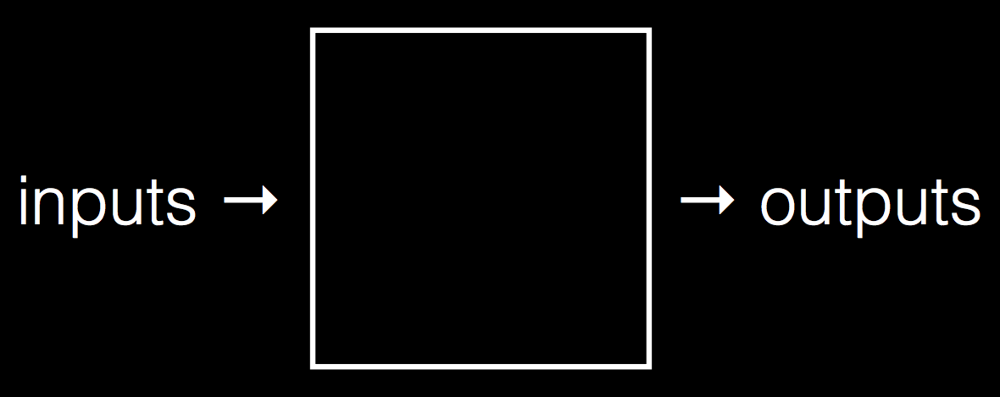

:author: Cheng Gong

= Week 11

[t=0m0s]
== Some Closure

* Today we'll look at some applications of computer science, and even get some closure about the course.
* Everything we've done thus far, with regards to problem solving, goes back to this model that we first saw in week 0:
+

** We use algorithms to take some inputs and produce some outputs, to solve a problem.
* Just 12 weeks ago, 73% of you have never taken a CS course before, but now you've learned so many languages and implemented so many applications.
* We want to remind you that "what ultimately matters in this course is not so much where you end up relative to your classmates but where you, in Week 11, end up relative to yourself in Week 0."
* And indeed, many of the staff were just where you were a year ago.
* We watch a short https://www.youtube.com/watch?v=zCLP-33AnK8[video of our staff], and thank them all, without whom the course would not be possible.
* You too, can be involved next year. Visit https://cs50.harvard.edu/apply[https://cs50.harvard.edu/apply] to find out how!
* The outros at the end of each lecture are actually scenes from a short film the production team wrote and filmed over the summer, which we've combined https://www.youtube.com/watch?v=h9dia3WkzJI[here] for you to get the full experience.
* We've also been using a camera that records in 360 degrees, so lectures can be recorded and watched in VR, virtual reality.
* You can use applications on your phone and move the screen around in space to watch from different angles, or even use special headsets to immerse yourself visually as if you were in lecture.
* So students all over can experience lecture, and we invite some students to the stage to demonstrate this with one such VR headset, the HTC Vive.
* In the archaeology department, VR technology has been used to transport users to different places and time periods, virtually.
* Professor Manuelian from the archaeology department talks to us about using technological tools to study the past.
* One problem to solve is how to take archives, drawings, and photos of the past and organize the data around locations or items, so connections can be made.
* For a particular object, we can now search for related objects, sites, or people, on http://gizapyramids.org/[http://gizapyramids.org/].
* A 3D model of the Giza Pyramids were also created recently, at http://giza3d.3ds.com/[http://giza3d.3ds.com/].
* The next step is to create a view that can be seen with VR headsets, for even more immersion.
* With VR, we can also see scenes and locations that have been digitally restored, which would not be otherwise possible.
* There are also smaller problems that fit the scope of CS50 Final Projects, suggested in the past, as well as Gen Ed courses on archaelogy if you'd simply like to learn more.
* In Problem Set 5, we created the Big Board in which students and staff can compete for the fastest spell-checker solution, and this year the student with the best code was Derek Wang.
* We also had a CS50 Coding Contest, and the top teams that ranked at the top were @big_board_boys, @fabulous_prizes, and @we_miss_u_huds.
* Coming up soon is the CS50 Hackathon, an overnight event in Cambridge where we'll serve multiple dinners and breakfast at IHOP, between which you'll work on your final projects. Sign up at https://cs50.harvard.edu/register[https://cs50.harvard.edu/register].
* We'll also be holding a CS50 Fair on each campus, where you'll present your final projects to other students, recruiters, and the entire campus.
* We hope you've been more comfortable approaching problems after this course, and we'll end on ...
* https://www.youtube.com/watch?v=LO26ThcsvF0[This was CS50.]
