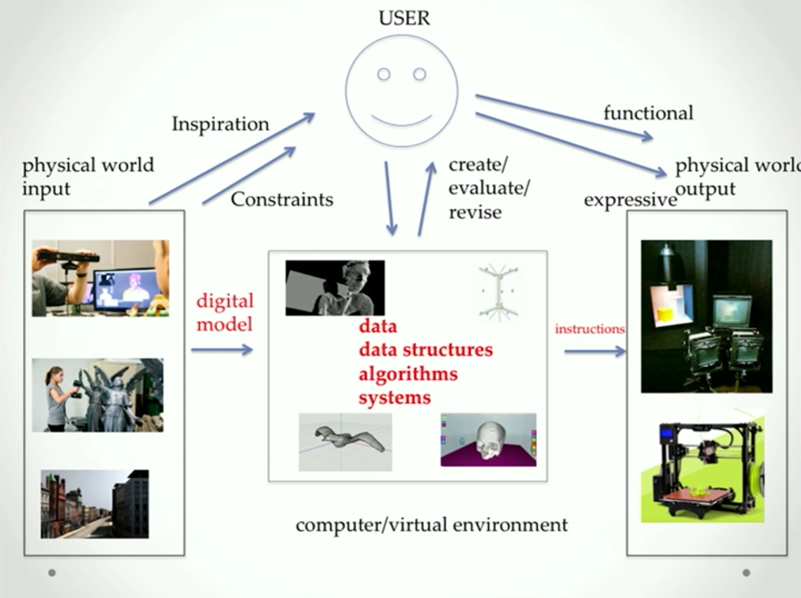
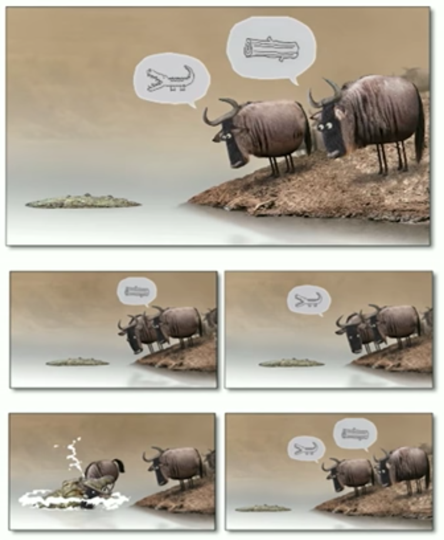

---
---
:author: Cheng Gong

= Week 11

[t=0m0s]
== CS at Yale

* It's been amazing to see the progress everyone's made this semester.
* We'll soon have the Hackathon in Cambridge, where we can meet friends while working on the final project, and the Fair, here in New Haven, where you can present those projects to the entire community.
* Today we'll start thinking about life after CS50, and present a few opportunities we have here at Yale, for those of you who want to continue down the path of learning Computer Science.
* Professor Rushmeier teaches a variety of courses in the CS department, including computer graphics.
* Computer graphics is the "use of computers to make and use images for exploration, communication, and expression."
* Research topics include how to generate realistic images and how different image processing methods can be applied to other fields, such as studying statues.
* Users find problems or areas of interest in the physical world, and data is taken to build digital models, which can then be used to find solutions or observations:
+

* Here at Yale, there are various courses and a wide range of projects in the area of computer graphics, such as digital humanities, where computers might be used to help analyze manuscripts.
* Professor Karbasi talks about sensing data, or how "systems can automatically acquire and reason about highly uncertain information."
* Applications include automated summarization (such as finding the most important parts of a lecture to watch), automated teaching, and machine learning.
* For automated summarization, an algorithm can take a short clip as input, and determine which frames are the most important:
+

* With automated teaching, we want to find a way to choose optimal examples to show, in order to teach classification.
* And finally, we want to build a robot to solve simple problems like opening a microwave with a low-fidelity sensor, figuring out how to by touching various points.
* Professor Negahban from the Statistics department gives a demo of separating two audio tracks that have been combined, of two commentators of a sporting match.
* With an algorithm that implement something called independent component analysis, a computer can separate the two tracks.
* Professor Negahban also shows a website, http://tylervigen.com/spurious-correlations[Spurious Correlations], where two completely unrelated signals that happen to correlate are placed next to each other.
* Professor Balakrishnan introduces systems, or the underlying foundation of a computer system that the higher-levels such as machine learning and computer graphics are built on.
* An important concept is abstraction, which hides the "complexity of hardware."
* One example is a file system, with which we can save files without knowing how each bit is actually saved to a disk.
* End-to-end metrics are an important way to measure how well a system performs, such as its throughput, latency, and reliability.
*

