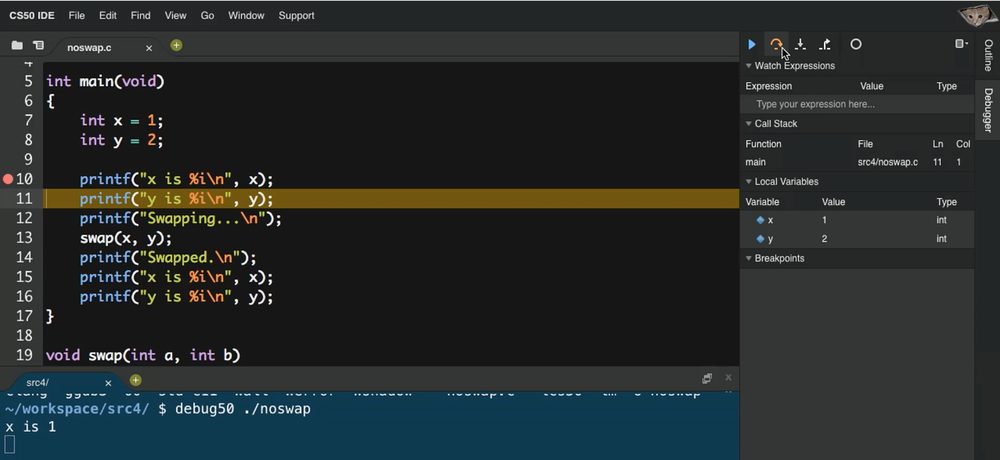
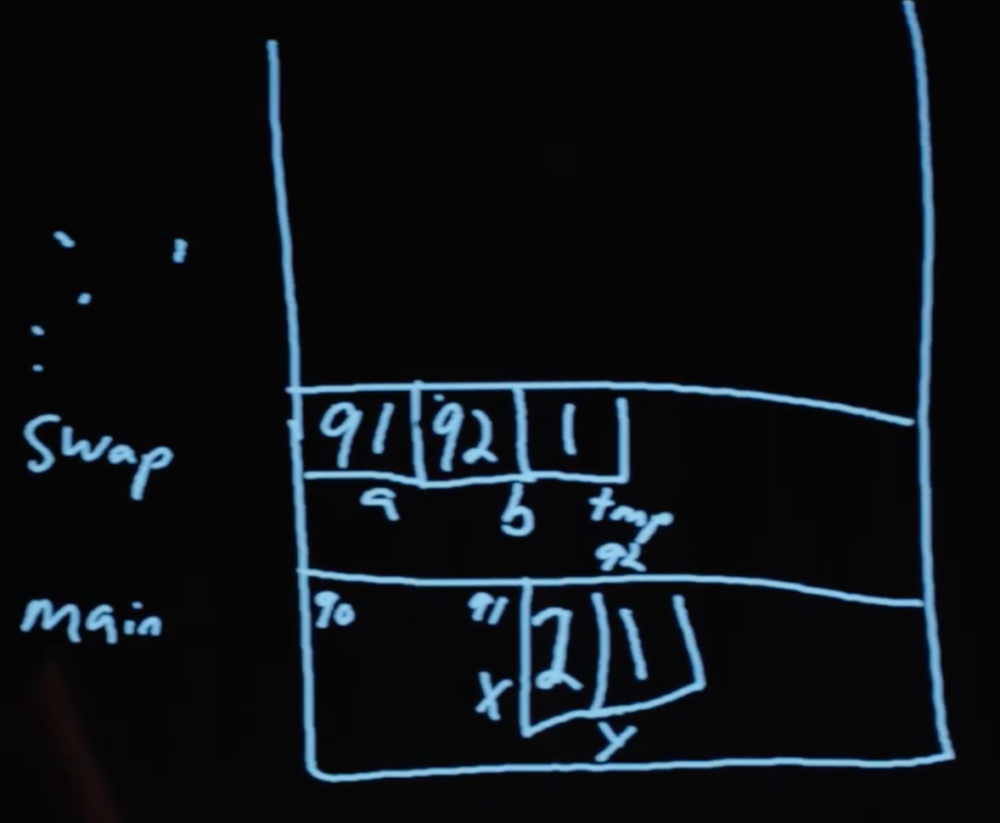
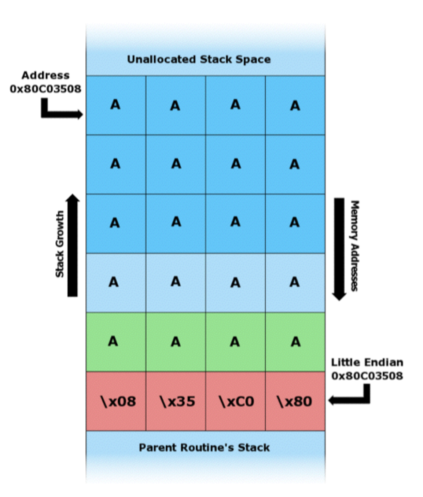
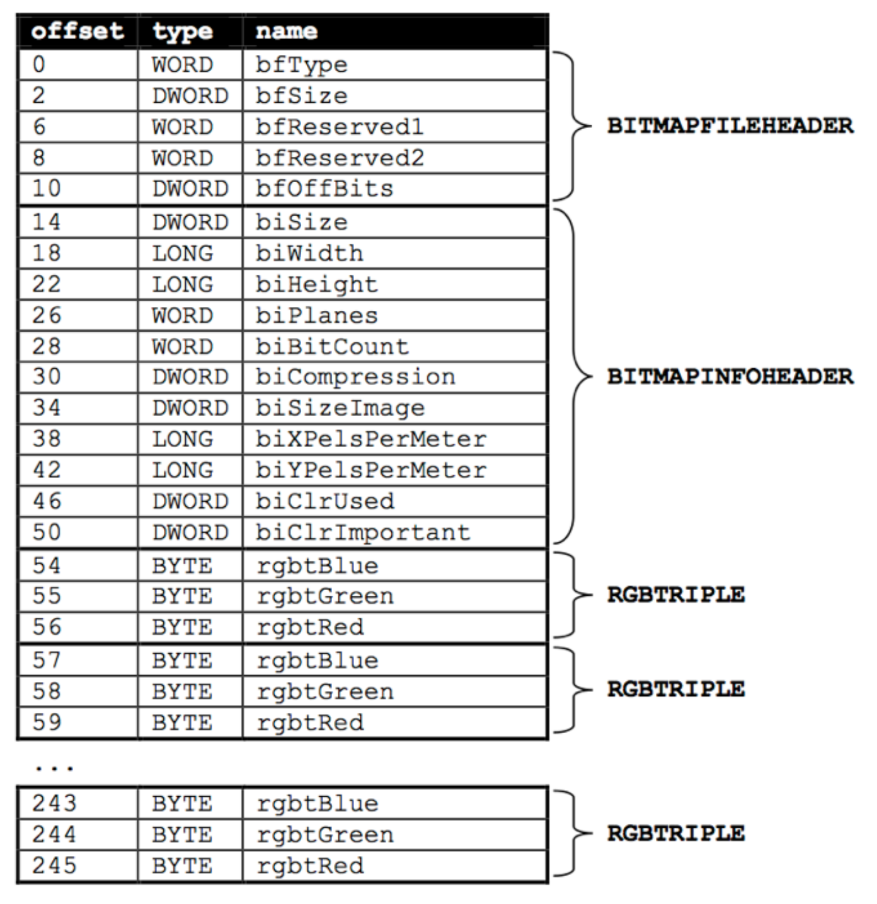

---
---
:author: Cheng Gong

= Week 4

[t=0m0s]
== Last Time

* Last time we looked at numbers and how we might search them and sort them, with algorithms like:
** linear search
** binary search
** bubble sort
** selection sort
** insertion sort
** merge sort
* We started using basic terms to describe running time (in units of steps taken), like:
** _n_^2^
** _n_ log _n_
** _n_
** log _n_
** 1
** ...
* The notation for running time includes:
** _O_, worst-case running time
** Ω, best-case running time
** Θ, if both of those are the same

[t=3m24s]
== Strings

* Now we'll take a closer look at strings and how they are actually stored by the computer.
* Let's look at `compare0.c`:
+
[source, c]
----
#include <cs50.h>
#include <stdio.h>

int main(void)
{
    printf("s: ");
    string s = get_string();

    printf("t: ");
    string t = get_string();

    if (s == t)
    {
        printf("same\n");
    }
    else
    {
        printf("different\n");
    }
}
----
** It looks like this program takes two strings from the user and compares them.
** But it doesn't work, when we put in two strings that look the same.
* Hm, mysterious. Let's try to copy the string:
+
[source, c]
----
#include <cs50.h>
#include <ctype.h>
#include <stdio.h>
#include <string.h>

int main(void)
{
    printf("s: ");
    string s = get_string();
    if (s == NULL)
    {
        return 1;
    }

    string t = s;

    if (strlen(t) > 0)
    {
        t[0] = toupper(t[0]);
    }

    printf("s: %s\n", s);
    printf("t: %s\n", t);

    return 0;
}
----
** Now we're getting a string `s` from the user, copying it to a string called `t`, and then making the first letter of `t` uppercase.
** But when we run the program, it again doesn't behave like we might expect. Both `s` and `t` are capitalized!
* Another example we can look at:
+
[source, c]
----
#include <stdio.h>

void swap(int a, int b);

int main(void)
{
    int x = 1;
    int y = 2;

    printf("x is %i\n", x);
    printf("y is %i\n", y);
    printf("Swapping...\n");
    swap(x, y);
    printf("Swapped.\n");
    printf("x is %i\n", x);
    printf("y is %i\n", y);
}

void swap(int a, int b)
{
    int tmp = a;
    a = b;
    b = tmp;
}
----
** We have a function called `swap` that's supposed to take two values, `a` and `b`, and swaps them. It takes `a`, puts the value into a temporary variable called `tmp`, and then stores the value of `b` into `a`. Then the value of `tmp`, which is the original `a`, is stored into `b`.
** But when we run this program, too, it doesn't swap the values of `x` and `y` in `main`.
* So we open our debugger, and step over each line of our program:
+

* Stepping into the `swap` function, we see that `a` and `b` are indeed the right values. But when we get back to `main`, `x` and `y` are still the same.

[t=15m13s]
== Memory

* It turns out that programs are given memory by the operating system, and areas of memory are set aside in a fairly standard way:
+
image::memory.png[alt="Memory", width=300]
** If we think about memory as a rectangle, a grid of bytes, each area (comprised of many many bytes) can be labeled as above.
** At the top is a chunk called "text," and that's actually where the machine code for your program is put in memory.
** Below that is the data, or variables, your program is using.
* Then we have something we call the stack. The "bottom" of our computer's memory, or the area with high addresses, is used for functions. In fact, for our C programs, the very bottom of the stack contains a chunk of memory for our `main` function, with any local variables or arguments:
+
image::stack.png[alt="Stack", width=300]
** Then on top, the next function called, such as `swap`, will have its own chunk of memory.
* And we can realize that each block, or byte, is individually addressed and stores some value, which explains what we saw earlier:
+
image::swap.png[alt="Swap", width=300]
** `swap` has its arguments passed in as copies.
* And once `swap` returns, its part of the stack is marked as usable (since it's returned), so `main` still sees the same `x` and `y`.
* And when we were comparing `s` and `t` earlier, we were actually comparing two memory addresses. When we call `get_string()`, we're actually storing the characters of the string somewhere else in memory (since we don't know how big the string will be). For example, if we called `get_string` and the user typed in `Zamyla`, the characters might be stored in memory starting at address `123`. (Recall that a string is just an array of characters, each one in a byte in a consecutive set of bytes.) So our `s` will have the value `123`.
* And when we call `get_string` again for another string, `t`, whatever the user types in will be stored somewhere else in memory, regardless of its contents. So `t` might have the value `234` if the second string was stored starting at byte `234`. (And this address is "dynamically allocated" by a C library, since we don't necessarily know ahead of time how big the string will be.)
+
image::strings.png[alt="Strings", width=500]
* When we tried to capitalize just one string, too, we were just setting `t` to the address of the string `s` was pointing to:
+
image::strings2.png[alt="Strings", width=500]
* In fact, we can think of both `s` and `t` as "pointers" to values that we care about. So in the end, what we knew as a `string` type was really just a pointer to a character (the start of a "string"). (And recall that we recognize the end of a string by the `\0` character, so we don't need to store the length or the ending address.)
* So how might we compare a string?
+
[source, c]
----
#include <cs50.h>
#include <stdio.h>
#include <string.h>

int main(void)
{
    printf("s: ");
    char *s = get_string();

    printf("t: ");
    char *t = get_string();

    if (s != NULL && t != NULL)
    {
        if (strcmp(s, t) == 0)
        {
            printf("same\n");
        }
        else
        {
            printf("different\n");
        }
    }
}
----
** Now that we know what `get_string` actually returns, we can set the type of our variable `s` to `char *`, or a pointer to a character. (And indeed the CS50 Library has just been mapping all mentions of `string` to `char *` this whole time!)
** Turns out, there exists a library function called `strcmp` that compares strings, and returns `0` if they're the same. And `strcmp` probably does that with a loop looking at the ``i``th character in each string, comparing them one at a time.
* To make a copy of a string, we do something a little fancier:
+
[source, c]
----
#include <cs50.h>
#include <ctype.h>
#include <stdio.h>
#include <string.h>

int main(void)
{
    printf("s: ");
    char *s = get_string();
    if (s == NULL)
    {
        return 1;
    }

    char *t = malloc((strlen(s) + 1) * sizeof(char));
    if (t == NULL)
    {
        return 1;
    }

    for (int i = 0, n = strlen(s); i <= n; i++)
    {
        t[i] = s[i];
    }

    if (strlen(t) > 0)
    {
        t[0] = toupper(t[0]);
    }

    printf("s: %s\n", s);
    printf("t: %s\n", t);

    free(t);

    return 0;
}
----
** We get `s` as usual, but then for `t` we use another C library function called `malloc`, which allocates some memory for us to use. The amount of memory we ask for is the length of `s` (plus 1 for `\0` to end the string), times the size of a single character. And if `malloc` returns `NULL` for `t`, that means something went wrong (perhaps we ran out of memory), so our program too needs to check for that and return an error if so.
** Now we can deliberately go through the entire string, and one past the end of the string, to copy the `\0` character. Then we'll have a copy of `s` in `t`, and changing something in `t` will no longer change `s`.
** Finally, at the end of our program, we should make the habit of calling `free` on our manually allocated memory, which marks it as usable again.
+
image::capitalize.png[alt="capitalize", width=500]

[t=45m11s]
== Pointers

* We can also fix our `swap`:
+
[source, c]
----
#include <stdio.h>

void swap(int *a, int *b);

int main(void)
{
    int x = 1;
    int y = 2;

    printf("x is %i\n", x);
    printf("y is %i\n", y);
    printf("Swapping...\n");
    swap(&x, &y);
    printf("Swapped!\n");
    printf("x is %i\n", x);
    printf("y is %i\n", y);
}

void swap(int *a, int *b)
{
    int tmp = *a;
    *a = *b;
    *b = tmp;
}
----
** Now we're passing in pointers to our `main` function's `x` and `y`, and swapping their values directly. The syntax to get an address of variable is with `&`, and to go the other way and get the value at some address is with a `*`. (Not to be confused with declaring a pointer, which would be using `char *` or `int *` to say "I would like a new variable that stores a pointer to a `char` or `int`.")
* So now our `swap` function gets the addresses of ``main``'s `x` and `y`, and can swap them (with the help of a temporary variable):
+

* Now that we know the basics of pointers, we can do even more with them:
+
[source, c]
----
#include <cs50.h>
#include <stdio.h>
#include <string.h>

int main(void)
{
    // get line of text
    char *s = get_string();
    if (s == NULL)
    {
        return 1;
    }

    // print string, one character per line
    for (int i = 0, n = strlen(s); i < n; i++)
    {
        printf("%c\n", *(s+i));
    }
}
----
** This program just prints a string, one character at a time. Since `s` is a pointer to the first character (the address of the first character), adding `i` to it means we'll get the address `i` characters down. For example, if the first character started at address `123`, the third character (2 down) will be at address `125`. And so we can use our `*` notation to access the character at that address. (And we've used `s[i]` before, which actually means the exact same thing. The C language has this feature as "syntactic sugar" which means that it's convenient and easy to read, but not necessary to have, since we can express it otherwise.)
* At the same time, it's easier to write buggy code:
+
[source, c]
----
int main(void)
{
    int *x;
    int *y;

    x = malloc(sizeof(int));

    *x = 42;

    *y = 13;

    y = x;

    *y = 13;
}
----
** We allocate memory that can hold an `int`, and point `x` to it. Then we set that to `42` with `*x = 42`, since we got a chunk of memory to use.
** But the next line will not work and even crash our program, because `y` is pointing to ... somewhere in memory, and we're just changing that random value to `13`. When we declare a variable, we have some area of memory allocated to it, but the value inside is some random garbage value.
* We'll watch a https://www.youtube.com/watch?v=6pmWojisM_E[quick animation] about pointers.

[t=59m55s]
== More Memory

* Another problem is memory leaks. If we allocate a lot of memory and not call `free`, or mark it as usable again, then our computer has less and less memory.
* `valgrind` is another command-line tool that we can use to check for these memory leaks.
* Let's run:
+
[source, c]
----
// http://valgrind.org/docs/manual/quick-start.html#quick-start.prepare.

#include <stdlib.h>

void f(void)
{
    int *x = malloc(10 * sizeof(int));
    x[10] = 0;
}

int main(void)
{
    f();
    return 0;
}
----
** We're going to call some function `f` that allocates memory for 10 integers, but never frees it. `f` also tries to access the "10"th element of that array of integers, but since we start counting at `0`, `x[10]` is actually the 11th element, which we did not allocate, and so actually holds something else in memory that could be important.
** If we save this as `memory.c` and `make memory`, we can run `valgrind --leak-check=full ./memory`.
** Then we'll see something like:
+
[source]
----
Invalid write of size 4
    at 0x4005FF: f (memory.c:21)
    by 0x400623: main (memory.c:26)
...
40 bytes in 1 blocks are definitely lost in loss record 1 of 1
    at 0x4C2AB80: malloc in /usr/lib/valgrind/vgpreload_memcheck-amd64-linux.so)
    by 0x4005F6: f (memory.c:20)
    by 0x400623: main (memory.c:26)
----
** We see that the output is a little hard to read, but ultimately the source of these errors come from some lines in `memory.c`.
** We can fix this program by changing `f`:
+
[source, c]
----
...
void f(void)
{
    int *x = malloc(10 * sizeof(int));
    x[9] = 0;
    free(x);
}
...
----
* If we look back to our layout of memory, we see another area called the heap, and that is where these ``malloc``ed chunks of memory come from:
+
image::memory.png[alt="Memory", width=300]
* The stack contains memory that disappears as functions return, but the heap contains memory that will be usable until we `free` it.
* And if we look at the arrows, we see the implication that they might collide if we use too much memory in the heap and too much memory in the stack, as they grow in opposite directions.
* "Stack overflow" is the term for a stack that has grown too large, perhaps if we have a recursive function that calls itself too many times.
* "Heap overflow" is the term for a heap that is too large, perhaps if we called `malloc` for large chunks of memory without ever calling `free`.
* "Buffer overflow" is the overarching term for when too much data is placed into a finite amount of allocated space.
+
[source, c]
----
#include <string.h>

void foo(char *bar)
{
    char c[12];
    memcpy(c, bar, strlen(bar));
}

int main(int argc, char *argv[])
{
    foo(argv[1]);
}
----
** We see buffer overflow in a program like this. `main` calls the function `foo` and passes in whatever the command-line argument to it is. `foo` then copies it to a `char` array `c`, but `c` can only hold 12 characters. (`memcpy` copies from `bar` into `c`, for as many bytes as `strlen(bar)`. And our friendly `man` pages tells us this and more.) So if the command-line argument is too long, then the rest it will "overflow" and be written to the chunk of memory right after what's allocated to `c`.
* And since `c` is a static variable, it will be on the stack, which means that whatever the user passed in as a command-line argument will be written to the stack, and possibly executed as machine code!
* Let's take a look at this diagram:
+
image::stack1.png[alt="Stack overflow 1", width=400]
** The bottom, "Parent Routine's Stack," is like the code for `main`. On top of that is the "Return Address," or the location of the code the function should return to, once it's done (since it could be called somewhere different in `main` each time).
** Now let's look in the stack of our function. We see `char *bar`, the argument to `foo`, first, because the stack grows upwards. Then we have the array `char c[12]`, with a grid representing the first character `c[0]` and a grid for the last, `c[11]`, and the rest in between. And if we start writing to `c`, we might start overwriting other values.
* For example, with a short string, we have memory that looks like this:
+
image::stack2.png[alt="Stack overflow 2", width=400]
* But with a longer string, we might copy over other values:
+

** The return address is actually overwritten with the address of the beginning of the string, so our program will actually go back to that and execute the string there as machine code.

[t=1h26m53s]
== Images

* An application of using pointers is in manipulating images.
* When we zoom in on an image, we see something like this:
+
image::zamyla.png[alt="Zamyla", width=400]
** Each grid is a pixel, since an image has a finite size and thus finite information in it.
* A black and white smiley face might be represented in binary like this: image:smiley.png[alt="Smiley",width=400]
** With the bit `1` to represent black and `0` for white, we can create a "bitmap" image.
* The bitmap format is like the JPEG format for images, except that JPEGs use compression, which makes images smaller by using fewer bits, and throwing away some of the information. And JPEG files all start with the same three bytes, `255`, `216`, `255` as a standard, to indicate its filetype.
* We've learned binary and decimal, and there is also hexadecimal, which uses 16 symbols instead of 10, with the symbols `0-9` and `a`, `b`, `c`, `d`, `e`, `f`.
* `255` in decimal is `1111 1111`, and `216` is `1101 1000`. Each of those four bits, since they can hold 16 values, map perfectly to hexadecimal. `1111` is `f`, `1101` is `d`, and `1000` is `8`. So `255` is the same as `ff`, and `216` is the same as `d8`. And it's convention to write hexadecimal as `0xff` and `0xd8`.
* Knowing this, we can recover JPEGs (if files were deleted but not overwritten) from raw binary data, in a similar way to detecting strings (with a starting value and an ending value).
* Bitmap files, with the extension BMP, are older and less efficient since they don't have compression. But they are easier to work with since each pixel has some number of bytes.
* The file header, or what should go at the beginning of the file, of BMPs look like this:
+

** Files are just a sequence of bits, and if we think of each byte as having some offset from the beginning, we can specify exactly what should be in a file for it to be valid.
** We see a few fields we might be able to guess the values for, like `biWidth` and `biHeight`.
** But the most interesting part is the repeating sequence at the end, an `RGBTRIPLE` comprised of three bytes that each represent the colors blue, green, and red. With those three colors in various amounts, we can display millions of different colors.
* And we'll learn one new keyword to easily represent this, a `struct`. We can create a more complicated data type and name it:
+
[source, c]
----
typedef struct
{
    string name;
    string dorm;
}
student;
----
** To represent a student, we can include two pieces of information, `string name` and `string dorm`.
* And we can use this container like so:
+
[source, c]
----
#include <cs50.h>
#include <stdio.h>
#include <string.h>

#include "structs.h"

#define STUDENTS 3

int main(void)
{
    student students[STUDENTS];

    for (int i = 0; i < STUDENTS; i++)
    {
        printf("name: ");
        students[i].name = get_string();

        printf("dorm: ");
        students[i].dorm = get_string();
    }

    for (int i = 0; i < STUDENTS; i++)
    {
        printf("%s is in %s.\n", students[i].name, students[i].dorm);
    }
}
----
** We can create an array of `student` structs called `students`, with `STUDENTS` number of elements.
** We used `#define STUDENTS 3` to set a constant, `STUDENTS`, to the value `3`. This prevents having to make a variable that might otherwise be changed.
** Then we can access properties in the structs with syntax like `students[i].name`, since `students` is an array and `students[i]` gets an individual `student` struct for us to use.
* We can even open a file in C and use it with our structs:
+
[source, c]
----
#include <cs50.h>
#include <stdio.h>
#include <stdlib.h>
#include <string.h>

#include "structs.h"

#define STUDENTS 3

int main(void)
{
    student students[STUDENTS];

    for (int i = 0; i < STUDENTS; i++)
    {
        printf("name: ");
        students[i].name = get_string();

        printf("dorm: ");
        students[i].dorm = get_string();
    }

    FILE *file = fopen("students.csv", "w");
    if (file != NULL)
    {
        for (int i = 0; i < STUDENTS; i++)
        {
            fprintf(file, "%s,%s\n", students[i].name, students[i].dorm);
        }
        fclose(file);
    }
}
----
** Here we are using the `FILE` type, part of C, and a library function `fopen`, that allows us to open files. `"w"` allows us to write to the file.
** After we use `fprintf`, another library function to write to the `file`, we close the file.
* With all these tools, we can now do more and more interesting things!
