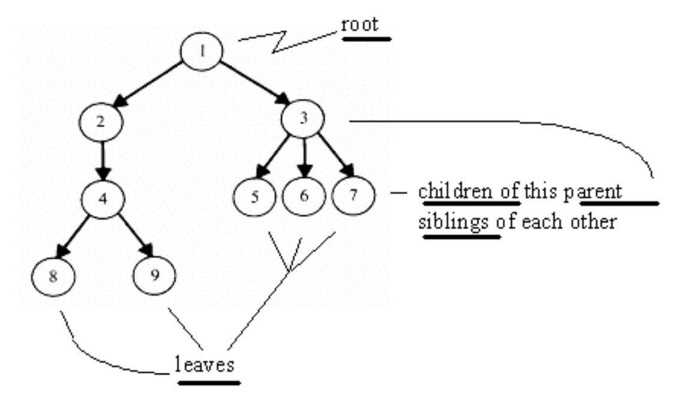
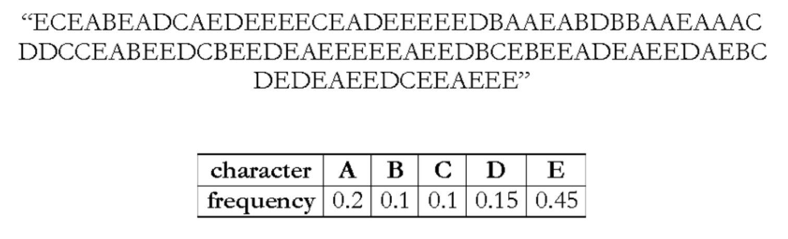
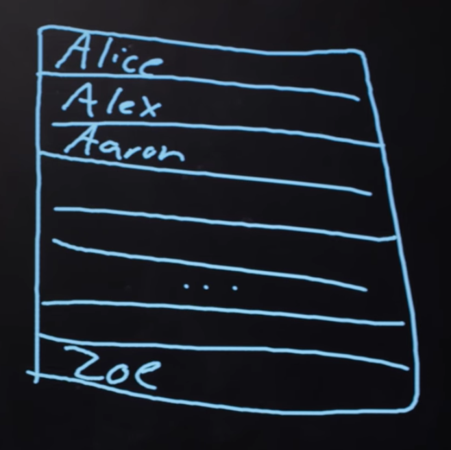
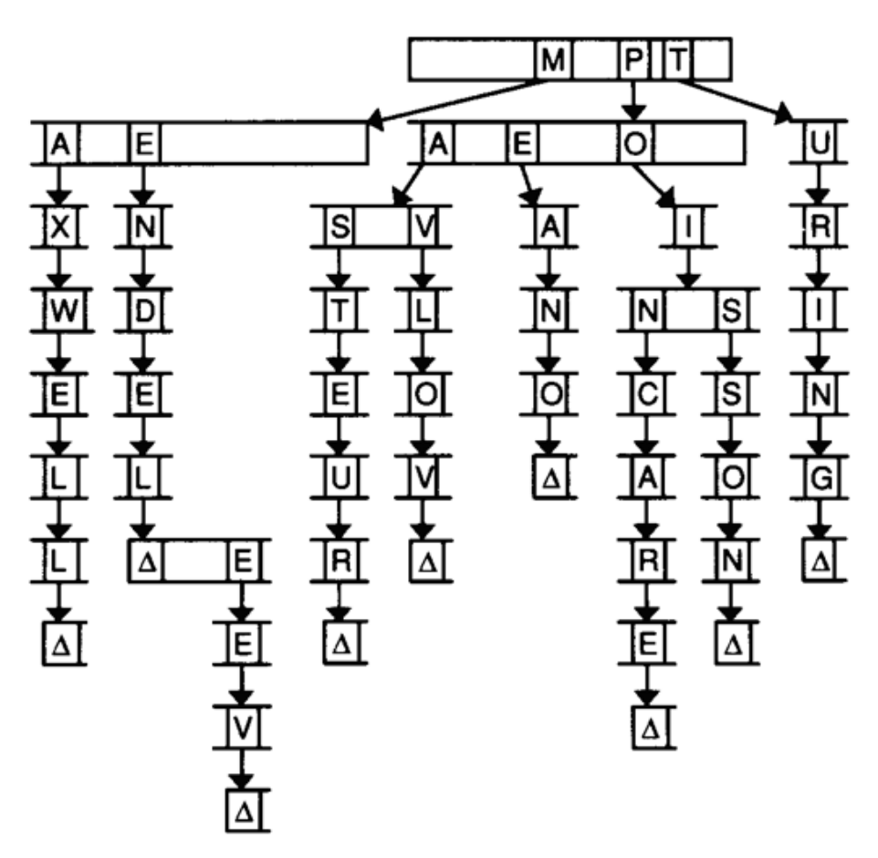

---
---
:author: Cheng Gong

= Week 5

[t=0m0s]
== Last Time

* We started talking about pointers, an address to a location in memory where a piece of data might be stored.
* In C, we can go to these locations and allocate more memory to use.
* We looked at this diagram, which showed how memory is divided up into regions for specific things:
+
image::memory.png[alt="Memory", width=400]
** The stack contains slices of memory for functions and their local variables.
** The heap has dynamically allocated memory, or memory allocated when the program is running, if we don't know ahead of time how much memory we'll need.
** The data regions are for storing variables we've declared, and the text contains the actual code for our program.
* We also figured out how to swap variables by passing in pointers and changing the values they point to:
+
[source, c]
----
void swap(int *a, int *b)
{
    int tmp = *a;
    *a = *b;
    *b = tmp;
}
----
** `int *a` declares a pointer to an `int` with the name `a`, and later using `*a` means we are going to the location `a` points to, and retrieving the value there (also known as dereferencing a pointer).
* We also looked at images and file formats, and also our own data types.

[t=7m34s]
== Linked Lists

* Arrays store the same type of data in a consecutive chunk of memory, so we can jump to each location by knowing its index.
* But we have some limitations. If we wanted to increase the size of an array, we can't always add another element to the end of it, since the memory right after it might be used to store some other variables.
* We could allocate memory of a bigger size, copy what we had before to the new location, and add elements there, but that requires more and more work as our array grows bigger and we have more to copy.
* But with the ability to dynamically allocate memory and create our own data types, we can do something like this:
+
image::linked_list.png[alt="Linked list", width=500]
** Here we have 5 sorted numbers in a data structure known as a linked list. Each of these rectangles containing a number and an arrow we'll call a node, and the arrows will just be a pointer to the next node. This way, the elements no longer need to be contiguous in memory, and we can allocate new elements one at a time.
* We'll create nodes with a `struct` like this:
+
[source, c]
----
typedef struct node
{
    int n;
    struct node *next;
}
node;
----
** A node will contain the `int n` but also a pointer to the next node, a `struct node *` named `next`.
* With this data structure, we can have operations like `delete`, `insert`, and `search`.
* We can implement these functions fairly intuitively.
* Going back to our first diagram, we need at least a pointer called `first` to point to the first node, the start of the list. And the last node will have a pointer to `NULL`, so we can know we're at the end of the list.
* To search for an element in the list, we need to start with the first element, follow the pointer to the second element, and so on. This is because each node could be anywhere in memory, so we can't use strategies like binary search. So the running time of this linear search will be O(_n_), even if our list is sorted.
* Insertion would be O(1) if we didn't want to keep the list sorted, since we can just insert the number at the beginning. We'll have `first` point to our new node, and have the new node's `next` pointer point to the previously first node. But if we want to keep the list sorted, we'd have to find the correct location to insert the number first, which would again take running time O(_n_).
* Similarly, deleting a node will also take O(_n_) since we'll need to find the number want to delete first.
* We demonstrate inserting  with a few volunteers. We need to be careful when inserting at the end of the list, since we need to update the last node to point to the new node before we follow its `NULL` pointer and lose track of it. We also need to be careful when inserting into a list, since we need to change the new node to point to the next node before we change the previous node's pointer (since that's the only place we keep track of the next node).
* Removing elements would require carefully ordering the operations we do, since we don't want to lose parts of our list or our node before we `free` its memory.
* Let's implement the search function, which will help us with learning the syntax of using nodes, structs, and pointers:
+
[source, c]
----
bool search(int n, node *list)
{
    node *ptr = list;
    while (ptr != NULL)
    {
        if (ptr->n == n)
        {
            return true;
        }
        ptr = ptr->next;
    }
    return false;
}
----
** Our function declaration takes in two arguments, the `n` we are looking for, and the list, which is a pointer to the first `node`.
** We make a temporary `node *ptr` we can use, and set it to what the list is.
** Then, while there is an element in the list, we use `ptr->n` to follow the pointer to a node struct, and access the `n` stored within. If it's what we're looking for, we `return true`, and otherwise, we set our `ptr` to the next element in the list.
** Once we have no more elements in the list to look at, we can `return false`, since we would have returned `true` if we found `n` already.
* With linked lists, we get the ability to grow and shrink it as we need, but slower searches and insertions and deletions, and overall in CS there tends to be a theme of tradeoffs between time or space or complexity.

[t=41m26s]
== Stacks and Queues

* Imagine a stack of trays, where you can easily take the top tray off or put another tray on top, but not much else. A data structure with this metaphor, called a stack, does exist, with the operations `push` and `pop`, that stores and removes items respectively.
* The property we now get is that the last item we pushed, will be the first one we pop. And there are applications where this property is useful, such as our stack in memory where the next function being called is placed on top of the previous function.
* We could implement this ourselves:
+
[source, c]
----
typedef struct
{
    int numbers[CAPACITY];
    int size;
}
stack;
----
** Now we have a struct `stack`, with an array of ``int``s called `numbers` with size `CAPACITY` we can define elsewhere. And it also will have a property called `size`, since we won't always have as many items in our stack as its capacity.
* And instead of storing the entire array in our struct, we can store just the pointer to the first element:
+
[source, c]
----
typedef struct
{
    int *numbers;
    int size;
}
stack;
----
** Now we can `malloc` some chunk of memory to store our numbers, and only store a pointer in our struct. We also have the benefit of being able to choose how big we want each stack to be.
* A queue would be the opposite of a stack. In a queue, the first item in will be the first item out, like a line of people. We'll have operations `enqueue`, which places an element at the end of the list, and `dequeue`, which takes the first element from the beginning of the list.
* With a queue, we need to keep track of a little more information:
+
[source, c]
----
typedef struct
{
    int front;
    int numbers[CAPACITY];
    int size;
}
queue;
----
** Here we use an array to store our queue, but now we also need to keep track of where the front of the queue is. Each time we call `dequeue`, we'll need to return the item at the index `front` and then increment it so we get the next item next time. Since we have an array, we can't easily shift items down, so we'll use `front` to keep track of where the front is.
* And we can similarly dynamically allocate memory:
+
[source, c]
----
typedef struct
{
    int front;
    int *numbers;
    int size;
}
queue;
----
* A stack and queue are both abstract data types, where we can implement them in any number of different ways but expect the same properties and operations.
* We watch a http://facstaff.elon.edu/sduvall2/CSFairyTales/cartoon.html[quick animation] about stacks and queues.

[t=57m52s]
== Trees

* With pointers, we can also now build data structures that aren't just one-dimensional:
+

** We can have one node point to multiple other nodes, and in the case of this data structure, a tree, we have one root node that points to other children nodes, like in a family tree. And nodes without children are called leaves.
* Now imagine if we had some numbers and wanted to be able to search them efficiently with a binary search algorithm. We could use an array, but we could also use what's called a binary search tree:
+
image::binary_search_tree.png[alt="Binary search tree", width=400]
** Now we can insert and delete elements, as long as we are careful to make sure the left child is less than and the right child is greater than the parent node.
** Each node can only have a maximum of 2 children, and we can simply add new nodes by allocating memory for them and changing pointers to point to them.
** We also need to make sure that the tree is balanced. For example, if we kept inserting bigger and bigger elements to the far right, we would end up with a linked list. Instead, we need to insert elements carefully to ensure we have a tree that looks like the diagram above, not the following:
+
image::unbalanced_bst.png[alt="Unbalanced binary search tree", width=300]
** In higher-level CS courses, you'll have the chance to explore algorithms that insert elements to form a balanced tree and algorithms to rebalance a tree.
* But we will start with something simpler. To implement a binary search tree, we might start with defining a node:
+
[source, c]
----
typedef struct node
{
    int n;
    struct node *left;
    struct node *right;
}
node;
----
** The number we store in the node is again `n`, and we also keep a pointer to the left and right children.
* We can now use recursion to search this elegantly:
+
[source, c]
----
bool search(int n, node *tree)
{
    if (tree == NULL)
    {
        return false;
    }
    else if (n < tree->n)
    {
        return search(n, tree->left);
    }
    else if (n > tree->n)
    {
        return search(n, tree->right);
    }
    else
    {
        return true;
    }
}
----
** Since we know each children of a tree is also the start of a smaller binary search tree, we can recursively call our `search` function on smaller and smaller trees.
** If the pointer to the tree is `NULL`, then we should `return false`, since we don't have a tree at all.
** Otherwise, depending on how `n` compares to the number at the root of the tree, we'll search the left or right subtree, or `return true`. Since `search` takes a `node *tree`, we can pass in the `tree->left` and `tree-right` pointers, and `search` will treat them as the root of the tree.
** And we also `return` that value that we get back when we call `search`.
* We could apply trees to to compress text, without losing information.
* Recall that characters are encoded using ASCII, with a byte per character. But if we only use a few characters, and some more frequently than others, we can use fewer bits for the most common characters.
* Huffman coding is a system that uses this concept for compression.
* Morse code, too, uses shorter series of dots and dashes for more common letters. But some messages might be ambiguous. For example, `H` is four dots in a row, and `I` is two dots in a row, and `E` is one dot, so six dots in a rows could either be `HI` or `EEEEEE`.
* Huffman coding avoids this ambiguity. Suppose this is a message we want to send:
+

** First, we count the frequency of each character as a fraction of the message.
* Then, we use the fewest bits for the most common characters, and build a tree like this:
+
image::huffman.png[alt="Huffman tree", width=400]
** We build this by starting at the bottom, by taking the two smallest nodes and combining them, and adding their frequencies together.
** Notice that `E`, the most common character, uses only one bit, `1`, to represent, and the least frequent letters, `B` and `C` requires the most, either `0000` or `0001`.
* And to send messages, now we need to include this mapping of compressed bits to decompressed characters. If our file is small compared to the number of different characters, it could even get bigger as we try to include this mapping. So we can't compress files over and over and get smaller and smaller files!
* We might represent a leaf in a Huffman tree like this:
+
[source, c]
----
typedef struct node
{
    char symbol;
    float frequency;
    struct node *left;
    struct node *right;
}
node;
----
** With this, we can store the information of the diagram above.

[t=1h28m45s]
== Hash Tables and Tries

* Yet another data structure is a hash table, with many operations taking O(1), a constant number of steps.
* A hash table looks like an array:
+
image::hash_table.png[alt="Hash table", width=300]
** We might store any piece data in each of the location in the hash table, but we can get close to a constant time lookup.
* Imagine we have buckets, each labeled with a letter of the alphabet. And we have exam booklets from students, so we place them into each bucket based on the first letter of their name. Our hash function will thus be using the first letter of their name.
* So now we can work with 1/26th as many exam booklets at once, if we know which bucket to look in. And if we use the same hash function, we we can always repeat the process and sort our booklets into the same buckets.
* Since a hash table is an array, we might have multiple items that want to fit into the same slot. So we could just move to the next slot in a technique called linear probing:
+

** If we are inserting a name like `Alex` or `Aaron` but a name in the `A` slot, `Alice`, is already present, then we just move down our hash table to the next slot.
* We can also contain a pointer to a linked list in each of its locations, so a particular bucket can expand horizontally:
+
image::separate_chaining.png[alt="Separate chaining", width=400]
** This technique is called separate chaining, where we have smaller and smaller linked lists as our hash table grows bigger.
* In the worst case, if everyone shares the same first letter of their name, we have a running time that's linear again, but in the real world, the actual running time might be closer to 1/26th as before.
* Finally, we have another data structure called a trie:
+

** Short for retrieval, this is esesentially a tree with an array as each of its children. Each array contains pointers to the next layer of arrays. In this diagram, with arrays of size 26 to store letters, the first layer has a pointer to the next layers at location `M`, `P`, and `T`. And the diagram omits other parts of arrays in lower layers, but each of those are also 26 letters wide.
** To look for an element, in this case a word, we start with the first letter, then see if the next letter has a child, and continue until we are at the end of our word and see a valid ending.
* A trie has running time of O(1), since we just need to look up words based on the letters in them, and that's not affected by the number of other words in the trie. Inserting and removing a word, too, is also a constant time operation.
* With these abstract data types and data structures, we can solve more complex problems that require more efficiency and better design. Until next time!
