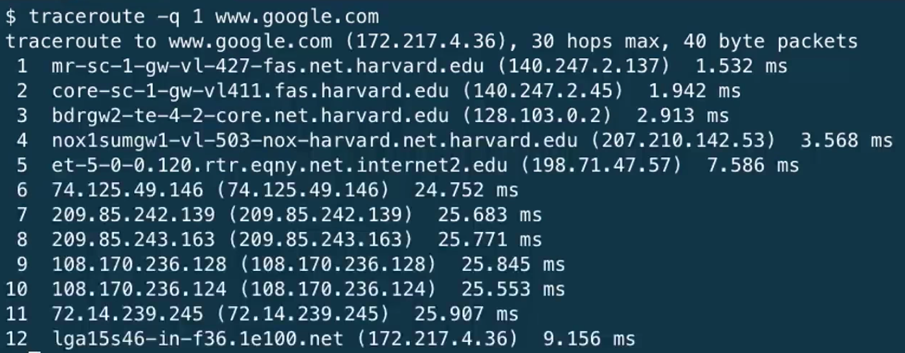
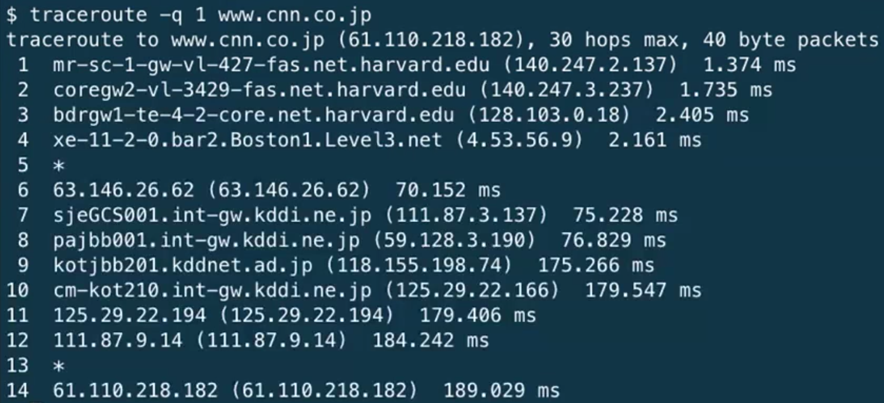
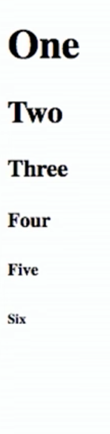

---
---
:author: Cheng Gong

= Week 6

[t=0m0s]
== Last Time

* We learned about more complex data structures, such as:
** linked lists, nodes connected by pointers
** stacks and queues, lists which maintain properties of first in first out or last in first out
** binary search trees, with up to two nodes linked to each parent node
** hash tables, essentially arrays of linked lists, where we can quickly find elements
** tries, where we can look up elements one character at a time

[t=5m19s]
== The Internet

* Now we leave behind the world of C to learn about the internet and the web.
* Let's consider how we might connect to the internet at home. We have an internet service provider (ISP) such as Comcast or Verizon, who build some wires into your home that connects you to their network of wires.
* And the internet is just a connection of all these networks. Applications that we use every day run on top of this physical connection.
* These days we typically connect to a router (a box that the wire from the outside world plugs into) wirelessly. Once we choose the wireless network that our router is broadcasting and connect to it, a technology called DHCP (Dynamic Host Configuration Protocol) assigns some IP (Internet Protocol) address to our computer, that uniquely identifies it. And this address is how computers across the internet talk to each other.
* IPv4 (IP version 4) is the most common today, with four numbers of the format ``#.#.#.#``.
* Just like how buildings in the real world have an address to identify them, so do computers on the internet.
* And there is a system for allocating these addresses, by provider or organization. For example, Harvard's IPs include the ones in the range of `140.247.#.#` or `128.103.#.#`.
* Each of the `#` symbols can be in the range `0` to `255`, and that's the range of values 8 bits can hold. So an IP address with 4 of these numbers are exactly 32 bit values.
* There are also reserved IPs, known as private addresses, with the ranges `10.#.#.#` and `172.16.#.# - 172.31.#.#` and `192.168.#.#` that are used within a particular network, but not with the outside world.
* But we rarely, if ever, type in some numbers into our browser to visit websites. There is another technology called DNS (Domain Name System) that maps IP addresses to domain names, and vice versa. So a domain name like `www.google.com` is translated to an IP address behind the scenes.
* And now that we have IP addresses to send to and receive from, we can create and send packets information with those addresses in them.
* We send those packets to routers, computer servers, that are in datacenters around the world, that only route information based on the destination IP. By passing our packets from router to router, we can get them to our destination.
* We can open the CS50 IDE, and run a command like:
+
[source]
----
$ nslookup www.google.com
Server:         140.247.233.195
Address:        140.247.233.195#53

Non-authoritative answer:
Name:   www.google.com
Address: 172.217.4.36
----
** The first line is the DNS server we asked to look up the domain name for us, and it returned a `Non-authoritative answer` of the address since it doesn't own that domain name.
* So we can imagine packets as envelopes with information inside, and To and From addresses on the outside.
* We can even run a command like this:
+

** We see the routers that our packets would go through if we wanted to reach `www.google.com`.
** The first two, with the letters `sc` in their name and ending in `.harvard.edu` are Harvard's routers in the Science Center.
** The next one, `bdrgw2`, is a "border gateway", that then connects to `nox1`, "northern crossroads," a place where a lot of internet providers connect their cabling and technology.
** Then we have lots of anonymous routers with no domain names attached, until we finally reach the last one, which must be one of Google's servers.
* Now let's try a website far away:
+

** So it looks like the Japanese version of CNN's website takes a lot longer to reach.
** It seems that routers 8 and 9 has the biggest gap, so there might be a (literal) ocean of distance between them.
* We watch a video on https://www.youtube.com/watch?v=IlAJJI-qG2k[underwater cables].
* So once someone, say Google, receives the packet we sent them, they might want to reply. But if they want to send more data than can fit in a single packet, there exists a technology called TCP (Transmission Control Protocol) that splits data into pieces, and sends multiple packets. And those packets are labeled with something like `1 of 4` or `2 of 4`, so we can order them and know we got them all.
* There are also other services, so for a computer to differentiate what application a packet is meant for, packets can also be labeled with an additional number called a port.
* For example, standard ports and protocols include:
** 21 FTP, for file transfers
** 22 SSH, secure shell, to run commands on another computer
** 25 SMTP, for sending email
** 53 DNS
** 80 HTTP, for visiting websites
** 443 HTTPS, for visiting secure websites
* Firewalls keep out packets, so they might be used to block certain websites, or keep in packets, to prevent sensitive information from leaving. And this is implemented with a local router looking at all the packets, and simply not sending ones with certain addresses. And it could also block all traffic on a certain port.
* There are services called VPNs (Virtual Private Networks) that you can use to connect to your company or school's network. An encrypted tunnel is created to route all your traffic through the VPN first, before being sent out to the internet. But the cost of this is that it now takes more time to send our packets there first.
* Other pieces of hardware include switches, with lots of ports to plug ethernet cables into, to connect many machines, and access points, which create wireless networks for computers to connect to.
* We watch another video summarizing https://www.youtube.com/watch?v=PBWhzz_Gn10[how the internet works].

[t=57m0s]
== HTTP

* Now that we have an idea of how data is transmitted between computers on the internet, we can talk about what is being sent.
* HTTP (HyperText Transfer Protocol) is one of the most common ways that messages are formatted for communication.
* For example, in the real world we might introduce ourselves by saying "Hi, I'm David" and extending our hand, and the other person says their name and shakes our hand back.
* With HTTP, we have similar conventions for how we start communicating and respond to communications.
* The simplest request in HTTP is a method called `GET`, where we send a message that literally reads:
+
[source]
----
GET / HTTP/1.1
Host: www.harvard.edu
...
----
** The `/` refers everything in the default directory, `HTTP/1.1` indicates the the version of HTTP we want to use, and `Host: www.harvard.edu` indicates the website we want the server to return to us.
* And a response would start with this:
+
[source]
----
HTTP/1.1 200 OK
Content-Type: text/html
...
----
** And after those first lines, will be the actual webpage or information we requested.
** HTML is the language that webpages are written in, which is what the content would likely be using.
* Common status codes include:
** `200 OK`
** `301 Moved Permanently`
** `302 Found`
** `304 Not Modified`
** `401 Unauthorized`
** `403 Forbidden`
** `404 Not Found`
** `500 Internal Server Error`
* We can see this with commands in our terminal too. We can run:
+
[source]
----
$ telnet www.harvard.edu 80
Trying 104.16.151.6...
Connected to www.harvard.edu.cdn.cloudflare.net
Escape character is '^]'.
----
** We use port 80 since that's used for HTTP, and we see that Harvard uses a service called CloudFlare, which is a content delivery network (that helps serve websites more quickly).
* Then we can type:
+
[source]
----
GET / HTTP/1.1
Host: www.harvard.edu
----
* And if we send that, and then scroll up (or redirect the output to a file), we'll see first the HTTP response:
+
image::response.png[alt="HTTP response", width=800]
** We see `HTTP/1.1 200 OK` and a lot of other headers, that indicate when this page expires or what type of content it is.
* We can use an alternative command called `curl` to see just the headers:
+
[source]
----
$ curl -I http://www.harvard.edu/
----
* We can do:
+
[source]
----
$ curl -I http://reference.cs50.net/
HTTP/1.1 301 Moved Permanently
Cache-control: no-cache="set-cookie"
Content-Length: 178
Content-Type: text/html
Date: Mon, 03 Oct 2016 17:17:39 GMT
Location: https://reference.cs50.net/
Server: nginx/1.8.1
Set-Cookie: AWSELB=7D03E3C11C9564D4EBA91026CCAAA8EEDCD5DC34657AEDEBBAB0856E24F9ACB5BE65C5B4443B7EF06C9BBEAC5F36BF556A51333C0377A6BC471E810D021D4033A06AC36B27;PATH=/
Connection: keep-alive
----
** We see a `Location:` header to redirect us to a new URL.
** If we go to that into our browser we'll see that the location changes for us to start with `https://` automatically.
* With HTTPS, our traffic between the server and ourselves will be encrypted, so anyone else on the network won't be able to read it.
* If we now visit Google and search for something like "cats", we might end up at some long URL. But we can change it to what we understand: `http://www.google.com/search?q=cats`. And if we visit just that URL, we still see our results.
* So it seems like our browser is sending out input (what we typed into the search page) to the server with the URL.
* If we right-click a website in Chrome, we can click `Inspect` and see formatted HTML with a nested structure and perhaps patterns of words:
+
image::elements.png[alt="HTML elements", width=800]

[t=1h13m0s]
== HTML

* A simple webpage you can write might look like this:
+
[source, html]
----
<!DOCTYPE html>

<html>
    <head>
        <title>hello, world</title>
    </head>
    <body>
        hello, world
    </body>
</html>
----
** Notice that we have the first line declaring that this page is written in HTML, in particular version 5 (implied).
** And then we notice that there's nesting and symmetry with tags that look like `<html>` and end in `</html>`.
** The start tag, like `<title>`, indicates the start of a particular element, like the title of the page, and the end tag signals the end of it.
** We have a lot of indentation and whitespace that other websites might not use, since it doesn't matter whether or not there's whitespace in between them, as long as the order and nesting stays the same.
* We can represent this webpage with a tree structure like this:
+
image::dom.png[alt="HTML Document Object Model", width=800]
** The `document` is the entire page, and it contains the `html` element, with the children `head` and `body`.
** We can imagine that, on websites where parts of the page update without us having to manually refresh the entire page, that elements in this tree are being modified in real time.
* We can open the CS50 IDE and save a file called `hello.html` in our workspace with those contents. Then we can visit our page and see it in a browser.
* We can also include images:
+
[source, html]
----
<!DOCTYPE html>

<html>
    <head>
        <title>image</title>
    </head>
    <body>
        
    </body>
</html>
----
** We need to upload `cat.jpg` to our workspace, and since no other content goes inside an `img` tag, we simply close the start tag with `/>`.
** And `alt="Grumpy Cat"` indicates to the browser that the image can be described with that text, for accessibility purposes.
* And we can create links:
+
[source, html]
----
<!DOCTYPE html>

<html>
    <head>
        <title>link</title>
    </head>
    <body>
        Search for <a href="https://www.google.com/search?q=cats">cats</a>.
    </body>
</html>
----
** The `a` tag is for anchor, with a `href`, or hyper-reference. Inside we put the URL that we want the link to go to, and the text we want to show inside. And notice we can place an element directly in another.
* We can combine these ideas and have the image be the link, too:
+
[source, html]
----
<!DOCTYPE html>

<html>
    <head>
        <title>link</title>
    </head>
    <body>
        Search for .
    </body>
</html>
----
* The behaviors of tags can be changed attributes such as `href` or `src`. And we can look any of the online places with documentation for HTML, to know what tags and attributes we can use.
* We can also include paragraphs:
+
[source, html]
----
<!DOCTYPE html>

<html>
    <head>
        <meta name="viewport" content="width=device-width, initial-scale=1"/>
        <title>paragraphs</title>
    </head>
    <body>
        

            Lorem ipsum dolor sit amet, consectetur adipiscing elit. Nullam in tincidunt augue. Duis imperdiet, justo ac iaculis rhoncus, erat elit dignissim mi, eu interdum velit sapien nec risus. Praesent ullamcorper nibh at volutpat aliquam. Nam sed aliquam risus. Nulla rutrum nunc augue, in varius lacus commodo in. Ut tincidunt nisi a convallis consequat. Fusce sed pulvinar nulla.
        

        

            Ut tempus rutrum arcu eget condimentum. Morbi elit ipsum, gravida faucibus sodales quis, varius at mi. Suspendisse id viverra lectus. Etiam dignissim interdum felis quis faucibus. Integer et vestibulum eros, non malesuada felis. Pellentesque porttitor eleifend laoreet. Duis sit amet pellentesque nisi. Aenean ligula mauris, volutpat sed luctus in, consectetur id turpis. Phasellus mattis dui ac metus blandit volutpat. Donec lorem arcu, sollicitudin in risus a, imperdiet condimentum augue. Ut at facilisis mauris. Curabitur sagittis augue in dictum gravida. Integer sed sem sed justo tempus ultrices eu non magna. Phasellus semper eros erat, a posuere nisi auctor et. Praesent dignissim orci aliquam laoreet scelerisque.
        

        

            Mauris eget erat arcu. Maecenas ac ante vel ipsum bibendum varius. Nunc tristique nulla eget tincidunt molestie. Morbi sed mauris eu lectus vehicula iaculis ac id lacus. Etiam sit amet magna massa. In pulvinar sapien ac mi ultrices, quis consequat nisl hendrerit. Aliquam pharetra nec sem non vehicula. In et risus leo. Ut tristique ornare nisl et lacinia.
        

    </body>
</html>
----
** Notice that we have Latin paragraphs, each in a separate `
` tag.
** And in the `head` tag we have a strange line that starts with `meta` that tells our browser to scale the webpage to the size of the device (so if we are viewing the page on a phone, we won't have tiny text we might otherwise get).
* We can also use headings:
+
[source, html]
----
<!DOCTYPE html>

<html>
    <head>
        <title>headings</title>
    </head>
    <body>
        <h1>One</h1>
        <h2>Two</h2>
        <h3>Three</h3>
        <h4>Four</h4>
        <h5>Five</h5>
        <h6>Six</h6>
    </body>
</html>
----
+

* With lists, we have a little more nesting:
+
[source, html]
----
<!DOCTYPE html>

<html>
    <head>
        <title>list</title>
    </head>
    <body>
        <ul>
            <li>foo</li>
            <li>bar</li>
            <li>baz</li>
        </ul>
    </body>
</html>
----
** We have an `ul`, unordered list, element, inside which are `li`, list item, elements.
** We can also use `ol` instead for an ordered list.
* These examples, and more, are at http://cdn.cs50.net/2016/fall/lectures/6/src6/[http://cdn.cs50.net/2016/fall/lectures/6/src6/]!

[t=1h30m30s]
== CSS

* We can add styles with another language, CSS, Cascading Style Sheets. While HTML is used to mark up web pages, or indicate their hierachy and content, CSS is used to change the look and appearance of web pages.
* Here is an example, which mixes CSS into HTML:
+
[source, html]
----
<!DOCTYPE html>

<html>
    <head>
        <title>css-0</title>
    </head>
    <body>
        

            

                John Harvard
            

            

                Welcome to my home page!
            

            

                Copyright &#169; John Harvard
            

        

    </body>
</html>
----
** Notice that elements now have a `style` attribute, inside which is something like `font-size: 12px;`, among other lines.
** A `div` is like a division, a rectangular region on the pag.
** The outermost `div`, with `text-align: center;` as a style, will center the text of all of its children ``div``s.
* But we can factor out the CSS:
+
[source, html]
----
<!DOCTYPE html>

<html>
    <head>
        
        <title>css-1</title>
    </head>
    <body>
        

            John Harvard
        

        

            Welcome to my home page!
        

        

            Copyright &#169; John Harvard
        

    </body>
</html>
----
** Now we've given each `div` in our `body` an attribute with an `id` that identifies them, and in our `head` of the page we specify CSS for each of them in a tag called `style`.
** `#top`, `#middle`, and `#bottom` is the syntax we use to select each of those ``div``s, and within our `style` tag we use curly braces to indicate properties we want to apply to each element.
** So now our content is separated from our aesthetics.
* We can even separate the CSS out into a file:
+
[source, html]
----
<!DOCTYPE html>

<html>
    <head>
        <link href="css2.css" rel="stylesheet"/>
        <title>css-2</title>
    </head>
    <body>
        

            John Harvard
        

        

            Welcome to my home page!
        

        

            Copyright &#169; John Harvard
        

    </body>
</html>
----
** Here, in the `head` tag, we include a `link` tag that is similar to `include` in C, and now a corresponding `css2.css` file will be applied:
+
[source, css]
----
body
{
    text-align: center;
}

#top
{
    font-size: 36px;
    font-weight: bold;
}

#middle
{
    font-size: 24px;
}

#bottom
{
    font-size: 12px;
}
----
** And notice the line of HTML we have that has `&#169;`, which indicates a copyright symbol. We can search online for something like "HTML entities" to find out how we can include symbols in our webpages.
* So even though these three versions show the exact same webpage when we view them, the design of the last one is now better than the others. For example, the same `css2.css` file can be shared between different HTML pages, and we would only need to change a particular style in one place.
* In fact, there are many CSS libraries online that have lots of styles written by others, that we can apply to our own webpages without doing all the work from scratch.

[t=1h38m3s]
== POST

* We learned about the `GET` method in HTTP, and it turns out there's another one called `POST`, which allows the browser to send information to a server within the request, rather than in the URL.
* A `POST` request might look like:
+
[source]
----
POST /login.php HTTP/1.1
Host: www.facebook.com
...

email=username@example.com&pass=12345
----
* We can see both `email` and `pass` being sent through, and this will help us make our own web pages.
* Let's create a page called `search`:
+
[source, html]
----
<!DOCTYPE html>

<html>
    <head>
        <title>CS50 Search</title>
    </head>
    <body>
        <h1>CS50 Search</h1>
        <form action="https://www.google.com/search" method="get">
            <input name="q" type="text"/>
             
            <input type="submit" value="CS50 Search"/>
        </form>
    </body>
</html>
----
** We have a `h1` heading, and then a `form` element.
** We'll use `get` as the method for this one, since we know Google uses that for searching.
** We'll add an `input` with the name `q` and a submit button.
* Now if we view this page and enter something like `cats`, our browser will know to create a URL that looks like `https://www.google.com/search?q=cats` and take us to it, from the form.
* But we haven't created a back-end, or the server that actually reads the URLs it receives and generates the right response and sends it back. Next week, we'll learn yet another language called Python, which will let us write our very own web server.
