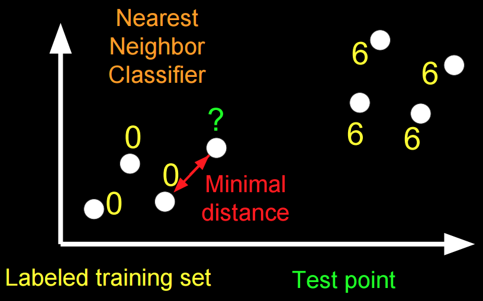
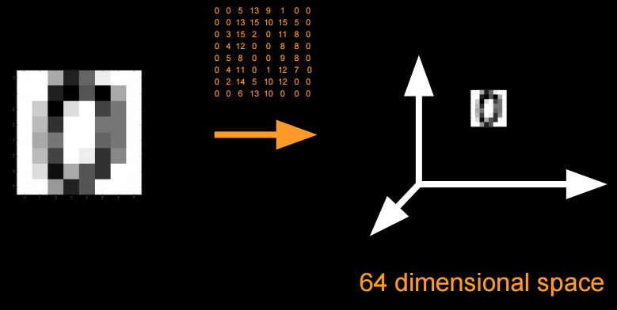
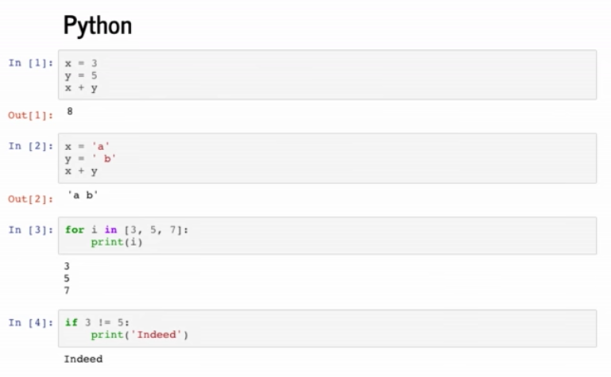
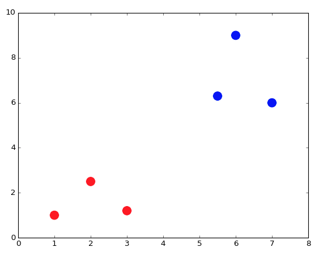
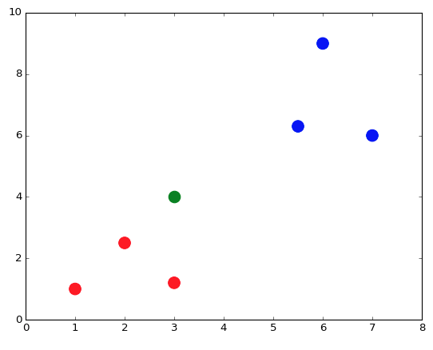

---
---
:author: Cheng Gong

= Week 7

[t=0m0s]
== Introduction to Machine Learning

* This lecture will bridge the first part of the course, where we learn about low-level languages, and the second part, where we use higher-level programming languages.
* Python, for example, can be used to write the back-end of a web server that takes requests, talks to a database, and return a response to a user.
* Today we'll use Python as a tool for data analysis, in the context of machine learning.
* As the following image jokingly depicts, there are various conceptions of what programmers working on machine learning do:
+
image::machine_learning.png[alt="Machine learning conceptions", width=600]
** It is accurate, though, that they do spend most of their time using Python and importing packages to help them analyze data.
** We can read that line already, and guess that `sklearn` is a module, or library, `from` which we are ``import``ing some pieces of functionality called `svm`, even if we don't know what they actually do.
* Machine learning is often associated with AI, artificial intelligence, and especially robots in science fiction movies.
* But on a day-to-day basis, machine learning is applied to building search engines, image recognition, voice recognition, and natural language processing.
* And machine learning is really just referring to some algorithm that solves these problems.
* Recall that an algorithm takes some inputs and produces some outputs. For image recognition, we want to take in some images, and output text descriptions of what the image contains.
* For natural language processing, we might want to process an entire novel and output its themes or topics.
* In the past, we've done something similar in the Whodunit problem set, where a noisy image was filtered to get a hidden message.
* The main difference there was that we already knew that the noise was the red added, but in image recognition we don't have any information about its contents ahead of time.
* To help with this, we use something called training data. For example, we can provide many examples of images of horses to an algorithm, to increase its ability to recognize new images of horses, by comparing them.

[t=11m28s]
== Image Classification

* We can see this by starting with the following training data, aiming to create an algorithm that can recognize handwritten digits:
+
image::digit_classification.png[alt="Digit classification training data", width=600]
* Let's imagine a number line, with two groups of points:
+
[source]
----
<--•--•-•----------------•-•-•-->
   0  0 0                6 6 6
----
* We can think of this as training data, and if we were given a test point as follows, we'd guess it was a ``6``:
+
[source]
----
<--•--•-•--------------•-•-•-•-->
   0  0 0              ? 6 6 6
----
** The principle we used to guess this was that the new point was closest to the group of other ``6``s, and this algorithm is called the *nearest neighbor classifier*.
* We might even see points in two dimensions, and do the same:
+

* The question now is how we might map images of digits to space, since from there we can find the nearest neighbors of test points to our training data points.
* Flatland is a story about a two-dimensional being, a Square, who visits Lineland and tries to convince the points inside that there are two dimensions, and then visits Spaceland to discover the existence of a third dimension. We watch https://vimeo.com/8675372[a trailer] of a movie based on this story.
* In our case, we live in a three-dimensional space, but we can similarly map points to spaces with even more dimensions.
* With an image of a digit, we can map the grayscale values of each pixel to a number, and each number to a dimension:
+

* Now we can imagine that, with our nearest neighbor algorithm, we can plot all our training data as points, and, given a test point, we can find the training point with the closest distance.

[t=26m25s]
== Nearest Neighbors with Python

* We can open the CS50 IDE, and simply type `python` into our terminal to get an interpreter.
* From there, we can write simple commands:
+
[source]
----
>>> x = 3
>>> y = 5
>>> x + y
8
>>> x = 'a'
>>> y = ' b'
>>> x + y
'a b'
---
** In Python, we don't need to define the type of variables, or differentiate between single and double quotes.
* We also don't need a compiler, since the interpreter reads the code line by line and compiles and runs it for us in real time.
* We can write a simple `for` loop too:
+
[source]
----
>>> for i in [3, 5, 7]:
...   print(i)
...
3
5
7
----
** We have an array and can iterate over the items inside directly. And we also don't need curly braces, but use indentation instead to indicate the level of our code.
* For the rest of the lecture, we'll use something called an iPython notebook, which allows us to write lines of code and see their output, one chunk at a time:
+

* The process of training our algorithm earlier was called supervised learning. In supervised learning, we label some training data, some inputs, with expected outputs.
* We'll start by importing some modules, or libraries:
+
[source, python]
----
import numpy as np
import matplotlib.pyplot as plt
# Configure matplotlib to embed the plots in the output cells of the present notebook
%matplotlib notebook
----
* Since Python is a very popular language, it means that we get the benefit of having lots of libraries written for us that we can import.
* We'll start by creating some training data:
+
[source, python]
----
In [2]:
X_train = np.array([[1,1], [2,2.5], [3,1.2], [5.5,6.3], [6,9], [7,6]]) # Define numpy array of two-dim points
Y_train = ['red', 'red', 'red', 'blue', 'blue', 'blue'] # Define a Python built-in list (i.e., array) of strings
----
** `X_train` are the points, and `Y_train` are the labels for each point.
* We can think of `X_train` as a two dimensional array, and access elements within elements in the array:
+
[source, python]
----
In [3]:
print(X_train[5,0]) # Extract the 0th coordinate of the 5th point in the array
print(X_train[5,1]) # Extract the 1st coordinate of the 5th point in the array
7.0
6.0
---
** Notice that Python is a 0-indexed programming language, much like C.
* Python also has a slicing syntax that allows us to extract multiple elements in an array at once:
+
[source, python]
----
In [4]:
print(X_train[:, 0]) # Extract the 1st coordinate (indexed by 0) of all elements (:) in the array X_train
[ 1.   2.   3.   5.5  6.   7. ]
In [5]:
print(X_train[:, 1]) # Extract the 2nd coordinate (indexed by 1) of all elements (:) in the array X_train
[ 1.   2.5  1.2  6.3  9.   6. ]
----
* Now we can plot these points, with their colors as their labels:
+
[source, python]
----
plt.figure() # Define a new figure
plt.scatter(X_train[:,0], X_train[:,1], s = 170, color = Y_train[:]) # Plot points with Python slicing syntax
plt.show() # Display plot
----
+

** We can learn from documentation the parameters to pass into `plt.scatter`.
* Let's create and plot a test point:
+
[source, python]
----
X_test = np.array([3,4])
plt.figure() # Define a new figure
plt.scatter(X_train[:,0], X_train[:,1], s = 170, color = Y_train[:])
plt.scatter(X_test[0], X_test[1], s = 170, color = 'green')
plt.show() # Display plot
----
+

** We specify that this point is `green`, since we don't know what its label should be.
* To run the Nearest Neighbor Classifier, we need to first define a distance function:
+
[source, python]
----
def dist(x, y):
    return np.sqrt(np.sum((x - y)**2)) # np.sqrt and np.sum are numpy functions to work with numpy arrays
----
** We know our points are in two dimensions, so we compute the distance by subtracting the values of each coordinate of two points `x` and `y`, square them, taking their sum, and then taking the square root:
+
image::distance_formula.png[alt="Distance formula", width=400]
* Now, for each point in our training data, we can compute its distance to the test point:
+
[source, python]
----
num = len(X_train) # Compute the number of points in X_train
distance = np.zeros(num) # Initialize a numpy arrays of zeros
for i in range(num):
    distance[i] = dist(X_train[i], X_test) # Compute distance from X_train[i] to X_test
print(distance)
[ 3.60555128  1.80277564  2.8         3.39705755  5.83095189  4.47213595]
----
** We get back an array of distances.
* Alternatively, we can use a "vectorization" syntax to apply a distance formula to arrays directly:
+
[source, python]
----
distance = np.sqrt(np.sum((X_train - X_test)**2, axis = 1)) # Vectorization syntax
print(distance)
[ 3.60555128  1.80277564  2.8         3.39705755  5.83095189  4.47213595]
----
* Now we can find the minimum distance, and the label for that point:
+
[source, python]
----
In [12]:
min_index = np.argmin(distance) # Get the index with smallest distance
print(Y_train[min_index])
red
----

[t=43m50s]
== Image Classification with Python

*

