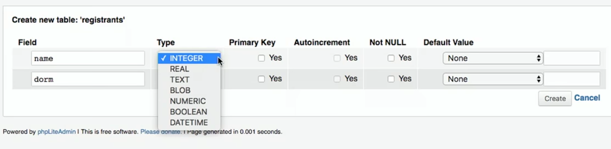
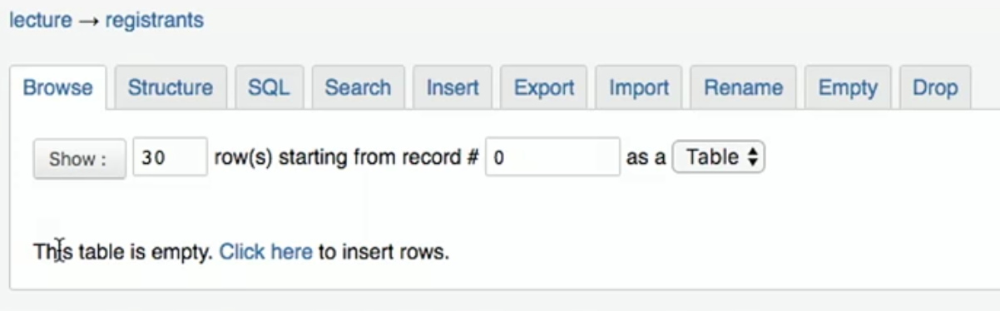
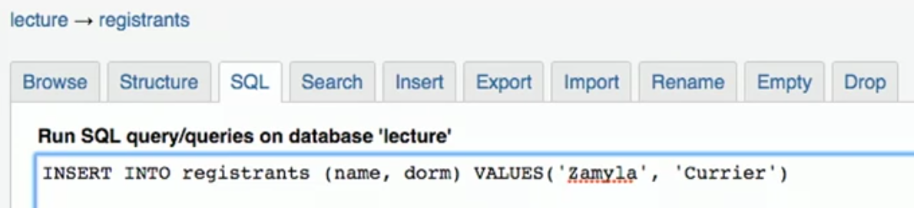
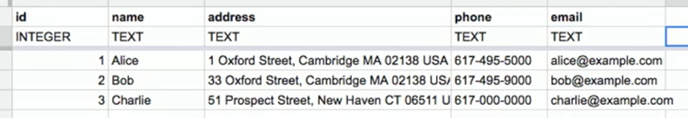
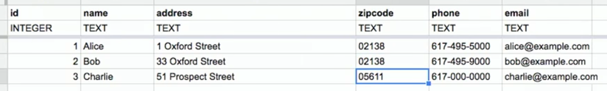
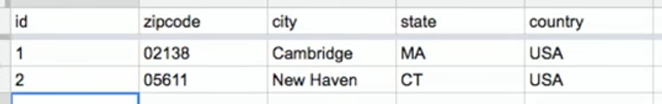
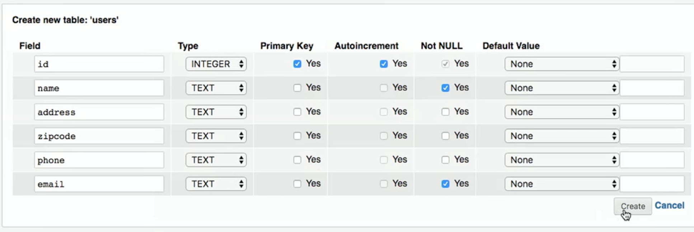
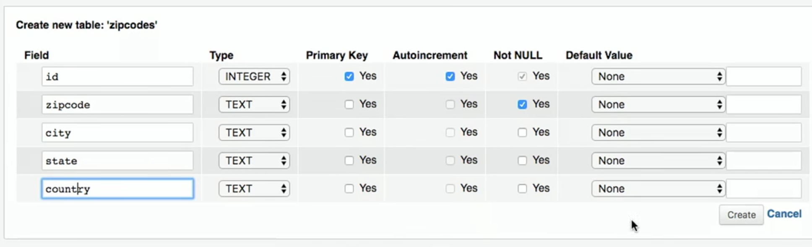
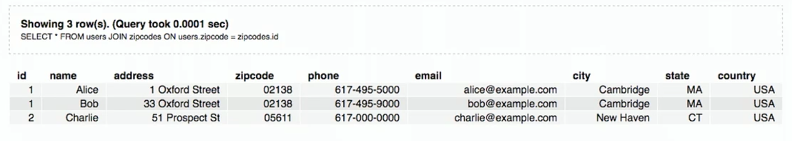
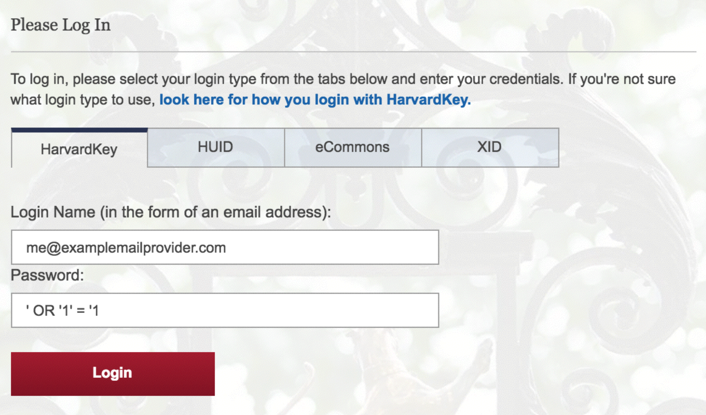

:author: Cheng Gong

= Week 9

[t=0m0s]
== Last Week

* Last week we looked back to Scratch to remind us of basic programming constructs, to help us transition from C to Python.
* We saw a new way to start a simple program:
+
[source, python]
----
def main():
    print("hello, world")

if __name__ == "__main__":
    main()
----
** and write more complex programs from there.
* We also looked at the design pattern of MVC, used for creating the architecture of web applications.
* Today we'll look further at the M of MVC, Model, to save and retrieve data.
* We'll continue to use Flask, a popular web application framework for Python, as a starting place for our examples as we did last week. But web applications can be written with any number of other frameworks, or even built-in Python functions.
* An application using Flask can be as simple as:
+
[source, python]
----
from flask import Flask, render_template

app = Flask(__name__)

@app.route("/")
def index():
    return render_template("index.html")
----
** This program just returns the template `index.html` when the user visits `/`, or the default webpage, of the server.

[t=1m0s]
== Frosh IMs

* Let's look at http://cdn.cs50.net/2016/fall/lectures/9/src9/froshims0/[`froshims0`], which has a `templates` directory with various files ending in `.html`, as well as `application.py`:
+
[source, python]
----
from flask import Flask, render_template, request

app = Flask(__name__)

@app.route("/")
def index():
    return render_template("index.html")

@app.route("/register", methods=["POST"])
def register():
    if request.form["name"] == "" or request.form["dorm"] == "":
        return render_template("failure.html")
    return render_template("success.html")
----
** We added a `register` function that will respond differently based on the user's input.
** In this case, we will check whether the HTTP request, submitted with a POST method, has a form with a `name` and `dorm` field, and if either are blank, return the template `failure.html`, otherwise `success.html`.
* `failure.html` just had this:
+
[source, html]
----



failure



You must provide your name and dorm!

----
* And `success.html` is similar:
+
[source, html]
----



success



You are registered! (Well, not really.)

----
* `index.html`, meanwhile, had the actual form:
+
[source, html]
----



Frosh IMs



<h1>Register for Frosh IMs</h1>
<form action="{{ url_for('register') }}" method="post">
    Name: <input name="name" type="text"/>
     
    Dorm:
    <select name="dorm">
        <option value=""></option>
        <option value="Apley Court">Apley Court</option>
        <option value="Canaday">Canaday</option>
        <option value="Grays">Grays</option>
        <option value="Greenough">Greenough</option>
        <option value="Hollis">Hollis</option>
        <option value="Holworthy">Holworthy</option>
        <option value="Hurlbut">Hurlbut</option>
        <option value="Lionel">Lionel</option>
        <option value="Matthews">Matthews</option>
        <option value="Mower">Mower</option>
        <option value="Pennypacker">Pennypacker</option>
        <option value="Stoughton">Stoughton</option>
        <option value="Straus">Straus</option>
        <option value="Thayer">Thayer</option>
        <option value="Weld">Weld</option>
        <option value="Wigglesworth">Wigglesworth</option>
    </select>
     
    <input type="submit" value="Register"/>
</form>

----
** But notice that this page, too, uses the shared `layout.html` but with its own `title` `block` and `body` `block`.
* To get the final web page, those blocks are then substituted into `layout.html`:
+
[source, html]
----
<!DOCTYPE html>

<html>
    <head>
        <meta content="initial-scale=1, width=device-width" name="viewport"/>
        <title></title>
    </head>
    <body>
        
    </body>
</html>
----
** Since every page in our application share common pieces in their HTML, we can place those common pieces here but customize certain areas for each page.
* To actually store our data, let's look at `application.py` in http://cdn.cs50.net/2016/fall/lectures/9/src9/froshims1/[`froshims1`]:
+
[source, python]
----
from flask import Flask, render_template, request
import csv

app = Flask(__name__)

@app.route("/")
def index():
    return render_template("index.html")

@app.route("/register", methods=["POST"])
def register():
    if request.form["name"] == "" or request.form["dorm"] == "":
        return render_template("failure.html")
    file = open("registrants.csv", "a")
    writer = csv.writer(file)
    writer.writerow((request.form["name"], request.form["dorm"]))
    file.close()
    return render_template("success.html")
----
** Notice that in the final lines of `register()`, we write the information we get from the request into a file called `registrants.csv`, in a comma-separated values file format.
** To do this, we open the file, and the second argument, `a`, appends to the file, or adds to the end. If we used `w` for writing, we'd overwrite the previous file with a new one.
** Then we use a `csv` module that comes with Python to write to the file, calling a method `writerow` that actually does the writing of the `name` and `dorm`.
* We can open `csv` files in Excel or Google Sheets or similar programs, but reading data from them or changing them programmatically require a lot of manual work, and becomes less and less efficient with more data.

[t=2m0s]
== SQL

* To solve this problem of managing data, there exists SQL, Structured Query Language.
* It's a programming language that allows us to do basic operations on data, and there are many programs that support using this language, such as MySQL and PostgreSQL.
* Usually those programs act as a server and listens for requests and responds to them, but a simpler implementation is SQLite, which allows us to use SQL.
* Spreadsheet programs like Excel or Google Sheets allow us to store data in rows and columns. We commonly use the top row for headers like "name" and "dorm", and each row after will be an entry:
+
image::students.png[alt="students", width=400]
* In this example, we have structured data, with keys, or metadata that describes each column, and values.
* We can think of this as a list of rows, each of which is a dictionary. Each row has a cell for each column, so we can make key-value pairs for each cell, where the key is the header for that column and the value is what's in that cell for that row.
* But we can better design a data storage system that is efficient and easy to integrate with other programs.
* We'll need basic operations:
** `CREATE  ...`
** `INSERT  ...`
** `SELECT  ...`
** `UPDATE  ...`
** `DELETE  ...`
** `...`
* SQL is used for relational databases, or databases with data that has relationships with each other in different tables.
* Within the CS50 IDE, we'll run a program called `phpliteadmin` to create an SQLite database, and then we'll be able to manage it with a web-based interface:
+
image::phpliteadmin.png[alt="phpliteadmin", width=600]
** The tool itself is written in a language called PHP, but we can use it without knowing its implementation (abstraction!).
** We see that we have a database called `registrants`, and we can do various things. The `Structure` tab shows us information about our database, `SQL` tab allows us to run queries in SQL, and we can `Export` or `Import` data, too.
* But first, we'll create a new table (which we can think of as like a new sheet in a spreadsheet file) called `registrants`, with 2 fields.
* We'll call those fields `name` and `dorm`, but now we can choose the type of data each field will store, to help with optimization:
+

** Some options such as `INTEGER`, `REAL` (a floating-point number), `TEXT` (a string), `BLOB` (binary data), `NUMERIC` (numbers that can be either integers or floats), `BOOLEAN`, `DATETIME` (to store dates and times in a standard way).
** We'll choose `TEXT` for both, and then we have a few more options for each field.
** `Primary Key` indicates whether that field is the key that uniquely identifies all the rows in that table. But it's possible that two people share the same name and dorm, so we won't check that.
** `Autoincrement` allows us to have an integer field that increments itself every time a new row is added (like for an ID number), so we'll leave that unchecked too.
** `Not NULL` means that the field cannot be empty, or null. Since we want both fields to filled for every row, we'll check this for both.
** Finally, we can specify some `Default Value` if no value is provided, but we won't use that either.
* Once we click `CREATE`, we'll see this:
+
image::created.png[alt="table created", width=400]
** The text is the actual SQL query used to create the table from the options we selected just now, and phpLiteAdmin has generated that for us, so we didn't need to remember all the syntax or search for documentation.
* Now if we click on the table `registrants`, we'll see yet more tabs:
+

** `Browse` lets us look at the data, but there isn't any yet.
** `Structure` shows us what the fields look like, and what their types and properties are, and allows us to change them.
** `Insert` lets us add data, and if we fill out the form, we'll be shown the query:
+
image::insert.png[alt="insert into table", width=300]
* Then we'll be able to see our newly added data. But we can type in our own SQL with the (you guessed it) `SQL` tab:
+

** We can manually insert a new row into our table like so.
* We've seen the tool use `CREATE` to create a table and `INSERT` to add data, but let's try other operations ourselves:
+
[source]
----
SELECT * FROM registrants
----
** In this case, `*` means "everything", so running that query gives us:
+
image::select.png[alt="sql select query", width=800]
*** We'll call this a result set of 3 rows.
* We can change existing data, too:
+
[source]
----
UPDATE registrants SET dorm = 'Grays' WHERE name = 'Zamyla'
----
** Even though this is new syntax, we can sort of understand what this does.
* We can also remove data:
+
[source]
----
DELETE FROM registrants WHERE name = 'Rob'
----
* Just to recap, here are some more sample queries:
** `CREATE TABLE 'registrants' ('id' INTEGER PRIMARY KEY, 'name' TEXT, 'dorm' TEXT)`
** `INSERT INTO 'registrants' (name, dorm) VALUES('David', 'Matthews')`
** `SELECT * FROM 'registrants'`
** `UPDATE 'registrants' SET name = 'David Malan' where id = 1`
** `DELETE FROM 'registrants' WHERE id = 1`
* Our database table earlier only stored the fields `name` and `dorm`, but there might be two people with the same name and/or the same dorm, so an `UPDATE` or `DELETE` query might not be able to select the correct rows.
* Just like how people have unique identifiers, like ID numbers, we can assign IDs to rows in our database tables.
* Now we'll add an `id` field, an `INTEGER`, and make sure that it is a `Primary Key` so it is unique, and `Autoincrement`, where each row will be assigned a number as it is added, starting with `1`, `2`, `3`, and so forth.
* Now if we run `INSERT INTO registrants (name, dorm) VALUES('David', 'Matthews')`, we aren't specifying the `id` but the database will automatically add that for us:
 +
image::id.png[alt="registrants table with id", width=300]
* Now we can specify which row we want to delete, as in `DELETE FROM registrants WHERE id = 2`.
* And if we add yet another row after that, that row will have `id` `4`, so that these numbers are unique for the database forever (in case other tables reference the `id` `2`).
* SQL also has functions to manipulate `date`, `time`, and `datetime` types, so we can select only records that match certain dates.
* It also has other properties that can be assigned to columns:
** `PRIMARY KEY`, where this column will be used to uniquely identify rows, and in addition be used to store the data in some data structure that optimizes for selecting and updating on that value (such as a binary tree).
** `UNIQUE` means that the field will be unique for every row, which will also allow the database to optimize queries on that field.
** `INDEX` means that we want the database to store the field in some index to speed up searches in the future, if we anticipate searching on that field frequently.
** `NOT NULL` means that the field has to have some value, and can't be blank.
** `FOREIGN KEY` we'll come back to again later, but means that it is referring to a row in some other table.
* SQL also allows us to `JOIN` tables together.
* If we have a spreadsheet called `users`, we might have basic data such as name, address, phone, and email:
+

** We'll make each field a `TEXT` type, except for `id`, which is an `INTEGER`, since that makes the most sense.
** We might want to index name or address since we might search for that often, but not make those unique.
** Email might be specified as unique, since we might be using it as the username for a user to log in, so there should only be one record associated with an email.
* But we see some redundancy in how addresses are stored. We have two users who both live in Cambridge, so we don't need to store the entire part of the address that has city and state. Instead, we can store just the `zipcode`:
+

* And to look up the name of the city later, we'll want to store the full city information for each zipcode in a separate sheet, but just once:
+
image::zipcodes.png[alt="zipcodes sheet", width=400]
* And if we give each row in the `zipcodes` sheet some `id`, we can even store just an integer instead of the full zipcode for each user:
+
image::zipcode1.png[alt="zipcodes in users sheet", width=600]
+

* So now we've made our system more complex, but now if we get many more rows to our users sheet, we won't need to store the same city name and state over and over again. We've *normalized* our database, factoring out common pieces of data and linking them instead.
* We'll convert this to a database by creating a `users` and `zipcodes` table, with the fields and types as discussed:
+

+

* But `zipcode` in the `users` table should not be `TEXT`, but rather `INTEGER`, the same as the `id` in the `zipcodes` table.
* Now we can insert our data manually:
+
image::insert_user.png[alt="insert user", width=800]
* So now, if we want to get information about users, we can `SELECT` them, and see that their `zipcode` is `1`, so we might `SELECT` that from the `zipcodes` table to see information about that table. But SQL can do that for us, with the `JOIN` keyword:
+
[source]
----
SELECT * FROM users JOIN zipcodes ON users.zipcode = zipcode.id
----
** Now we'll combine the tables on the fields that should be linked to each other, the `zipcode` field in the `users` table and the `id` field in the `zipcodes` table.
* So that gives us back:
+

** Our result set this time has everything, even though we have stored it efficiently.
* We can `CREATE` an index on fields like `email` now, so if we try to `INSERT` another record with the same `email`, the database will return an error and not allow us to insert that record.
* We can write, in our Python code, to first `SELECT` by some email before we try to `INSERT` it, but the database helps us out here by checking for us.
* Other useful SQL features include:
** `BEGIN TRANSACTION`
** `COMMIT`
** `ROLLBACK`
* If we go back to our IDE, we see a `lecture.db` file that has the data we've been creating and using.
* We can use a command-line program to access it: `$ sqlite3 lecture.db`.
* This gives us a `sqlite>` prompt that allows us to run queries:
+
image::sqlite3.png[alt="sqlite3", width=600]
* And there is a convention for naming ``FOREIGN KEY``s, or fields that are ``PRIMARY KEY``s in some other table. In our example, the `zipcode` field in the `users` table actually was the `id` in the `zipcodes` table, so we should name the field in the `users` table as `zipcode_id`, to make it clear that it is an id.

[t=3m0s]
== Frosh IMs

* So let's look at http://cdn.cs50.net/2016/fall/lectures/9/src9/froshims2/[`froshims2`], in particular `application.py`:
+
[source, python]
----
from cs50 import SQL
from flask import Flask, render_template, redirect, request, url_for

app = Flask(__name__)

db = SQL("sqlite:///froshims2.db")

@app.route("/")
def index():
    return render_template("index.html")

@app.route("/register", methods=["POST"])
def register():
    if request.form["name"] == "" or request.form["dorm"] == "":
        return render_template("failure.html")
    db.execute("INSERT INTO registrants (name, dorm) VALUES(:name, :dorm)", name=request.form["name"], dorm=request.form["dorm"])
    return render_template("success.html")
----
** We'll start by importing the `SQL` module from the `cs50` library that allows us to execute queries more simply from our Python code.
** We'll indicate what database we want to use with the line `db = SQL("sqlite:///froshims2.db")`.
** Now in `register` we'll have similar code as before, but if we have data to save, we can actually save it with `db.execute("INSERT INTO registrants (name, dorm) VALUES(:name, :dorm)",` `name=request.form["name"], dorm=request.form["dorm"])`. We see the query as the first argument to `db.execute`, and we use `:name` and `:dorm` as placeholders, since we want to replace them with the value of variables. So the next arguments pass in those values from `request.form`. Then the `cs50` `execute` function will substitute those values into the final SQL query.
* So we'll need to create the `froshims2.db` with `phpliteadmin` again, and create the table we need.
* Then we can visit our form at `index.html`, and if we fill in the form and click `Submit`, we'll see the data in our database.
* So now we can programmatically create and select data. We can create a `registrants` route that shows all the registrants:
+
[source, python]
----
@app.route("/registrants")
def registrants():
    rows = db.execute("SELECT * FROM registrants")
    return render_template("registrants.html", registrants=rows)
----
** Earlier, when we did `db.execute` `INSERT`, we didn't check the return value. But here, since we're doing a `SELECT`, we want to save the return value since that will be our result set, a list of dictionaries.
* And our `registrants.html` template will look like this:
+
[source, html]
----



    registrants



<ul>
    
        <li>{{ registrant.name }} from {{ registrant.dorm }}</li>
    
</ul>

----
** For each `registrant` in our list of `registrants`, passed in from `application.py`, we'll get the values for each key in that `registrant` dictionary.
** We have new strange syntax with `{{` and `}}` that will include a variable in our generated HTML.
* And we can add yet another route to delete a row:
+
[source, python]
----
@app.route("/unregister", methods=["GET", "POST"])
def unregister():
    if request.method == "GET":
        rows = db.execute("SELECT * FROM registrants")
        return render_template("unregister.html", registrants=rows)
    elif request.method == "POST":
        if request.form["id"]:
            db.execute("DELETE FROM registrants WHERE id = :id", id=request.form["id"])
        return redirect(url_for("registrants"))
----
** If we're visiting the `unregister` page, we might want to show a page that gives us a form with options of who we can unregister. If we then send a `POST` from that form, we want to actually execute the `DELETE` query, and then redirect the user to the `registrants` route.
* And `unregister.html` will have the form:
+
[source, html]
----



    registrants



<form action="{{ url_for('unregister') }}" method="post">
<ul>
    
        <li><input name="id" type="radio" value="{{ registrant.id }}"/> {{ registrant.name }} from {{ registrant.dorm }}</li>
    
</ul>
<input type="submit" value="Unregister"/>
</form>

----
** We'll create HTML inputs with the type `radio` which means we can only select one in the form, and specify the `action` of the `form` as `url_for('unregister')`, so it is ``POST``ed to the right place.
** And the `value` for each `input` is the `registrant.id`, so when we submit the form the `id` is passed in to our `unregister` method.
* So now we have a form that create an interactive user interface, but also a server that can take the values inputted and do something with them.
* We have HTML, a markup language to write web pages in, sent over HTTP, a protocol for communicating over the internet, and a server in Python, a programming language, with a framework like Flask to help us run a simple web server. And today we learned some SQL to manage data.

[t=4m0s]
== Models

* We can abstract from the level of using SQL queries to models, a feature we can get with a framework like Flask.
* In http://cdn.cs50.net/2016/fall/lectures/9/src9/froshims3/[`froshims3`], we have changed how we interact with the database. In `application.py`:
+
[source, python]
----
from flask import Flask, render_template, redirect, request, url_for
from flask_sqlalchemy import SQLAlchemy

app = Flask(__name__)

# Flask-SQLAlchemy
app.config["SQLALCHEMY_TRACK_MODIFICATIONS"] = False
app.config["SQLALCHEMY_DATABASE_URI"] = "sqlite:///froshims3.db"
app.config["SQLALCHEMY_ECHO"] = True
db = SQLAlchemy(app)
----
** We use another library called SQLAlchemy, that we specify the database file for, and can then use as `db`.
* We can then define an object-relational mapping (ORM) that describes our data as objects:
+
[source, python]
----
class Registrant(db.Model):

    __tablename__ = "registrants"
    id = db.Column(db.Integer, primary_key=True)
    name = db.Column(db.Text)
    dorm = db.Column(db.Text)

    def __init__(self, name, dorm):
        self.name = name
        self.dorm = dorm
----
** Here we're defining a `class` called `Registrant` that extends a basic `Model` that we get from `db`, the database object created by the SQLAlchemy library.
** Then we specify the properties of this class, such as the table and the columns. So we're now specifying properties of our data and how we'd like it to be stored in Python, without writing the SQL ourselves.
** And each object of this class will be a row in the table, with its own `name` and `dorm` properties.
* Later in the `register` route, we see how this is useful:
+
[source, python]
----
@app.route("/register", methods=["POST"])
def register():
    if request.form["name"] == "" or request.form["dorm"] == "":
        return render_template("failure.html")
    registrant = Registrant(request.form["name"], request.form["dorm"])
    db.session.add(registrant)
    db.session.commit()
    return render_template("success.html")
----
** Now, instead of writing our own `INSERT` command, we can create a `Registrant` object by passing in the values we want to initialize it with, and add it to our `db` database with `db.session.add`. And the next line, `db.session.commit()` actually saves the new `registrant` to the database.
* `registrants` and `unregister`, too, can use this new method to interact with the database:
+
[source, python]
----
@app.route("/registrants")
def registrants():
    rows = Registrant.query.all()
    return render_template("registrants.html", registrants=rows)

@app.route("/unregister", methods=["GET", "POST"])
def unregister():
    if request.method == "GET":
        rows = Registrant.query.all()
        return render_template("unregister.html", registrants=rows)
    elif request.method == "POST":
        if request.form["id"]:
            Registrant.query.filter(Registrant.id == request.form["id"]).delete()
            db.session.commit()
        return redirect(url_for("registrants"))
----
* Once our application becomes more complex, the ability for the library to write SQL for us will be more and more useful and time-saving.

[t=3m0s]
== SQL Injection

* Writing our own SQL, too, can lead to problems.
* SQL injection attacks are one such problem. For example, when we log in to some website we might fill out the username and password fields of some form, and the back-end might try to select from the database a row that has a matching username and password.
* But if the server uses SQL, then what we pass in to the form might be directly include in the query. For example, suppose we pass in `me@examplemailprovider.com` as the username and `' OR '1' = '1` as our password:
+

* SQL happens to have the keyword `OR`, and it looks like this password value will change the meaning of a SQL query, if it's included directly with single quotes.
* Suppose the back-end code looks like this:
+
[source, python]
----
username = request.form["username"]
password = request.form["password"]
db.execute("SELECT * FROM users WHERE username = '{}' AND password = '{}'".format(username, password))
----
** So if `password` is substituted in, our query will actually end up being:
+
[source, subs="macros"]
----
SELECT * FROM users WHERE username = 'me@examplemailprovider.com' AND password = '+++<u>' OR '1' = '1</u>+++'
----
** And that will select the row with `username = 'me@examplemailprovider.com'` even if `password` doesn't match, since `1` is always equal to `1`.
* But if we use the CS50 library, or other libraries in general, is that they cover cases like this and escape them properly:
+
[source, python]
----
username = request.form["username"]
password = request.form["password"]
db.execute("SELECT * FROM users
WHERE username = :username AND password = :password", username=username, password=password)
----
* becomes:
+
[source, subs="macros"]
----
username = request.form["username"]
password = request.form["password"]
db.execute("SELECT * FROM users
WHERE username = 'me@examplemailprovider.com' AND password = '+++<u>\' OR \'1\' = \'</u>+++1'")
----
** so the single quotes are now escaped and no longer ends the string and changes the meaning of the query.
* And the CS50 library actually just passes the query along to the SQAlchemy library, which actually implements this escaping.
* We could even include a semicolon in the value we pass in, if we know the server is vulnerable to this attack, and run any query like `DROP DATABASE`.
* Next, we'll use JavaScript to make even more interactive user experiences!
