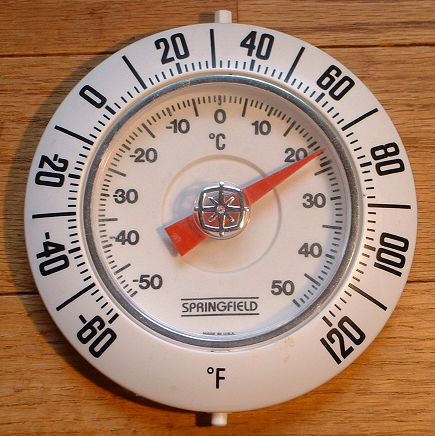

:skip-front-matter:

= Problem: Fahrenheit

Questions? Feel free to head to https://www.reddit.com/r/cs50[CS50 on Reddit], http://cs50.stackexchange.com[CS50 on StackExchange], or the https://www.facebook.com/groups/cs50[CS50 Facebook group].

== tl;dr

Implement a program that converts degrees in Celsius to Fahrenheit, per the below.

[source,subs=quotes]
----
$ [underline]#./fahrenheit#
C: [underline]#0#
F: 32.0
----

== Recommended Reading

* Pages 1 – 7, 9, and 10 of http://www.howstuffworks.com/c.htm.
* Chapters 1 – 5, 9, and 11 &#8211; 17 of _Absolute Beginner's Guide to C_.
* Chapters 1 – 6 of _Programming in C_.

include::../../honesty.adoc[]

== Assessment

Your work on this problem set will be evaluated along four axes primarily.

Scope::
 To what extent does your code implement the features required by our specification?
Correctness::
 To what extent is your code consistent with our specifications and free of bugs?
Design::
 To what extent is your code written well (i.e., clearly, efficiently, elegantly, and/or logically)?
Style::
 To what extent is your code readable (i.e., commented and indented with variables aptly named)?

To obtain a passing grade in this course, all students must ordinarily submit all assigned problems unless granted an exception in writing by the instructor.

== Turning Up the Heat

In the past, if you wanted to know what the outdoor temperature was, you had to look around for one of these, which might have been mounted outside at your house.

Prior to that, if you wanted to know what the temperature was outside, you just stood outside, but we digress. Nowadays, it's a fairly trivial exercise to pull open a weather app on your phone or visit a weather-reporting website to get the current temperature and the five-day forecast. No need to mess around with one of the above circular dials or its tube-of-mercury cousinfootnote:[e.g., https://upload.wikimedia.org/wikipedia/commons/b/ba/Thermometer.jpg.].

Depending on where you live in the world, your country uses one of two major temperature scales. If you live in the United States (and don't spend most of your day working in a science lab), it's likely that you're familiar with the Fahrenheit scale, and so if you hear that it's 30&deg; outside you're probably putting on a heavy coat and warm pants and bracing yourself for the possibility of snow, because that means it's quite cold, given that the freezing point of water is 32&deg;. On the other hand, it's not until the temperature hits 212&deg; that water boils.

In practically every other country of the world (or if you live in the United States and do in fact spend most of your day working in a science lab), you're probably most familiar with the Celsius or centigrade scale. In that case, if you hear that it's 30&deg; outside you're probably going to rummage through your closet for a swimsuit and put on some sunblock, because it's a beautiful beach day. On the Celsius scale, 0&deg; is the freezing point of water, and 100&deg; is the boiling point.

We acknowledge that with most apps that tell you the weather, it's fairly simple to press that switch that switches the temperature display from Fahrenheit to Celsius (or vice versa), but before that process was automated for us, one either had to memorize some of the more common conversion points or had to use a mathematical formula to convert from one scale to another, which is important if you plan on traveling internationally.

For this problem, we're going to focus on converting in just one direction: _from_ Celsius _to_ Fahrenheit. As it happens, the formula for this conversion isn't terribly complex. (Phew!) One simply takes the current temperature in degrees Celsius (&deg;C), multiplies it by 9, divides by 5, and then adds 32. The result is the equivalent temperature in degrees Fahrenheit (&deg;F). Not bad, right? For the more visually inclined, this translates to this formula:

[source,bash]
----
F = ((C * 9) / 5) + 32
----

Let's do a quick test to make sure things work as expected. Worldwide, the commonly accepted value for normal human body temperature is 37&deg;C. If we plug "37" into that formula where &deg;C goes and do the math (37 multiplied by 9 is 333, 333 divided by 5 is 66.6, 66.6 + 32 is 98.6) we get 98.6&deg;F which is what folks in the United States know as normal human body temperature. So that checks out. Similarly if we plug in 0&deg;C (the freezing point of water) into that formula does it convert to 32&deg;F, and 100&deg;C (the boiling point of water) is apparently equivalent to 212&deg;F. Seems like things are going well.

== A Cool Look Back

Log into your CS50 IDE account (remember how?) and be sure before doing anything to run `update50` in your terminal window, waiting until any updates finish processing before moving further. We'll remind you of this as much as possible, but do note that before each problem you should remember to run that command to be sure your IDE workspace is fully up-to-date.

If you have it from http://docs.cs50.net/2017/ap/problems/hello/hello.html[Hello], take a look at your `hello.c` file, which should be in your `chapter1/hello/` directory. (If you don't have it, create it now.) The contents should look probably like this:

[source,c]
----
#include <stdio.h>

int main(void)
{
    printf(“Hello, world!\n”);
}
----

To make our program more adaptable, instead of having it always print the same simple message (`Hello, world!\n`) each time, we can modify this program to prompt a user to provide their name and then print out their name instead:

[source,c]
----
#include <cs50.h>
#include <stdio.h>

int main(void)
{
    string name = get_string("Enter your name: ");
    printf("hello, %s\n", name);
}
----

Notice a couple of important differences in this program. It seems that we have decided to include another header file called `cs50.h`. In this file, which you can have a peek at https://raw.githubusercontent.com/cs50/libcs50/develop/src/cs50.h[here] and which we'll also discuss in more detail later in the course (so don't be alarmed by some unfamiliar syntax), you'll see that that's where we've declared the data type of `string` and declared a function called `get_string`.

A `string` in computer science essentially refers to a collection of characters--a word, a sentence, or a phrase. Because when we ask the user for their name it probably consists of more than a single letter, which would be just a character (`char`), we need to use `get_string` to collect their input and we need to store it in a variable whose data type is `string`; we've done this, the variable called `name` has the data type of `string`.

What else has changed, though? That last line of code looks a bit strange. There's a `%s` in there, and the variable `name` appears. What's going on?

Essentially, `%s` is what's known as a __placeholder__ for a variable. At the time the program is compiled, we don't know exactly what will be printed out (unlike the original program which will always print out `hello, world\n`), but we do expect that the program will print `hello,` followed by whatever the user typed. `%s` is how we indicate to `printf` that a `string` will be printed there.

What `string` will we print? Well, that'd be `name`! After we specify what we want `printf` to print, leaving as many placeholders as necessary, we specify what variables those placeholders refer to in order from left to right, separated by commas. We only have one placeholder in our modified program, a single `%s`, and so the variable that we're telling `printf` to print in place of that `%s` is whatever the user typed at the prompt. For example:

[source,bash,subs=quotes]
----
~/workspace/chapter1/hello/ $ [underline]#./hello#
Enter your name: [underline]#Alice#
Hello, Alice!
----

There's not just `get_string` in `cs50.h` though. There are functions to get user input of nearly all types: `get_int`, `get_float`, `get_double`, `get_long_long`, `get_char`.

== Getting Warmer ==

Now, create a file called `fahrenheit.c` (remember how?), ensuring that it is inside of a subdirectory called `fahrenheit` inside of your `chapter1` directory, and then double-click on that file in the file tree to the left. You should now have an open window in Ace with the tab name `fahrenheit.c`, and you're ready to write your first utility program--a program that can be used by others to do something meaningful for them. (Not to knock the value of saying `Hello, world!`… but we can do so much more!)

Write a program that converts a temperature in Celsius to Fahrenheit, as per the sample output below, wherein underlined text represents some user's inputfootnote:[Incidentally, while spelling Fahrenheit correctly is a little tricky, do be careful to do so lest you be told that your program doesn't exist!].

[source,bash,subs=quotes]
----
~/workspace/chapter1/fahrenheit/ $ [underline]#./fahrenheit#
C: [underline]#100#
F: 212.0
----

To solve this problem, you needn't do anything more complex than use your currently existing knowledge of C, and the information contained in this specification, including the temperature conversion formula. No matter how the user inputs the temperature in Celsius (that is, no matter to how many decimal places they choose), take care to display Fahrenheit to _exactly_ one decimal place. No need to worry about floating-point imprecision or integer overflow, if you recall what those terms mean.footnote:[If you don't, you soon will!]

Do recall that if you include `<cs50.h>` atop your `fahrenheit.c` file, you will have access to a function called `get_float`, which will allow the user to input a floating-point value (a number with a decimal point in it, also known as a __real number__).The parameters of the get functions will display a prompt for users. So if you had a line in a file called `name.c` that looked like this `get_string(“name please:”)`, it will display the following:

[source,bash,subs=quotes]
----
~/workspace/name/ $ [underline]#./name#
name please:
----

Incidentally, know that `printf` can be used to specify how many places after the decimal point you wish to display to the user. For example, assuming you've written the following program in a file called `truncate.c`:

[source,c]
----
#include <stdio.h>

int main(void)
{
   float pi = 3.1415926535;
   printf("%.2f\n", pi);
}
----

When executed (by first compiling with `make truncate` and then executing with `./truncate`), this program will output the value of the variable `pi` to exactly 2 decimal places: `3.14`. Can you see why? Perhaps you can adapt that to display the converted temperature to just one decimal place?

Before turning in your solution, be sure to test the correctness of your program with `check50`, by executing the below.

[source,bash]
----
check50 cs50/2017/ap/fahrenheit
----

If you pass all the `check50` test cases, and get a green smiley face when you run things through `style50`, congratulations! If not, don't worry: it's just time for a little bit of debugging and/or cleaning up your code.

If you'd like to play with our own implementation of `fahrenheit` in the IDE, you may execute the below:

[source,bash]
----
~cs50/chapter1/fahrenheit
----

== How to Submit

=== Step 1 of 3

Make sure your IDE is up-to-date by executing `update50`

=== Step 2 of 3

Ensure that `fahrenheit.c` is in `~/workspace/chapter1/fahrenheit`, as with:

[source]
----
cd ~/workspace/chapter1/fahrenheit
ls
----

If `fahrenheit.c` is not in `~/workspace/chapter1/fahrenheit`, move it into that directory, as via `mv` (or via CS50 IDE's lefthand file browser).

=== Step 3 of 3

* To submit `fahrenheit`, execute
+
[source]
----
cd ~/workspace/chapter1/fahrenheit
submit50 cs50/2017/ap/fahrenheit
----
+

If you run into any trouble, email sysadmins@cs50.harvard.edu!

You may resubmit any problem as many times as you'd like before the deadline.
   
Your submission should be graded for correctness within 2 minutes, at which point your score will appear at https://cs50.me/[cs50.me]!

This was Fahrenheit.
