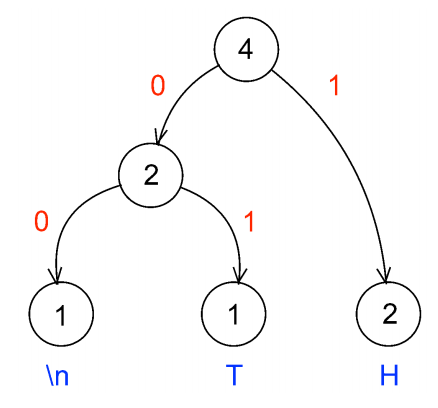

:skip-front-matter:

= Problem: Puff

Questions? Feel free to head to https://www.reddit.com/r/cs50[CS50 on Reddit], http://cs50.stackexchange.com[CS50 on StackExchange], the `#cs50ap` channel on https://cs50x.slack.com[CS50x Slack] (after signing up), or the https://www.facebook.com/groups/cs50[CS50 Facebook group].

== tl;dr

Implement Huffman decompression, per the below

[source]
----
./puff hth.bin puffed.txt
----

include::../../honesty.adoc[]

== Assessment

Your work on this problem set will be evaluated along four axes primarily.

Scope::
 To what extent does your code implement the features required by our specification?
Correctness::
 To what extent is your code consistent with our specifications and free of bugs?
Design::
 To what extent is your code written well (i.e., clearly, efficiently, elegantly, and/or logically)?
Style::
 To what extent is your code readable (i.e., commented and indented with variables aptly named)?

To obtain a passing grade in this course, all students must ordinarily submit all assigned problems unless granted an exception in writing by the instructor.

== Getting Ready

You're welcome, and encouraged, to do the following exercises so that you may better prepare yourself for this problem, but know that they are not required to be submitted.

Remember that a binary tree has nodes similar to those of a linked list, except instead of one pointer there are two: one for the left "child" and one for the right "child". Draw a boxes-and-arrows diagram of a binary tree node containing 7, where each child pointer is `NULL`.

With a linked list, we only had to store a pointer to the first node in the list in order to remember the whole list. Likewise, with trees, we only have to store a pointer to a single node in order to remember the whole tree. This node is called the "root" of the tree.

Build upon your diagram from before (or draw a new one)such that you have a boxes-and-arrows depiction of a binary tree with the value 7 inside of the root node, 3 inside of the left child node, and 9 inside of the right child node. Now, make an additional node containing 6, and set the right child pointer of the node containing 3 point to it.

Let's go over some terminology. We already talked about how the "root" of the tree is the top-most node in the tree, the one containing 7 in the diagram you just drew. With a pointer to the root, you can hold on to the entire tree.

The nodes at the bottom of the tree are called the "leaves". In precise terms, these are the nodes for which both child pointers are `NULL`. In the diagram described above, the nodes containing 6 and 9 are leaves.

The "height" of a tree is the number of hops you have to make to get from the root to the most distant leaf. If the tree only has one node, then we say that its height is 0. The tree you just drew has a height of 2, since you have to make two hops to get from the root to the node containing 6.

We can also talk about nodes in a tree in terms relative to the other nodes in the tree. For this, we use terminology taken from family trees: parents, children, siblings, ancestors, and descendants. Using your best instincts, answer the following questions using the diagram you just drew! Identify each node by the value it's holding.

* Which node is the parent of 3?
* How many siblings does 9 have? Name them.
* How many ancestors does 6 have? Name them.
* How many descendants does 7 have? Name them.
* How many children does 3 have? Name them.

We say that a binary tree is "ordered" if for each node in the tree, all of its descendants on the left (i.e., the left child and of its children) have lesser values and all of its descendants on the right have greater values (we'll assume that there aren't any duplicate values in our tree). For example, the tree above is ordered, but it's not the only possible ordered arrangement! Try to draw as many ordered trees as you can think of using the numbers 7, 3, 9, 6. How many distinct arrangements are there/ What is the height of each one?

Ordered binary trees are cool because we can search through them in a very similar way to searching over a sorted array! To do so, we start at the root and work our way down the tree, towards the leaves, checking each node's value against the value we're searching for. If the current node's value is less than the value you're looking for, you go next to the node's right child. Otherwise, you go to the node's left child. At some point, you'll either find the value you're looking for or you'll run into a `NULL`, indicating that the value's not in the tree.

Using the initial tree you drew above (with 7 at the root and 3 and 9 as its children, plus 6 as a child of 3), perform the following lookups. Indicate which nodes you check, in order.

* 6
* 10
* 1

Ok, let's play with binary trees in C! Log into cs50.io and create a file called `binary_tree.c`. Because the file will not be submitted, feel free to save it wherever you'd like.

First, we'll need a new type definition for binary tree node containing `int` values. Using the boilerplate `typedef` below, create a new type definition for a node in a binary tree. If stuck, refer to past problems!

[source,c,subs=quotes]
----
typedef struct node
{
	// [yellow-background]#TODO#
}
node;
----

Now declare a global `node*` variable for the root of a tree. In `main`, initialize the root and put the value 7 in it.

Create three more nodes: one containing 3, one containing 6, and one containing 9. Link them up using pointeres so that you've got the same tree structure as the one you've drew above, where 7 is at the root, 3 is the root's left child, 9 is in the root's right child and 6 is 3's right child.

Now write a function called `contains` with a prototype of

[source,c]
----
bool contains(int value);
----

that returns `true` if the tree pointed to by the global variable `root` contains `value` and `false` otherwise. Add some sample function calls to `main` along with some calls to `printf` to make sure your function behaves as expected!

Add some more nodes to your tree: Try adding 5, 2, and 8. Make sure your `contains` code still works as expected!

So adding nodes manually like this is a bit of a pain, eh? Fortunately, now that you've written `contains`, insert isn't too much harder! Implement a function with prototype

[source,c]
----
bool insert(int value);
----

that inserts a node containing `value` into the tree pointed to by the global `root` variable. Return `true` if successful, and return `false` if you failed for some reason (e.g., lack of sufficient heap memory, value already in the tree, etc.). Try inserting 1, 4, 9, and 2 (again!) to the tree to make sure the code works as expected!

== Getting Started

First, log into cs50.io if not already logged in and execute

[source,bash]
----
update50
----

within a terminal window to make sure your workspace is up-to-date. Then navigate your way to the chapterB directory by executing

[source,bash]
----
cd ~/workspace/chapterB
----

Then execute

[source,bash]
----
wget http://docs.cs50.net/2016/ap/problems/puff/puff.zip
----

to download a ZIP of this problem's distro. Let's unzip the ZIP file by executing

[source,bash]
----
unzip puff.zip
----

and delete the ZIP file with

[source,bash]
----
rm -f puff.zip
----

If you navigate into the newly created `puff` folder and execute

[source,bash]
----
ls
----

you should see that the directory contains ten files

[source,bash]
----
Makefile	dump.c	forest.c	forest.h	ht.txt	huffile.c	huffile.h	tale.txt	tree.c	tree.h
----

== Story Time!footnote:[You, uh... can skip this section if you want.]

__Once upon a time when pigs spoke rhyme__

__And monkeys chewed tobacco,__

__And hens took snuff to make them tough,__

__And ducks went quack, quack, quack, O!__

There was an old sow with three little pigs, and as she had not enough to keep them, she sent them out to seek their fortune. The first that went off met a man with a bundle of straw, and said to him:

"Please, man, give me that straw to build me a house."

Which the man did, and the little pig built a house with it. presently came along a wolf, and knocked at the door, and said:

"Little pig, little pig, let me come in."

To which the pig answered:

"No, no, by the hair of my chin chin chin."

"Then I'll huff, and I'll puff, and I'll blow your house in."

So he huffed, and he puffed, and he blew his house in, and ate up the little pig.

The second little pig met a man with a bundle of furze, and said:

"Please, man, give me that furze to build me a house."

Which the man did, and the pig built his house. Then along came the wolf, and said:

"Little pig, little pig, let me come in."

"No, no, by the hair of my chin chin chin."

"Then I'll huff, and I'll puff, and I'll blow your house in."

So he huffed, and he puffed, and he puffed, and he huffed, and at last he blew the house down, and he ate up the little pig.

The third little pig met a man with a load of bricks, and said:

"Please, man, give me those bricks to build a house with."

So the man gave him the bricks, and he built his house with them. So the wolf came, as he did to the other little pigs, and said:

"Little pig, little pig, let me come in."

"No, no, by the hair of my chin chin chin."

"Then I'll huff, and I'll puff, and I'll blow your house in."

Well, he huffed, and he puffed, and he huffed and he puffed, and he puffed and huffed; but he could _not_ get the house down. When he found that he could not, with all his huffing and puffing, blow the house down, he said:

"Little pig, I know where there is a nice field of turnips."

"Where?" said the little pig.

"Oh, in Mr. Smith's Home-field, and if you will be ready tomorrow morning I will call for you, and we will go together, and get some for dinner."

"Very well," said the little pig, "I will be ready. What time do you mean to go?"

"Oh, at six o'clock."

Well, the little pig got up at five, and got the turnips before the wolf came (which he did about six) and who said:

"Little Pig, are you ready?"

The little pig said: "Ready! I have been and come back again, and got a nice potful for dinner."

The wolf felt very angry at this, but thought that he would be up to the little pig somehow or other, so he said:

"Little pig, I know where there is a nice apple-tree."

"Where?" said the pig.

"Down at Merry-garden," replied the wolf, "and if you will not deceive me I will come for you, at five o'clock tomorrow and get some apples."

Well, the little pig bustled up the next morning at four o'clock, and went off for the apples, hoping to get back before the wolf came; but he had further to go, and had to climb the tree, so that just as he was coming down from it, he saw the wolf coming, which, as you may suppose, frightened him very much. When the wolf came up he said:

"Little pig, what! Are you here before me? Are they nice apples?"

"Yes, very," said the little pig. "I will throw you down one."

And he threw it so far, that, while the wolf was gone to pick it up, the little pig jumped down and ran home. The next day the wolf came again, and said to the little pig:

"Little pig, there is a fair at Shanklin this afternoon, will you go?"

"Oh yes," said the pig, "I will go; what time shall you be ready?"

"At three," said the wolf. So the little pig went off before the time as usual, and got to the fair, and bought a butter-churn, which he was going home with, when he saw the wolf coming. Then he could not tell what to do. So he got into the churn to hide, and by so doing turned it round, and it rolled down the hill with the pig in it, which frightened the wolf so much, that he ran home without going to the fair. He went to the little pig's house, and told him how frightened he had been by a great round thing which came down the hill past him. Then the little pig said:

"Hah, I frightened you, then. I had been to the fair and brought a butter-churn, and when I saw you, I got into it, and rolled down the hill."

Then the wolf was very angry indeed, and declared he _would_ eat up the little pig, and that he would get down the chimney after him. When the little pig saw what he was about, he hung on the pot full of water, and made up a blazing fire, and, just as the wolf was coming down, took of the cover, and in fell the wolf; so the little pig put on the cover again in an instant, boiled him up, and at him for supper, and lived happy ever afterwards.

== Huff, Man, Huff!

Okay, enough fairy tales. Time to get to work.

The challenge ahead is to implement a program called `puff` that puffs (i.e., decompresses) files that have been huffed (i.e., Huffman-compressed) with a program that we wrote called `huff`. Let's begin with a story of our own.

Once upon a time, there were four little pigs who lived in a four-byte ASCII file. The first little piggy was an `H`. The second little piggy was a `T`. The third little piggy was an `H`. And the fourth little piggy was a newline.

Presently came along David A. Huffman, and made a tree out of the piggies' frequencies, per the figure below.

In a file called `tale.txt`, finish this tale if (and only if) feeling creative.

When represented in ASCII, each of those piggies take up 8 bits on disk. But, thanks to Huffman, we can generally do better. After all, how many bits does it really take to represent any of there different characters? Just two, of course, as two bits allows us as many as 2^2^ = 4 codes. And so could we represent, per the figure above, a newline with `00`, `T` with `01`, and `H` with `1`. Notice how, even in this tiny example, the least frequent of characters receive, by design, the longest of codes.

The catch, of course, is that you must be able to reconstruct this tree (or, more generally, recover these codes) if you wish to puff back to ASCII piggies that have been huffed. Perhaps, the simplest way to enable a program like `puff` to decompress files that have huffed is to have `huff` include in those files piggies` original frequencies. With those frequencies can `puff` then re-build the same tree that `huff` built. Of course, inclusion of this metadata does cost us some space. But, for larger inputs, that cost is more than subsumed by savings in bits.

We chose, for `huff`, to include these frequencies and more. Let's get you started on `puff`.

== To Puff a Huff

Open up `huffile.h` and spend some time looking over the code and comments therein. This file defines a "layer of abstraction" for you in order to facilitate your implementation of `puff` (and our implementation of `huff`). More technically, it defines an API (application programming interface) with which you can read (or write) Huffman-compressed files.

Ultimately, this problem set is as much about learning how to interface with someone else's code (e.g., ours) as it is about building and traversing binary trees. After all, after CS50, you won't always have someone to walk you through code. But what once looked like Greek should at least now look like C to you!footnote:[Unless you actually speak Greek.]

Notice that, in `huffile.h`, we have defined the following `struct` to wrap all our metadata.

[source,c]
----
typedef struct
{
	int magic;
	int frequencies[SYMBOLS];
	int checksum;
}
Huffeader;
----

As its own name suggests (say it three times fast), this `struct` defines a header for a Huffman-compressed file (much like `BITMAPFILEHEADER` defined a header for BMPs). Before writing out bits (i.e., codes), our implementation of `huff` first writes out this header, so that your version of `puff` can read in the same and reconstruct the tree we used for huffing.

Besides symbols' frequencies, notice that this header includes some magic! Much like JPEGs begin with `0xffd8`, so have we decided (arbitrarily) that `huff`-compressed files must begin with `0x46465548`.footnote:[We say "arbitrarily", but `0x46465548` actually has meaning. What does it spell?] A "magic number," then, is a form of signature. We have also decided that huffed files' headers must end with a "checksum," a summation of all frequencies therein.

In other words, if, upon reading some file's first several bytes into a `Huffeader`, `magic` is not `0x46465548` or `checksum` does not equal the sum of all values in `frequencies`, then the file was most certainly not huffed!footnote:[Of course, some non-huffed file's first several bytes might happen to satisfy these conditions as well, in which case it could be mistaken for a huffed file. Probabilistically, that's not too likely to happen. But it's because of that chance that some operating systems (also) rely on files' extensions (e.g., `.bmp`) to distinguish files' types.

Take a look now at `hth.txt`, but take care not to make any changes. In that file are those four little piggies (even though the text editor might now show you the newline). Let's blow their house down and compress them with our implementation of `huff`. Run the below to save a compressed version of `hth.txt` in a new file called `hth.bin`.

[source,bash]
----
~cs50/chapterB/huff hth.txt hth.bin
----

Let's take a look at the huffed file's size. Run the below.

[source,bash]
----
ls -l hth.txt hth.bin
----

Ack! Per that command's output, it seems that we have "compressed" 4 bytes to 1034! Such is the cost of that metadata for particularly small files. For larger inputs, though, it won't be so bad.

Incidentally, `hth.txt` is considered an ASCII (or text) file because it contains ASCII codes, and `hth.bin` is a binary file because it does not. That we've chosen extensions of `.txt` for the former and `.bin` is just for convenience and not by requirement.

Let's take a look at the contents of `hth.bin` in hex. Run the below.

[source,bash]
----
xxd -g 4 hth.bin
----

Scroll back on up to the start of `xxd`pass:['s] output. Take a look at this huffed file's first four bytes! Wait a minute, talk about magic, those bytes are reversed! (And, yes, they do spell `HUFF` if you insist on interpreting those bytes as ASCII, as `xxd` does in its rightmost column. So clever we are.) Recall that a huffed file's first four bytes were supposed to be `0x46465548`, not the reverse. So what's going on?

It turns out that the IDE is "little endian,' whereby multi-byte primitives (like `int`) are stored with their little end (i.e. least-significant byte) first. Generally speaking, you need not worry about endianness when programming, unless you start manipulating binary files (or network connections). We mention it now so that you understand `xxd`pass:['s] output!

Notice, by the way, how many `0`s are in `hth.bin`. Of course, `hth.txt` only had three unique piggies, so most of those `0`pass:[s] represent the frequencies of ASCII's other (absent) 253 characters. But, if you look closely, scattered among all those `0`pass:[s] are `01000000`, `02000000`, and `01000000` which are, of course, little-endian representations of 1, 2, and 1 (in decimal), the frequencies of newlines, `H`, and `T`, respectively, in `hah.txt`! Lower in `xxd`pass:['s] output you'll find `04000000`, the sum (i.e., checksum) of those counts. The second-to-last byte in `hah.bin` appears to be `b0` and the very last `06`. Hm, back to those in a bit.

Next take a look now at `dump.c`. That file implements a program with which you can dump `huff`-compressed files in human-readable form. Look over its comments and code to learn how it works.

Next take a look at `Makefile`, in which we've defined a target for `dump` but not one for `puff`. (We'll leave that to you.) Notice how `dump` depends not only on `dump.c` but also on other `.c` and `.h` files as well. That `dump.c` itself appears relatively simple is because we have abstracted away important,, but potentially distracting, details with APIs.

Go ahead and build `dump` with Make. (Remember how?) Then run it as follows.

[source,bash]
----
./dump hth.bin
----

You should see output like the below.

[source,bash]
----
! 0	- 0	9 0	E 0	Q 0	] 0	i 0	u 0
" 0	. 0	: 0	F 0	R 0	^ 0	j 0	v 0
# 0	/ 0	; 0	G 0	S 0	_ 0	k 0	w 0
$ 0	0 0	< 0	H 2	T 1	` 0	l 0	x 0
% 0	1 0	= 0	I 0	U 0	a 0	m 0	y 0
& 0	2 0	> 0	J 0	V 0	b 0	n 0	z 0
' 0	3 0	? 0	K 0	W 0	c 0	o 0	{ 0
( 0	4 0	@ 0	L 0	X 0	d 0	p 0	| 0
) 0	5 0	A 0	M 0	Y 0	e 0	q 0	} 0
* 0	6 0	B 0	N 0	Z 0	f 0	r 0	~ 0
+ 0	7 0	C 0	O 0	[ 0	g 0	s 0
, 0	8 0	D 0	P 0	\ 0	h 0	t 0

101100
----

Atop `dump`pass:['s] output is a table of frequencies, not for all ASCII characters but for those that display nicely in terminal windows. Notice that the frequencies of `H` and `T` are expected. (Newlines are simply not among the characters shown.)

Below that table, meanwhile, is a sequence of six bits, the compressed version of `hth.txt`! Recall, after all, that our tree told us to represent newline with `00`, `T`, with `01`, and `H` with `1`. And, so, the above indeed represents our original text!

Let's take one more look at this file with `xxd`, this time in binary. Try the below.

[source,bash]
----
xxd -b hth.bin
----

Take a close look at `hah.bin`pass:['s] final two bytes: `10110000` and `00000110`. (You may recall these bytes as `b0` and `06` in hex.) Notice how the former is but `101100` padded with two trailing `0`pass:[s]. Why these two `0`pass:[s]? Well, you can write individual bytes to disk but not individual bits. Ergo, even though our implementation of `huff` only called `bwrite` six times in order to write out six bits, our API ultimately has to write out eight bits. To avoid confusion when it's time to read those bits back in, our API employs a trick. We keep track, in a huffed file's very last byte, of how many bits in the file's second-to-last byte are valid so that `bread` can avoid returning trailing padding, lest you, in writing `puff`, mistake extra `0`pass:[s] for encoded symbols.

If curious, take a look at `huffile.c`. As is the case with most APIs, you don't need to understand how our API works underneath the hood in order to use the functions. After all, you've probably never seen the contents of `stdio.c`, but that hasn't stopped you from using `printf`! But you should absolutely understand what you can do with our API. For that knowledge, you can rely on `huffile.h` alone.

A final stroll through some code, if we may. Recall that, to implement Huffman's algorithm, you can begin with a "forest" of single-node trees, each of which represents a symbol and its frequency within some body of text. Iteratively can you then pick from that forest the two trees with lowest frequencies, join them as siblings with a new parents whose own frequency is the sum of its children's, and plant that new parent in the forest. In time will this forest converge to a lone tree whose branches represent symbols' codes.

Also recall that the manner in which ties between roots with equal frequencies are broken is important to standardize, lest `huff` and `puff` build different trees. And so we have provided you not only with an API for reading (or writing) `Huffile`pass:[s] but also with an API for forest management.footnote:[Speaking of forest management, did you know that Harvard owns a forest? Procrastinate at http://harvardforest.fas.harvard.edu/] Take a look first at `tree.h`. Notice that we have provided the following definition for trees' nodes.

[source,c]
----
typedef struct tree
{
	char symbol;
	int frequency;
	struct tree* left;
	struct tree* right;
}
Tree;
----

Rather than store symbols' frequencies as percentages (i.e., floating point values), a node, per this definition, instead stores raw counts.

As the design of `tree.h` suggests, rather than ever `malloc` a `Tree` yourself, you should instead call `mktree`, which will not only `malloc` a `Tree` for you but also initialize its members to defaults. Similarly should you never call `free` on a `Tree` but, instead, invoke `rmtree`, which will delete that `Tree`pass:['s] root for you plus all its descendants.footnote:[If familiar with, say, C++, you can think of `mktree` as a sort of constructor and `rmtree` as a sort of destructor.]

Now take a look at `forest.h`. This API happens to implement a `Forest` as a linked list of `Plot`pass:[s], each of which houses a `Tree`. But you need not worry about such details, as we have abstracted them away for the sake of simplicity (and standardization). Rather than ever `malloc` or `free` a `Forest` yourself, you should instead, much like for `Tree`pass:[s], call `mkforest` or `reforest`, respectively. Moreover, rather than ever touch a `Forest`pass:[']s linked list, you should instead add `Tree`pass:[s] to a `Forest` with `plant` and remove `Tree`pass:[s] from a `Forest` with `pick`. Note that this API does not build Huffman's tree for you! Rather, it maintains `Tree`pass:[']s that you yourself have planted in sorted order so that you can pick those same `Tree`pass:[s] in order of increasing frequency, with the API (and not you) breaking ties when necessary.

If curious as to how this all works, take a look at `tree.c` and `forest.c`. But again, most important is that you familiarize yourself with these APIs by way of those header files.

== What To Do

Implement in a file called `puff.c` a program called `puff` that decompresses huffed files! Allow us to put forth the following requirements.

* Your program must accept two and only two command-line arguments: the name of a file to `puff` followed by the name under which to save the puffed output. If a user does not provide such, your program should remind the user of its usage and exit, with `main` returning `1`.
* Your program must ensure that its input is (most likely) indeed huffed by reading, with `hread`, its first bytes into a `Huffeader` and checking its magic number and checksum. If its input is not a valid huffed file, your program should inform the user accordingly and exit, with `main` returning `1`.
* You must build Huffman's tree using our APIs for `Forest` and `Tree`. That tree must not include nodes for symbols not appearing in the huffed file.
* After picking two trees from a forest in order to join them as siblings with a new parent, the first tree picked should become the parent's left child, the second the parent's right.
* Assume that left branches represent 0s and the right branches 1s
* If puffing a file that contains only one unique symbol, assume the symbol's code is just 0.
* You  must read in bits using our API for `Huffile`pass:[s].
* You need not ever call `bwrite` or `hwrite`, unless you'd also like to implement `huff`!
* You must handle all possible errors gracefully by printing error messages and returning `1`; under no circumstances should we be able to crash your code.
* You may not leak any memory. Before quitting, even upon error, your program must free any memory allocated on its heap, either with `free` or, if allocated by our APIs, with `hfclose`, `rmtree`, and/or `rmforest`.
* You must update `Makefile` (however you see fit) with a target for `puff`. Recall, though, that a target's second line must begin with a tab. Recall, though, that when you hit Tab in the IDE, you do not get `\t` but instead four spaces instead by default. To insert a true tab using the IDE, Go to the view tab on the top left of the IDE and uncheck *Less Comfortable*, if checked. Then in the lower right hand of your C file, you should see something like *Spaces: 4*. Click on that tab, and uncheck *Soft Tabs (spaces)*. Then you can hit Tab to insert `\t`. You may want to recheck the soft tabs option afterwards.

If unsure where to begin, return your attention to `dump.c`, as you can adopt its overall framework as your own. Of course, `dump` stops short of building Huffman's tree, so there's still work to be done!

How to determine if your code is correct? Well, certainly play with the staff's solutions to both `huff` and `puff` in `~cs50/chapterB`, comparing our output to yours. Also use `ls` with its `-l` switch to compare files' sizes. And, rather than compare outputs visually, (e.g., with a text editor, `xxd`, `cat`, `more`, or `less`), you can use a popular Linux command called `diff`. For instance, suppose that you've already run the below.

[source,bash]
----
~cs50/chapterB/huff hth.txt hth.bin
----

And now you'll like to try puffing `hth.bin` with your own version of `puff`, and so you run a command like the below.

[source,bash]
----
./puff hth.bin puffed.txt
----

You can now compare `hth.txt` and `puffed.txt` for differences by executing the below.

[source,bash]
----
diff hth.txt puffed.txt
----

If the files are identical, then `diff` will output nothing. Otherwise it will report lines with differences.

Of course best to test `puff` with more than just `hth.txt`. Odds are, you have a whole bunch of text files within reach from the Mispellings Problem that you can huff with our `huff` and puff with your `puff`! In theory, you can huff binary files as well, even though (conceptually, at least) Huffman's algorithm is meant for ASCII files.

And how can you chase down memory leaks? Well, you know your code best, so certainly think about where your own code might leak. Focus, in particular, on any blocks of code in which your code might return prematurely (as in the case of some error); it's not likely sufficient to free up your heap only, say, at the very end of `main`.

But also take advantage of `valgrind`, whose job is to report memory-related mistake and, in particular, leaks. Run it with a command line like the bellow.

[source,bash]
----
valgrind ./puff hth.bin puffed.txt
----

Admittedly, `valgrind`pass:[']s output is a bit cryptic, but keep an eye out for `ERROR SUMMARY` and, possibly, `LEAK SUMMARY`. For additional hints, run it with some optional switches, per the below.

[source,bash]
----
valgrind -v --leak-check=full ./puff hth.bin puffed.txt
----

And don't forget to use `gdb` when debugging!

Alright, off you go. HTH!

This was Puff.
