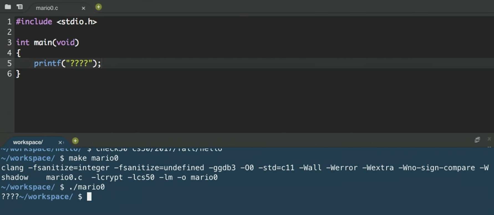
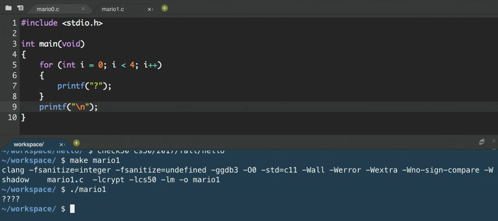
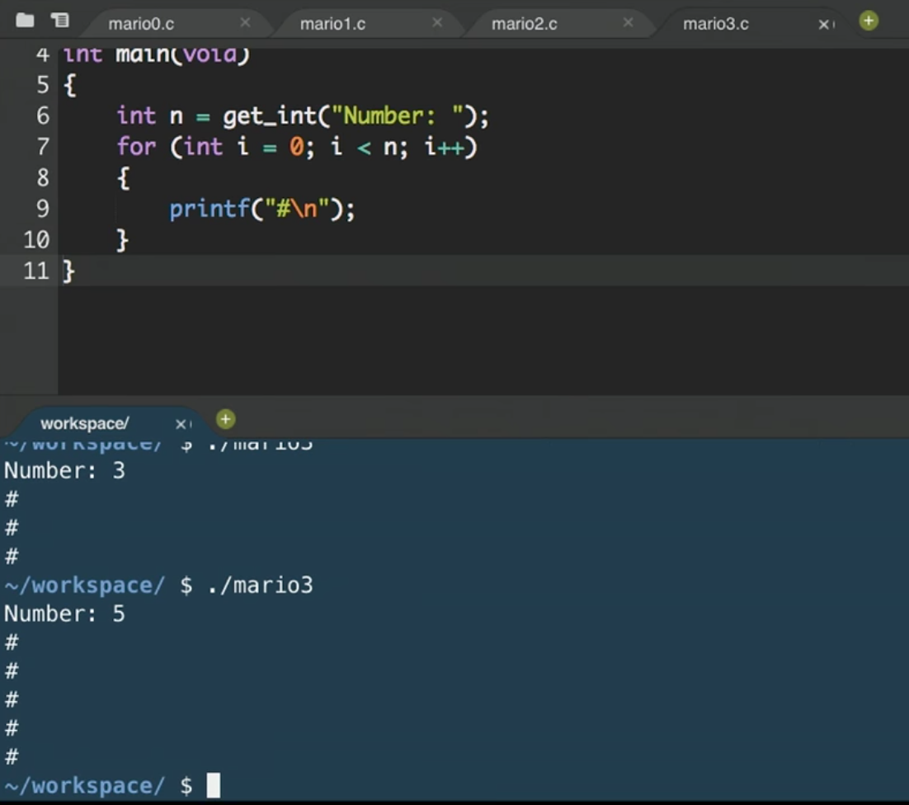
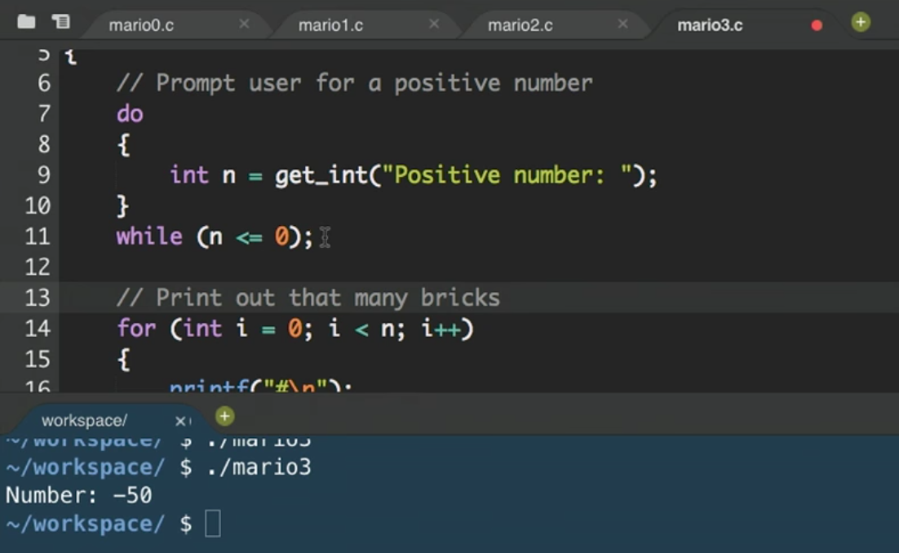
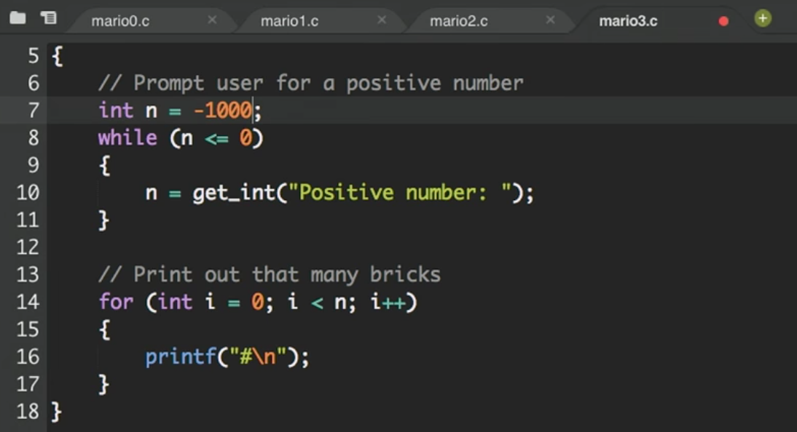

---
---
:author: Cheng Gong

= Lecture 2

[t=0m0s]
== C, continued

* Last time, we learned how to use the CS50 IDE to write and compile source code, and run the compiled program in our terminal.
* Recall that `clang` is one compiler that can take source code written in C, and turn it into machine code, instructions in 0s and 1s, that our computer can actually run.
* And recall that, in order to use functions like `get_string`, we need to `#include <cs50.h>` at top, or `#include <stdio.h>` to use `printf`, among others.
* If we see any errors when compiling, we should always look at the first one, try to fix it, and recompile, since the following errors might simply be a result of the first error.
* If we see an error we don't understand, we can use a command written by CS50 staff, `help50`. For example, we could run `help50 clang hello.c`, and see the following:
+
image::help50.png[alt="help50 output", width=400]
** By reading the yellow text, we get a hint to indeed `#include` the library that we initially forgot to add.
* Now if we run `clang` again, we get a different error. When we add a header file to our source code, it only indicates that the library exists somewhere. Since the CS50 library wasn't built in (like `stdio.h` is), we also need to point `clang` to the file that contains the library's code:
+
image::lcs50.png[alt="clang lcs50", width=200]

[t=0m0s]
== Compiling

* So far, when we've used the term compiling, we were actually referring to a process that is made of four steps:
** preprocessing
*** In C, preprocessing involves replacing the lines that start with `#include` with the contents of the actual file.
** compiling
*** The compiler takes the complete source code and converts it to assembly code, much simpler instructions that look like this:
+
[source, assembly]
----
main:                               #   @main
    .cfi_startproc
# BB#0:
    pushq   %rbp
.Ltmp0:
    .cfi_def_cfa_offset 16
.Ltmp1:
    .cfi_offset %rbp, -16
    movq %rsp, %rbp
.Ltmp2:
    .cfi_def_cfa_register %rbp
    subq $16, %rsp
    movabsq $.L.str, %rdi
    movb $0, %al
    callq   printf
...
----
These lines are single-step arithmetic or memory management instructions that CPUs can perform.
** assembling
*** Finally, these lines of assembly are converted to 0s and 1s that the CPU can directly understand.
** linking
*** We also need to combine into our program the binary file for standard I/O library that we call functions from, and this last step does exactly that. Recall that we only included `stdio.h`, which is just the header file that declares the functions, not the actual code for them.
* By having different stages, we can more closely examine, debug, and work with each layer, so the more complicated systems that we build atop them are cleaner, more secure, and better-designed.

[t=0m0s]
== Tools

* For the problem sets, you'll be able to use two other tools written by staff, `check50` and `style50`.
** `check50` will run test cases against our program, by uploading it to CS50's servers.
** `style50` will check for style, like indentation, variable naming, and comments. For our `hello` program, we might add a one-line summary at the top:
+
image::hello_comment.png[alt="Comment for hello.c", width=300]
If we forgot to indent or indented too much, `style50` will also indicate that with color: green for spacing it suggests adding, and red for spacing we should remove:
+
image::hello_style.png[alt="Style for hello.c", width=300]
Like with compiler errors, if we see a lot of output, we can try fixing one or a few things at once, and re-running to see our progress.
* As for design, we'll learn from practice, examples, and feedback from human TFs!

[t=0m0s]
== Printing

* Super Mario Bros. is a classic video game from the 1980s, where the main character Mario runs across the screen, jumping into bricks and enemies.
* We can quickly write a program, with what we already know, to print 4 question marks in our terminal:
+

** We can immediately improve this by adding `\n` to the end of the string of question marks: `"????\n"`.
* We can try using a `for` loop to improve our program:
+

** We start with `i = 0` and check whether `i < 4` by convention, which makes for 4 iterations of the loop.
** We also add the `\n` to the outside of the loop, since we want just one, when we're done printing our question marks.
* Finally, we can make a version of this program that takes input from the user, and uses that to print some number of question marks:
+
image::mario2.png[alt="mario2", width=500]
** If we typed in a negative number as input, it would be saved to `n` since it's a valid integer, but the `for` loop would check the condition and move on immediately, since `i` would not be less than `n`.
** And if we accidentally had a bug in our code or input that caused too many question marks to be printed, we can press Control + C on our keyboard to stop the program immediately.
* Now, if we wanted to print a vertical line of blocks, we can add `\n` to each line inside the `for` loop:
+

* We can also re-prompt the user for a number if the integer we get from them is negative, by using a do-while loop:
+

** A do-while loop does something at least one time, then checks the condition, and repeats until the condition is no longer true.
* But when we compile this, we get lots of errors:
+
image::mario3_errors.png[alt="mario3 compiler errors", width=400]
** First, we notice that for each error, we are told the line number and character or column where the error is.
** Somehow, our error is that `n` is not used and used when it isn't declared yet.
** In Scratch, variables created somewhere can be used anywhere. But in C, and other languages, variables have a *scope*, or level of code where it can be used, based on where it is initialized. For C, we can generally think of `scope` as being limited to being within the closest set of curly braces.
** In this case, `n` only exists within the `do` part of the loop, since it is initialized inside. To fix this, we need to make the following change:
+
image::mario3_working.png[alt="mario3 working", width=400]
** We can initialize `n` outside the do-while loop with no value, and it will be accessible inside the loop since the loop is within the scope of the `main` function (the curly braces that surround the initialization of `n`).
* We could use a `while` loop if we initialize `n` to some negative value, but it's not clear where that value is from, and is considered bad design:
+

* Now let's print a square of bricks:
+
image::mario4.png[alt="mario4", width=300]
** We can think of `printf` as being able to print to the terminal like a typewriter: it can print one character after another, and use a new line to move to the next line.
** Here we are nesting one `for` loop inside another, using `j` as our counter to avoid mixing up our counts.
** In the inner `for` loop, we print `#` the right number of times for each row, and follow that with a new line. The outer `for` loop will then repeat that for the right number of rows.
* We can use another tool, `eprintf`, to provide information to ourselves when our program is running:
+
image::eprintf.png[alt="eprintf", width=300]
* We should also use the debugger, by clicking on line numbers to the left of our code:
+
image::debugger.png[alt="debugger", width=500]
** The red dot is called a *breakpoint*, which pauses our program at that line.
** Then we can run `debug50 ./mario4`, and the panel on the right automatically opens.
** We see a section called "Local Variables", underneath which we see that our only variable so far, `n` is `0` at that point in our code.
** We can use the buttons on the top of that panel to control our program precisely. The triangle that looks like a play button will let the program resume normally until it reaches another breakpoint, if any. The next button, an arrow in the shape of a half-circle, will run the very next line of code, and pause the program again. The next button, the arrow pointing downwards, allows us to "step into" that line of code, and finally, the last arrow pointing up and to the right allows us to step back out of the next line of code.
* We take a quick break by looking at https://www.youtube.com/watch?v=RjJ44klc8zk[this video] of Super Mario Bros. recreated in augmented reality, with the Microsoft HoloLens headset.
