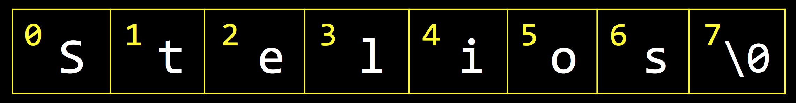

---
---
:author: Cheng Gong

= Lecture 3

[t=0m0s]
== Strings

* We talked last time about memory chips in our computers that simply store bits, one after another, with addresses that we can use to access each byte.
* We can think of all of our memory as a grid of bytes, numbered in order like so:
+
image::memory.png[alt="memory", width=300]
** In an actual modern computer, billions and billions of bytes can be stored in RAM (random access memory), so these addresses can go up to the billions!
* And we also learned last time that we can store Stelios' name in memory, terminating the string with a https://en.wikipedia.org/wiki/Null_character[NUL character]:
+

* We know that our computer has some way to address memory and store data for us, so we can abstract that away and program at a slightly higher level with C, using variables and arrays instead of memory addresses ourselves (as we might in an assembly language).
* Let's write a program to extract the initials of a name provided as input:
+
[source, c]
----
#include <cs50.h>
#include <ctype.h>
#include <stdio.h>
#include <string.h>

int main(void)
{
    char initials[4];
    string s = get_string("Name: ");
    int length = 0;
    for (int i = 0, n = strlen(s); i < n; i++)
    {
        if (isupper(s[i]))
        {
            initials[length] = s[i];
            length++;
        }
    }
    initials[length] = '\0';
    printf("%s\n", initials);
}
----
** We initialize an array of characters (which is exactly what a `string` is) to store the initials we extract from the string, and here we assume a user will have no more than 3 capital letters in their name. We allocate 4 characters, so the last can be the NUL character.
** With the `for` loop, we use the same method we learned last time to iterate over the input string, and if the character we are looking at is an uppercase character, we store it into our `initials` array. We create a `length` variable that keeps track of how many characters we've seen already, so we can store each character in the right index of `initials` and terminate it correctly as well. If we terminate our string at the very end, without knowing that we assigned values to the rest of the array, then we might see garbage values if we tried to print out `initials`.
** Recall that, if we wanted to initialize that array of characters manually, we can do something like:
+
[source, c]
----
...
char initials[4];
initials[0] = 'D';
initials[1] = 'J';
initials[2] = 'M';
initials[3] = '\0';
...
----
* Arrays can be used to store many of the same type of variable, but computers can only access one item in them at a time. A metaphor might be a row of lockers in a school, where a computer has to open each one to see the value inside, as opposed to reading all the values at once.

[t=20m17s]
== Searching

* If we had an array of numbers and wanted to find a particular one within the array, we need some algorithm to search for it.
* We have a volunteer find the number 50 behind 7 virtual doors on the board, and she finds it on the first try by a lucky guess.
* The numbers on the board were `15 23 16 8 42 50 4`, and since they were not ordered, there was not a faster way to find the number 50.
* If the numbers were then sorted from smallest to largest, then our volunteer would start at the end to find the number 50.
* But if we didn't know that 50 was the largest number, a smart strategy might be to start at the middle, like we did with the phone book from the first lecture. We can look at the value in the middle of our array, and then move to either the left or right half depending on whether the value we wanted to find is smaller or larger.
* In our first example with unsorted numbers, the best we could do is open each door, in order or randomly, until we found our number or opened all the doors. If we did this in order, the algorithm would be called *linear search*. In the worst case, this would take _n_ steps, where _n_ was the number of ... numbers in our array, and in the best case, we would find it in the first step.
** The pseudocode might look like this, and notice that we only `return false` after the `for` loop has finished, meaning we checked all the values in the array:
+
[source, pseudocode]
----
for each element in array
    if element you're looking for
        return true
return false
----
* With the second example of sorted numbers, we could use *binary search* and have a worst case of something logarithmic. We could write out the algorithm like so:
+
[source, pseudocode]
----
look at middle of sorted array
if element you're looking for
    return true
else if element is to left
    search left half of array
else if element is to right
    search right half of array
else
    return false
----
** Even though the code for this looks a little more complicated, we are dividing the problem in half each time, so we will have fewer steps before we find our number, or complete the algorithm.

[t=28m53s]
== Sorting

* A prerequisite requirement to being able to run binary search is having an array of sorted numbers.
* When we take exams, we might turn in blue books, or answer booklets with our names on them. If we had a pile of these blue books and wanted to sort them, we could pick up two of them, compare them, and start a sorted pile. Then we continue by taking one at a time from the unsorted pile, and inserting them into the correct place in our sorted pile. This algorithm is called *insertion sort*.
* Let's see another algorithm in action with 8 volunteers, each of whom will be one of the following numbers:
+
[source, subs="macros"]
----
+++<u>2 4</u>+++ 7 5 6 8 3 1
2 +++<u>4 7</u>+++ 5 6 8 3 1
2 4 +++<u>5 7</u>+++ 6 8 3 1
2 4 5 +++<u>6 7</u>+++ 8 3 1
2 4 5 6 +++<u>7 8</u>+++ 3 1
2 4 5 6 7 +++<u>3 8</u>+++ 1
2 4 5 6 7 3 +++<u>1 8</u>+++
----
** At each step, we look at the a pair of numbers, one at at time, and swap them if they are in the wrong order.
** We see that, after our first pass through the array, the numbers are not completed sorted, but the largest number, 8, is at the end. And the largest number, since we start swapping from left to right, will always end up at the end.
* Now we can make another pass:
+
[source, subs="macros"]
----
+++<u>2 4</u>+++ 5 6 7 3 1 8
2 +++<u>4 5</u>+++ 6 7 3 1 8
2 4 +++<u>5 6</u>+++ 7 3 1 8
2 4 5 +++<u>6 7</u>+++ 3 1 8
2 4 5 6 +++<u>3 7</u>+++ 1 8
2 4 5 6 3 +++<u>1 7</u>+++ 8
2 4 5 6 3 1 +++<u>7 8</u>+++
----
** Now, not every pair of numbers we looked at needed to be swapped, but we did succeed in making the list slightly more sorted with the next largest number, 7, reaching its final position in the list.
* We repeat our algorithm, *bubble sort*, until the numbers are sorted. Now we can demonstrate another algorithm, *selection sort*.
* First, we go over the entire list, and look for the smallest number. Then we take that number, and put it at the front of our list, swapping it with whatever was originally at that position:
+
[source, subs="macros"]
----
4 2 7 5 6 8 3 1
+++<u>1</u>+++ 2 7 5 6 8 3 4
+++<u>1 2</u>+++ 7 5 6 8 3 4
+++<u>1 2 3</u>+++ 5 6 8 7 4
+++<u>1 2 3 4</u>+++ 6 8 7 5
+++<u>1 2 3 4 5</u>+++ 8 7 6
+++<u>1 2 3 4 5 6</u>+++ 7 8
+++<u>1 2 3 4 5 6 7</u>+++ 8
+++<u>1 2 3 4 5 6 7 8</u>+++
----
** Then we make another pass, looking for the smallest number, and swap it with the number that is at the end of the sorted part of our list.
** (In lecture, David accidentally picked up 2 and swapped it with 4, even though he shouldn't have! The correct order of swaps is as above.)
* We can write pseudocode for these algorithms. For bubble sort:
+
[source, pseudocode]
----
repeat until no swaps
    for i from 0 to n-2
        if i'th and i+1'th elements out of order
            swap them
----
** We look at each pair of elements through the list, moving left to right, at indexes `i` and `i+1`, where `i` goes from 0, the index of the first element, to `n-2`, the second to last element in the list, and swapping them if they are out of order.
** Then we repeat this until the list is sorted, and we know this if we didn't need to make any swaps.
* For selection sort:
+
[source, pseudocode]
----
for i from 0 to n-1
    find smallest element between i'th and n-1'th
    swap smallest with i'th element
----
** We build a sorted list, one element at a time, by finding the element that goes in the ``i``th position by looking for the smallest element in the rest of the list.
* For insertion sort:
+
[source, pseudocode]
----
for i from 1 to n-1
    call 0'th through i-1'th elements the "sorted side"
    remove i'th element
    insert it into sorted side in order
----
** Here we are simply building a sorted list by taking each element in the list, and inserting it into the correct spot of the sorted list so far.
** However, recall that computers can only work with one element in an array at once, so `inserting a value into the sorted side` becomes tedious quickly, as we need to shift elements around.

[t=45m36s]
== Running Time

* These algorithms all have some running time, or the number of steps it takes to solve a problem.
* Recall our familiar graph:
+
image::running_time.png[alt="running time", width=400]
** The horizonal axis is the size of the problem, such as the number of numbers in an array.
** The vertical axis is the time to solve, with some consistent unit we might want to use to measure a single step.
* For bubble sort, if we have a list with _n_ elements, we would compare (_n_ - 1) pairs in our first pass.
* And after our first pass, the largest element will have been swapped all the way to the right. So in our second pass, we'll only need (_n_ - 2) comparisons.
* So we'll have made a total of (_n_ - 1) + (_n_ - 2) + ... + 1 comparisons. And those numbers actually add up to _n_(_n_ - 1)/2. And that multiplies out to (_n_^2^ - _n_)/2.
* When comparing running time, we generally just want the term with the biggest order of magnitude, since that's the only one that really matters when _n_ gets really big. And we can even get rid of the factor of 1/2.
* We can look at an example (not a proof!) to help us understand this. Imagine we had 1,000,000 numbers to sort. Then bubble sort will take 1,000,000^2^/2 - 1,000,000/2 steps, and if we multiply that out, we get 500,000,000,000 - 500,000 = 499,999,500,000. Which is awfully close to the first number.
* So when we have an expression like (_n_^2^ - _n_)/2, we can say it is on the order of, _O_(_n_^2^).
* There is a more formal mathematical definition, but we'll consider this notation, *big _O_*, to be an upper bound on how long an algorithm might take.
* Depending on the algorithm, we might see:
** _O_(_n_^2^)
** _O_(_n_ log _n_)
** _O_(_n_)
** _O_(log _n_)
** _O_(1)
*** This last one takes one step, or ten steps, or a constant number of steps regardless of the size of the problem.
* Finding an element in an unsorted list, with linear search, for example, would have running time of _O_(_n_), since we might look at up to all _n_ elements before we find the correct one.
* Binary search would have a logarithmic running time, _O_(log _n_), since we are dividing the problem in half each time.
* And constant time algorithms, with running time _O_(1), might include adding numbers or printing something, since in each case we can say it takes one step.
* Another symbol we might see is big Omega, *Ω*, which we can think of as the opposite of big O. Big O is the running time of the worst-case scenario (in the case of sorting, for many algorithms the worst-case scenario is a list that is completely backwards), but big Omega is the lower bound, or the best case.
* Algorithms for search, like linear search or binary search, tend to have Ω(1) running time, since in the best case we get lucky and find our element on the first try.
* Bubble sort has Ω(_n_), since we can stop if we made no swaps, but we need to at least look at all _n_ elements.
* An algorithm with Ω(_n_^2^), for example, would be selection sort. Even if the list was already sorted, we wouldn't know because we look for the smallest element in the rest of the list, one at a time, so we end up looking at about _n_^2^ elements.
* And we have yet another notation, theta, Θ, if the running time of an algorithm is the same in the worst-case (Ω) and the best-case (_O_).

[t=59m5s]
== Merge Sort

* We take a look at https://www.cs.usfca.edu/~galles/visualization/ComparisonSort.html[this visualization] of how sorting differs between algorithms. We see each number represented as bars, and the larger numbers (taller bars) move to the right for bubble sort, as we'd expect. For selection sort, we see the smaller numbers move to the left, one at a time. And for insertion sort, we can see a sorted list built by taking one element at a time from the rest of the list, by shifting the elements in the sorted side of the list.
* Before we can implement merge sort, let's look at http://cdn.cs50.net/2017/fall/lectures/3/src3/sigma0.c.src[`sigma0.c`]:
+
[source, c]
----
#include <cs50.h>
#include <stdio.h>

int sigma(int m);

int main(void)
{
    int n;
    do
    {
        n = get_int("Positive integer: ");
    }
    while (n < 1);
    int answer = sigma(n);
    printf("%i\n", answer);
}

// Return sum of 1 through m
int sigma(int m)
{
    int sum = 0;
    for (int i = 1; i <= m; i++)
    {
        sum += i;
    }
    return sum;
}
----
** The program adds up all the numbers from 1 to the number provided as input, using a function that we wrote, `sigma`, that in turn uses a `for` loop to make a sum.
* We can use another programming technique, *recursion*, to implement `sigma`:
+
[source, c]
----
...

// Returns sum of 1 through m
int sigma(int m)
{
    if (m <= 0)
    {
        return 0;
    }
    else
    {
        return (m + sigma(m - 1));
    }
}
----
** Notice that now the `sigma` function calls itself, but changes the argument to `m - 1`, since the sum of the numbers from 1 through `m` is the sum of the numbers from 1 through `m - 1`, plus `m`. Essentially, we can use the same algorithm to solve the rest of the problem, after we solved some part of it. Eventually, these partial solutions will add up to solve the problem completely.
** We also have a condition for a *base case*, where the function no longer calls itself, and instead returns a value in the most basic case, which is where `m` is 0 or smaller. That will end the recursion.
* Now we can express merge sort in pseudocode:
+
[source, c]
----
on input of n elements
    if n < 2
        return
    else
        sort left half of elements
        sort right half of elements
        merge sorted halves
----
** The base case, where there's less than two elements, means that there's nothing for us to do, since by definition that will already be sorted.
** Otherwise, we sort both halves by recursively using merge sort on those halves, and then we merge them together by taking the smallest one from each of the lists, one at a time.
* We can best see this with an example:
+
[source]
----
4 2 7 5 6 8 3 1       // unsorted list
----
+
[source]
----
| 4 2 7 5 | 6 8 3 1    // sort the left half
----
+
[source]
----
| 4 2 | 7 5 6 8 3 1    // sort the left half of the left half
----
+
[source]
----
| 4 | 2 7 5 6 8 3 1    // sort the left half of the left half of the left half, which is just 4, so it's sorted
----
+
[source]
----
4 | 2 | 7 5 6 8 3 1    // sort the right half of the left half of the left half, which is just 2, so it's sorted
----
+
[source]
----
| _ _ | 7 5 6 8 3 1    // now we merge the left half of the left half
| 2 4 |                // use extra memory to keep our sorted list of size 2
----
+
[source]
----
_ _ | 7 5 | 6 8 3 1    // now we go back and sort the right half of the left half
2 4 | 5 7 |            // sorted right half of right half
----
* Now we can remember that our second statement earlier, "sort the left half", is wrapping up with merging its two sorted halves together:
+
[source]
----
_ _ | 7 5 | 6 8 3 1
2 4 | 5 7 |
2 4   5 7 |            // merged left half
----
** To merge two sorted lists, we start at the beginning of both lists, and take whichever element is the smallest at each step, but in this case the numbers happened to already be in order.
* Now we repeat with the right half:
+
[source]
----
_ _ | _ _ | 6 8 3 1
_ _ | _ _ |
2 4   5 7 |
----
+
[source]
----
_ _ | _ _ | 6 8 3 1
_ _ | _ _ | 6 8 |      // sorted left half of right half
2 4   5 7 |
----
+
[source]
----
_ _ | _ _ | 6 8 3 1
_ _ | _ _ | 6 8 | 1 3     // sorted right half of right half
2 4   5 7 |
----
+
[source]
----
_ _ | _ _ | 6 8 3 1
_ _ | _ _ | _ _ | _ _ |
2 4   5 7 | 1 3   6 8    // merged right half
----
* Now we're back to the very first pass of our algorithm where we need to merge both halves, so:
+
[source]
----
_ _ | _ _ | 1 7 5 3
_ _ | _ _ | _ _ | _ _ |
2 4   6 8 | 1 3   5 7
1 2   3 4   5 6   7 8    // merged list
----
* It seems that there were a lot of steps, and on top of that we needed a lot of extra space to keep the new lists stored somewhere in memory.
* But we could have used the space in the original list as we went along, so we could get by with enough memory for just two lists.
* And with a list of 8 elements, we needed to have 3 layers, splitting it three times. With, say, 1024 elements, we would have needed 10 layers, since we divide by 2 each time.
* So with dividing the problem in half each time, it seems that we've reduced our problem to something logarithmic, with log _n_ layers. And at each layer, we looked at all _n_ elements to merge them. So intuitively, we can estimate that this algorithm takes O(_n_ log _n_) time.
* We can even look at the pseudocode to analyze running time:
+
[source]
----
on input of n elements
    if n < 2
        return
    else
        sort left half of elements
        sort right half of elements
        merge sorted halves
----
* The first condition takes _O_(1) step to return, a constant number, so T(_n_), the time to solve a problem of size _n_, is _O_(1). The running time is _O_(1).
* But the second condition takes T(_n_) = T(_n_/2) + T(_n_/2) + _O_(_n_) since sorting each half requires the running time of each half, plus the time it takes to merge the two halves.
* Mathematically, this series actually sums up to be O(_n_ log _n_). But this would only be obvious if you're familiar with this subject and had the help of a textbook; no worries if not!
* In http://docs.cs50.net/2017/fall/psets/3/pset3.html[Problem Set 3], we'll learn a little about the physics and notation of music, and implement a program that can convert notes to audio!
* Finally, we close on https://www.youtube.com/watch?v=kPRA0W1kECg[this visualization] of sorting algorithms, with generated sounds as well.
