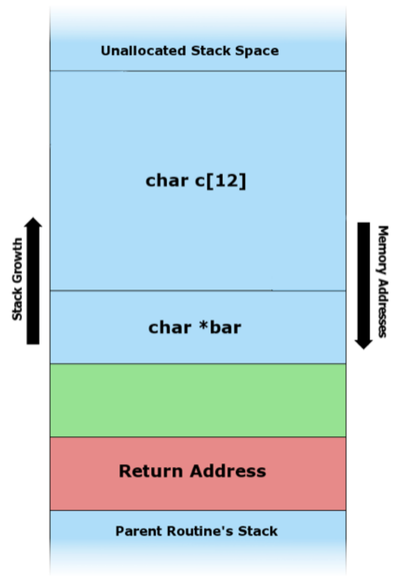
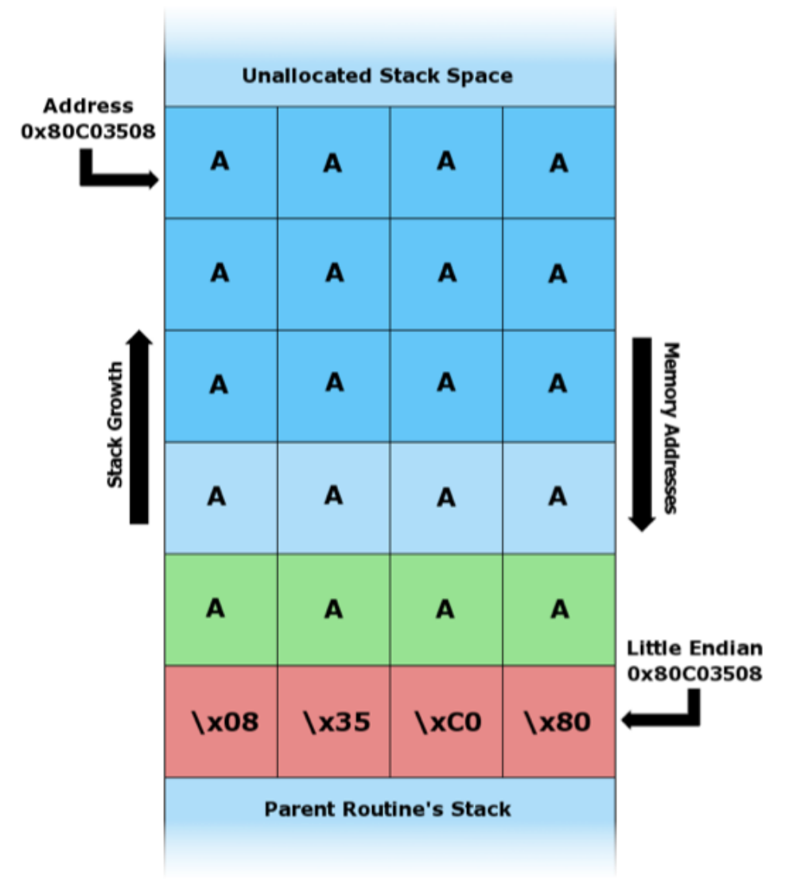
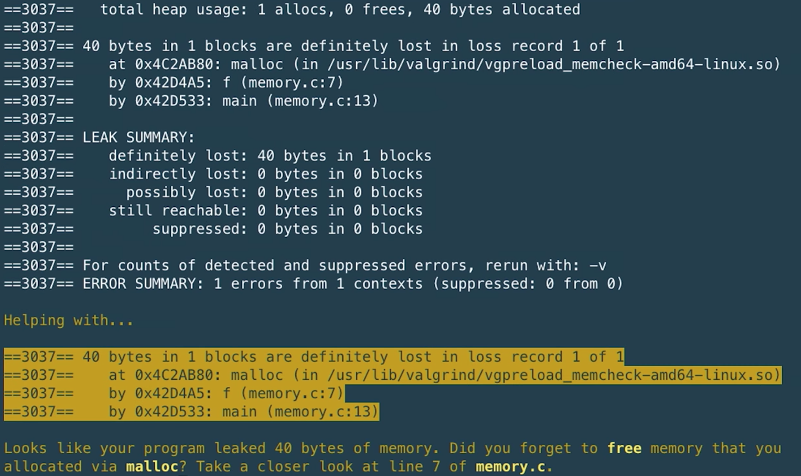
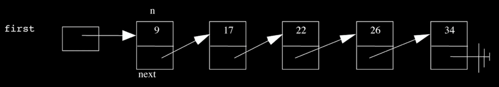
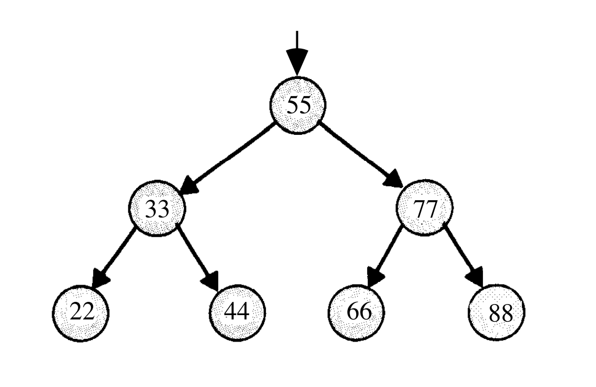

---
---
:author: Cheng Gong

= Lecture 5

[t=0m0s]
== Structs

* In Problem Set 5, we will implement a program to filter out red from an image, so we can see a different image underneath.
* To do that, we had to understand the file headers of a bitmap file, and use a `struct`, or a structure, where we can create our own data type, composed of other data types:
+
[source, c]
----
typedef struct
{
    char *name;
    char *dorm;
}
student;
----
* We can save that snipper into a file called `struct.h`, a header file of our own that describes the `student` struct, and include it in another program to use it:
+
[source, c]
----
#include <cs50.h>
#include <stdio.h>
#include <string.h>

#include "struct.h"

int main(void)
{
    // allocate space for students
    int enrollment = get_int("enrollment: ");
    student students[enrollment];

    // prompt for students' names and dorms
    for (int i = 0; i < enrollment; i++)
    {
        students[i].name = get_string("name: ");
        students[i].dorm = get_string("dorm: ");
    }

    // print students' names and dorms
    for (int i = 0; i < enrollment; i++)
    {
        printf("%s is in %s.\n", students[i].name, students[i].dorm);
    }
}
----
** We create an array of elements with the type `student` named `students`, with size `enrollment`.
** We then access each `student` in the `students` array the usual way with `[i]`, and use the `.name` and `.dorm` syntax to access particular variables within the struct.
* And rather than print out our data to the screen, we can save it to a file:
+
[source, c]
----
...
// save students to disk
FILE *file = fopen("students.csv", "w");
if (file)
{
    for (int i = 0; i < enrollment; i++)
    {
        fprintf(file, "%s,%s\n", students[i].name, students[i].dorm);
    }
    fclose(file);
}
...
----
** We use the `fopen` function to get a pointer to a variable of the type `FILE` that we will call `file`, by giving it the name of the file and how we want to open it. (In this case, we want to write to it, so we use `w`.)
** We check that `file` was actually opened with `if (file)`, since `fopen` will return `NULL` if it can't open the file for some reason.
** Then, instead of `printf`, we just use `fprintf`, where we just need to pass in the pointer to the file as the first argument. And we use a comma to separate each item in our row, since we want to save our data in the CSV format, which spreadsheet programs like Excel can also read.
** Finally, we can use `fclose` to indicate we are done with the file, and close our access to it.

[t=10m0s]
== Memory

* We started talking about pointers, an address to a location in memory where some data might be stored.
* We looked at this diagram, which showed how memory is divided up into regions for specific things:
+
image::memory.png[alt="Memory", width=400]
** The text area contains the binary code of our compiled program.
** Initialized and uninitialized data refers to global variables for our program, depending on whether we've set initial values for them.
** The heap has dynamically allocated memory, or memory allocated when the program is running. And we can manage this manually, so our variables do not disappear when a function in our program returns. We've seen `malloc`, which allocates some fixed amount of memory. `calloc` does the same, but sets the initial values of that memory to 0, so we don't have garbage values. `realloc` grows the size of previously allocated memory, which we will see in a moment.
** The stack contains slices, or frames, of memory for functions and their local variables.
** Environment variables, which we'll see in web programming, are variables like usernames and passwords that we don't want to store in the source code of our program, but still want access to via different mechanisms.
* Our `noswap` example only swapped the variables within the buggy `swap` function, so we fixed it by passing in pointers to the variables in `main` that we wanted to swap, and changing the values they point to:
+
[source, c]
----
void swap(int *a, int *b)
{
    int tmp = *a;
    *a = *b;
    *b = tmp;
}
----
** `int *a` declares a pointer to an `int` with the name `a`, and later we use `*a` to go to the address `a` points to.
* Since we know now that frames on the stack are allocated and deallocated as functions are called and as they return, we can infer that garbage values for variables within functions come from previous functions that may have used that same memory.
* We watched an animation about pointers with Binky, with the following example:
+
[source, c]
----
int main(void)
{
    int *x;
    int *y;

    x = malloc(sizeof(int));

    *x = 42;

    *y = 13;

    y = x;

    *y = 13;
}
----
** We declare two variables, `x` and `y`, that will be used to point to integers. Then we use `malloc` to allocate enough memory for one integer, and save that address to `x`. Then, we go to the address stored in `x`, and store 42 there.
** Next, we dangerously go to the address stored in `y`, which could be anything, and try to store 13 into it. By trying to access memory we didn't allocate ourselves, we trigger a segmentation fault.
** To fix this, we use `y = x` to have `y` point to the same address as `x`, so we can set that integer to 13 successfully.
* StackOverflow is a website where a community of people ask and answer questions about programming, and its name is actually interesting. We know now what a stack is, and we know that the heap is somewhere above it. If we were to call enough functions, and use up enough much memory, we could overflow the stack to the point where we start overwriting memory in the heap.
* A heap overflow is similar, where we start allocating so much memory from the heap that we start reaching memory that our stack has grown to.
* We can also have a buffer overflow. A buffer is a chunk of memory that we've allocated to store data, and when we try to write more data than the size of the buffer, we start writing past the end of it, and overwrite some other memory. A string, for example, is a buffer with a fixed size.
* We can see a buffer overflow with a string in this example:
+
[source, c]
----
#include <string.h>

void foo(char *bar)
{
    char c[12];
    memcpy(c, bar, strlen(bar));
}

int main(int argc, char *argv[])
{
    foo(argv[1]);
}
----
* Recall that `argv[1]` is one of the command-line arguments passed into this program, and the `main` function passes that into `foo` as the variable `bar`.
* `foo`, in turn, creates an array `c` of size 12, and copies `bar` into `c` with the function `memcpy`. But if `bar` is longer than 12, `memcpy` will copy more bytes than `c` has allocated.
* The stack for our `foo function might look like this:
+

** It turns out, in addition to the local variables for a function, each function's stack frame also has a *return address*, which tells the computer the location in memory to go back to once the function returns. In this case, it will be the line after `foo` is called in `main`.
* We can use `c` with a shorter string like this:
+
image::buffer_overflow_2.png[alt="Stack for buffer overflow", width=400]
* But we can type a long enough string that `c` overflow:
+

** And here the string someone has passed in has `A` repeated for padding, but that `A` could be any machine code converted to ASCII. Then, by overwriting the return address with an address to the start of the `A`, that person could trick our program into running the code they passed in as input.

[t=38m0s]
== Debugging

* To help defend against this, a tool called `valgrind` can help detect memory issues.
* In http://cdn.cs50.net/2017/fall/lectures/5/src5/memory.c.src[`memory.c`], we allocate an array of size 10, then try to access the element at index 10, which we haven't actually allocated:
+
[source, c]
----
#include <stdlib.h>

void f(void)
{
    int *x = malloc(10 * sizeof(int));
    x[10] = 0;
}

int main(void)
{
    f();
    return 0;
}
----
* Then, when we run valgrind, we would see output like the following:
+
image::valgrind_1.png[alt="Valgrind output", width=800]
+
image::valgrind_2.png[alt="Valgrind output", width=800]
** Most of the output we can ignore, but we notice that there is an `Invalid write of size 4` somewhere. An `int` is 4 bytes, and we are indeed writing somewhere that we shouldn't.
* In fact, we can run `help50 valgrind ./memory`, and see highlights and explanations:
+
image::help50.png[alt="help50 valgrind output", width=800]
** We change the line `x[10] = 0;` to read `x[9] = 0;`, correcting setting the last element of the array.
* Once we've fixed that error, we see there are still other errors, so we run `help50 valgrind ./memory` again:
+

** On line 7, we used `malloc` to allocate memory. When we finish using it, it's best to call `free` (in this case we would have the line `free(x)`), to mark that chunk of memory as free.
* Finally, if we looked back to the original `valgrind` output, we see lines like `at 0x42D50F: f` and `by 0x42D533: main`, and those hexadecimal numbers are the memory addresses where those functions are.
* Another idea for debugging is to have a rubber duck on your desk, to which you explain your own code, and often that process is enough to help you notice bugs or think of a better solution to a problem.

[t=46m9s]
== Data Structures

* With pointers, we can connect pieces of memory together in any way we want to.
* Recall an array is a contiguous chunk of memory where we can have the same element back-to-back. If we had an array of size six, and if we need to add a seventh element, we would have to allocate a new array of size 7, copy the 6 elements of the old array to the new one, and add our new element. Then we can free the old array. But this is inefficient, since we need to take the time to make those copies each time we want to increase the array.
* Our memory might also have lots of small pieces used, so we aren't able to find enough contiguous memory for our array once it gets to a certain size, since the free memory is fragmented, or spread throughout our total memory.
* We can solve this problem with something like this:
+

** Here we have 5 sorted numbers in a data structure known as a linked list. Each of these rectangles is called a node, and each of them contains a number and an arrow that is a pointer to the next node. This way, the elements no longer need to be contiguous in memory, and we can allocate new elements one at a time, by allocating memory for a new node, and adding the pointer to the new node to the end of the list.
* With a few volunteers on stage, we demonstrate this. The `first` node is special in that it doesn't store a number value, but only points to the first node in the list.
* If we wanted to insert a new node into the list, we'd need a temporary pointer to find the right position in the list. Since each node could be anywhere in memory, we can no longer access elements randomly. Instead, we would need to start at the beginning of the list, and use our temporary pointer to follow the nodes in the linked list until we find the correct place in the list. When we do, we set the previous node's pointer to our new node, and our new node's pointer to the next element of the list. In our example on stage, the new node ended up at the end of our sorted list, so we set the point for her to `NULL`.
* We noticed that inserting a new element had a running time of _O_(n), but if we didn't need to keep our list sorted, we could have running time of _O_(1).
* In http://cdn.cs50.net/2017/fall/lectures/5/src5/list0.c.src[`list0.c`], we have an array for numbers:
+
[source, c]
----
#include <cs50.h>
#include <stdio.h>

int main(void)
{
    // Prompt for number of numbers
    int capacity;
    do
    {
        capacity = get_int("capacity: ");
    }
    while (capacity < 1);

    // memory for numbers
    int numbers[capacity];

    // Prompt for numbers
    int size = 0;
    while (size < capacity)
    {
        // Prompt for number
        int number = get_int("number: ");

        // Check whether number is already in list
        bool found = false;
        for (int i = 0; i < size; i++)
        {
            if (numbers[i] == number)
            {
                found = true;
                break;
            }
        }

        // If number not found in list, add to list
        if (!found)
        {
            numbers[size] = number;
            size++;
        }
    }

    // Print numbers
    for (int i = 0; i < size; i++)
    {
        printf("%i\n", numbers[i]);
    }
}
----
** We use `capacity` to indicate how many numbers our array can store, and we use `size` to keep track of how many numbers we've already added to our array. Then, we ask our user for new numbers and add them to our array if they're not already in the array.
* In http://cdn.cs50.net/2017/fall/lectures/5/src5/list1.c.src[`list1.c`], we reallocate the size of our array:
+
[source, c]
----
#include <cs50.h>
#include <stdio.h>

int main(void)
{
    // memory for numbers
    int *numbers = NULL;
    int capacity = 0;

    // Prompt for numbers (until EOF)
    int size = 0;
    while (true)
    {
        // Prompt for number
        int number = get_int("number: ");

        // Check for EOF
        if (number == INT_MAX)
        {
            break;
        }

        // Check whether number is already in list
        bool found = false;
        for (int i = 0; i < size; i++)
        {
            if (numbers[i] == number)
            {
                found = true;
                break;
            }
        }

        // If number not found in list, add to list
        if (!found)
        {
            // Check whether enough space for number
            if (size == capacity)
            {
                // Allocate space for number
                int *tmp = realloc(numbers, sizeof(int) * (size + 1));
                if (!tmp)
                {
                    if (numbers)
                    {
                        free(numbers);
                    }
                    return 1;
                }
                numbers = tmp;
                capacity++;
            }

            // Add number to list
            numbers[size] = number;
            size++;
        }
    }

    // Print numbers
    printf("\n");
    for (int i = 0; i < size; i++)
    {
        printf("%i\n", numbers[i]);
    }

    // Free memory
    if (numbers)
    {
        free(numbers);
    }
}
----
** Here our code is a bit more complicated, where `*numbers` is a pointer to our array that we allocate memory for, with `realloc`, once the `size` of our array reaches its `capacity`.
** For `realloc`, we need `sizeof(int) * (size + 1)` bytes of memory each time we want to add a number, since we are storing integers and `size` is the variable we are using to keep track of how large our array already is.
* Finally, with http://cdn.cs50.net/2017/fall/lectures/5/src5/list2.c.src[`list2.c`], we use a linked list:
+
[source, c]
----
#include <cs50.h>
#include <stdio.h>

typedef struct node
{
    int number;
    struct node *next;
}
node;

int main(void)
{
    // memory for numbers
    node *numbers = NULL;

    // Prompt for numbers (until EOF)
    while (true)
    {
        // Prompt for number
        int number = get_int("number: ");

        // Check for EOF
        if (number == INT_MAX)
        {
            break;
        }

        // Check whether number is already in list
        bool found = false;
        for (node *ptr = numbers; ptr != NULL; ptr = ptr->next)
        {
            if (ptr->number == number)
            {
                found = true;
                break;
            }
        }

        // If number not found in list, add to list
        if (!found)
        {
            // Allocate space for number
            node *n = malloc(sizeof(node));
            if (!n)
            {
                return 1;
            }

            // Add number to list
            n->number = number;
            n->next = NULL;
            if (numbers)
            {
                for (node *ptr = numbers; ptr != NULL; ptr = ptr->next)
                {
                    if (!ptr->next)
                    {
                        ptr->next = n;
                        break;
                    }
                }
            }
            else
            {
                numbers = n;
            }
        }
    }

    // Print numbers
    printf("\n");
    for (node *ptr = numbers; ptr != NULL; ptr = ptr->next)
    {
        printf("%i\n", ptr->number);
    }

    // Free memory
    node *ptr = numbers;
    while (ptr != NULL)
    {
        node *next = ptr->next;
        free(ptr);
        ptr = next;
    }
}
----
** At top, we use a `struct` to create our `node` data type, with a `number` as well as a `*next` pointer to another node.
** Then, `*numbers` is like our first pointer that points to just the first node in our list. After we prompt our user for a number, we check our linked list for it with a `for` loop:
+
[source, c]
----
bool found = false;
for (node *ptr = numbers; ptr != NULL; ptr = ptr->next)
{
    if (ptr->number == number)
    {
        found = true;
        break;
    }
}
----
We use `*ptr` as a temporary pointer to go down our list, and use the `ptr->number` syntax to access the `number` variable within the `node struct` that `ptr` is pointing to. If the number is the same as the new number, we exit the loop with `break`. Otherwise, after we check each node, we use `ptr = ptr->next` to set our temporary pointer to the next node in the list to check.
** Then, we allocate a new `node` and add it to the end of the list in a similar way:
+
[source, c]
----
node *n = malloc(sizeof(node));
if (!n)
{
    return 1;
}

// Add number to list
n->number = number;
n->next = NULL;
if (numbers)
{
    for (node *ptr = numbers; ptr != NULL; ptr = ptr->next)
    {
        if (!ptr->next)
        {
            ptr->next = n;
            break;
        }
    }
}
else
{
    numbers = n;
}
----
** `n` is our new `node`, and we set `ptr->next = n` as we go down our list and find the one at the end that isn't already pointing to a `next` node.
** Finally, we free each node in the list, since we allocated each one ourselves originally as well.
* The syntax for all this is new, but rest assured that with sections, examples, and practice, it will become all the more familiar.

[t=1h15m0s]
== Stacks and Queues

* Imagine a stack of trays, where you can easily take the top tray off or put another tray on top, but not much else. A data structure with this metaphor is also called a stack, and it has two operations, `push` and `pop`, that stores and removes items respectively.
* The property we now get is that the last item we pushed, will be the first one we pop.
* We could implement this ourselves:
+
[source, c]
----
typedef struct
{
    int *numbers;
    int size;
}
stack;
----
** Now we have a struct `stack`, with an array of ``int``s called `numbers` that we can allocate and resize as needed. And it also will have a property called `size`, since we won't always have as many items in our stack as its capacity.
* We can even write header files that only show how to use the `push` and `pop` functions of our implementation, so that someone else can use our stack code. `push` and `pop` would be an *API*, application programming interface, where someone can abstract away the details of how a stack is actually implemented, and use it simply by reading our documentation.
* A queue would be the opposite of a stack. In a queue, the first item in will be the first item out, like a line of people. We'll have operations `enqueue`, which places an element at the end of the list, and `dequeue`, which takes the first element from the beginning of the list.
* With a queue, we need to keep track of a little more information:
+
[source, c]
----
typedef struct
{
    int front;
    int *numbers;
    int size;
}
queue;
----
** Here we use an array to store our queue, but now we also need to keep track of where the front of the queue is. Each time we call `dequeue`, we'll need to return the item at the index `front` and then increment it so we get the next item next time. Since we have an array, we can't easily shift items down, so we'll use `front` to keep track of where the front is.
* We watch a http://facstaff.elon.edu/sduvall2/CSFairyTales/cartoon.html[quick animation] about stacks and queues.

[t=1h22m50s]
== Trees

* We can build other shapes with our data structures too, each of which will have different properties that we can take advantage of.
+
image::tree.png[alt="Tree", width=500]
** We can have one node point to multiple other nodes, and in the case of this data structure, a tree, we have one node at the top, the root node, that points to other children nodes, like in a family tree. And nodes without children are called leaves.
* Now imagine if we had some numbers and wanted to be able to search them efficiently with a binary search algorithm. We could use an array, but we could also use what's called a binary search tree:
+

** Now we can insert and delete elements, as long as we are careful to make sure the left child is less than and the right child is greater than the parent node.
** Each node can have a maximum of 2 children, and we can simply add new nodes by allocating memory for them and changing pointers to point to them.
** Given that, we can easily go down the list to find an element, dividing the problem in half each time.
** And we can define each node as follows:
+
[source, c]
----
typedef struct node
{
    int n;
    struct node *left;
    struct node *right;
}
node;
----
* We can now use recursion to search this elegantly:
+
[source, c]
----
bool search(int n, node *tree)
{
    if (tree == NULL)
    {
        return false;
    }
    else if (n < tree->n)
    {
        return search(n, tree->left);
    }
    else if (n > tree->n)
    {
        return search(n, tree->right);
    }
    else
    {
        return true;
    }
}
----
** Since we know each of the children of a tree is also the start of a smaller binary search tree, we can recursively call our `search` function on smaller and smaller trees.
** If the pointer to the tree is `NULL`, then we should `return false`, since we don't have a tree at all.
** Otherwise, depending on how `n` compares to the number at the root of the tree, we'll search the left or right subtree, or `return true`. Since `search` takes a `node *tree`, we can pass in the `tree->left` and `tree-right` pointers, and `search` will treat them as the root of the tree.
** And we also `return` that value that we get back when we call `search`.
* Yet another data structure is a hash table, with many operations taking O(1), a constant number of steps.
** If we had a shuffled deck of playing cards, we might start sorting them by putting each suit (Spades, Hearts, Clubs, Diamonds) into a different pile. This is the process of hashing, where we are given some input and calculate some value to categorize it.
* A hash table looks like an array:
+
image::hash_table.png[alt="Hash table", width=300]
** We might store any piece of data in each of the locations in the hash table, but we can get close to a constant time lookup.
* Since a hash table is an array, we might have multiple items that want to fit into the same slot. If we are inserting a name like `Alex`, but a name in the `A` slot, `Alice`, is already present, then we just move down our hash table to the next slot. But then we might have to go down the table further and further to find a free slot.
* We can also contain a pointer to a linked list in each of its locations, so a particular bucket can expand horizontally:
+
image::separate_chaining.png[alt="Separate chaining", width=400]
** This technique is called separate chaining, where we have a linked list that can grow if more items are added to the same slot in the table.
* In the worst case, if everyone shares the same first letter of their name, we have a running time that's linear again, but in the real world, the actual running time might be closer to 1/26th as before.
* Finally, we have another data structure called a trie (pronounced like try):
+
image::trie.png[alt="Trie", width=400]
** Short for retrieval, this is essentially a tree with an array as each of its children. Each array contains pointers to the next layer of arrays. In this diagram, with arrays of size 26 to store letters, the first layer has a pointer to the next layers at location `M`, `P`, and `T`. And the diagram omits other parts of arrays in lower layers, but each of those are also 26 letters wide.
** To look for an element, in this case a word, we start with the first letter, then see if the next letter has a child, and continue until we are at the end of our word and see a valid ending (the triangle symbol in this diagram).
* A trie has running time of O(1), since we just need to look up words based on the letters in them, and that's not affected by the number of other words in the trie. Inserting and removing a word, too, is also a constant time operation.
* Finally, we watch a short clip on how the internet works, which we'll get more into next week.
