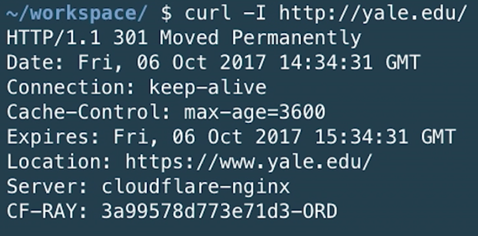
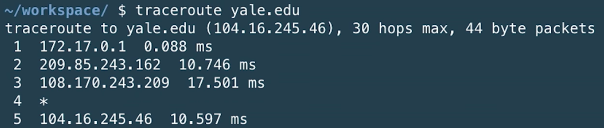
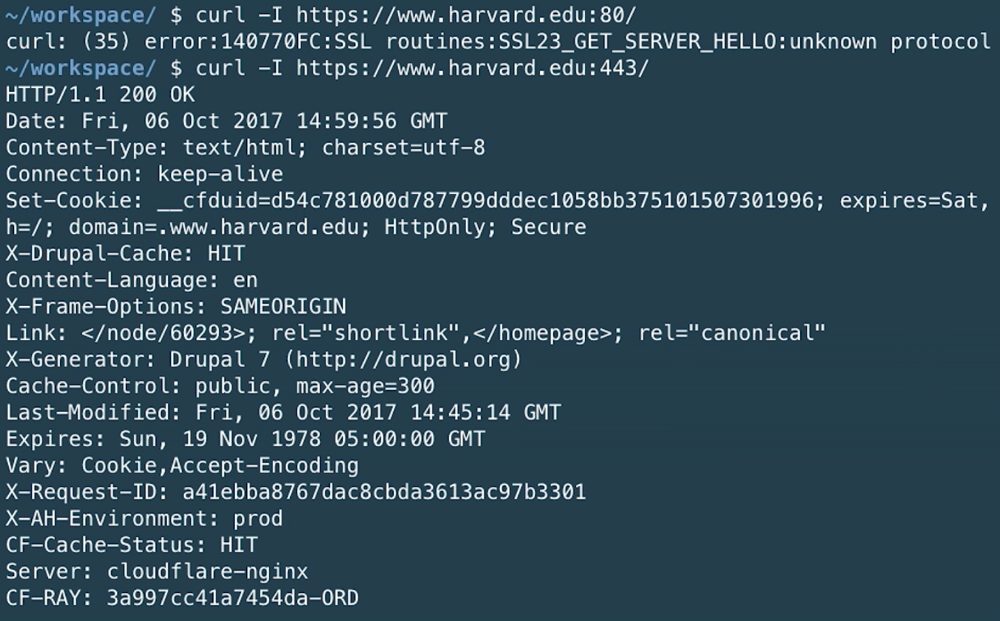

---
---
:author: Cheng Gong

= Lecture 6

[t=0m0s]
== Last Time

* We learned how to use structs in C, to work with many small pieces of data as one larger data type of our own creation.
* We applied this to build data structures like linked lists, hash tables, and tries.
* And finally, we learned about how memory is laid out in C, as well as problems that might arise if we weren't careful with managing it.

[t=3m22s]
== HTTP

* On our own computers, we use programs called a web browser, like Chrome, Safari, Edge, or Firefox, to go online, but those programs somehow talk to other programs somewhere else. Those programs are called web servers, and their job is to return websites and other data.
* Websites are generally written not as binary, but in markup language, which we'll soon see.
* In fact, when we've compiled and run programs on the CS50 IDE, those programs were actually running on a computer somewhere else as well, and only the interface and output was returned to our own computers.
* Modern companies with high-traffic websites might have datacenters where lots of computers, positioned neatly (or not so neatly) on racks, are running server software that is waiting for a client to make a request.
* In this case, our browsers are the clients. If we wanted to visit Facebook, we might type in `facebook.com` or `www.facebook.com`, and the two addresses both work because Facebook has configured its website to be the same on both. And `www` stands for World Wide Web, and back in the day it was used to indicate that the domain name was for a website. As for the `.com` ending, while it's still popular, there are now hundreds of other endings a website can have.
* While it's rare that we type this out, a browser actually also adds `http://` to the beginning of the URL by default. (It might also add `https://`, to make a secure, encrypted connection, if it's available for that website.) And finally, a browser also adds an ending `/`, so the final URL might look like `https://www.facebook.com/`. The `/` indicates we want the root, or main, page of the website, but we could add other page names to the end, too.
* HTTP stands for Hypertext Transport Protocol, a set of standards that indicate how a client should talk to a web server, and vice versa. In the real world, a protocol we might use to introduce ourselves is to say, "Hi, I'm David," and extending our hand. Then, the other person will know to say their name and shake our hand back.
* To make a simple request, a client will send a message that looks like this:
+
[source]
----
GET / HTTP/1.1
Host: www.facebook.com
...
----
** `GET` is a method that specifies we want to retrieve something.
** The `/` refers to the default page, or the homepage.
** `HTTP/1.1` indicates the the version of HTTP we want to use.
** And `Host: www.facebook.com` indicates the website we want the server to return to us, since that same server might have many websites it is responsible for.
* If we wanted to visit Mark Zuckerberg's page, our browser would make a request like this:
+
[source]
----
GET /zuck HTTP/1.1
Host: www.facebook.com
...
----
* And a response sent back from the server might start with this:
+
[source]
----
HTTP/1.1 200 OK
Content-Type: text/html
...
----
** After those first lines would be the actual webpage or information we requested. These first lines are called the headers.
** `200` is one of many status codes specified in HTTP to tell the client concisely what the response to the request is. Other status codes might be:
*** 200 OK
*** 301 Moved Permanently
*** 302 Found
*** 304 Not Modified
*** 401 Unauthorized
*** 403 Forbidden
**** The requesting client doesn't have the permissions to access a particular page.
*** 404 Not Found
*** 418 I'm a Teapot
**** Actually an April Fool's joke that stuck around.
*** 500 Internal Server Error
**** The code on the web server itself had an error.
* With a `301` status code, a server can tell a client that the website is at some other address now:
+
[source]
----
HTTP/1.1 301 Moved Permanently
Content-Type: text/html
Location: http://www.harvard.edu/
...
----
** Indeed, if we tried to visit just `harvard.edu` in our browser, it would automatically take us to `https://www.harvard.edu/`.
* We can see this ourselves by running the `curl` command in the CS50 IDE. The `-I` flag indicates that we want to see just the headers we get back:
+
image::curl.png[alt="curl headers", width=400]
** First, `http://harvard.edu/` redirects us to `http://www.harvard.edu/`, which in turn redirects us to `https://www.harvard.edu/`
** There are also some additional headers sent back, which we don't need to worry about.
* To see the HTML that actually comprise the webpage, we could use `curl`, or the Developer Tools feature in Google Chrome:
+
image::developer_tools.png[alt="Developer Tools", width=600]
* We'll see lots of features, and first we'll use the Network tab to see the requests our browser makes when we visit Harvard's website:
+
image::network.png[alt="Network tab", width=600]
** We see a total of 90 requests made for the homepage, and that might include images or other files needed for the page.
** The first and second requests had a 301 status code as we already saw with `curl`, and the rest came back with 200s.
* But Yale's web servers are configured slightly better, redirecting us in one step rather than two:
+

* And if we visit `http://safetyschool.org/`, someone had actually set up that domain to redirect to Yale's homepage as well!
+
image::curl_safetyschool.png[alt="curl headers", width=400]
** A few years later, Yale's students pranked Harvard back, convincing the audience on Harvard's side at a football game to http://www.harvardsucks.org/[hold up some less than ideal signs].
* So far, we've discovered that HTTP requires clients and servers to send messages back and forth. That happens over IP, Internet Protocol, which specifies that all devices connected to the Internet has some address, known as an IP address.
* Just like "33 Oxford Street, Cambridge, MA" helps us identify a building, IP addresses identify computers and phones in the format `\#.#.\#.#`.
* Each of the numbers can be in the range `0` to `255`, which means that exactly 8 bits, or one byte, is needed to store each number. So an IP address with 4 of these numbers has 32 bits, and from there we can deduce that a total of about 2 billion unique IP addresses exist.
* And there is a system for allocating these addresses, by provider or organization. For example, Harvard's IPs include the ones in the range of `140.247.\#.#` or `128.103.\#.#`.
* There are also reserved IPs, known as private addresses, with the ranges `10.\#.#.\#` and `172.16.#.# - 172.31.\#.#` and `192.168.\#.#` that are used within a particular network, but not with the outside world. This way, one IP address can be used for, say, one household, with many devices that share the same internet connection.
* On a PC or Mac, we can see our own IP address in a Network settings panel.
* DHCP, Dynamic Host Configuration Protocol, is the technology used for computers to automatically acquire an IP address from a DHCP server on the network it is connected to.
* There is another technology called DNS, Domain Name System, that maps IP addresses to domain names, and vice versa. So a domain name like `www.google.com` is translated to an IP address behind the scenes. With the `nslookup` command in the CS50 IDE, we can perform such a lookup:
+
image::nslookup.png[alt="nslookup", width=300]
** Google has many many servers able to serve its website, so looking up its domain name returns a few of those nearby. And we can visit one of those IP addresses directly, and see what happens using the Network tab as before:
+
image::network_google.png[alt="Network tab for visiting Google IP", width=600]
** If we clicked on the first request there, we'll see the header that indicates the new location:
+
image::headers_google.png[alt="Network tab headers for visiting Google IP", width=400]
* So now we can use those IP addresses, to indicate on our virtual envelopes, the destination of where we would like them to go. We also write our own IP address on those envelopes, so we can get a response back.
* We send those envelopes, or packets, to routers, computer servers, that are in datacenters around the world, that only route information based on the destination IP. By passing our packets from router to router, we can get them to our destination.
* We can run a command in the CS50 IDE, `traceroute`, that tells us the intermediate routers between us and some destination:
+

** It turns out, there are 5 steps before we can reach Yale's web servers. And we can see that it only takes about 10 milliseconds to do that.
* We can do the same for a website perhaps further away:
+
image::traceroute_jp.png[alt="traceroute .jp", width=600]
** We see a jump from about 38 ms to 121 ms between steps 3 and 4, implying that there might be a much longer distance between the two servers, that our packet has to travel across. Indeed, across oceans, there are long cables that transmit information, forming the global Internet.
* A server can respond to multiple types of requests, and TCP is a standard that tells us we need to add another number on the outside of the envelope we send, to specify the service we want from the server. This number is a port number that corresponds to some service. For example, standard ports and protocols include:
** 22 SSH, secure shell, to run commands on another computer
** 53 DNS
** 80 HTTP, for visiting websites
** 443 HTTPS, for visiting secure websites
** 587 SMTP, for sending mail
...
* For example, if we tried to send an HTTPS request to port 80, we'd see an error, but the same request works through port 443 as we'd expect:
+

* And on the outside of each envelope, our browser also adds a specific port number to our own, return IP address. Then we can have multiple applications communicating with the outside world, and each of them getting the right responses back.
* It turns out that our browsers also commonly use one more feature provided by TCP and IP. When we want to send or receive a larger amount of data, such as an image or video, the binary data is divided into many smaller pieces. Then, on the outside of the envelope, we specify something like 1/4, 2/4, 3/4, and 4/4, so the recipient can verify that they were able to get all the pieces. (And if any are missing, they can make a request to the server to send missing pieces again.)
* And each envelope can take a different path to the final address, since some routers might become busy.

[t=53m2s]
== HTML

* Now that we have an understanding of how servers and clients can send and receive data through the Internet, we can focus on the content of a typical webpage.
* HTML, Hypertext Markup Language, is used to mark up webpages. Unlike a programming language, HTML itself has no loops or variables. Instead, it has tags that describe how content should be laid out.
* A simple webpage looks like this:
+
[source, html]
----
<!DOCTYPE html>

<html>
    <head>
        <title>hello, title</title>
    </head>
    <body>
        hello, body
    </body>
</html>
----
** The first line, `<!DOCTYPE html>`, just indicates that the version of HTML used for the page is the latest.
** Then, we see a start tag for the page, `<html>`, which is matched by a closing tag at the bottom, `</html>`. Start tags will have the format of `<tag>`, and closing tags will have the format `</tag>`.
** Within the page, we have a `<head>` section, which includes information about the page, and a `<body>` section, which has the content actually displayed in the browser's window.
* If we save the code above as `hello.html`, we'll be able to open it in our browser.
* Notice that all of our tags are opened and closed, and that they can contain other tags inside. So we can map the page to a tree:
+
image::html_tree.png[alt="HTML page as a tree", width=400]
** For instance, the `html` node has two children inside, `head` and `body`, which matches our code above.
** So our browsers might load HTML files into memory as trees.
* When we visit a webpage in Chrome, we can right-click somewhere on the page and use the View Source option to see the HTML source code of the page. We see a lot of code and content, but we'll start using higher-level languages like Python and JavaScript that can generate HTML for us. A page with a photo album, for example, might have some code that uses a `for` loop to generate the same HTML for each photo.

[t=1h1m12s]
== Web Development in the CS50 IDE

* With the CS50 IDE, we can run a server of our own, with some other port number. Remember that we ourselves are using 443 to connect to it and write code on a server somewhere in the cloud.
* We'll make a new file, paste in our simple HTML code, and run a command to serve it:
+
image::http-server.png[alt="http-server in the CS50 IDE", width=400]
** We use `http-server -p 8080`, and the command tells us the URL where we can find our files. If we go to that URL, we'll see it on the internet for as long as we're running that command.
* Other features of HTML include:
** paragraphs
+
[source, html]
----
<!DOCTYPE html>

<html>
    <head>
        <title>paragraphs</title>
    </head>
    <body>
        

            Lorem ipsum dolor sit amet, consectetur adipiscing elit. Nullam in tincidunt augue. Duis imperdiet, justo ac iaculis rhoncus, erat elit dignissim mi, eu interdum velit sapien nec risus. Praesent ullamcorper nibh at volutpat aliquam. Nam sed aliquam risus. Nulla rutrum nunc augue, in varius lacus commodo in. Ut tincidunt nisi a convallis consequat. Fusce sed pulvinar nulla.
        

        

            Ut tempus rutrum arcu eget condimentum. Morbi elit ipsum, gravida faucibus sodales quis, varius at mi. Suspendisse id viverra lectus. Etiam dignissim interdum felis quis faucibus. Integer et vestibulum eros, non malesuada felis. Pellentesque porttitor eleifend laoreet. Duis sit amet pellentesque nisi. Aenean ligula mauris, volutpat sed luctus in, consectetur id turpis. Phasellus mattis dui ac metus blandit volutpat. Donec lorem arcu, sollicitudin in risus a, imperdiet condimentum augue. Ut at facilisis mauris. Curabitur sagittis augue in dictum gravida. Integer sed sem sed justo tempus ultrices eu non magna. Phasellus semper eros erat, a posuere nisi auctor et. Praesent dignissim orci aliquam laoreet scelerisque.
        

        

            Mauris eget erat arcu. Maecenas ac ante vel ipsum bibendum varius. Nunc tristique nulla eget tincidunt molestie. Morbi sed mauris eu lectus vehicula iaculis ac id lacus. Etiam sit amet magna massa. In pulvinar sapien ac mi ultrices, quis consequat nisl hendrerit. Aliquam pharetra nec sem non vehicula. In et risus leo. Ut tristique ornare nisl et lacinia.
        

    </body>
</html>
----
** links
+
[source, html]
----
<!DOCTYPE html>

<html>
    <head>
        <title>link</title>
    </head>
    <body>
       Hello, world! My favorite school is <a href="http://www.stanford.edu/">stanford.edu</a>.
    </body>
</html>
----
*** Notice here we have an `href=""` attribute inside the `<a>` tag, that modifies the tag. And notice that someone can change where the link leads, independent of the text that's displayed to the user, so it's best to check the URL displayed by the browser, in the bottom left when hover over the URL, before we click on it.
** images
+
[source, html]
----
<!DOCTYPE html>

<html>
    <head>
        <title>image</title>
    </head>
    <body>
        <!-- https://news.yale.edu/2016/11/17/meet-handsome-dan-xviii -->
        
    </body>
</html>
----
*** Here, the `` tag is special because it can be closed with a `/` at the end (since there's no other content that can go inside an image). We also see the `src` attribute, that indicates the source of the image, and the `alt` attribute, that the browser should display if we hover over the image or if the image needs to be read as text.
*** We also see the `<!-- -->` syntax for indicating comments, which won't be displayed on the page but can be helpful for commenting code.
** http://cdn.cs50.net/2017/fall/lectures/6/src6/headings.html[headings]
** http://cdn.cs50.net/2017/fall/lectures/6/src6/list.html[lists]
*** We have a parent `<ul>` list, for an unordered, bulleted list, which we could change to `<ol>` for an ordered, numbered list.
** http://cdn.cs50.net/2017/fall/lectures/6/src6/table.html[table]
*** Now we have a more complicated nesting of elements, with `<tr>` elements indicating rows, and `<td>` indicating cells.
* All of these examples, and more, are in this week's http://cdn.cs50.net/2017/fall/lectures/6/src6/[source directory], and we can discover even more features of HTML by searching online for documentation and examples.
* If we wanted to reimplement Google's search page, we might start by using its service and noticing that the URL contains what we want to search for. By trial and error, we discover that we can simplify the URL to the following:
+
image::google_cats.png[alt="Google search for cats with URL", width=600]
** It turns out, changing the value `cats` to something like `dogs` also changes the page that Google's servers returns to us.
** `search` is the path that we are requesting, and `?` starts a set of parameters, or inputs we will be providing.
** `q=` is the name of the query, and the value follows.
** If we were to type in something with spaces, we would see those spaces automatically replaced by `%20` by our browser, which keeps the URL one string.
* We can write http://cdn.cs50.net/2017/fall/lectures/6/src6/search.html.src[`search.html`]:
+
[source, html]
----
<!DOCTYPE html>

<!-- Demonstrates action -->

<html lang="en">
    <head>
        <title>search</title>
    </head>
    <body>
        <form action="https://www.google.com/search" method="get">
            <input name="q" type="text"/>
            <input type="submit" value="Search"/>
        </form>
    </body>
</html>
----
** We see a new tag, `<form>`, which has the attributes `action`, the target of the form, and `method`, the HTTP method to use.
** Then we have an `input` which allows us to type in some value that will be passed to Google via the `q` parameter in the URL.
* Our `search.html` is an example of a front-end, or the page that loads in the user's browser, and is the user interface. Google, on the other hand, still runs the back-end service, which involves the databases and servers that actually provide the search results. And correspondingly, there are occupations where developers focus on front-end development, back-end development, or both.
* HTML is just a markup language, as we've seen, and we can use CSS, Cascading Style Sheets, another language, to indicate to browsers how webpages should look.
* Let's look at http://cdn.cs50.net/2017/fall/lectures/6/src6/css0.html.src[`css0.html`]:
+
[source, html]
----
<!DOCTYPE html>

<!-- Demonstrates inline CSS -->

<html lang="en">
    <head>
        <title>css0</title>
    </head>
    <body>
        <header style="font-size: large; text-align: center;">
            John Harvard
        </header>
        <main style="font-size: medium; text-align: center;">
            Welcome to my home page!
        </main>
        <footer style="font-size: small; text-align: center;">
            Copyright &#169; John Harvard
        </footer>
    </body>
</html>
----
** Here, `<header>` (not to be confused with ``<head>``) is the top portion of the page, and it has a `style` attribute that indicate its `font-size` and text alignment. (And we'd only know the right words to use from looking up documentation online.) The syntax for this is in the format ``property: value;``, where each CSS property has some value we can specify.
* But this could be improved in design, since the same property for `text-align` is applied to each. So we can factor that out, and put it in the parent element. With CSS, properties cascade, or are automatically copied over, from parent elements to each of the child elements:
+
[source, html]
----
<!DOCTYPE html>

<html lang="en">
    <head>
        <title>css1</title>
    </head>
    <body style="text-align: center;">
        <header style="font-size: large;">
            John Harvard
        </header>
        <main style="font-size: medium;">
            Welcome to my home page!
        </main>
        <footer style="font-size: small;">
            Copyright &#169; John Harvard
        </footer>
    </body>
</html>
----
** This page is functionally the same as before, but simpler and better-designed.
* In http://cdn.cs50.net/2017/fall/lectures/6/src6/css2.html.src[`css2.html`], we can define the `class` attribute on each HTML element, and set the CSS properties for each of them in the `
        <title>css2</title>
    </head>
    <body class="centered">
        <header class="large">
            John Harvard
        </header>
        <main class="medium">
            Welcome to my home page!
        </main>
        <footer class="small">
            Copyright &#169; John Harvard
        </footer>
    </body>
</html>
----
** Notice that classes are indicated in CSS with a `.` in front of them, with curly braces to contain some properties for each of those classes.
* In http://cdn.cs50.net/2017/fall/lectures/6/src6/css3.html.src[`css3.html`], we simply use the names of tags directly to specify properties that should apply to them. Notice that here, they do not start with a `.` because they are HTML tag types, rather than classes we've specified:
+
[source, html]
----
<!DOCTYPE html>

<html lang="en">
    <head>
        
        <title>css3</title>
    </head>
    <body>
        <header>
            John Harvard
        </header>
        <main>
            Welcome to my home page!
        </main>
        <footer>
            Copyright &#169; John Harvard
        </footer>
    </body>
</html>
----
* Finally, we can factor out the `<style>` section into another file we can include, `css4.css`, that we can reuse for other pages too:
+
[source, html]
----
<!DOCTYPE html>

<html lang="en">
    <head>
        <link href="css4.css" rel="stylesheet"/>
        <title>css4</title>
    </head>
    <body>
        <header>
            John Harvard
        </header>
        <main>
            Welcome to my home page!
        </main>
        <footer>
            Copyright &#169; John Harvard
        </footer>
    </body>
</html>
----
* And instead of writing all of our styles from the ground up, we can use CSS libraries like http://getbootstrap.com/[Bootstrap] that come with pre-written code that we can use to make our websites more quickly.
* Indeed, the https://speller.cs50.net/[Big Board] uses Bootstrap to format its page.
* Let's look at http://cdn.cs50.net/2017/fall/lectures/6/src6/form0.html.src[`form0.html`]:
+
[source, html]
----
<!DOCTYPE html>

<!-- Demonstrates form -->

<html lang="en">
    <head>
        <title>form0</title>
    </head>
    <body>
        <h1>Frosh IMs</h1>
        <form>
            <input name="name" placeholder="Name" type="text"/>
            <select name="dorm">
                <option disabled selected value="">Dorm</option>
                <option value="Apley Court">Apley Court</option>
                <option value="Canaday">Canaday</option>
                <option value="Grays">Grays</option>
                <option value="Greenough">Greenough</option>
                <option value="Hollis">Hollis</option>
                <option value="Holworthy">Holworthy</option>
                <option value="Hurlbut">Hurlbut</option>
                <option value="Lionel">Lionel</option>
                <option value="Matthews">Matthews</option>
                <option value="Mower">Mower</option>
                <option value="Pennypacker">Pennypacker</option>
                <option value="Stoughton">Stoughton</option>
                <option value="Straus">Straus</option>
                <option value="Thayer">Thayer</option>
                <option value="Weld">Weld</option>
                <option value="Wigglesworth">Wigglesworth</option>
            </select>
            <input type="submit" value="Register"/>
        </form>
    </body>
</html>
----
** We have a `form` with no `action`, so it won't do anything yet, but we use `<input>` to create a text box and `<select>` for a drop-down:
+
image::form0.png[alt="form0 in browser", width=300]
* In contrast, http://cdn.cs50.net/2017/fall/lectures/6/src6/form1.html.src[`form1.html`] looks much better with just a few more lines of code, simply by including the Bootstrap library. By reading the documentation, we can experiment and discover new features and abilities.
* Finally, in our HTML examples earlier, we had lines like `Copyright &#169; John Harvard`. In particular, `&#169;` was displayed as a copyright symbol. And like escaped characters in C, HTML has special strings called HTML entities that start with `&` and end in `;` but are displayed as some symbol.
* And emoji on your phone are also characters that can be displayed, but they are specified by the Unicode standard, as opposed to the ASCII standard in C. We can see the https://unicode.org/emoji/charts/full-emoji-list.html[full list], and use that to include emoji in our webpages:
+
[source, html]
----
<!DOCTYPE html>

<!-- Demonstrates inline CSS -->

<html lang="en">
    <head>
        <title>css0</title>
    </head>
    <body>
        <header style="font-size: large; text-align: center;">
            John Harvard
        </header>
        <main style="font-size: medium; text-align: center;">
            Welcome to my home page!
        </main>
        <footer style="font-size: small; text-align: center;">
            Copyright &#x1f600; John Harvard
        </footer>
    </body>
</html>
----
** Here we've taken the hexadecimal code for one emoji and placed it into the entity after `&#x`.
** Save and open this file yourself to see what the emoji looks like!
