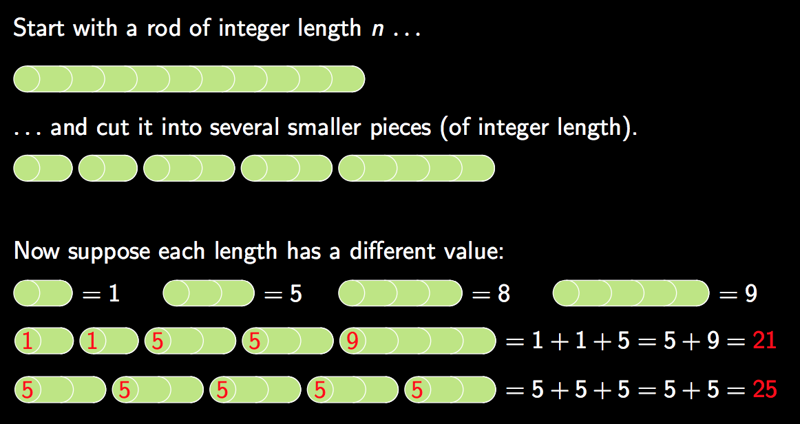
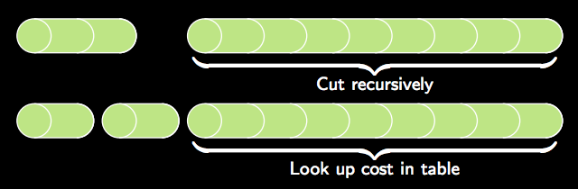
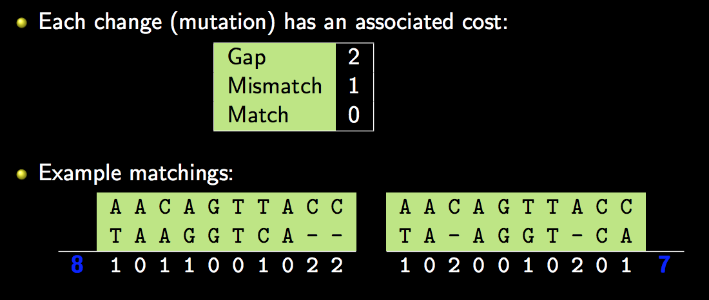
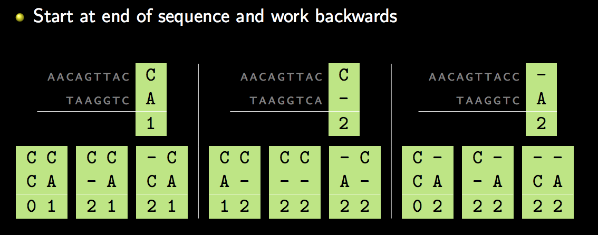
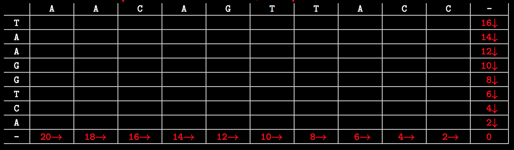

---
---
:author: Cheng Gong

= Lecture 7

[t=0m0s]
== Dynamic Programming

* The term "dynamic programming" was invented by Richard Bellman to "sound cool" to management, ensuring that there would continue to be funding for his research.
* In fact, dynamic programming is simply the concept of saving computed results for reuse later, much like a lookup table.
* Just like how hash tables and tries are types of data structures, dynamic programming is a type of algorithm that solves a problem by saving the results each time, and looking up the answer if it's needed in the future, saving that extra computation.
* A `for` loop that reads like this:
+
[source, c]
----
for (int i = 0; i < strlen(str); i++) {
    ...
}
----
could be optimized by storing `strlen(str)`:
+
[source, c]
----
int length = strlen(str);
for (int i = 0; i < length; i++) {
    ...
}
----
** And this is an example of a lookup table, where only one value, the length of the string, is stored.

[t=5m52s]
== Rod Cutting

* One example of a problem that can be solved with a lookup table is rod cutting, where we have a rod of something valuable, and we can cut it into segments of various lengths. But each length can be sold for different amounts, so we want to maximize the total value we get:
+

** There are different ways we can cut a rod of length 10, and we see that the total amount we can get is different depending on how we cut it.
* To solve this problem and find the maximum value, we have a few different approaches. First, we note that a rod of length 10 has 9 places where we can choose to cut or not cut it, meaning that there are 2^9 different combinations of how we might cut it. So there are 2^_n_ - 1^ possibilties for a rod of length _n_.
* One strategy to solve this is to find the best cut for the first cut, then recursively cut the rest. But this still means that we are doing an exponential amount of calculations:
+
image::recursive_rod_cutting.png[alt="Rod cutting recursively", width=300]
* A way to optimize this is to store the value of each part on the left as we make different cuts, and look up the right part in our table or compute it if it wasn't stored yet:
+

** Since we are storing the results, we only need to make _O_(_n_^2) calculations, since we have 10 choices to make initially, then 9, then 8, and so on.
* Another strategy is to start with calculating the value of length 1, then calculating the best value of length 2, using the stored value of length 1, then calculating the best value of length 3 with the previously stored values, and so on, until we get to the length we want to solve for.

[t=18m20s]
== Network Routing

* As we've learned, computers on the Internet have many routes to communicate with each other, using servers in between to pass messages along. Finding the most efficient servers to pass those messages to is a problem called routing.
* To do this, all computers on the Internet broadcast their existence to its immediate neighbors, and share their lists of immediate neighbors with each other. This happens recursively, so eventually we know which server to send our messages to:
+
image::network_routing.png[alt="Network routing", width=800]
** Benedict on the lower left, for example, might want to send a message to Harvard. He knows that sending it to Natalie to forward will take 3 hops, but Yale's server is only 2 hops away. And Benedict only needs to know the first server where he should send his message to, since that server will also have a list of where to send a message to next, for it to reach its destination.
** At each step, each server only needs to add 1 to the number of hops its neighbors can reach, and select the minimum, as opposed to calculating all possible routes.
* In general, our own computers only go so far as to know about our local network and our access point, and only our ISP or school's servers will participate in this route sharing process.

[t=28m57s]
== Sequence Matching

* In biology, human DNA is comprised of 4 bases: Adenine (A), Thymine (T), Guanine (G), Cytosine (C), so we can represent DNA as a long string of these 4 characters in some combination.
* If we have two pieces of DNA, and wanted to see how similar they are, one metric is edit distance, whereby the cost to convert one string to another is determined by the number of gaps and changes:
+

** Here, a gap has a cost 2, and a change has cost 1. (This is based on the fact that genetic mutations where a base is changed is about twice as likely as it is to be completely missing.) The example on the left has an edit distance (cost) of 8, and the example on the right has a cost of 7.
** Notice that the second string is the same in both cases, but where we place the 2 gaps affect the total cost. If the 2 gaps are left at the end, we have a cost of 8, and if we place the 2 gaps in the middle somewhere, the cost is only 7.
* If we wanted to find the minimum edit distance, or the most likely way that one sequence of bases was converted to another, we can try to solve this recursively:
+

** At each step, we have three options: mark it as a change with cost 1, mark it as the bottom base being missing with cost 2 and shift the bottom sequence, or mark it as the top base being missing with cost 2 and shift the top sequence.
** We can start with the last base in each sequence. Then, we'll have three options for the second to last base, in each of those three cases. This means that we'll have _O_(3^_n_), which is far too high to be solvable!
* In fact, edit distance applies not only to comparing genes, but also comparing two assignment submissions for similarity (among other applications).
* To solve this with dynamic programming, we can realize that at each step, the cost to match the remaining strings can be stored, and looked up, since many of the cases will be repeated.
* Our lookup table will look like this:
+

** The first sequence forms the columns, and the second sequence forms the rows. Each cell will have the cost of matching the sequence from that base to the end of the sequence.
** For example, the bottom right has a value of 0 because two empty sequences has no cost.
** To convert C, the second to last column, to an empty sequence, we have a cost of 2, as we see in the cell to the left of 0.
** To convert the entire top sequence to an empty string, we look at the cell at bottom left, with a value of 20, since it will require 10 deletions (shifting right) to convert it to an empty string.
* We can start filling in the table:
+
image::matching_table_start.png[alt="Matching table started", width=600]
** The cost for each cell can be represented as:
+
[source]
----
cost[i][j] = min(cost[i + 1][j] + 2,
                 cost[i][j + 1] + 2,
                 cost[i + 1][j + 1] + x)
----
** At each base, we again have three options. We can delete the base in the row and have a cost of two, plus the cost of matching the rest of the sequence that forms the rows (indicated by an arrow downwards). We can delete the base in the column and have the cost of 2, plus the cost of matching the rest of sequence that forms the columns (indicated by an arrow rightwards). Finally, we can attempt to match or edit the two bases, with a cost of 0 (if they are the same) or 1 (if they are different), plus the cost of matching the rest of both sequences (with the diagonal arrow).
** In this example marked in red, matching the C to the A has a cost of 3 with a diagonal arrow, because we can change A to C with a cost of 1, and then have to delete the last C with a cost of 2 (as the cell indicates).
* We can continue this for each cell, working backwards row by row until it is complete:
+
image::matching_table_completed.png[alt="Matching table completed", width=600]
** Now, to find the minimum edit distance for the two sequences, we follow the arrows that tell us what to do at each step.
** First, we match A to T, then A to A, and so on, until the entire sequences are matched. The third step, for example, which matches C to A, is marked with an arrow going to the right, indicating that the best path is for us to delete the C.
* We can use this algorithm to match DNA sequences, compare assignment submissions, and even determine the most likely match in a dictionary for a misspelled word.

[t=57m33s]
== Image Compositing

* Another example is where we have a set of overlapping images that we want to combine into one:
+
image::image_compositing.png[alt="Image compositing", width=600]
** The two images here might be slightly different, so we want to combine them with the shortest seam (path of connected pixels) between the two. And the seam should take the path where the two images are most similar, so we don't notice it as easily.
** At each pixel, we can compute the difference in value between the two images, and decide if our seam should go right, down, or diagonally down and to the right. We can build a table the same way we did for sequence matching, but the cost we add at each step is the difference in the value of the pixels. So the algorithm to find the optimum seam is the same as before, too.

[t=1h4m22s]
== Seam Carving

* We look at a http://nparashuram.com/seamcarving/[demo] of seam carving, where we want to resize an image in one dimension, but instead of squeezing or expanding all the pixels of the image, we want to keep only the important features of the image.
* In the demo, this is accomplished by deleting a column of pixels that are the most similar to the columns of pixels next to them. Then, a human is less likely to notice a jump in the image. And instead of deleting a straight column of pixels, we will delete a "wiggly" column, where we start with deleting a pixel in some column at the top row, and for each row below, we can delete the pixel to the left, immediately below, or to its right.
* Just like before, we can build the same table and use the same algorithm, and only change our cost function. And as we resize our image to be narrower and narrower, we can update our table and delete more and more columns of pixels.
* With just some computer science background, we can take these relatively simple ideas and have surprisingly good results.
