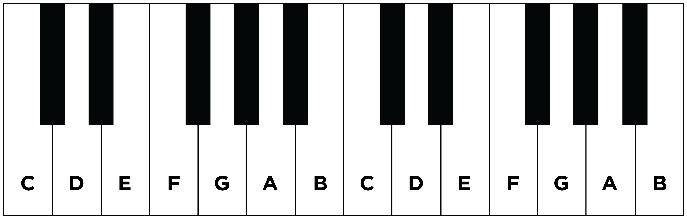
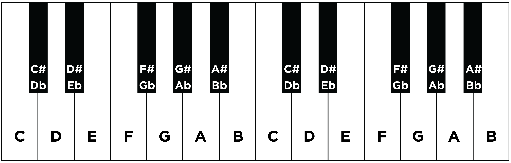
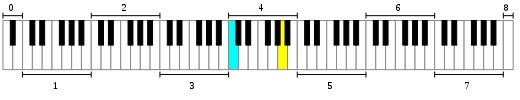
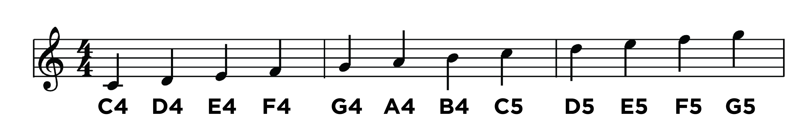
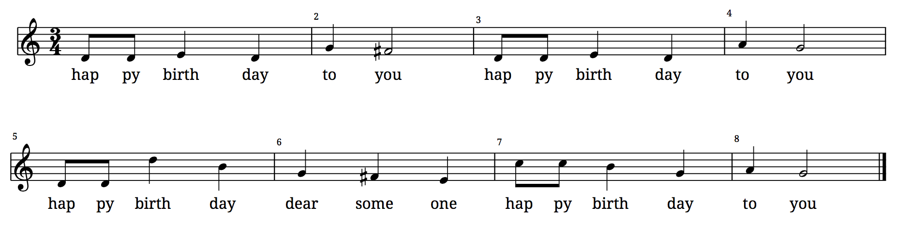

---
---

= Music

== tl;dr

. Learn to read sheet music.
. Convert musical notes to frequencies.
. Sythesize songs.

== Distribution

=== Downloading

[source]
----
$ cd ~/workspace/pset3/
$ wget http://cdn.cs50.net/2017/fall/psets/3/music.zip
$ unzip music.zip
$ rm music.zip
$ cd music
$ ls
Makefile  helpers.c  helpers.h  notes.c  synthesize.c  songs/  wav.c  wav.h
----

=== Understanding

==== `songs`

==== `notes.c`

==== `synthesize.c`

==== `helpers.h`

==== `helpers.c`

==== `wav.h`

==== `wav.c`

==== `Makefile`

== Background

A song is essentially a sequence of sounds, otherwise known as notes, each of which has some duration. In Western music, each of those notes is known by a letter, A through G. Those letters happen to correspond to the white keys on a piano, otherwise known as "natural keys," per the below.
  

Among all of those white keys are black keys, otherwise known as accidentals. (Though white keys can be accidentals too.) Those black keys are identified by their relation to white keys, per the below. A black key immediately above (i.e., to the right of) a white key is identified by the same letter but with a suffix of &#9839; (often typed as #), otherwise known as a sharp; a white black key immediately below (i.e., to the left of) a white key is also identified by the same letter but with a suffix of &#9837; (often typed as a lowercase b), otherwise known as a flat.

Each key on a piano is said to be one semitone, otherwise known as a half step, away from its adjacent neighbor, whether white or black.

Now, all of those keys, when pressed, generate waves of air molecules (i.e., alternations of high and low air pressure), otherwise known as sound waves, per the below. If those sound waves reach your ear, you'll hear sounds. Each of those sound waves has some height, otherwise known as its frequency. The higher a sound wave's frequency, the higher the pitch of sound you'll hear; the lower a sound wave's frequency, the lower the pitch of sound you'll hear. If curious as to why some air molecules sound better than others, you might like https://plus.maths.org/content/magical-mathematics-music[the magical mathematics of music].

////
https://web.stanford.edu/~zhoufan/MathematicsOfMusic.pdf
////
. Chronological sequence of pictures of the compression of air molecules for a sound wave moving in the rightward direction.
image::MathematicsOfMusic.png[]

Pianos, meanwhile, typically have as many as 88 keys, 52 of which are white. With only seven letters (A through G) with which to identify them, those letters necessarily identify multiple keys. And so notes are divided into octaves, groups of contiguous keys, each of which is numbered, per the below.

////
https://en.wikipedia.org/wiki/A440_(pitch_standard)#/media/File:Piano_Frequencies.svg
////

Not only are notes identified by letters (and accidentals), then, but also by octaves, per the below.

image::octaves.png[]

Among the most popular notes is Middle C, highlighted in cyan, otherwise known as C4, since that C is in the piano's fourth octave. Above Middle C (i.e., to its right) is another popular note, A4, otherwise known as A440, since the frequency of its sound waves is 440 Hz, which means that they oscilate up and down 440 times per second. If you consider a note just an abstraction for a sound wave, then, it's fair to say that the note itself has a frequency. Here's what 440 Hz sounds like:

video::teb64y-D2sA[youtube]

The frequencies of one octave's notes differ from those of adjacent octaves' notes by a factor of two. For instance, the frequency of A3 is 220 Hz (i.e., half that of A4), while the frequency of A5 is 880 Hz (i.e., twice that of A4). More generally, the frequency, _f_, of some note is 2^^(n/12)^^ × 440, where _n_ is the number of half steps from that note to A4.

Musicians, though, tend to write music not with letters or frequencies but with visual notations, otherwise known as sheet music, whereby notes are written on or between lines, otherwise known as a staff. The lines on or between which notes are written imply the notes' letters, per the below.

The duration of a note, meanwhile, is implied by its shape. For instance,

* &#9834; is an eighth note, though when adjacent to one or more other eighth notes, they're often beamed, a la &#9835;;
* &#9833; is a quarter note, the duration of which is twice that of an eighth note;
* &#1D15E; is a half note, the duration of which is four times that of an eighth note; and
* &#1D15D; is a whole note, the duration of which is eight times that of an eighth note.

An absence of a note (i.e., silence) is considered a rest, the duration of which is also implied by its shape. For instance,

* &#1D13E; is an eighth rest, the duration of which is identical to that of an eighth note;
* &#1D13D; is a quarter rest, the duration of which is twice that of an eighth rest;
* &#1D13C; is a half rest, the duration of which is four times that of an eighth rest; and
* &#1D13B; is a whole rest, the duration of which is eight times that of an eighth rest.

With these building blocks can you represent a song like the below.

If unfamiliar, here's what that song sounds like (when its notes sound waves reach your ear).

audio::flat-happy-birthday.wav[]

== Specification

=== `song.txt`

In `song.txt`, type the ASCII representation of _Happy Birthday_, translating its sheet music to the machine-readable representation prescribed herein. You should find that the song begins with:

[source]
----
D4@1/8
D4@1/8
E4@1/4
D4@1/4
G4@1/4
F4@1/2
----

Implement a program called `music` that generates MIDI files from a sequence of notes.

* Implement your program in a file called `music.c` in a directory called `music`.
* Your program should accept exactly one command-line argument, the name of the MIDI file which your program will eventually generate.
** If your program is not executed with exactly one command-line argument, it should remind the user of correct usage, as with `fprintf` (to `stderr`), and `main` should return `1`.
* Your program should first get (via `stdin`) a string from the user, which is the ASCII representation of the song you should generate, formatted according to the above specification.
** This means that you can also pass in the contents of a file as the notes to generate via file redirection (remember how?)
* Your program should then output a playable MIDI audio file based on those notes.
* If your program is passed an invalid representation of a song, it should display an error message, and `main` should return `2`.

== Usage

Your program should behave per the examples below. Assumed that the underlined text is what some user has typed.

[source,subs=quotes]
----
$ [underline]#./music#
Usage: ./music output.mid 
----

[source,subs=quotes]
----
$ [underline]#./music bday.mid < songs/bday.txt#
$ [underline]#echo $?#
0
----

[source,subs=quotes]
----
$ [underline]#./music output.mid#
[underline]#D4_...F#4...A4_...D5_...   D5_...A4_...F#4...D4_...#
$ [underline]#echo $?#
0
----

== Walkthrough

video::yTNp6wiU1ZI[youtube,list=PLhQjrBD2T380boRF-5b7Dow2opWBbZhLH]

== Testing

=== `song`

[source]
----
check50 2017/fall/music/song
----

=== `piano`

[source]
----
check50 2017/fall/music/piano
----

=== `synthesize`

[source]
----
check50 2017/fall/music/synthesize
----

////
== Hints

TODO
////
