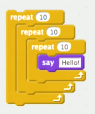
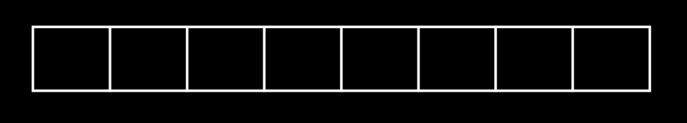

:author: Cheng Gong

= Algorithms, Data Structures

== Last Time

* We discovered that we can tell computers to do things with programming languages, but there are more and more ways to accomplish the same tasks as we have more and more sophisticated (or even simple) tasks.
* Floating-point imprecision occurs when a computer can't accurately represent fractions given limited memory, and overflow occurs when an integer becomes too big to fit in the memory allocated to it.
* A compiled program needs to be converted to machine code by a compiler first before it is run directly, and an interpreted program is run line by line by an interpreter.

== Algorithms

=== Running Time

* In our phone, we have a list of alphabetized names with numbers attached to them that we can search through.
* On our first day, we had three algorithms: searching one page at a time, searching two pages at a time but checking the last page once we've past the name we're looking for, and finally *binary search* where we eliminate half the problem at each step.
* Recall that the running times look like this for each algorithm:
+
image::efficiency.png[alt="Efficiency", width=800]
* Binary search has *running time*  of log _n_, and this is denoted by the *big _O_* symbol, _O_.
* For example, our first algorithm of searching one page at a time has running time _O_(_n_) ("big _O_ of _n_"), where _n_ is the size of the problem (number of pages, in our case) and big _O_ is the upper bound, or worst case, of the number of steps required for the algorithm. In this case, since we are searching one page at a time, with _n_ pages we will require _n_ steps.
* In the second case, we will have _O_(_n_ / 2), but we generally ignore the constants, since fundamentally the efficiency of the algorithm isn't much better. In the real world, the second algorithm is certainly twice as fast, but theoretically the growth in running time is still linear to _n_, so we simplify them to be equivalent.
* In the last case, the running time is _O_(log _n_), since the number of steps we need is logarithmic to the number of pages in our phone book.
* In Scratch, we can nest three `repeat` blocks with 10s to do something 1000 times:
+

* But if we were to repeat on `n`, the number of times would be `n^3`:
+
image::repeat-n.png[alt="Repeat on n", width=300]
* With _O_(_n_^3^), an algorithm becomes very slow very quickly as _n_ gets large.
* Ω, Omega, is also used sometimes to denote the lower bound of an algorithm, though this is less useful since it describes the best case.
* For all of our algorithms, the Ω running time is 1, since the name we are looking for might be on the first page we look at!
* There are lots of formulas that might be possible for _O_, with common ones like:
** _O_(_n_^2^)
** _O_(_n_ log _n_)
** _O_(_n_)
** _O_(log _n_)
** _O_(1)
** ...
* An algorithm that takes a constant number of steps, with _O_(1), might be one that does something a certain number of times.
* If an algorithm's upper bound is the same as its lower bound, then it also has a Θ, theta.

=== Sorting

* We have a volunteer try to find the number 50 behind 8 sheets of paper, knowing nothing else, and that resulted in randomly flipping over the papers. This has a worst case, _O_(_n_) steps if there are _n_ papers, and a best case Ω(1), if we got lucky and found the number in the first try.
* Now we have sorted numbers, and by using binary search we had _O_(log _n_).
* But there was work done in the beginning, to sort the numbers the first time.
* Let's say we have the following numbers:
+
[source]
----
4  2  7  5  6  8  3  1
----
* We can compare numbers next to each other, and swap them:
+
[source, subs="macros"]
----
+++<u>4</u>+++  +++<u>2</u>+++  7  5  6  8  3  1
+++<u>2</u>+++  +++<u>4</u>+++  7  5  6  8  3  1
----
* Then we keep going:
+
[source, subs="macros"]
----
2  +++<u>4</u>+++  +++<u>7</u>+++  5  6  8  3  1
2  4  +++<u>7</u>+++  +++<u>5</u>+++  6  8  3  1
2  4  +++<u>5</u>+++  +++<u>7</u>+++  6  8  3  1
----
* When we get to the end of the row, we have:
+
[source, subs="macros"]
----
2  4  5  6  7  3  1  8
----
* So we need to do this process _n_ more times, since `8` is now all the way to the right, but we need to finish moving all the other numbers. And each time we go through the row, we look at _n_ - 1 pairs of numbers, which simplifies to a running time of _n_^2^. This algorithm is called *bubble sort*.
* We can try a different algorithm. Each time, we'll find the smallest number in the list, and swap it with the number at the beginning of the list:
+
[source]
----
4  2  7  5  6  8  3  1
1  2  7  5  6  8  3  4
----
* We need to make this a swap, and not just move the `1` to somewhere before the `4`, since in memory our numbers might be stored between other variables, and using the memory before the `4` to store the `1` might result in overwriting something else.
* We'll repeat this with the rest of the list until it's completely sorted, but finding the smallest element each time takes _n_ steps, and there are _n_ elements to move, so the running time is _n_^2^ again. And this algorithm is called *selection sort*.
* The pseudocode might look like this:
+
[source]
----
for i from 0 to n-1
    find smallest element between i'th and n-1'th
    swap smallest with i'th element
----
* And for bubble sort:
+
[source]
----
repeat until no swaps
    for i from 0 to n-2
        if i'th and i+1'th elements out of order
            swap them
----
* In both cases, `i` is the index in the list, and since we start with index `0`, we go up to `n - 1` or, in the case of bubble sort, the ``n - 2``th element (the second to last element, since we compare it to the last element).
* To calculate the running time of these algorithms more precisely, we'll consider the number of steps.
* If we have a list with _n_ elements, we would compare (_n_ - 1) pairs in our first pass.
* And after our first pass, the largest element will have been swapped all the way to the right. So in our second pass, we'll only need (_n_ - 2) comparisons.
* By the end, we'll have made a total of (_n_ - 1) + (_n_ - 2) + ... + 1 comparisons. And this one actually adds up to _n_(_n_ - 1)/2. And that multiplies out to (_n_^2^ - _n_)/2.
* When comparing running time, we generally just want the term with the biggest order of magnitude, since that's the only one that really matters when _n_ gets really big. And we can even get rid of the factor of 1/2.
* We can look at an example (not a proof!) to help us understand this. Imagine we had 1,000,000 numbers to sort. Then bubble sort will take 1,000,000^2^/2 - 1,000,000/2 steps, and if we multiply that out, we get 500,000,000,000 - 500,000 = 499,999,500,000. Which is awfully close to just the first number.
* So when we have an expression like (_n_^2^ - _n_)/2, we can say it is on the order of, _O_(_n_^2^).
* And we can visualize different sorting algorithms with sites like https://www.cs.usfca.edu/~galles/visualization/ComparisonSort.html[https://www.cs.usfca.edu/~galles/visualization/ComparisonSort.html] or https://www.toptal.com/developers/sorting-algorithms[https://www.toptal.com/developers/sorting-algorithms].
* Merge sort, one other algorithm, divides the list of numbers in half over and over and sorts them individually before merging them, leading to a fundamentally better running time of _O_(_n_ log _n_).
* Another https://youtu.be/t8g-iYGHpEA[fun animation] has sound to help with visualizing the sorting.

== Data Structures

* Recall that in memory, we have bytes laid out in what is essentially a long row:
+

* If we were to fill these boxes with our unsorted numbers, they would be stored in a simple data structure called an array, where elements are stored next to each other in a pre-defined, contiguous area of memory.
* The advantage of an array is that, if we knew the index of the item we want to access, we can jump to it and read the value at that index with _O_(1).
* Furthermore, since the items are laid out in a row, their locations can be calculated arithmetically. For example, the middle element of an array of size 5 would be at index 2 (since the indices would range from 0 to 4).
* We could place our items randomly in memory (in locations we knew we could use), but that requires linking together each element somehow:
+
image::linked_list.png[alt="Linked list", width=400]
* We can better represent this with the following diagram:
+
image::linked_list_2.png[alt="Linked list 2", width=400]
** The gaps between the boxes represent the fact that the boxes can be located anywhere in memory.
* Each box will now contain two items, the first being the value that we want to store, and the second being a reference to the next box. This reference would be the address in memory of that box, since we can assign absolute addresses of all boxes in memory globally. In C, these references are called pointers.
* This is called a linked list, and the advantage is that we can grow and shrink and reorder this list easily, just by changing the references. But now we need more space in memory we need per element, and we can no longer randomly access elements, so search will be _O_(_n_).
* There are yet more data structures, like a binary tree:
+
image::binary_tree.png[alt="Binary tree", width=400]
* Now each element has at most two children, with its left one being strictly smaller and the right one being greater.
* If we had built up this data structure correctly, with the lines between elements as references to the next ones, then we can add and remove elements dynamically while still being able to binary search.
* Finally, a hash table is an array of linked lists, where we have a fixed number of linked lists, each of which can be as long or short as we'd like:
+
image::hash_table.png[alt="Hash table", width=400]
* In the real world, with an appropriately sized hash table, we can achieve constant time searches and insertions.
* For example, if we wanted to store the name of everyone in the class, we might have each linked list be a certain letter:
+
image::hash_table_2.png[alt="Hash table 2", width=400]
* We'll use the first letter of a name to determine where each one will be placed, and later to find it again too. This operation of converting a value to an index in the hash table is called hashing.
* But if we have a lot of names that start with A, then we'll have a longer linked list and thus more steps for an algorithm to run after hashing.
* A good hash function, then, will distribute values more evenly across the table.
* With these algorithms, data structures, and options for building them, we see how it might be possible to design a system more efficiently.
