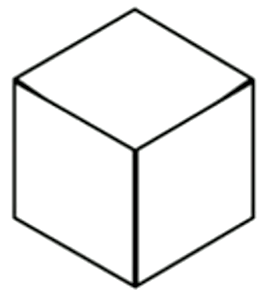

---
---
:author: Cheng Gong

= Computational Thinking

== Themes

* There are a few themes to what we'll discuss today:
** ASCII, binary
** abstraction, algorithms, pseudocode
** imprecision, overflow

=== ASCII, binary

* *Binary* is a system of counting that uses two symbols, ``0``s and ``1``s. Unary is a system that uses one symbol to count, like tally marks, and humans typically use decimal, with ten symbols, ``0`` through ``9``.
* Computers, at a very basic level, take in electricity as input, whether from an outlet or a battery.
* In decimal, `123` is one hundred and twenty-three. And if we think way back to grade school, that's because each column has a place value, and we add them up like so:
+
[source, subs=quotes]
----
    100         10          1

      *1*          *2*          *3*

100 x 1     10 x 2      1 x 3
----
* Binary represents numbers in the same pattern, but using powers of 2 instead of powers of 10 that decimal uses. The first row shows the value of each column, like the 100, 10, and 1 above, and the second row is our current binary number.
+
[source, subs=quotes]
----
      4          2          1

      *0*          *0*          *0*
----
* To represent a 1, we simply place a `1` in the ones column:
+
[source, subs=quotes]
----
      4          2          1

      *0*          *0*          *1*

             1 x 1
----
* And a 2 like so:
+
[source, subs=quotes]
----
      4          2          1

      *0*          *1*          *0*

             2 x 1
----
* And a 3 by combining the previous two steps:
+
[source, subs=quotes]
----
      4          2          1

      *0*          *1*          *1*

             2 x 1      1 x 1
----
* We can continue this pattern:
+
[source, subs=quotes]
----
      4          2          1

      *1*          *0*          *0*

  4 x 1
----
+
[source, subs=quotes]
----
      4          2          1

      *1*          *0*          *1*

  4 x 1                 1 x 1
----
+
[source, subs=quotes]
----
      4          2          1

      *1*          *1*          *0*

  4 x 1      2 x 1
----
+
[source, subs=quotes]
----
      4          2          1

      *1*          *1*          *1*

  4 x 1      2 x 1      1 x 1
----
* But once we have used up all the places, we need more *bits*, or binary digit, which stores a `0` or `1`. With additional digits, we can represent larger numbers like 8:
+
[source, subs=quotes]
----
     8          4          2          1

      *1*          *0*          *0*          *0*

  8 x 1
----
* So our computer has many many switches (called transistors) that can be turned on or off given electricity, and a switch that is on represents a 1 and a switch that is off represents a 0.
* A CPU, central processing unit, is a chip inside computers with billions of these transistors, that constantly turn on and off to store information, count, and perform other numeric operations.
* So far we've represented numbers, but we also know that computers can represent letters of the alphabet. Some years ago the world decided on a standard mapping of numbers to letters, called http://en.wikipedia.org/wiki/ASCII[*ASCII*]. We've essentially abstracted away the low-level implementation detail whereby binary is used to ultimately represent characters in a computer's memory, much like the source of power, whether from a battery or outlet, can be abstracted away as some power input.
* In ASCII, the letter `A` is the decimal number 65, `B` 66, `C` 67, and so on. And lowercase letters are another set of numbers. Numbers, too, that you type, would be represented as different binary numbers according to the table.
* Initially, only 8 bits were allocated for one character, so the maximum number of different characters that could be represented in that number of bits is 2^8 = 256. (And just to be clear, one of those values is 0, so the maximum decimal number that can be stored in 8 bits is 255.)
* Unicode is another system that is a superset of ASCII, using up to 16 bits to represent characters from other languages and even emoji.
* We can also represent colors using a system called https://en.wikipedia.org/wiki/RGB_color_model[*RGB*], where three values each represent the amount of red, green, and blue that mixes together to represent some color.
* And computer screens, if you lean in really close, are made up of lots and lots of dots, or *pixels*, each with some RGB value that together form a picture or text.
* Formats for photos, like `.jpeg` or `.png`, can use more bits to represent the colors of each pixel than a format like `.gif`, which allows GIF files to be smaller at the expense of visual quality.
* And with lots of images, one after another, we get videos.
* Depending on the context a file is opened, the bits will be interpreted in different ways, such as text, images, or a instructions to run a program.
* If we wanted to implement colorized text, we could add bits after each character to represent the color of that character. But this feature, too, increases the space required to store each character.
* Further complicated representations, such as a slide in a presentation software, require more abstractions. For example, a slide could contain a text box and also an image, each of which has bits storing actual data of the content inside, but also bits indicating what type of content is inside, and where on the slide each container should be placed. The software will then know, when opening each file, which patterns of bits to look at to determine what should be displayed and how. And indeed, those patterns of bits are even abstracted away as values to variables that are generally named by words.
* Some file formats, like JPEG, are standardized with its https://en.wikipedia.org/wiki/JPEG#Syntax_and_structure[format well documented].
* The terms 32-bit or 64-bit refer to how many bits a CPU uses as a unit by default, so generally software needs to be compiled (more on this next week) into instructions that are 32-bits or 64-bits wide as appropriate, so the CPU can understand them.
* In the physical world, electricity also isn't always delivered cleanly at accurate levels, so a range of values between, say, 0 and 5 volts can be recorded, and anything that's closer to 0 will be a binary 0, and anything closer to 5V will be a binary 1. It's possible to have devices use more values, but that's also more likely to introduce errors. Quantum computing is one such innovation, which allows for greatly increased processing power, but is also difficult to implement in the physical world.

=== Abstraction, algorithms, pseudocode

* The idea of *abstraction*, taking low-level building block, and layering them to create more interesting applications, seems very powerful.
* We can demonstrate this with an activity. Everyone is given a sheet of paper, and a volunteer describes a picture with four shapes for everyone to draw.
* With short instructions like "draw a square, then a circle next to it", we get a variety of sizes and interpretations:
+
image::drawing1.png[alt="Drawing 1", width=300]
+
image::drawing2.png[alt="Drawing 2", width=300]
* But we notice that everyone knew what a "square" and "circle" was, demonstrating the use of abstraction in the instructions our volunteer gave. She didn't need to specify that a "square" was made up of four lines at right angles to each other, etc.
* We also see how this could backfire, since we might not be able to specify instructions with as much granularity as we'd like.
* A picture of a cube like the following could be abstracted away as multiple rhombuses, but it's probably easier to simply start describing it as drawing lines of certain lengths and angles:
+

** A parameter we could pass in, after we define how to draw a cube generally with lines, is the size of the cube, which could then affect each of the steps.
* All of these abstractions can be intimidating at first, since understanding the complexity of all of the layers is a huge (even impossible) undertaking, but we can simply take for granted that we can use building blocks to create high-level applications we care about. We'll see this as we use Scratch in our first project!
* *Algorithms* are sets of instructions to solve particular problems, the "black box" that produces some outputs from some inputs.
* Now we know how computers represent these inputs and outputs, as 0s and 1s.
* One example is finding someone in a phone book. We have a phone book of names and numbers as our inputs, and the output we would like is the number matching someone like Mike Smith. One algorithm is to open the phone book to the first page, look for Mike Smith, and then the second page, and then the third page, and so on, until we find Mike Smith. This algorithm is correct, since we'll either find him or reach the end of the phone book, but it's not very efficient.
* We can flip two pages at a time, and it is twice as fast as the previous algorithm, but it's possible that we might miss him if he is on an odd page, so we might need to go back once if we reach a letter that's past Smith.
* We can go straight to the middle, and find ourselves in the M section, and know that Mike Smith is in the right half of the book, and throw the left half away. We can repeat this again and again, and eventually find one page. With 1000 pages, it would only take about 10 steps of division to reach that one page. This algorithm is called binary search, as we divide the problem in half each time.
* As we think about how we might solve problems efficiently, we can write our algorithm in *pseudocode*, not actual code but more specific words than typical English:
+
[source, pseudocode, numbered]
----
 0   pick up phone book
 1   open to middle of phone book
 2   look at names
 3   if Smith is among names
 4       call Mike
 5   else if Smith is earlier in book
 6       open to middle of left half of book
 7       go back to step 2
 8   else if "Smith" is later in book
 9       open to middle of right half of book
10       go back to step 2
11   else
12       quit
----
* Notice that there is a structure, with indentation indicating what we might do if we followed certain paths.
* Some of these lines are actions we might take, like `pick up` or `open to` or `look at` or `call`. We'll call these functions.
* `if`, `else if`, and `else` are leading to branches, or decision points, based on whether or not the expression, like `Smith is among names`, is true.
* These expressions are called Boolean expressions (named after someone with the last name Bool), and can either be true or false, to use as conditions to decide which paths to follow.
* We also have lines like `go back to step 2` that induce a loop, where there is a cycle that does something over and over again.
* Finally, we can also look at how efficient this algorithm is. The x-axis is the size of the problem, and the y-axis is the time to solve. With `n` as the size of the problem, the red line represents the first algorithm in which time to solve increases with the size of the problem:
+
image::efficiency.png[alt="Efficiency", width=800]
** The yellow line is the second algorithm, which, though twice as fast, still increases linearly with the size of the problem.
** The green line will have a *logarithmic slope* that doesn't increase in height as much as the other lines. With the phone book, even if the size of the phone book doubled, it would only take one more step to solve the problem.
* A good algorithm will solve a problem correctly and efficiently, and there is a tradeoff with the effort it takes to write an algorithm, and how efficient it is.
