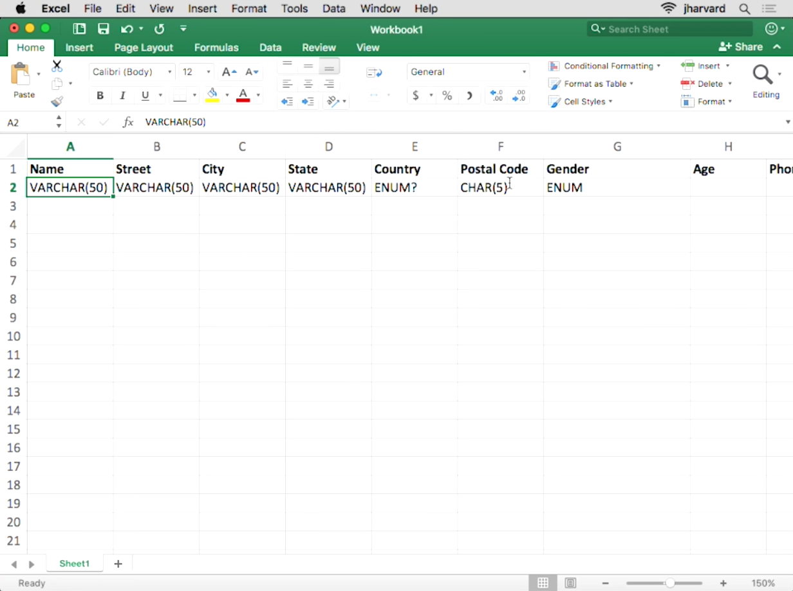

---
---
:author: Cheng Gong

= Database Design

== Last Times

* Phishing is when an attacker sends you an email or creates a website that seems legitimate, but is actually controlled by the attacker. We can avoid this by not including links in email, but that adds friction to users. As a user, we can carefully look at the email sender and link URL.
* We can look around at http://security.harvard.edu/click-wisely[http://security.harvard.edu/click-wisely] for more tips.
* We left off last time with discussing how we might scale the technology we're using for our web services. We might want to vertically scale by having faster and faster servers, but eventually we'll reach the limit of the fastest single server that exists. So we might horizontally scale, with multiple servers that each run the same code.
* But now we need to figure out how to synchronize the data between each of the servers we have, since a customer might be visiting a different one each time. And if each server is distant from each other geographically, there might be significant latency between them.
* *Sharding* is a way to divide our data between servers. For example, users with names between A-M might be on the first server, with users between N-Z on the second. But now we need to figure out which server to send them to, with another load-balancing server that the customers connect to first, that then forwards them to the appropriate web server.
* We might also use cookies, which are like digital handstamps that are large random numbers that browsers save and present back to the server each time, to prove that they are the same browser as before (to avoid logging in each time).
* We're assuming that each server has its own database, with its own set of data, but this means that we no longer have redundancy with our data in multiple places.
* So we'll have two web servers, sharing the same database, which will allow our data to be consistent with no latency between the servers updating each other.
* To add redudancy, we might add another database and they might be configured to replicate each other (with existing software). And both servers will need to be able to talk to both databases, in case something goes wrong with one of them.
* But if we have dozens of servers and dozens of databases, then the network becomes impossibly complex. We could use a switch, which is a device with lots of ports for other devices to connect to, linking them all together. But we still have dozens of databases, all of which have to communicate with each other and synchronize with each other. The switch, too, is now a single point of failure for our entire setup.
* So we might duplicate our setup with two sets of servers, routers, and databases, but those too need to be connected and negotiated with software and hardware. More commonly, we might have one stack, designated primary, that our visitors typically use, and another identical stack that's also running, but only copying data from the primary. Then, if the primary happens to fail, we can switch our network address over to the secondary with very little downtime.
* We might have a concern where there might not be a hardware failure, but possibly an administrator accidentally deleting some data. Then, our secondary will copy that action, and delete its data too. So we might not want real-time updates, and have some other server take snapshots, or backups, of the database at certain points in time.
* We can check our data integrity with hashes or more commonly checksums, which are similar to hashes in that they will change if a small part of the data has changed.
* We do also have a tradeoff of spending more in order to maintain redundancy, but that might be worth the potential risk of losing any data or uptime.
* Our web server receives HTTP requests and responds to them with webpages generated dynamically with code, and our database servers store the data they use to build those pages.
* Even if our servers were in a single data center and something happened to that entire site, we might consider that to be acceptable since the chances of that are so small, and that other websites will also be in the same situation.

== Databases

* We've almost certainly all used Microsoft Excel before, a program used to store data in rows and columns.
* A sheet of rows and columns is like a table in a database.
* With many rows, Excel might become very slow or even crash. It's trying to load everything in the file into memory, but a particularly large file would use up too much and cause problems.
* A relational database program is always running, and allows for the storage and updating of much more data efficiently.
* SQL, Structured Query Language, is a limited programming language that is used to interact with databases.
* CRUD is an acronym for the primary operations with a database:
** create
** read
** update
** delete
* In SQL, those commands are `INSERT`, `SELECT`, `UPDATE`, and `DELETE`.
* We also have to design our database to store particular types of data:
** `CHAR`, `VARCHAR`
*** Stores characters, or strings. `CHAR` is a fixed number of characters, whereas `VARCHAR` sets some upper bound for a variable number of characters.
** `SMALLINT`, `INTEGER`, `BIGINT`
*** These types store numbers with different numbers of bits, so the largest number in each increase, but the amount of space used is also higher.
** `FLOAT`, `DOUBLE PRECISION`, `DECIMAL`
*** These types store real numbers with various numbers of bits. `DECIMAL` in particular prevents floating point imprecision, by specifying the number of digits before and after the decimal point.
** `DATE`, `TIME`, `TIMESTAMP`
** ...
* We need to specify these types ahead of time, so our database can build the most efficient data structures and allocate the correct amount of memory for each row.
* If we wanted to build a database of customers, we might want to design something like this:
+

** Name might be a `VARCHAR`, and we might limit it to 50, but some people might have even longer names that don't fit.
** Address will probably be a longer `VARCHAR`, but we probably want to split it to street, city, state, and country. Breaking up our data to smaller units will allow us to filter our data more efficiently in the future. Those fields might be all `VARCHAR`, and we might want to make the postal code an `INT`, but leading zeroes will be dropped, so we'll stick to `VARCHAR`. But we could use `CHAR(5)` if we know all zip codes have 5 digits, and this will allow the database to use the exact amount of bytes each time without wasting space.
** For gender, we can use a type not mentioned before, `ENUM`, which is an enumerated, fixed list of choices that we can choose from for each value.
** If we wanted to store age, we'll probably have to update it every year, and be inaccurate if we didn't know each person's birthdays. So instead we might store a birthday as a `DATE`.
** An ID is generally an `INTEGER` used to uniquely identify rows, like the row numbers in Excel.
* Much of the address information might be repetitive, so we could remove city and state if we're already storing the postal code. We can use a different sheet or table to store the city and state information, so we can look up the full details with just the postal code.
* We can also tell our database ahead of time to index our columns, or build a data structure to quickly search for values. There are various types of attributes we can apply to our columns:
** `PRIMARY` indicates that this column will be unique and used to identify each row.
** `UNIQUE` is a constraint that this column will have only unique values among rows. A phone number or email might be in this category.
** `INDEX` allows for any column to be indexed, for quicker searches.
** `FULLTEXT` indexes the strings in the column, so we can search for keywords within those strings.
* The tradeoff to keep these indices are that inserts and updates will require these indices to be updated as well. Storage space will also be a consideration if our database becomes very large.
* Finally, there is a new technology, NoSQL, where data is stored hierarchically, nested, rather than rows and columns:
+
[source]
----
{
    "_id": "02134",
    "city": "Allston",
    "loc": [
        -71.132866,
        42.353519
    ],
    "pop":23775,
    "state":"MA"
}
----
* We'll have a seminar next time with more hands-on experiments with databases.
