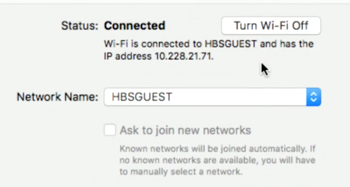
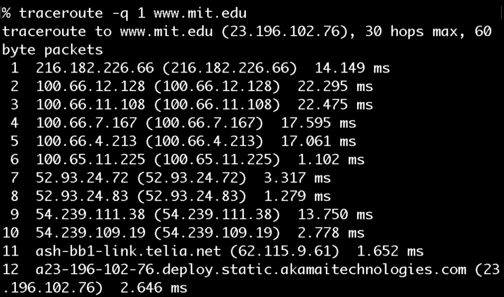
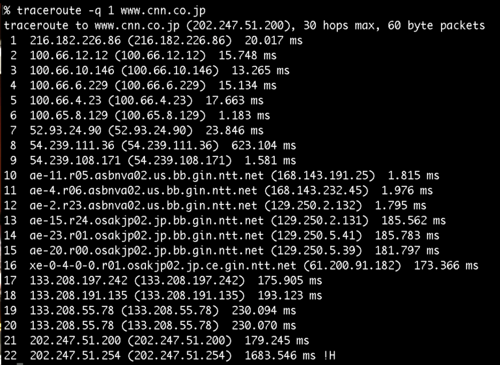

:author: Cheng Gong

= Internet Technologies

== Last Time

* We talked about algorithms and how to talk about the upper bound of their running time with big O and _n_, where _n_ is some measurement of the size of a problem, and their lower bound with big Omega. But big O is more relevant since we want to consider the worst case.

== This Time

* The internet is a network of computers connected together, and we generally think about it in terms of websites and applications.
* We've abstracted away the actual mechanism by which computers actually communicate with each other, but it's important to have a basic understanding of how it works.
* Some steps involved in having a website might be:
** Buy a domain
*** There are official registrars who are in charge of selling (renting) domain names (URLs that end in `.com`, `.net`, among the hundreds of others today). A central authority, https://en.wikipedia.org/wiki/Internet_Assigned_Numbers_Authority[IANA], is in charge of the master database of domain names globally, in which the registrars register domain names on your behalf.
*** Back in the day, it was easy to control branding by buying ACME.com and ACME.org and ACME.net, but now there are many different domain endings that would add up in cost for us to buy.
*** After we "buy" a domain, that only gives us the ability to point it to our own servers for a certain amount of time, after which someone else can buy it if we don't renew it.
*** There are also "squatters" who buy many common domain names, hoping that they can resell some at a high price.
** Build website
*** We'll talk more tomorrow about this step, but for now we can think of a website as just a file or a set of files.
*** On http://www.hbs.edu/, we can right click the page and click `View Page Source`, which will show us the HTML of the website.
*** HTML, Hypertext Markup Language, is not an actual programming language, but uses tags to describe (markup) content.
*** We can right-click a specific part of the page, click `Inspect`, and see the corresponding HTML:
+
image::hbs.png[alt="hbs.edu Inspect", width=600]
*** For this link, we see `<a href="http://hbswk.hbs.edu/item/cost-cutting-leads-to-turbulence-in-the-airline-industry" id="homepage-news-articletitle" class="makeItBlack">Cost-cutting Leads to Turbulence in the Airline Industry</a>`. `<a>` indicates a tag that starts a link, with an `href`, hyper-reference, to that URL. Then there are some other attributes (`id="..."`), and there is a closing tag, `</a>`, that ends this link, with the text that actually appears as the clickable link in between.
** Communication tools
*** We'll come back to this, along with a deeper dive into website building, tomorrow.
** Hosting
*** We need to put files (the HTML, images, and videos) for our website somewhere, so we need to pay a web host who gives us a certain amount of storage and bandwidth per month, and support for the language our website is written in. (A dynamic website could have its HTML generated each time by a programming language like Python or Ruby, which we'll also see tomorrow.)
*** Once we do that and copy our website to our web host, we need to go back to our registrar and point our domain name to the web host's server.
* IP, Internet Protocol, is the procedure by which computers on the internet communicate with each other. Every computer on the internet has an IP address, in the format `pass:[###.###.###.###]`. Each number must have a value between 0 and 255, so to represent 256 values we need 8 bits for each number, and thus a total size of 32 bits, or 4 bytes, for an IP address. That also implies a total of only 4 billion IP addresses, and there's actually a replacement version, IPv6, which assigns addresses with 128 bits, allowing for a lot more addresses.
* So our hosting company has a set of IP addresses, one of which is connected to the server on which our website is stored. We'll need to tell our registrar to point our domain name to our hosting company's nameservers (also known as DNS servers), servers which translate domain names to IP addresses. Then when someone wants to visit our website, their computer will be able to follow the trail of records and find our website.
* DNS, Domain Name System, is the system by which domain names are translated to IP addresses. There are root DNS servers that point to other DNS servers (for example, the one for all `.com` domains) in a hierarchy that eventually gives us an IP address back.
* Our computers might cache an IP address locally, and our ISPs (Internet Service Providers) too might cache all the common domains, to speed up future requests. But the tradeoff here is that these records might be out of date for some time, since we're not checking with the authoritative DNS server each time. But these caches are refreshed periodically, and we can redirect any visitors to a new domain name with our web server (at the old IP address) until the caches expire.
* A proxy server (a server passing data from website you visit and your computer, rewriting the request to have its IP address as opposed to yours) will prevent the other websites from seeing your real IP address, but it can also read your data unless encryption is being used.
* DHCP, Dynamic Host Configuration Protocol, is the procedure by which a device gets an IP address when it first connects to the internet. It first connects to the local network with a temporary address that asks the local DHCP server for an address that it can use.
* In the Network tab of System Preferences of our laptops, we can find something like this:
+

* We can see even more detail with `Advanced > TCP/IP`:
+
image::tcp_ip.png[alt="TCP/IP", width=400]
** Knowing the subnet mask allows us to figure out which computers are on the same local network and which ones are elsewhere, and the router is the server that sends information between us and the outside world. (A router is also known as a gateway.)
* In a Terminal window, we can run:
+
[source]
----
% nslookup www.hbs.edu
Server:     10.0.0.2
Address:    10.0.0.2#53

Non-authoritative answer:
www.hbs.edu canonical name = www.wip.hbs.edu.
Name:   www.wip.hbs.edu
Address: 199.94.20.35
----
** Apparently the full name of HBS' website is `www.wip.hbs.edu`, but when we visit that address, we get a page that says "Not Found".
* Another step needed is to configure our server, once we have our domain name pointing to it, to respond to requests for particular addresses. It seems that HBS' web server is only configured to respond to `www.hbs.edu`, and not `www.wip.hbs.edu`, even though that domain is also pointed to it.
* We can do a similar `nslookup` for `www.google.com`:
+
[source]
----
$ nslookup www.google.com
Server:     10.0.0.2
Address:    10.0.0.2#53

Non-authoritative answer:
Name:   www.google.com
Address: 216.58.218.228
----
** And if we went to http://216.58.218.228, we would indeed get redirected to https://www.google.com. This is done by their server, and we'll see tomorrow how we can implement that.
* We can run `traceroute`, a command that shows us the route to a server, to `mit.edu`:
+

** There seems to be 12 hops, and each one is a server that relays our request to the next one that's closer to our target address.
** Interestingly, based on the last hop it seems that MIT's hosting is provided by a company called Akamai, which is a web host that's also a CDN, content delivery network, which just means that they have many servers providing the same content all over the world, increasing speed and reliability.
* Remember that the internet is a network of computers, so the path that we take might be different each time, and if one or more of them stop functioning, we are still likely to be able to send a message to our destination. ISPs determine the overall structure of this network, since they might control the actual wires connecting servers geographically. On the smaller level, routers themselves have algorithms built-in to choose the best next server to pass messages to.
* We can try `traceroute` to other websites, like `www.stanford.edu` and `www.berkeley.edu`, but those require more hops. We can guess at what the names of their servers mean, but also notice that the times to each intermediate server increase as we get further and further:
+
image::berkeley.png[alt="traceroute berkeley.edu", width=600]
* We can even go across the ocean to the Japan version of CNN:
+

** After hop 12, it seems that our message needed to cross an entire ocean, adding more than 100ms of delay, but that's still incredibly fast for the distance covered.
* We watch https://www.youtube.com/watch?v=IlAJJI-qG2k[this animation] of these undersea cables.
* A limitation on how many visitors we can have is the type of web hosting we pay for. Since a server has a limited number of CPU cycles, it can only process and respond to so many requests in a given unit of time. So we might not be able to accomodate many simultaneous visitors, unless we upgrade our server with the web host, or increasing the number of servers. There are other ways to scale capacity, which we'll be able to better discuss once we learn more about the cloud next week.
* There are two factors that affect a user's experience, latency and bandwidth. Latency is how much time it takes to get any response back, and bandwidth is the number of bits per second we can send or receive once a connection is established. A hotel, for example, might have good bandwidth, but high latency, so browsing the web might be frustrating but a download would still be fast overall.
* Private IP addresses, that start with certain numbers, allow for many more devices than simply using IPv4 addresses would allow. A local network in a home, for example, might have a router with a single public IP address, and many devices inside with private IP addresses, that the router directs messages to and from. NAT, Network Address Translation, is the technology that affords this.
* IP also allows us to send larger amounts of information, like images or video, in smaller chunks.
* IP allows for information to be sent in packets, which we can think of as envelopes. These packets have the destination address, the source address, the information we are sending, and an indicator about the fragment of information, such as 1/4, 2/4, etc. This way, the recipient can piece the information back together when all of them are received.
* But if one piece somehow didn't get through, another technology, TCP, Transmission Control Protocol, allows the recipient to send a message back requesting another copy of just the piece that is missing.
* In networking, there are also https://en.wikipedia.org/wiki/Network_layer[layers of abstraction], where ethernet, for example, is level 2, and IP is level 3, and TCP is level 4.
* TCP also specifies a port number, which helps indicate what application or service is sending and receiving that packet.
* TCP is separate from IP because we might not necessarily want the feature to resend data to be part of all transmissions. For example, a live video stream would not need to have previously dropped packets re-transmitted.
* UDP is the protocol that allows packets that are dropped to be lost forever.
* HTTP, Hypertext Transfer Protocol, and HTTPS, the secure version of HTTP, both describe how a browser and a web server communicate. This layer is built on top of TCP, which we can now take for granted that allows computers to communicate reliably.
* We can think of protocols as humans greeting each other with handshakes, since there is a series of steps that each side follows by convention.
* HTTP specifies that if a browser sends a message in a particular format, it will get a reply back in a particular format.
* For example, we can run a command called `telnet` which allows us to manually send messages:
+
[source]
----
$ telnet www.hbs.edu 80
Trying 199.94.20.35...
Connected to www.wip.hbs.edu.
Escape character is '^]'.
GET / HTTP/1.1
Host: www.hbs.edu

HTTP/1.0 301 Moved Permanently
Location: http://www.hbs.edu/Pages/default.aspx
Server: BigIP
Connection: Keep-Alive
Content-Length: 0
----
** We typed `GET / HTTP/1.1` and `Host: www.hbs.edu`, which was a complete HTTP request for `/`, the root directory, of `www.hbs.edu`.
** We got a reply that had a status code of `301`, `Moved Permanently`, which redirects us to the URL of the actual homepage of the site. You might recognize some common status codes like `404`, which means "Not Found".
* We can use another program, `curl`, which will automatically send a request on our behalf and get the raw HTML at that URL:
+
image::curl.png[alt="curl http://www.hbs.edu/Pages/default.aspx", width=600]
* Until next time!
