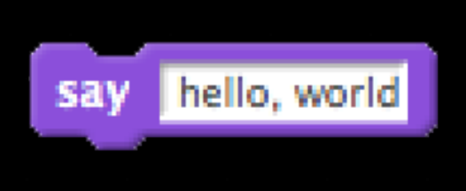
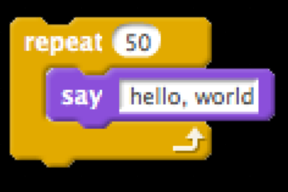
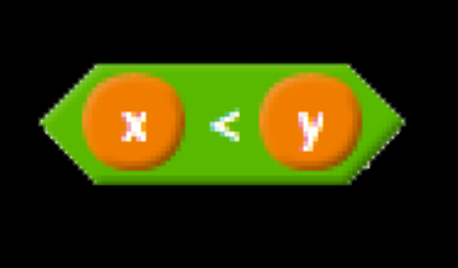

---
---
:author: Cheng Gong

= Programming Languages

== Announcements

* Office hours are https://cs50.github.io/hbs/hours[listed online] and vary. Let us know if you're coming for each one so we won't move them.
* https://cs50.github.io/hbs/seminars[Seminars] will also be coming up soon here in Aldrich 207.

== Last Last Time

* We focused on computational thinking, and the problem of instructing someone to make a peanut butter and jelly sandwich.
* The first example we looked at was fairly specific, but still included ambiguous phrases like "CUT the loaf of bread in half" which can be taken to mean cutting the entire loaf in half!
* The next example is more specific, so we were able to make a sandwich, albeit with an excessive amount of peanut butter and jelly.
* This demonstration reminds us how important it is to be very deliberate and precise in programming.
* An email from HUPD last year ended with "Avoid area. This is last message, unless new info develops." But this is strange, since it implies the area should be avoided indefinitely.
* Programs and data that a computer is using live in RAM, random access memory, while permanent data storage lives in disk drives such as a hard drive or solid state drive. This is another example of the theme of tradeoffs, where speed is traded for capacity and price.
* Regardless, each type of memory is finite, and integer overflow happens when a number we are trying to store is bigger than the amount of memory we have allocated to it.
* In decimal, for example, if we only have three digits, the highest number we would be able to represent is 999, and if we tried to write 1000, all we'd have is 000, the last three places.
* Back in the day, Lego Star Wars had a limit on the maximum score, since the highest integer that can be stored in 32 bits is about 4.2 billion.
* In the game Civilization, players who adopted the path "democracy" had their aggressiveness factor reduced by 2. Ghandi, who started with a factor of 1, would experience integer underflow when this happened, looping his aggressiveness factor back to 255!
* A Boeing 787 plane could also lose power if one of its components is on for 248 days continuously, since it has an internal counter that eventually overflows and causes a shutdown.
* Floating-point imprecision is a similar problem, since computers can't always represent fractions precisely with a finite number of bits.

== Last Time

* We learned a little Scratch, and some of you submitted a project to https://scratch.mit.edu/studios/3841693/[our shared studio here].
* The simplest program for Scratch looks like this:
+
image::hello_world.png[alt="Scratch hello world", width=300]
** We can read this quite literally, as in "when green flag clicked, say hello, world".
* `say` is an example of a *function*:
+

** The equivalent to a high-level language commonly used, Python, would be:
+
[source, python]
----
print("hello, world")
----
** `print` is the name of the function, the quotes `"` indicate a string, or a type of variable that is a sequence of characters, and the parentheses indicate that we are passing in arguments, or parameters, to the function.
* This would be a *loop*, in particular a forever loop:
+
image::forever.png[alt="Scratch forever", width=300]
* In Python, this would be:
+
[source, python]
----
while True:
    print("hello, world")
----
** Since `True` is always true, the `while` condition will always occur, so the `print` will run over and over again.
* We can translate a `repeat` block as follows:
+

+
[source, python]
----
for i in range(50):
    print("hello, world")
----
* `for` is a type of loop, `i` is just a counter we won't use otherwise, and `range` creates a range of numbers up to `50`, 0 through 49, so we `print` exactly 50 times.
* We can create and set variables:
+
image::set.png[alt="Scratch set", width=300]
+
[source, python]
----
i = 0
----
* One `=` sign is the assignment operator, which stores the value on the right into the variable on the left.
* To compare two values, we would use two equal signs.
* A boolean translates to this:
+
image::boolean.png[alt="Scratch boolean", width=300]
+
[source, python]
----
i < 50
----
+

+
[source, python]
----
x < y
----
* In Scratch, we can have fancier logic that also translates into Python:
+
image::conditions.png[alt="Scratch conditions", width=300]
+
[source, python]
----
if x < y:
    print("x is less than y")
elif x > y:
    print("x is greater than y")
else:
    print("x is equal to y")
----
** `elif` is the keyword in Python that means "else if".

= Writing Code

* We can use the [CS50 IDE](http://cs50.io), an integrated development environment that allows us to edit and run code in a standardized setting.
* CS50's IDE is a customized version of a third-party service, Cloud9, and since it runs in the cloud, we can continue our work anywhere in the world.
* On the left, we'll see the files and folders we have access to. The main panel is a code editor for whatever file we have open, and the bottom is a terminal where we can run our code.
* If we create a new file and save it as `hello.py`, then in the terminal we can type `python hello.py`. `python` is the name of the program we're actually running, and `hello.py` is a parameter we're passing in, for it to run.
* When we write code in plain text, it is *source code*. `hello.py` is source code written in the language Python. Another popular language is C.
* For programs written in the language C, a *compiler* is needed to convert the source code into *machine code* that can be run. Machine code is 0s and 1s, instructions in binary that a CPU understands.
* Previously, we had the `python` program, which compiled our source code into *bytecode* and then *interpreted* it line by line. This allows us to make changes to our code and see it run again quickly, without waiting for it to compile, but while running we'd likely see lower performance since we need to interpret it as we go along.
* Languages also increase and decrease in popularity in time.
* A buffer overflow happens in programs, like those written in C, where memory can be manipulated directly, and can lead to crashes or attacks if not handled properly.
* Python, in contrast, does not allow such low-level manipulation of memory by the programmer, preventing this class of bugs. But the tradeoff there is that we need more memory and overhead for the interpreter to manage our variables and objects for us. This management too might be generic and thus slower and less optimal than a solution we might implement ourselves.
* There are lots of programming languages, and https://helloworldcollection.github.io/[many ways] to write a "Hello, world!" program.
* Languages each have their advantages and disadvantages. JavaScript, for example, is well-suited to interactive webpages due to its support among web browsers. R is a language for data science and statistics. SQL is a language for querying databases.
* Good programmers might know multiple languages, especially different types thereof, and also be able to pick up new languages.
* Tomorrow we'll talk more about algorithms and data structures.
* If we wanted to store numbers in our computer's memory, for example, the simplest way might be one after another, in a grid of bytes. But as we have to store more and more bytes, we'll need better ways to organize and abstract how we store things in memory in what are called data structures. And once we've stored our data, we'll need to search and sort them efficiently with algorithms.
