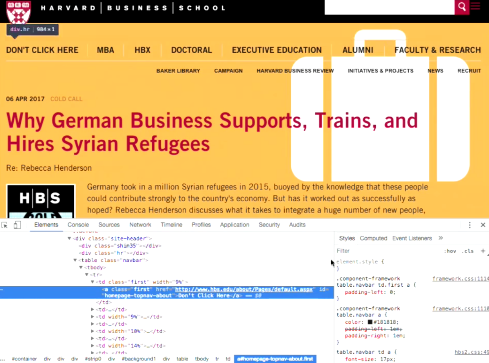

---
---
:author: Cheng Gong

= Web Programming

* Last time, we tinkered with database design.
* This time, we'll explore how we can programmatically generate websites.
* HTML and CSS aren't true programming languages, since they lack functions, variables, and conditions, where there is some logic or dynamism in the output.
* A *back end* technology is server-side, such any code written to generate web pages before they are sent to the user, or any database servers.
* A *front-end* technology is used to create a user interface, such as CSS to describe a web page's layout, or the look of a search box.
* There might also be other technologies in between, in multiple layers. For example, the back-end web server might talk to a database server, that's even "further back," or removed from the user. There might be an email server that sends messages, or a message bot server, neither of which directly respond to user requests but are part of our application.
* JavaScript is a programming language used in browsers and recently for web servers as well.
* HTML displays static information, but JavaScript code can be used to update it. For example, in GMail, when we get new emails, our inbox shows them without us having to refresh the entire page.
* Even though JavaScript is the only language for front-end code (because it is the only one that is supported by all major web browsers), there are many frameworks and ways to use JavaScript for front-end app development.
* This is a diagram of our mental model of a simple web page:
+
image::dom.png[alt="DOM", width=600]
** This is called a *document object model*, where we have a tree that represents the web page, with nodes that represent each HTML element.
* In fact, browsers are programmed to represent HTML pages that they receive, in memory, as trees like this.
* JavaScript can manipulate this tree, which will then be reflected by what we see on the page.
* With our browser, we can manually change elements in the DOM as well:
+

** Here we've used the Elements tab in the Chrome Developer Tools to change a link to read `Don't Click Here`.
* JavaScript is also event-based, which means that we can write functions that only get executed when certain events occur, such as when the user clicks the mouse or presses a key.
* When we drag the page in Google Maps, there must be some JavaScript code that shifts the map we are looking at, and also loads the information to display the new parts of the map.
* We can see this by using the Network tab in Developer Tools:
+
image::maps.png[alt="Google Maps Network requests", width=600]
* Whenever we resize CS50 for MBA's homepage, the font size seems to change, and even the layout if the window becomes too narrow (to help mobile users).
* Chrome's Developer Tools also lets us simulate various device sizes, with the icon on the bottom left:
+
image::devices.png[alt="Chrome simulating devices", width=600]
* A *responsive design* is one that changes the layout of the site based on the size of the window.
* All of this code is front-end, since it runs on the client and affects how things look.
* Let's recap some familiar Scratch blocks in JavaScript:
** `say [hello, world]`
+
[source, javascript]
----
window.alert("hello, world");
----
*** The syntax here is a bit more complicated but `window.alert` is a function we can call to create an alert box, and we're passing in as an argument a string of `hello, world`.
** `forever`
+
[source, javascript]
----
while (true)
{
    window.alert("hello, world");
}
----
** `repeat 10`
+
[source, javascript]
----
for (var i = 0; i < 10; i++)
{
    window.alert("hello, world");
}
----
*** Here we're creating a variable called `i`, initializing it to `0`, and adding one to it each time after we run what's inside, and we repeat this as long as `i < 10`.
** `set [counter] to [0]`
+
[source, javascript]
----
var counter = 0;
while (true)
{
    window.alert(counter);
    counter++;
}
----
** Boolean expressions:
+
[source, javascript]
----
(x < y)
((x < y) && (y < z))
----
*** To translate "and", we use `&&`.
** conditions:
+
[source, javascript]
----
if (x < y)
{
    window.alert("x is less than y");
}
else if (x > y)
{
    window.alert("x is greater than y");
}
else
{
    window.alert("x is equal to y");
}
----
*** In Scratch, we need to nest `if else` blocks inside each other, but JavaScript allows for using `else if`, to represent as many different paths as we'd like.
*** And we don't want multiple `if` conditions, since we'll be checking conditions unnecessarily.
* We look at a few examples in CS50 IDE, with the source code from http://cdn.cs50.net/2017/mba/classes/web_programming/web_programming.zip[http://cdn.cs50.net/2017/mba/classes/web_programming/web_programming.zip].
* First, `form0.html`:
+
[source, html]
----
<!DOCTYPE html>

<html>
    <head>
        <title>form0</title>
    </head>
    <body>
        <form method="get">
            <input name="email" placeholder="Email" type="text"/>
            <input name="password" placeholder="Password" type="password"/>
            <input name="confirmation" placeholder="Password (again)" type="password"/>
            <input name="agreement" type="checkbox"/> I agree
            <input type="submit" value="Register"/>
        </form>
    </body>
</html>
----
** This is just a simple form with a few fields, and even though it doesn't submit to a real server yet, we might want to check for some conditions.
** We could (and should) have our back-end server check these conditions after the form is submitted, but it would be more useful to the user for this to be checked by their browser with JavaScript.
* One way we can do this is with `form1.html`:
+
[source, html]
----
<!DOCTYPE html>

<html>
    <head>
        <title>form1</title>
    </head>
    <body>
        <form id="registration" method="get">
            <input name="email" placeholder="Email" type="text"/>
            <input name="password" placeholder="Password" type="password"/>
            <input name="confirmation" placeholder="Password (again)" type="password"/>
            <input name="agreement" type="checkbox"/> I agree
            <input type="submit" value="Register"/>
        </form>
        
   </body>
</html>
----
** Now we have a new tag, `<script>`, where we can put some JavaScript code that will run.
** We've also added `id` attributes to our HTML ``form``, so we can identify and select it.
** We do that with `var form = document.getElementById('registration');`, where `document` is the webpage that the browser has open, and `form` is the name of our variable that we will store it for later.
** After that, we check various conditions when the `form.onsubmit` event is triggered, by attaching a function to that event. We check if the values are empty, or matching, or checked, and warn or return `true` or `false`. If the function returns `true`, then all the checks passed and the form will continue to be submitted, but if we return `false`, the process will end so the user will have to try again.
* A small percentage of users might not have JavaScript enabled in their browser, so sites they visit might break or display a message like the following:
+
image::gmail.png[alt="GMail with JavaScript disabled", width=600]
* Whether or not a site supports users who don't have JavaScript is a business decision, since it requires time and effort and also means many features won't be possible.
* So we need to validate our form submissions twice, both on the client-side and the back-end. And libraries exist such that we might program these checks once, and have our code generate the validation code for both our server and in JavaScript.
* We'll visit http://nifty.stanford.edu/2011/parlante-image-puzzle/[this example] for a hands-on activity with everyone.
* Remember that in computers, images are made up of pixels, each of which are composed of varying values of each of three colors, red, green, and blue. The first image we see, for example, is mostly green and blue.
* It turns out that there is an API, Application Programming Interface, with which we can run functions on images on that site:
+
[source]
----
getRed(x, y)
getGreen(x, y)
getBlue(x, y)
----
** Each of these functions get the value of that color at the `x` and `y` coordinates of the `SimpleImage` object.
* Likewise, we can call these functions:
+
[source]
----
setRed(x, y, value)
setGreen(x, y, value)
setBlue(x, y, value)
----
** These functions set the value of that color at the `x` and `y` coordinates to `value`.
** And each value can go up to 255, implying that there are 8 bits allocated for each color, or 24 bits total.
* So first, we want to set all the blue and green values to `0`:
+
[source]
----
im = new SimpleImage("iron-puzzle.png");
for (x = 0; x < im.getWidth(); x++) {
  for (y = 0; y < im.getHeight(); y++) {
    im.setBlue(x, y, 0);
    im.setGreen(x, y, 0);
  }
}
print(im);
----
** The `for` loops seem to go over all the `x` values from `0` to the width of the image, and for each of those `x` values, go over all the `y` values from `0` to the height of the image, so we are going over each pixel one row at a time.
** So for each of those pixels, we set the blue and green values to `0`.
* Now we want to multiply each red value by 10 and set it back:
+
[source]
----
var im = new SimpleImage("iron-puzzle.png");
for (x = 0; x < im.getWidth(); x++) {
  for (y = 0; y < im.getHeight(); y++) {
    im.setBlue(x, y, 0);
    im.setGreen(x, y, 0);
    var value = im.getRed(x, y);
    im.setRed(x, y, value * 10);
  }
}
print(im);
----
** First, we get the red value and save it to a variable called `value`, and then we set 10 times that to the red value of the image.
* We could make this more elegant by using the value without saving it to a variable:
+
[source]
----
var im = new SimpleImage("iron-puzzle.png");
for (x = 0; x < im.getWidth(); x++) {
  for (y = 0; y < im.getHeight(); y++) {
    im.setBlue(x, y, 0);
    im.setGreen(x, y, 0);
    im.setRed(x, y, im.getRed(x, y) * 10);
  }
}
print(im);
----
* There are other puzzles on the page to play with later!
* Now we'll learn to use an API for Google Maps with https://developers.google.com/maps/documentation/javascript/tutorial[this tutorial].
* In the CS50 IDE, we'll start our webserver by running `apache50 start .` in our Terminal, and then use the `CS50 IDE > Web Server` menu option at the top left. Then we'll see the contents of our workspace.
* Now we can make a new file and save it as `map.html`.
* Then we copy and paste the Hello, World code from the tutorial into our `map.html`. But we need something called an *API key*, which allows us to access the service. (We signed up for one in advance for the class, and we want to paste it into the code where it reads `YOUR_API_KEY`.)
* Now if we load `map.html` from our workspace, we'll see an embedded map that we can then start modifying with more code.
* For example, there's a bit of code that's used to initialize the map:
+
[source]
----
function initMap() {
    map = new google.maps.Map(document.getElementById('map'), {
        center: {lat: -34.397, lng: 150.644},
        zoom: 8
    });
}
----
** By changing the variables passed in, we'll be able to change the default map. And we can find out more by looking at the documentation for Google's API.
* So we've just scratched the surface here, but there are lots of other services provided to us by APIs, both free and paid, that we might utilize.
