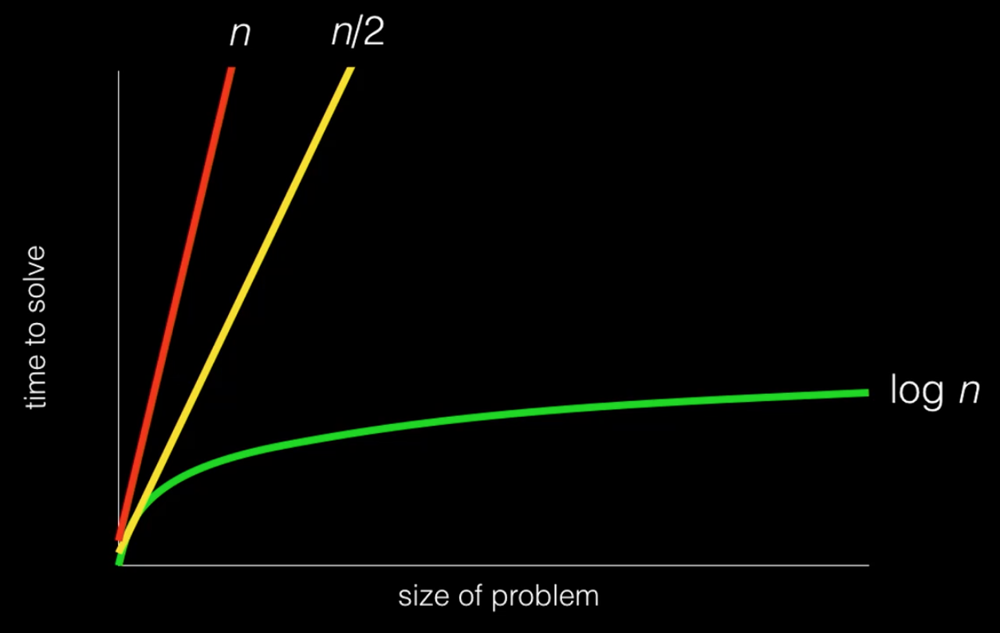

:author: Cheng Gong

= Week 0

[t=0m0s]
== This is CS50.

* David tells his own story of shopping CS50 long ago during his sophomore fall and taking it pass/fail, only find out how empowering the field of Computer Science was and how it intersects with the humanities, arts, and other sciences.
* 73% of CS50 students have never taken a CS course before, so rest assured that you are not alone, especially if you have no prior experience in CS.
* "what ultimately matters in this course is not so much where you end up relative to your classmates but where you, in *Week 11*, end up relative to yourself in *Week 0*"
* At the end of the day, computer science is about problem solving: taking some inputs (the problem we might be trying to solve) and creating some outputs (perhaps a solution to the problem).
* Between those inputs and outputs is what we might call a "black box," something that solves the problem for us even if we might not know or care _how_ it solves them.
* The inputs and outputs for a computer, for example, are just electricity (from a plug or battery) and changes on its screen.
* But let's think about how we might represent information. If David wanted to count the number of students, he might use his fingers (and quickly run out), or use tally marks:
+
image::tally_marks.png[alt="Tally marks", width=300]
* This is called *unary*, where there is one symbol and you simply add another one for each thing you're counting.
* Computers use a similar system called *binary*, where there are two symbols, 0 and 1. Humans typically use the *decimal* system, with the digits 0-9.
* In decimal, `123` is one hundred and twenty-three. And if we think way back to grade school, that's because each column has a place value, and we add them up like so:
+
[source, subs=quotes]
----
    100         10          1

      *1*          *2*          *3*

100 x 1     10 x 2      1 x 3
----
* Binary represents numbers in the same pattern, but using powers of 2 instead of powers of 10 that decimal uses. The first row shows the value of each column, like the 100, 10, and 1 above, and the second row is our current binary number.
+
[source, subs=quotes]
----
      4          2          1

      *0*          *0*          *0*
----
* To represent a 1, we simply place a `1` in the ones column:
+
[source, subs=quotes]
----
      4          2          1

      *0*          *0*          *1*

            1 x 1
----
* And a 2 like so:
+
[source, subs=quotes]
----
      4          2          1

      *0*          *1*          *0*

             2 x 1
----
* And a 3 by combining the previous two steps:
+
[source, subs=quotes]
----
      4          2          1

      *0*          *1*          *1*

             2 x 1      1 x 1
----
* We can continue this pattern:
+
[source, subs=quotes]
----
      4          2          1

      *1*          *0*          *0*

  4 x 1
----
+
[source, subs=quotes]
----
      4          2          1

      *1*          *0*          *1*

  4 x 1                 1 x 1
----
+
[source, subs=quotes]
----
      4          2          1

      *1*          *1*          *0*

  4 x 1      2 x 1
----
+
[source, subs=quotes]
----
      4          2          1

      *1*          *1*          *1*

  4 x 1      2 x 1      1 x 1
----
* But once we have used up all the places, we need more *bits*, or binary digit, which stores a `0` or `1`. With additional digits, we can represent larger numbers.
* So our computer has many many switches (called transistors) that can be turned on or off given electricity, and a switch that is on will represent a 1 and a switch that is off will represent a 0.
* Eight bits, by the way, is called a *byte*.
* So far we've represented numbers, but we also know that computers can represent letters of the alphabet. Some years ago the world decided on a standard mapping of numbers to letters, called http://en.wikipedia.org/wiki/ASCII[*ASCII*].
* In ASCII, the letter `A` is the decimal number 65, `B` 66, `C` 77, and so on. And lowercase letters are another set of numbers. Numbers, too, that you type, would be represented as different numbers according to the table.
* We can also represent colors using a system called https://en.wikipedia.org/wiki/RGB_color_model[*RGB*], where three values that each represent the amount of red, green, and blue, mixing together to represent some color.
* And computer screens, if you lean in really close, are made up of lots and lots of dots, or *pixels*, each with some RGB value that together form a picture or text.
* And with lots of images, one after another, we get videos.
* Now that we can represent inputs and outputs, we can start solving problems.

[t=1m0s]
== Algorithms

* *Algorithms* are sets of instructions to solve particular problems.
* If David wanted to take attendance (for real this time), he could start counting people one at a time. He could count two people at once, and that would be a little faster.
* But we can use everyone in the room to help, by following these steps:
[source, pseudocode]
----
0   Stand up and think of the number 1
1   Pair off with someone standing.
    Add your numbers together.
2   One of you should sit down.
    If you're still standing, go back to step 1.
----
* At the end, our count from this was 546, but the TFs counted 820 students in Sanders. So perhaps there were bugs with the execution of this algorithm!
* Let's move on to another problem. Say we have a large phone book, with thousands of pages. We might be looking for someone, say, Mike Smith. We could open the book to the first page, and the second, and the third, and continue looking like this until we find him. This algorithm is correct, since we will eventually find him, but it's not very fast.
* We can flip two pages at a time, and it is twice as fast as the previous algorithm, but it's possible that we might miss him if he is on an odd page.
* We can go straight to the middle, and find ourselves in the M section, and know that Mike Smith is in the right half of the book, and throw the left half away. We can repeat this again and again, and eventually find one page. With 1000 pages, it would only take about 10 steps of division to reach that one page.
* These are the steps we might follow:
+
[source, pseudocode, numbered]
----
 0   pick up phone book
 1   open to middle of phone book
 2   look at names
 3   if Smith is among names
 4       call Mike
 5   else if Smith is earlier in book
 6       open to middle of left half of book
 7       go back to step 2
 8   else if "Smith" is later in book
 9       open to middle of right half of book
10       go back to step 2
11   else
12       quit
----
* Some of these lines are actions we might take, like `pick up` or `open to` or `look at` or `call`. We'll call these functions.
* `if`, `else if`, and `else` are leading to branches, or decision points, based on whether or not the expression, like `Smith is among names`, is true.
* These expressions are called Boolean expressions (named after someone with the last name Bool), and can either be true or false.
* We also have lines like `go back to step 2` that induce a loop, where there is a cycle that does something over and over again.
* So we can also look at how efficient this algorithm is. The x-axis is the size of the problem, and the y-axis is the time to solve. With `n` as the size of the problem, the red line represents the first algorithm in which time to solve increases with the size of the problem:
+

** The yellow line is the second algorithm, which, though twice as fast, still increases linearly with the size of the problem.
** The green line will have a *logarithmic slope* that doesn't increase in height as much as the other lines. With the phone book, even if the size of the phone book doubled, it would only take one more step to solve the problem.
** In fact, even if the phone book were 4 billion pages long, we would only need to divide it 32 times before we had just one page left.
* A good algorithm will solve a problem correctly and efficiently.

[t=2m0s]
== About CS50

* To read more in-depth about what changes we've introduced to CS50 this fall, visit http://cs50.ly/new[cs50.ly/new].
* We'll summarize some major changes:
** The only lectures you need to attend are the first and last. The rest will be recorded as the course goes on, to incorporate current events. The schedule has been posted on the course website.
** Walkthroughs will be held on Wednesdays at 1pm, where David and head TFs will offer some guidance to that week's problem set. The same information will also be recorded and included in the problem sets themselves.
** Problem sets will be released on Fridays and due 10 days later on Mondays at noon, to allow more flexibility.
** We'll start the semester with Scratch, then C, then Python, among others.
* Here are some statistics from Fall 2015 regarding the average number of hours spent on problem sets:
+
image::problem_sets.png[]
* There's definitely variance to the hours students spend on problem sets, but we do encourage students to take CS50 as a first year and with other courses, as we believe we have a support structure for students more and less comfortable alike.
* Sections, too, have different tracks for students more comfortable, less comfortable, and in between, held Mondays, Tuesdays, and Wednesdays with our amazing teaching staff.
* Office hours will be every day, with a schedule that will also be posted online.
* Maria, Walter, and Doug introduce themselves as the Head TF, Head CA, and Preceptor.
* Rob and Zamyla also introduce themselves as senior members on staff.
* This coming Saturday is an event we've held for a few years, CS50 Puzzle Day, where no knowledge about computer science is needed to solve puzzles in teams for exciting prizes.
* CS50 Lunches are also held on Fridays, where friends from industry talk about
* This year we'll also have the CS50 Coding Contest, where teams will be competing against each other online with just the skills we learn from the course.
* The CS50 Hackathon is an overnight event at the end of the semester where everyone works to finish (or start) their final projects.
* And a few days later is the CS50 Fair, an epic display of those final projects and how far students with no prior CS experience have come after just one semester.
* We watch a video of staff talk about how excited they are for students to take CS50 and learn from the course!
