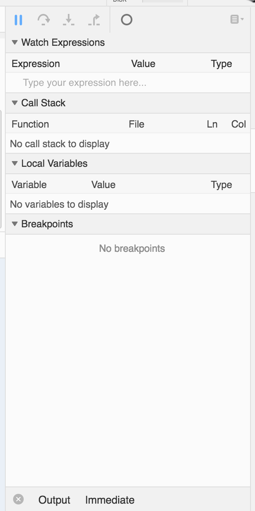
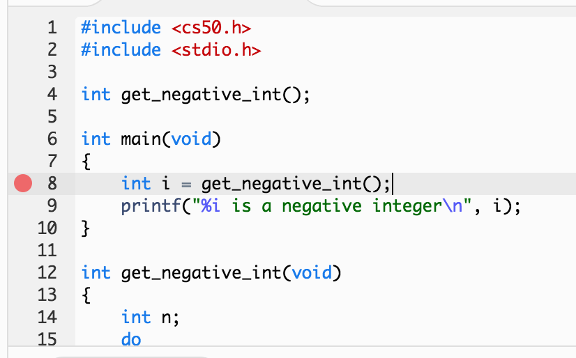
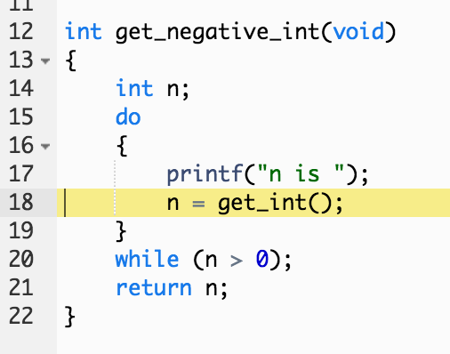

:author: Cheng Gong

= Week 2

[t=0m0s]
== Last Time

* We introduced programming with Scratch, and last week we learned a little bit of C, a textual language.
* Our first, simple program just printed out `hello, world`:
+
[source, c]
----
#include <stdio.h>

int main(void)
{
    printf("hello, world\n");
}
----
** But there was lots of magic going on, and by introducing Scratch first we were able to learn the important concepts first.
** The extra syntax is a common source of frustration and errors, so today we'll talk a little bit about how to solve those problems.
* We also learned to use CS50 IDE.
* And concepts like:
** functions
** loops
** variables
** Boolean expressions
** conditions
* And functions in C like `printf`, but really in essence they had analogies in Scratch, like the purple `say` block.
* We learned to include the CS50 library, with helpful functions like:
** `get_char`
** `get_double`
** `get_float`
** `get_int`
** `get_long_long`
** `get_string`
** ...
* And data types like:
** `bool`
** `char`
** `double`
** `float`
** `int`
** `long long`
** `string`
** ...
* We also ran into some limits of computing, like integer overflow or float imprecision, which could have severe real-world impact.

[t=1m0s]
== Debugging

* Commonly, errors come from our compiler, `make` or `clang`, as we'll demonstrate:
+
[source, c]
----
int main(void)
{
    printf("hello, world\n");
}
----
** When we try to compile just this, we get an error that looks like:
+
[source]
----
~/workspace/ $ make buggy0
clang -ggdb3 -O0 -std=c11 -Wall -Werror -Wshadow    buggy0.c  -lcs50 -lm -o buggy0
buggy0.c:3:5: error: implicitly declaring library function 'printf' with type 'int (const char *, ...)' [-Werror]
    printf("hello, world\n");
    ^
buggy0.c:3:5: note: include the header <stdio.h> or explicitly provide a declaration for 'printf'
1 error generated.
make: *** [buggy0] Error 1
----
** The first line under our command that starts with `clang` is normal, and just what `make` is doing for us.
** The next line tells us, in the file `buggy0.c`, line `3`, character `5`, there is an error. We are implicitly declaring a library function 'printf' ... and we might not understand the entire message or every part of it, but we can guess at what parts mean. Declaring a function is like mentioning it or defining it, and recall last time we had to declare a function's prototype before we could use it.
** Since we didn't write `printf`, we shouldn't try to write it ourselves, but rather include the library file that has the implementation, with `#include <stdio.h>` in the first line. (Indeed, the last line of the error tells us as much!)
* Now if we `make` our new file, everything should work.
+
[source, c]
----
#include <stdio.h>

int main(void)
{
    printf("hello, world\n");
}
----
* The first problem set introduced you to `help50`, a command written by staff which will help explain some errors that you still don't understand.
* Now let's try another buggy program:
+
[source, c]
----
#include <stdio.h>

int main(void)
{
    string s = get_string();
    printf("hello, %s\n", s);
}
----
** Oh boy, trying to `make` that resulted in `7 errors generated`. But scrolling up a little and fixing the first one first is generally a good idea. We see:
+
[source]
----
buggy0.c:5:5: error: use of undeclared identifier 'string'; did you mean 'stdin'?
    string s = get_string();
    ^~~~~~
    stdin
----
** We definitely meant to say `string`, so why is the compiler a little confused? Well, `string` and `get_string()` both come from the CS50 library, so we need to `#include` that too.
* Now let's try to print a `#` 10 times:
+
[source, c]
----
#include <stdio.h>

int main(void)
{
    for (int i = 0; i <= 10; i++)
    {
        printf("#\n");
    }
}
----
** Remember that a `for` loop like this one sets some variable to a starting count, checks to see whether we've reached the number of repeats, and then runs the code inside and adds to the counter.
* We can compile this without any issues, but when we run it, we see 11 `#` symbols, not 10 like we wanted.
* So let's include a new function from the CS50 Library, `eprintf`, that prints out errors (or anything we want to mark as special) to the screen:
+
[source, c]
----
#include <cs50.h>
#include <stdio.h>

int main(void)
{
    for (int i = 0; i <= 10; i++)
    {
        printf("#\n");
        eprintf("i is now %i\n", i);
    }
}
----
* Now we see a bunch of input:
+
[source]
----
~/workspace/ $ ./buggy0
#
buggy0:buggy0.c:9: i is now 0
#
buggy0:buggy0.c:9: i is now 1
#
buggy0:buggy0.c:9: i is now 2
#
buggy0:buggy0.c:9: i is now 3
#
buggy0:buggy0.c:9: i is now 4
#
buggy0:buggy0.c:9: i is now 5
#
buggy0:buggy0.c:9: i is now 6
#
buggy0:buggy0.c:9: i is now 7
#
buggy0:buggy0.c:9: i is now 8
#
buggy0:buggy0.c:9: i is now 9
#
buggy0:buggy0.c:9: i is now 10
----
** So it seems like `eprintf` is telling us the name of our program, the name of the file it's from, and the line number it's on.
** Hm, between 0 and 10, there are actually 11 numbers since we started at 0. So we could change our loop to stop before 10 with `i < 10`, or start with `int i = 1`. But conventionally, we like to start counting at the lowest number, 0, and stop before we reach the number of repeats we want.
** So now we can fix our error, remove the `eprintf`, and call this program done.
* Let's try one more:
+
[source, c]
----
#include <cs50.h>
#include <stdio.h>

int get_negative_int();

int main(void)
{
    int i = get_negative_int();
    printf("%i is a negative integer\n", i);
}

int get_negative_int(void)
{
    int n;
    do
    {
        printf("n is ");
        n = get_int();
    }
    while (n > 0);
    return n;
}
----
** A lot going on here, but we can figure it out. Inside `get_negative_int`, we create a new variable `n`, and get an int from the user while `n > 0`. Then we return it.
** `get_negative_int()` has `void` inside its parentheses, since it doesn't take any arguments, but it has an `int` in front, since that's the type of data we get back from it.
** Our program compiles, so we probably have a logical error. Let's run it and try a few numbers:
+
[source]
----
~/workspace/ $ ./buggy3
n is 1
n is 2
n is 3
n is 50
n is -50
-50 is a negative integer
~/workspace/ $ ./buggy3
n is -1
-1 is a negative integer
~/workspace/ $ ./buggy3
n is -2
-2 is a negative integer
~/workspace/ $ ./buggy3
n is 0
0 is a negative integer
----
** Hmm, it seems to work except for that very last case. Well, we could look at our code to try and figure out where that error happens, but once our program gets more complex we'll need some better tools too.
** We can use another CS50 tool called `debug50`, which lets us run our program step by step, line by line, and look at what's happening.
* Let's run:
+
[source]
----
~/workspace/ $ debug50 ./buggy3
n is
----
** A panel just popped up to the right, with a lot going on:
+

* But if we type in a number for our program, it seems to do the normal thing and tell us it's exiting:
+
[source]
----
~/workspace/ $ debug50 ./buggy3
n is -1
-1 is a negative integer

Child exited with status 0
GDBserver exiting

~/workspace/ $
----
** This really just means that our program finished and so the debugger will stop running, too.
* So we can click in the extra space next to a line, and a red dot will appear, which will tell the debugger to pause the program:
+

* Now as soon as we run the same command, we'll stop at that line and the debugger will tell us about our variables:
+
image::variables.png[alt="Variables", width=300]
* So now let's click the button next to the blue triangle at the top (which reads `Step Over` if you hover over it), which runs this line.
* And now in our terminal we'll see the prompt, and if we type in `-1` to the prompt again, we'll see that our variable has changed in the debugger. We'll also see the line we're on under `Call Stack` in the debugger, and if we press the Step Over button again, we'll see our `-1` printed out. Finally, if we press Step Over one last time (on the ending brace for `main` in our program), everything is complete and exits like before.
* Let's run it again with the same command, but this time instead of clicking `Step Over`, we'll click the button next to it (that looks like an arrow pointing downwards), and `Step Into` the function.
* And all of a sudden we'll jump to the first statement (the others are declaring variables and constructs, but not doing anything) in our `get_negative_int` function:
+

** We'll put in a number, `0`, and press `Step Over` since the next line is just `get_int` which we know works.
** But now we're on the last line, `return n;`, instead of inside the loop like we'd otherwise want. (Remember the whole point of all this was to get a negative number!)
** So we see that our variable `n` is `0`, and the condition was `while (n > 0)`.
** Since `0` isn't greater than `0`, the loop doesn't continue, and we aren't asked for another number.
** So all we need was to change the condition to `while (n >= 0)`, and now our program should work correctly.
* There's another, less technical way to debug called rubber duck debugging. When a programmer is working alone, it's a useful technique for them to imagine having a toy rubber duck, and explaining their code to the rubber duck. Sometimes, hearing ourselves give an explanation out loud can be useful in realizing where our errors might be!
* And if that doesn't work out, CS50 has a whole support staff ready to help!

[t=2m0s]
== Things to Know

* CS50 Problem Sets are evaluated on 4 axes, scope, correctness, design, and style.
** Scope is the amount of the problem set you've attempted.
** Correctness is whether your program works as it's supposed to.
** Design is how well written your program is, based on qualities like efficiency and duplicated code, etc.
** Style is how well-formatted your code is, where your indents are the same and your variables have appropriate names.
* Each of these axes will have a grade ranging from 1 to 5, and there's no need to worry about scores of 3s, with some 2s and 4s, in the beginning, since you'll have lots of room to grow and improve over the semester.
* The axes are also weighted with the following formula:
** scope x (correctness x 3 + design x 2 + style x 1)
* CS50 also takes academic honesty very seriously, and over years there's been a small, but significant fraction of students who have been involved in issues. Since we have the technological ability to compare all submissions to problem sets to each other, and past years, and any sources online, we tend to catch more cases than other courses.
* Our policy can be shortened to just "Be reasonable." And more descriptively, "The essence of all work you submit to this course must be your own."
* We're happy to allow classmates, TFs, friends to help you, but "... when asking for help, you may show your code to others, but you may not view theirs ..."
* This is explained more in the syllabus, and if you still have questions, please reach out to David or our head TFs for guidance!
* We also have a regret clause, "If you commit some act that is not reasonable but bring it to the attention of the course's heads within 72 hours, the course may impose local sanctions that may include an unsatisfactory or failing grade for work submitted, but the course will not refer the matter for further disciplinary action except in cases of repeated acts."

[t=3m0s]
== Cryptography

* Now we dive into our first real-world application, crytography, or the ability to send and receive secret (encrypted) messages.
* We watch a short clip from the movie A Christmas Story, where a child, Ralphie,  excitedly decodes a secret message from the radio with a ring that maps letters to other letters, only to find that it is just an advertisement for Ovaltine, a beverage popular many years ago.
* A method like that can be categorized as secret-key cryptography, where the sender and the receiver know some secret value, code, or phrase that can be used to encrypt and decrypt information.
* Cryptography can also be reduced to an algorithm that takes inputs and produces outputs.
* Inputs are the key and plaintext, or the message in unencrypted form that anyone can read, and the output is the ciphertext, or the encrypted message that only someone with the key can decrypt, or unscramble.
* So let's start by figuring out what a `string` really is. It's a sequence of characters, in an array (a list of things right next to each other) in memory.
* If we wanted to store Zamyla's name, `Zamyla`, we'd put each character in a box:
+
[source]
----
-------------------------
| Z | a | m | y | l | a |
-------------------------
----
* And this is important beacause we want to change one character at a time, say `A` to `B` and `B` to `C`.
* We can see this in action with the following program:
+
[source, c]
----
#include <cs50.h>
#include <stdio.h>
#include <string.h>

int main(void)
{
    string s = get_string();
    for (int i = 0; i < strlen(s); i++)
    {
        printf("%c\n", s[i]);
    }
}
----
** First, we include a new library, `string.h`, that includes functions to help us work with strings. Then we get a string `s` from the user, and for the length of the string, `strlen(s)`, we print out a character, whatever `s[i]` is. And `s[i]` is just the notation to get whatever is in that position of an array. So the loop will start with `i` set to `0`, meaning we get `s[0]`, the first character in the string, then `s[1]`, then `s[2]`, and so on, until each character of the string is printed out:
+
[source]
----
Z
a
m
y
l
a
----
* But what happens if, say, a user types in a really really long string or does something that causes an error? Well, `get_string()`, and certain other functions in C, can return a special value called `NULL`. And so to be safe, it's good practice to check that `s` is not `NULL` before we try to do something with it:
+
[source, c]
----
#include <cs50.h>
#include <stdio.h>
#include <string.h>

int main(void)
{
    string s = get_string();
    if (s != NULL)
    {
        for (int i = 0; i < strlen(s); i++)
        {
            printf("%c\n", s[i]);
        }
    }
}
----
** A `!=` means "not equal to" in C, and `get_string` can either return a string value or `NULL`, so we can proceed if `s != NULL` since it has to be a string value if it isn't `NULL`.
* So now our program, if we just wanted it to print each character on a line, would be correct. But how might we improve the design? Well, recall that a `for` loop first initializes a value, checks a condition, and after each iteration, increments the value. So on each pass of the loop, we're checking if `i < strlen(s)`. But `strlen()` is a function that we call, passing it `s` as an argument, and using the value it returns to compare with `i`. Each time, we're calculating the length of the string even though we don't have to. A better solution might look like this:
+
[source, c]
----
#include <cs50.h>
#include <stdio.h>
#include <string.h>

int main(void)
{
    string s = get_string();
    if (s != NULL)
    {
        for (int i = 0, n = strlen(s); i < n; i++)
        {
            printf("%c\n", s[i]);
        }
    }
}
----
** This is a little fancier, but we're just setting another variable, `n`, to the length of `s` at the beginning, and now we compare two numbers each time and not have to recalculate the length of the string.
* For style, our variable names are short, since we only have a few of them. We could comment our code:
+
[source, c]
----
#include <cs50.h>
#include <stdio.h>
#include <string.h>

int main(void)
{
    // ask user for input
    string s = get_string();

    // make sure get_string returned a string
    if (s != NULL)
    {
        // iterate over the characters in s one at a time
        for (int i = 0, n = strlen(s); i < n; i++)
        {
            // print i'th character in s
            printf("%c\n", s[i]);
        }
    }
}
----
** We explain the more interesting lines of our code in words. The `//` at the beginning of a line marks it as a comment, which means the compiler will ignore it. But now the code is understandable to humans.
* In C, there's another feature called `typecasting` that lets you convert one type of data to another. Characters are stored in memory as binary numbers, so we can convert them back and forth.
* Remember that ASCII is a standard for mapping characters to letters. Here are some sample ones:
+
[source]
----
A   B   C   D   E   F   G   H   I  ...
65  66  67  68  69  70  71  72  73  ...

a   b   c   d   e   f   g   h   i   ...
97  98  99  100 101 102 103 104 105 ...
----
* We can experiment with this program:
+
[source, c]
----
#include <stdio.h>

int main(void)
{
    for (int i = 65; i < 65 + 26; i++)
    {
        printf("%c is %i\n", (char) i, i);
    }
}
----
** We print out `i` as a character by typecasting it, using `(char) i` to tell our program to treat `i` as a character.
* Now if we compile and run our program, we get:
+
[source]
----
A is 65
B is 66
C is 67
...
Z is 90
----
* But we can actually just say `printf("%c is %i\n", i, i);`, and `i` will be printed out as a character too, since `printf` knows `%c` means that `i` should be formatted as a character.
* But wait, if we can treat numbers like characters, we can also treat characters like numbers:
+
[source, c]
----
#include <stdio.h>

int main(void)
{
    for (char c = 'A'; c <= 'Z'; c++)
    {
        printf("%c is %i\n", c, c);
    }
}
----
** Now we're using `c` like we would an integer `i`, and this iterates through all the capital letters like before. And since characters have an integer value due to ASCII, we can compare them to each other.
* There's another pattern with ASCII characters: a lowercase letter has a value exactly 32 higher than the same letter in uppercase.
* Maybe we can apply this:
+
[source, c]
----
#include <cs50.h>
#include <stdio.h>
#include <string.h>

int main(void)
{
    string s = get_string();
    if (s != NULL)
    {
        for (int i = 0, n = strlen(s); i < n; i++)
        {
            if (s[i] >= 'a' && s[i] <= 'z')
            {
                printf("%c", s[i] - ('a' - 'A'));
            }
            else
            {
                printf("%c", s[i]);
            }
        }
        printf("\n");
    }
}
----
** The first few lines we're familiar with already, where we're getting a string from the user, and iterating over each character of the string.
** Inside the loop, for each character, if the character is between `a` and `z` inclusive, which means if it's lowercase, we print out `s[i] - ('a' - 'A')`, which is the character minus the difference between a lowercase letter and an uppercase letter. Which makes it uppercase! (We could have also just used `32`, but it's more understandable to show where we got that value from.)
** Otherwise, if it's not a lowercase value, we just print it out.
* But we could even use a function that comes with C, `toupper`, in the library `ctype.h` (and we'd discover it through looking around reference books or online):
+
[source, c]
----
#include <cs50.h>
#include <ctype.h>
#include <stdio.h>
#include <string.h>

int main(void)
{
    string s = get_string();
    if (s != NULL)
    {
        for (int i = 0, n = strlen(s); i < n; i++)
        {
            if (islower(s[i]))
            {
                printf("%c", toupper(s[i]));
            }
            else
            {
                printf("%c", s[i]);
            }
        }
        printf("\n");
    }
}
----
* And in fact, `toupper` only changes lowercase letters to uppercase, so we can really just:
+
[source, c]
----
#include <cs50.h>
#include <ctype.h>
#include <stdio.h>
#include <string.h>

int main(void)
{
    string s = get_string();
    if (s != NULL)
    {
        for (int i = 0, n = strlen(s); i < n; i++)
        {
            printf("%c", toupper(s[i]));
        }
        printf("\n");
    }
}
----
** We can use the command `man toupper` in our terminal to read about functions or  commands, like `man strlen` or `man printf`. We can use our arrow keys to scroll up and down (it's pretty old school), and `q` to quit.
** And even if `toupper` didn't come with C, it would have been better design for us to implement it as a separate function, since our `main` function is much easier to understand now.
* Let's go even further in exploring strings by trying to implement a different function, `strlen`, ourselves:
+
[source, c]
----
#include <cs50.h>
#include <stdio.h>

int main(void)
{
    string s = get_string();
    int n = 0;
    while (s[n] != '\0')
    {
        n++;
    }
    printf("%i\n", n);
}
----
** We'll get a string as usual, and create a variable `n` to store some number. We'll start it at `0`, and while `s[n]`, the character at that index in `s`, isn't something called `\0`, we'll increase `n`.
** But why does this work? Turns out, strings are stored with a character at the end marking the end of a string, since there's no predetermined length, so a string in memory really looks like:
+
[source]
----
------------------------------
| Z | a | m | y | l | a | \0 |
------------------------------
----
* We can represent more of our computer's memory as a grid:
+
[source]
----
-----------------------------------
| Z | a | m | y  | l | a | \0 | A |
-----------------------------------
| n | d | i | \0 |   |   |    |   |
-----------------------------------
|   |   |   |    |   |   |    |   |
-----------------------------------
|   |   |   |    |   |   |    |   |
-----------------------------------
----
** We can imagine each byte (each box in this grid) of memory as labeled from `0` to `31`, since there are 32 bytes total. And to keep track of where strings start, we can simply remember the start of our string in memory, in the case of `Zamyla`, `0`, and `Andi`, `7`. Indeed, a string in C is just the location of the first character in memory.
** And with `\0`, C indicates the end of our string.
* Integers, and other data types, too, are stored in the same way in memory, even if they take up more bytes.
* Once we understand that data is just bytes in memory, we can manipulate all of it and can do everything by writing a program.
* And https://reference.cs50.net has lots of useful information too, about functions that come with C.

[t=4m0s]
== Command-Line Arguments

* Let's use what we've learned to dig deeper into command-line arguments.
* So far, we've used `int main(void)` to start our programs. The `void` keyword in particular is indicating that our program takes no arguments.
* But what if we want to write programs that take input from the command line, or words after the program name when we run it in the terminal? For example, we might run `make hello` or `make cough0`, and the second word there is an argument to our program `hello`.
* It turns out, we can start our program with this: `int main(int argc, string argv[])` and it will receive those command-line arguments.
* Now our program will receive two arguments. The first is an integer named `argc`, as in argument count, that tells us how many arguments we got. The second is an array, or list, of strings, called `argv`, as in argument vector. This list of strings can be accessed with the same syntax as we do for characters in a string (since a string is just an array of characters), like `argv[0]`.
* Let's see this in action:
+
[source, c]
----
#include <cs50.h>
#include <stdio.h>

int main(int argc, string argv[])
{
    if (argc == 2)
    {
        printf("hello, %s\n", argv[1]);
    }
    else
    {
        printf("hello, world\n");
    }
}
----
** This program, when we run it, will return something like the following if we give it a command-line argument:
+
[source]
----
~/workspace/ $ ./argv0 hello
hello, hello
----
** We used `argv[1]` because `argv[0]` is always the name of the program itself.
** When we run just `./argv0`, `argc` passed to our program will be `1`, so it will just say `hello, world`.
* Let's do this, to see how we can iterate over an array:
+
[source, c]
----
#include <cs50.h>
#include <stdio.h>

int main(int argc, string argv[])
{
    for (int i = 0; i < argc; i++)
    {
        printf("%s\n", argv[i]);
    }
}
----
** This program prints out each argument, or each string in `argv`, as it goes through the indexes from `0` to `argc`, which tells us how many strings are in `argv`.
* We can be even cooler. Since we know `argv` is an array of strings and each string is an array of characters, we can directly access characters from `argv`:
+
[source, c]
----
#include <cs50.h>
#include <stdio.h>
#include <string.h>

int main(int argc, string argv[])
{
    // iterate over strings in argv
    for (int i = 0; i < argc; i++)
    {
        // iterate over characters in current string
        for (int j = 0, n = strlen(argv[i]); j < n; j++)
        {
            // print j'th character in i'th string
            printf("%c\n", argv[i][j]);
        }
        printf("\n");
    }
}
----
** The outer `for` loop, with `i`, is iterating over each string in `argv`.
** The inner `for` loop, with `j`, looks at `argv[i]`, and for each character in it, prints it on a new line.
** Then the inner loop repeats for the next string.
** With `argv[i][j]` we can get an individual character in `argv`.
* So what about ``main``'s output? It turns out, `main` also returns some value by default. When a program exits successfully, it returns a number `0` to indicate as much. A non-zero number, on the other hand, is used to represent an error.
* Of course, we want to see this firsthand:
+
[source, c]
----
#include <cs50.h>
#include <stdio.h>

int main(int argc, string argv[])
{
    if (argc != 2)
    {
        printf("missing command-line argument\n");
        return 1;
    }
    printf("hello, %s\n", argv[1]);
    return 0;
}
----
** Now, if the program doesn't get a command-line argument, the program will quit by returning, and with the value `1`.
** Otherwise, we'll print the argument and explicitly return the value `0` as we exit.
* We can see the exit code in terminal like this:
+
[source]
----
~/workspace/ $ ./exit
missing command-line argument
~/workspace/ $ echo $?
1
----
** `$?` is a magic symbol for the previous program's exit code, and `echo` is a command-line program that just prints out values.
** We might not look for this often, but debuggers and other programs might look for it to determine if there were any errors.
* Don't forget, an array is a chunk of continuous memory, with each of the elements inside contiguous, back-to-back-to-back. And those elements are generally the same data type, as we commonly have arrays of characters or integers. We'll need this construct to solve more complex problems, like sorting and searching.
* Phew, what an exciting day! More fun to come next week!
