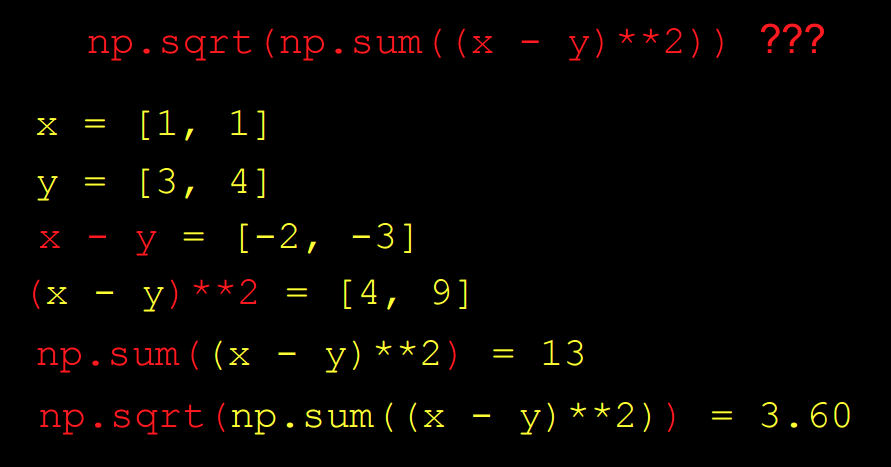
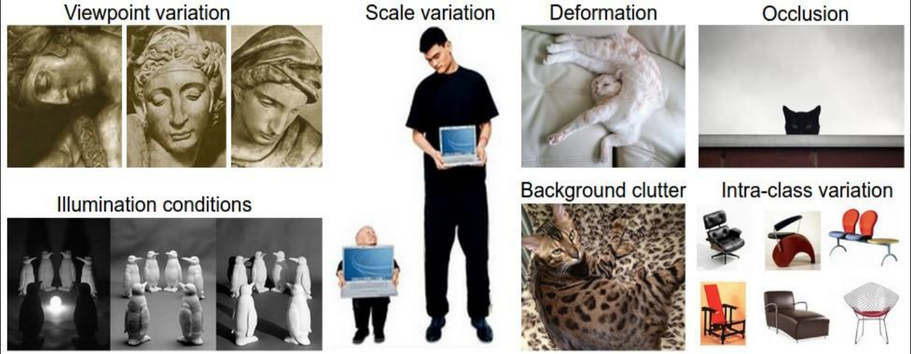
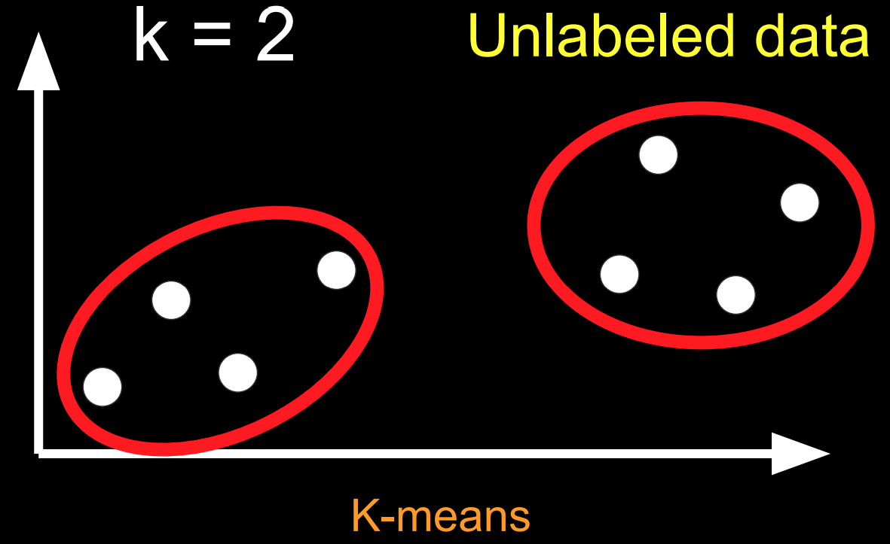
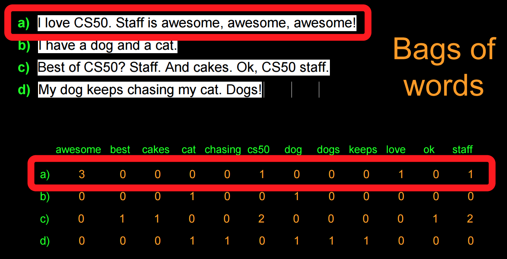
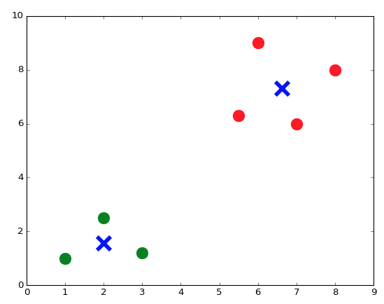
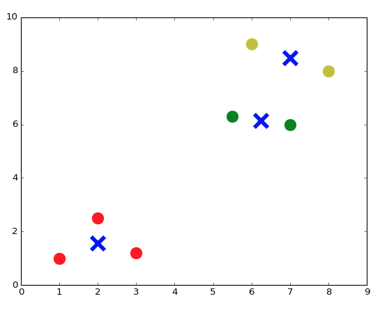

:author: Cheng Gong

= Week 7

[t=0m0s]
== Introduction to Machine Learning

* This lecture will bridge the first part of the course, where we learn about low-level languages, and the second part, where we use higher-level programming languages.
* Python, for example, can be used to write the back-end of a web server that takes requests, talks to a database, and return a response to a user.
* Today we'll use Python as a tool for data analysis, in the context of machine learning.
* As the following image jokingly depicts, there are various conceptions of what programmers working on machine learning do:
+
image::machine_learning.png[alt="Machine learning conceptions", width=600]
** It is accurate, though, that they do spend most of their time using Python and importing packages to help them analyze data.
** We can read that line already, and guess that `sklearn` is a module, or library, `from` which we are ``import``ing some pieces of functionality called `svm`, even if we don't know what they actually do.
* Machine learning is often associated with AI, artificial intelligence, and especially robots in science fiction movies.
* But on a day-to-day basis, machine learning is applied to building search engines, image recognition, voice recognition, and natural language processing.
* And machine learning is really just referring to some algorithm that solves these problems.
* Recall that an algorithm takes some inputs and produces some outputs. For image recognition, we want to take in some images, and output text descriptions of what the image contains.
* For natural language processing, we might want to process an entire novel and output its themes or topics.
* In the past, we've done something similar in the Whodunit problem set, where a noisy image was filtered to get a hidden message.
* The main difference there was that we already knew that the noise was the red added, but in image recognition we don't have any information about its contents ahead of time.
* To help with this, we use something called training data. For example, we can provide many examples of images of horses to an algorithm, to increase its ability to recognize new images of horses, by comparing them.

[t=11m28s]
== Image Classification

* We can see this by starting with the following training data, aiming to create an algorithm that can recognize handwritten digits:
+
image::digit_classification.png[alt="Digit classification training data", width=600]
* Let's imagine a number line, with two groups of points:
+
[source]
----
<--•--•-•----------------•-•-•-->
   0  0 0                6 6 6
----
* We can think of this as training data, and if we were given a test point as follows, we'd guess it was a ``6``:
+
[source]
----
<--•--•-•--------------•-•-•-•-->
   0  0 0              ? 6 6 6
----
** The principle we used to guess this was that the new point was closest to the group of other ``6``s, and this algorithm is called the *nearest neighbor classifier*.
* We might even see points in two dimensions, and do the same:
+
image::2d_classification.png[alt="Digit classification in two dimensions.", width=600]
* The question now is how we might map images of digits to space, since from there we can find the nearest neighbors of test points to our training data points.
* Flatland is a story about a two-dimensional being, a Square, who visits Lineland and tries to convince the points inside that there are two dimensions, and then visits Spaceland to discover the existence of a third dimension. We watch https://vimeo.com/8675372[a trailer] of a movie based on this story.
* In our case, we live in a three-dimensional space, but we can similarly map points to spaces with even more dimensions.
* With an image of a digit, we can map the grayscale values of each pixel to a number, and each number to a dimension:
+
image::64_dimensional_space.png[alt="64 dimensional space", width=600]
* Now we can imagine that, with our nearest neighbor algorithm, we can plot all our training data as points, and, given a test point, we can find the training point with the closest distance.

[t=26m25s]
== Nearest Neighbors with Python

* We can open the CS50 IDE, and simply type `python` into our terminal to get an interpreter.
* From there, we can write simple commands:
+
[source]
----
>>> x = 3
>>> y = 5
>>> x + y
8
>>> x = 'a'
>>> y = ' b'
>>> x + y
'a b'
----
** In Python, we don't need to define the type of variables, or differentiate between single and double quotes.
* We also don't need a compiler, since the interpreter reads the code line by line and compiles and runs it for us in real time.
* We can write a simple `for` loop too:
+
[source]
----
>>> for i in [3, 5, 7]:
...   print(i)
...
3
5
7
----
** We have an array and can iterate over the items inside directly. And we also don't need curly braces, but use indentation instead to indicate the level of our code.
* For the rest of the lecture, we'll use something called an iPython notebook, which allows us to write lines of code and see their output, one chunk at a time:
+
image::python.png[alt="Basic Python", width=800]
* The process of training our algorithm earlier was called supervised learning. In supervised learning, we label some training data, some inputs, with expected outputs.
* We'll start by importing some modules, or libraries:
+
[source, python]
----
import numpy as np
import matplotlib.pyplot as plt
# Configure matplotlib to embed the plots in the output cells of the present notebook
%matplotlib notebook
----
* Since Python is a very popular language, it means that we get the benefit of having lots of libraries written for us that we can import.
* We'll start by creating some training data:
+
[source, python]
----
In [2]:
X_train = np.array([[1,1], [2,2.5], [3,1.2], [5.5,6.3], [6,9], [7,6]]) # Define numpy array of two-dim points
Y_train = ['red', 'red', 'red', 'blue', 'blue', 'blue'] # Define a Python built-in list (i.e., array) of strings
----
** `X_train` are the points, and `Y_train` are the labels for each point.
* We can think of `X_train` as a two dimensional array, and access elements within elements in the array:
+
[source, python]
----
In [3]:
print(X_train[5,0]) # Extract the 0th coordinate of the 5th point in the array
print(X_train[5,1]) # Extract the 1st coordinate of the 5th point in the array
7.0
6.0
----
** Notice that Python is a 0-indexed programming language, much like C.
* Python also has a slicing syntax that allows us to extract multiple elements in an array at once:
+
[source, python]
----
In [4]:
print(X_train[:, 0]) # Extract the 1st coordinate (indexed by 0) of all elements (:) in the array X_train
[ 1.   2.   3.   5.5  6.   7. ]
In [5]:
print(X_train[:, 1]) # Extract the 2nd coordinate (indexed by 1) of all elements (:) in the array X_train
[ 1.   2.5  1.2  6.3  9.   6. ]
----
* Now we can plot these points, with their colors as their labels:
+
[source, python]
----
plt.figure() # Define a new figure
plt.scatter(X_train[:,0], X_train[:,1], s = 170, color = Y_train[:]) # Plot points with Python slicing syntax
plt.show() # Display plot
----
+
image::points.png[alt="Plotted points", width=300]
** We can learn from documentation the parameters to pass into `plt.scatter`.
* Let's create and plot a test point:
+
[source, python]
----
X_test = np.array([3,4])
plt.figure() # Define a new figure
plt.scatter(X_train[:,0], X_train[:,1], s = 170, color = Y_train[:])
plt.scatter(X_test[0], X_test[1], s = 170, color = 'green')
plt.show() # Display plot
----
+
image::points2.png[alt="Plotted points 2", width=300]
** We specify that this point is `green`, since we don't know what its label should be.
* To run the Nearest Neighbor Classifier, we need to first define a distance function:
+
[source, python]
----
def dist(x, y):
    return np.sqrt(np.sum((x - y)**2)) # np.sqrt and np.sum are numpy functions to work with numpy arrays
----
** We know our points are in two dimensions, so we compute the distance by subtracting the values of each coordinate of two points `x` and `y`, square them, taking their sum, and then taking the square root:
+

* Now, for each point in our training data, we can compute its distance to the test point:
+
[source, python]
----
num = len(X_train) # Compute the number of points in X_train
distance = np.zeros(num) # Initialize a numpy arrays of zeros
for i in range(num):
    distance[i] = dist(X_train[i], X_test) # Compute distance from X_train[i] to X_test
print(distance)
[ 3.60555128  1.80277564  2.8         3.39705755  5.83095189  4.47213595]
----
** We get back an array of distances.
* Alternatively, we can use a "vectorization" syntax to apply a distance formula to arrays directly:
+
[source, python]
----
distance = np.sqrt(np.sum((X_train - X_test)**2, axis = 1)) # Vectorization syntax
print(distance)
[ 3.60555128  1.80277564  2.8         3.39705755  5.83095189  4.47213595]
----
* Now we can find the minimum distance, and the label for that point:
+
[source, python]
----
In [12]:
min_index = np.argmin(distance) # Get the index with smallest distance
print(Y_train[min_index])
red
----

[t=43m50s]
== Image Classification with Python

* Now we can apply these principles to recognizing digits.
* First, we import ``sklearn``, a Python module for machine learning. This module comes with a few standard datasets, such as the digits dataset.
+
[source, python]
----
In [13]:
from sklearn import datasets
digits = datasets.load_digits()
----
* The `digits` dataset contains 1797 images representing handwritten digits, together with numerical labels representing the true number associated with each image. `digits.images` is the array of images, while `digits.target` is the array of labels.
* Each element in the array `digits.images` is on its own a 8 by 8 array of pixels, where each pixel is an integer between 0 and 16. Let us look what the first image, indexed by 0, looks like:
+
[source, python]
----
In [14]:
print(digits.images[0])
[[  0.   0.   5.  13.   9.   1.   0.   0.]
 [  0.   0.  13.  15.  10.  15.   5.   0.]
 [  0.   3.  15.   2.   0.  11.   8.   0.]
 [  0.   4.  12.   0.   0.   8.   8.   0.]
 [  0.   5.   8.   0.   0.   9.   8.   0.]
 [  0.   4.  11.   0.   1.  12.   7.   0.]
 [  0.   2.  14.   5.  10.  12.   0.   0.]
 [  0.   0.   6.  13.  10.   0.   0.   0.]]
----
* Can you see that the above represents number zero? It is easier if we plot this array by assigning to each number an intensity of black:
+
[source, python]
----
plt.figure()
plt.imshow(digits.images[0], cmap = plt.cm.gray_r, interpolation = 'nearest')
plt.show()
----
+
image::zero.png[alt="Plotted zero", width=200]
* Each element in the array digits.target is a numerical label representing the digit associated to the respective image:
+
[source, python]
----
In [16]:
print(digits.target[0])
0
----
* We'll create a training set with just the first 10 digits:
+
[source, python]
----
X_train = digits.data[0:10]
Y_train = digits.target[0:10]
----
* Then we'll choose some test point:
+
[source, python]
----
X_test = digits.data[345]
----
* Now we use the same algorithm as before to find the nearest neighbor to this test point, out of all the points in the training data:
+
[source, python]
----
num = len(X_train) # Compute the number of points in X_train
distance = np.zeros(num) # Initialize an arrays of zeros
for i in range(num):
    distance[i] = dist(X_train[i], X_test) # Compute distance from X_train[i] to X_test
min_index = np.argmin(distance) # Get the index with smallest distance
print(Y_train[min_index])
3
----
* Indeed, the actual label for this image is `3`:
+
[source, python]
----
print(digits.target[min_index])
3
----
* We can write a small amount of code to test some more points:
+
[source, python]
----
num = len(X_train) # Get the length of our training data
no_errors = 0 # Keep track of the number of errors
distance = np.zeros(num) # Create an array the length of X_trains, filled with zeros
for j in range(1697, 1797):
    X_test = digits.data[j] # Test values in the range [1697, 1797)
    for i in range(num):
        distance[i] = dist(X_train[i], X_test) # Compute distance from X_train[i] to X_test
    min_index = np.argmin(distance) # Get the index of the minimum distance
    if Y_train[min_index] != digits.target[j]: # If the actual label is not the same as the nearest neighbor, add a count to the number of errors
        no_errors += 1
print(no_errors)
37
----
* So we have incurred in 37 errors out of 100 images in the test dataset! Not bad for a simple algorithm. But we can do much better if we enlarge the training set, as we now see.
* If we modify the last few steps to use 1000 images as training data, as opposed to 10, we'll only get 3 errors out of those 100 test images.

[t=52m02s]
== More Image Classification

* We can try the same algorithm on a dataset with thousands of images, each labeled with the subject (airplane, bird, cat, dog, etc). But it turns out that we only get ~30% correctness with a simple nearest neighbor classifier.
* For example, the digit 0 always appear in as 2D, in black and white. Images of subjects are in color, but can also be from different angles or viewpoints.
* Challenges to image recognition include the following:
+

* Image recognition algorithms can be improved by grouping pixels in an image into features, in a process called deep learning:
+
image::deep_learning.png[alt="Deep learning", width=300]
* A lot of computational power is needed for these algorithms, and libraries like https://www.tensorflow.org/[TensorFlow] help build programs that use machine learning to solve some problem.
* The http://deepdreamgenerator.com[Deep Dream Generator] also finds patterns in input images, and combines them together, so that we might get a photo mixed with the style of a painting.
* With deep learning, we can achieve about 95% accuracy with image recognition. But for applications like self-driving cars, that accuracy may not be enough.
* In a recent case, a Tesla with the Autopilot feature failed to recognize a white trailer truck against a brightly lit sky, causing a crash.s

[t=1h04m15s]
== Text Clustering

* We can also try to create an algorithm that takes in movie synopses, and groups them.
* We can imagine that dramas might be grouped together, and Disney animations in another.
* Now our data is unlabeled, so we'll be using unsupervised learning.
* More specifically, given a set of unlabeled points, our algorithm will group them into `k` groups, like so:
+

** This algorithm is called `k-means`, the details of which are beyond the scope of this class.
* But from a high-level, to do this with movie synopses, we need to convert a block of text into some point in space.
* One strategy is "bags of words," where we have some strings, and we mark the frequency in which each word appears:
+

* We can improve on this by using the fractional frequency of words in each string, to normalize the differences between shorter and longer strings:
+
image::frequency.png[alt="Frequency", width=600]
* Then, we can plot each string in __n__-dimensional space, and run our `k-means` algorithm to group them.
* We can demonstrate this by creating some points, plotting them with the same lines we saw before:
+
[source, python]
----
import numpy as np
import matplotlib.pyplot as plt
# To configure matplotlib to embed the plots in the output cells of the present notebook
%matplotlib notebook
In [26]:
X = np.array([[1,1], [2,2.5], [3,1.2], [5.5,6.3], [6,9], [7,6], [8,8]]) # Define numpy array of two-dim points
plt.figure()
plt.scatter(X[:,0], X[:,1], s = 170, color = 'black') # Plot points with slicing syntax X[:,0] and X[:,1]
plt.show()
----
+
image::points3.png[alt="Points 3", width=300]
* We can import the `k-means` algorithm from the `sklearn` module, run it, and plot the groups and their centers:
+
[source, python]
----
from sklearn.cluster import KMeans
k = 2 # Define the number of clusters in which we want to partion the data
kmeans = KMeans(n_clusters = k) # Run the algorithm kmeans
kmeans.fit(X);
centroids = kmeans.cluster_centers_ # Get centroid's coordinates for each cluster
labels = kmeans.labels_ # Get labels assigned to each data
k = 2 # Define the number of clusters in which we want to partion the data
kmeans = KMeans(n_clusters = k) # Run the algorithm kmeans
kmeans.fit(X);
centroids = kmeans.cluster_centers_ # Get centroid's coordinates for each cluster
labels = kmeans.labels_ # Get labels assigned to each data
colors = ['r.', 'g.'] # Define two colors for the plot below
plt.figure()
for i in range(len(X)):
    plt.plot(X[i,0], X[i,1], colors[labels[i]], markersize = 30)
plt.scatter(centroids[:,0],centroids[:,1], marker = "x", s = 300, linewidths = 5) # Plot centroids
plt.show()
----
+

* We can even specify 3 or 7 groups:
+

+

* Now we can try to cluster some text:
+
[source, python]
----
corpus = ['I love CS50. Staff is awesome, awesome, awesome!',
          'I have a dog and a cat.',
          'Best of CS50? Staff. And cakes. Ok, CS50 staff.',
          'My dog keeps chasing my cat. Dogs!'] # This represents a list of strings in Python
----
* We'll import another component from the `sklearn` library, and use it to create a dictionary as well as the counts of each word in each string:
+
[source, python]
----
# Create bags-of-words matrix
from sklearn.feature_extraction.text import CountVectorizer
count_vect = CountVectorizer(stop_words = 'english')
Z = count_vect.fit_transform(corpus)
# The function fit_transform() takes as input a list of strings and does two things:
# first, it "fits the model," i.e., it builds the vocabulary; second, it transforms the data into a matrix.
----
* We can look at the dictionary:
+
[source, python]
----
vocab = count_vect.get_feature_names()
print(vocab)
['awesome', 'best', 'cakes', 'cat', 'chasing', 'cs50', 'dog', 'dogs', 'keeps', 'love', 'ok', 'staff']
----
* And we can look at the bags-of-words matrix Z:
+
[source, python]
----
Z.todense() # Generate a dense matrix from Z, which is stored as a sparse matrix data-type
Out[35]:
matrix([[3, 0, 0, 0, 0, 1, 0, 0, 0, 1, 0, 1],
        [0, 0, 0, 1, 0, 0, 1, 0, 0, 0, 0, 0],
        [0, 1, 1, 0, 0, 2, 0, 0, 0, 0, 1, 2],
        [0, 0, 0, 1, 1, 0, 1, 1, 1, 0, 0, 0]], dtype=int64)
----
* But a normalized frequency of each word, weighted by its absolute frequency (since common words will give us less information about the grouping of strings) will be more accurate, so we'll use a `tfidf` (Term Frequency times Inverse Document Frequency) formula to get a final weighted matrix:
+
[source, python]
----
# Create tf–idf matrix
from sklearn.feature_extraction.text import TfidfVectorizer
vectorizer = TfidfVectorizer(stop_words = 'english')
X = vectorizer.fit_transform(corpus)
X.todense()
Out[37]:
matrix([[ 0.89469821,  0.        ,  0.        ,  0.        ,  0.        ,
          0.23513012,  0.        ,  0.        ,  0.        ,  0.29823274,
          0.        ,  0.23513012],
        [ 0.        ,  0.        ,  0.        ,  0.70710678,  0.        ,
          0.        ,  0.70710678,  0.        ,  0.        ,  0.        ,
          0.        ,  0.        ],
        [ 0.        ,  0.35415727,  0.35415727,  0.        ,  0.        ,
          0.55844332,  0.        ,  0.        ,  0.        ,  0.        ,
          0.35415727,  0.55844332],
        [ 0.        ,  0.        ,  0.        ,  0.38274272,  0.48546061,
          0.        ,  0.38274272,  0.48546061,  0.48546061,  0.        ,
          0.        ,  0.        ]])
----
* Now we can run our `k-means` algorithm, and show us what the top terms of each cluster are:
+
[source, python]
----
k = 2 # Define the number of clusters in which we want to partion THE data
# Define the proper notion of distance to deal with documents
from sklearn.metrics.pairwise import cosine_similarity
dist = 1 - cosine_similarity(X)
# Run the algorithm KMeans
model = KMeans(n_clusters = k)
model.fit(X);

print("Top terms per cluster:\n")
order_centroids = model.cluster_centers_.argsort()[:, ::-1]
terms = vectorizer.get_feature_names()
for i in range(k):
    print ("Cluster %i:" % i, end='')
    for ind in order_centroids[i, :3]:
        print (' %s,' % terms[ind], end='')
    print ("")
Top terms per cluster:

Cluster 0: awesome, staff, cs50,
Cluster 1: dog, cat, keeps,
----
* We can import movie synopses from IMDB for some movies into Python, and follow the same process:
+
[source, python]
----
# Import the data set into a Panda data frame
import pandas as pd
from io import StringIO
import requests

act = requests.get('https://docs.google.com/spreadsheets/d/1udJ4nd9EKlX_awB90JCbKaStuYh6aVjh1X6j8iBUXIU/export?format=csv')
dataact = act.content.decode('utf-8') # To convert to string for Stringio
frame = pd.read_csv(StringIO(dataact))
----
* We can see that the data in `frame` is our input texts:
+
[source, python]
----
print(frame)
                     Title                                           Synopsis
0       Mad Max: Fury Road  Max Rockatansky (Tom Hardy) explains in a voic...
1               The Matrix  The screen is filled with green, cascading cod...
2        The King's Speech  The film opens with Prince Albert, Duke of Yor...
3   No Country for Old Men  The film opens with a shot of desolate, wide-o...
4         A Beautiful Mind  John Nash (Russell Crowe) arrives at Princeton...
5                Inception  A young man, exhausted and delirious, washes u...
6                   Frozen  The Walt Disney Pictures logo and the movie ti...
7            The Lion King  The Lion King takes place in the Pride Lands o...
8                  Aladdin  The film starts with a street peddler, guiding...
9               Cinderella  The film opens in a tiny kingdom, and shows us...
10            Finding Nemo  Two clownfish, Marlin (Albert Brooks) and his ...
11               Toy Story  A boy called Andy Davis (voice: John Morris) u...
12              Robin Hood  Told with animals for it's cast, the story tel...
----
* Now we'll build strings of each synopsis, a `tfidf` matrix as before, and finally show the labels and top terms of each cluster:
+
[source, python]
----
# Loop over each synopsis and append its content to a list of string named 'corpus'
corpus = []
for i in range(0, frame["Synopsis"].size):
    corpus.append(frame["Synopsis"][i])
# Create tf–idf matrix
from sklearn.feature_extraction.text import TfidfVectorizer
vectorizer = TfidfVectorizer(stop_words = 'english', min_df = 0.2)
# min_df = 0.2 means that the term must be in at least 20% of the documents
X = vectorizer.fit_transform(corpus)

k = 2 # Define the number of clusters in which we want to partion our data
# Define the proper notion of distance to deal with documents
from sklearn.metrics.pairwise import cosine_similarity
dist = 1 - cosine_similarity(X)
# Run the algorithm kmeans
model = KMeans(n_clusters = k)
model.fit(X);

no_words = 4 # Number of words to print per cluster
order_centroids = model.cluster_centers_.argsort()[:, ::-1] # Sort cluster centers by proximity to centroid
terms = vectorizer.get_feature_names()
labels = model.labels_ # Get labels assigned to each data

print("Top terms per cluster:\n")
for i in range(k):

    print("Cluster %d movies:" % i, end='')
    for title in frame["Title"][labels == i]:
        print(' %s,' % title, end='')
    print() #add a whitespace

    print("Cluster %d words:" % i, end='')
    for ind in order_centroids[i, :no_words]:
        print (' %s' % terms[ind], end=','),
    print()
    print()
Top terms per cluster:

Cluster 0 movies: Mad Max: Fury Road, The Matrix, No Country for Old Men, A Beautiful Mind, Inception, Frozen, Finding Nemo, Toy Story,
Cluster 0 words: room, tank, says, joe,

Cluster 1 movies: The King's Speech, The Lion King, Aladdin, Cinderella, Robin Hood,
Cluster 1 words: king, prince, john, palace,
----
* Interestingly, we might not place The King's Speech with the other animated movies, but given just the text synopses, the algorithm places it with them based on those top key words.
* Recently, a deep learning algorithm built by a team from Google beat the world champion at Go, and it did so by coming up with new moves, not just moves from its training data.
* Today we looked at some applications of machine learning, even though there's so much more.
* We also looked at how Python can be used to import libraries, with which we can write just a few lines of code to solve complicated problems.
* Until next time!
