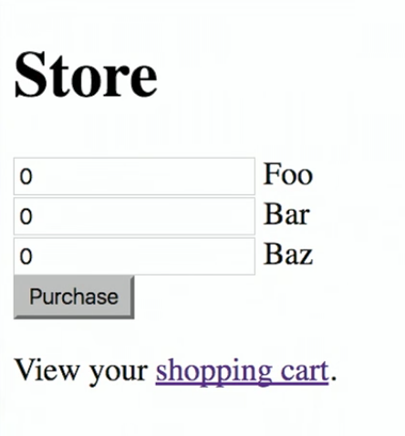
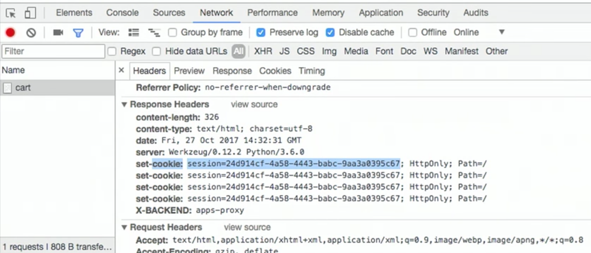
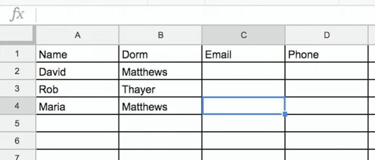
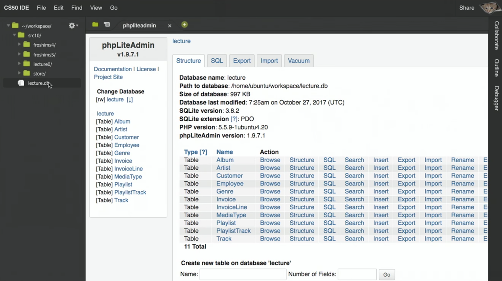
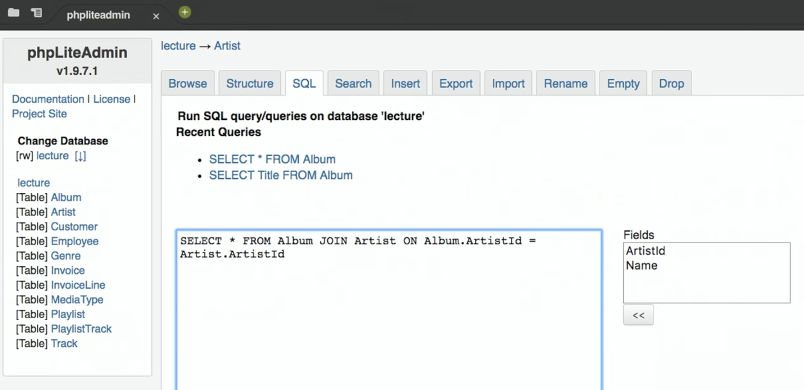
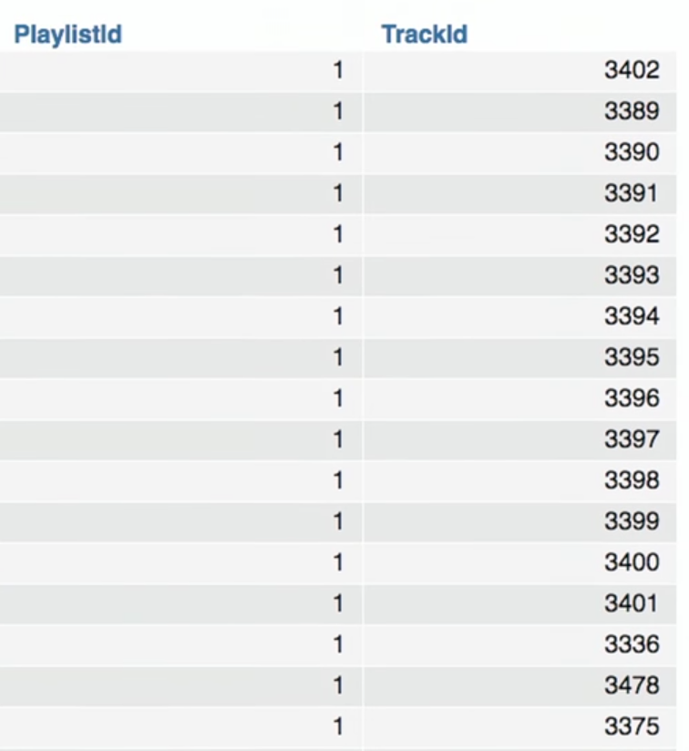
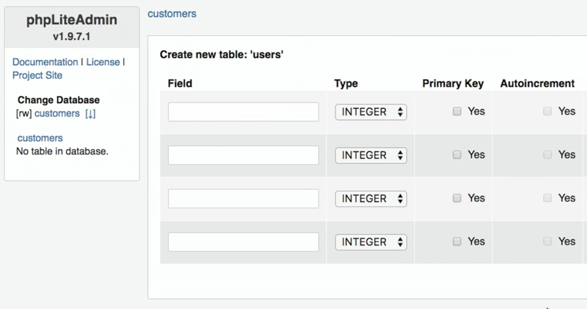
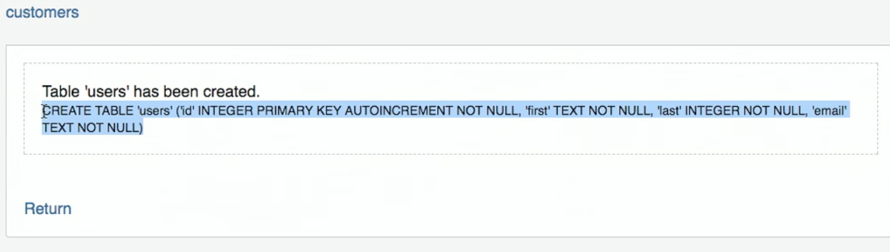

:author: Cheng Gong

= Lecture 10

[t=0m0s]
== Cookies

* Don't forget that we can import a function from CS50's Python library called `eprint`, which helps us debug our program by printing the filename and line number from where it was called.
* There are many websites like Facebook where we log in when we first visit, and not have to log in every time we move around that website after. Somehow, the website must remember who we are. And they store information on the server, like in CSV files or local variables like we saw last time. The server can't necessarily rely on the IP address, since one household or network might have one public IP address that many devices share.
* A *cookie* (in this context) is a small piece of information unique to our login that a web server gives to our browser, that our browser can send back in the future, to verify who we are. We can think of it like a digital handstamp that we might get at an amusement park, so we can get in or out easily.
* Our browser stores cookies for us and sends it back as part of an HTTP request in the headers. When we first log in, some of the headers in the reply from the server might look like this:
+
[source]
----
HTTP/1.1 200 OK
Content-Type: text/html
Set-Cookie: session=value
...
----
** `session` is the key for the cookie, like a variable name, and `value` will be our unique handstamp, which might be a large random number that's hard for others to guess.
* Now our browser, in future requests, will include that cookie in the headers:
+
[source]
----
GET / HTTP/1.1
Host: www.facebook.com
Cookie: session=value
...
----
** Facebook's servers stores the values of each account's cookies, so it can know who we are from that cookie.
* As individual users, we might want to delete our cookies. If someone has access to the cookies our browser is storing, they could pretend to be us by including them in requests.
* HTTPS encrypts the messages between our browser and the receiving server, so someone along the network won't be able to steal our cookies. A few years ago, a security researcher created a program that anyone can run, to capture all wireless traffic in the room, and show all the unencrypted cookies that were sent. That motivated most websites to use only HTTPS for sending information like this. And we ourselves might clear the cookies our browser has stored, so there's no trace of which websites we've visited in the past.
* Let's take a look at `application.py` from our http://cdn.cs50.net/2017/fall/lectures/10/src10/store/[`store`] demo:
+
[source, python]
----
from flask import Flask, redirect, render_template, request, session
from flask_session import Session

# Configure app
app = Flask(__name__)

# Configure sessions
app.config["SESSION_PERMANENT"] = False
app.config["SESSION_TYPE"] = "filesystem"
Session(app)

@app.route("/")
def index():
    return render_template("index.html")

@app.route("/update", methods=["POST"])
def update():
    for item in request.form:
        session[item] = int(request.form.get(item))
    return redirect("/cart")

@app.route("/cart")
def cart():
    return render_template("cart.html", cart=session)
----
** If we had a web application like a store, where we wanted to add items to a virtual cart, we could store that information on our server, linked to each user's cookie.
** We create a Flask application called `app`, and set up one of its built-in features, Session, which allows us to set information about a user's session.
** We set the default route to be `index.html` as usual.
** The `/cart` route leads to a template where we pass in the `session` variable. And `session` is tracked automatically by our server's Flask application. In `cart.html`, we see how that variable is used:
+
[source, html]
----



<h1>Cart</h1>

    {{ item }} : {{ cart[item] }}
     


    <a href="/">Continue shopping</a>.


----
*** We include the standard HTML from `layout.html`, and we add a heading of `Cart` to our page. Then, for each `item` in the variable `cart` (which was `session` when we passed it in), we print the key of `item` and the value of it in `cart`. `cart` is a dictionary, or hash table, in which we can store values for keys. Here we are iterating over all the keys, like `"foo"`, `"bar"`, and `"baz"`, so this loop would translate that to `cart["foo"]`, `cart["bar"]`, and `cart["baz"]` to print each one's value.
* If we visit our store, we see this page:
+

** "Foo", "bar", and "baz" are generic names in Computer Science that we can use to refer to some objects that don't need a specific name.
** We have a form where we can set the quantity of each item that we want, and if we go our cart, we'll see the quantities for each item as we input it.
* To see how, we can open Chrome's Developer Tools, and use the Network tab to see that our server is indeed responding with some values for setting a cookie with a `session` in the Response Headers:
+

* And if we go back to the relevant section of our server's code, we can see how we update the quantities stored every time the form is submitted, with the `update` route:
+
[source, python]
----
@app.route("/update", methods=["POST"])
def update():
    for item in request.form:
        session[item] = int(request.form.get(item))
    return redirect("/cart")
----
** For each `item` in the form, we set the value in our `session` dictionary to the `int` value (like casting in C) of the value sent through the form.
* And if we looked in the directory where our `store` application is, we would see a directory called `flask_session`, in which there are files for each `session` our server has created.

[t=34m46s]
== Databases

* Many web applications, including the ones we've demonstrated in lectures, follow a certain paradigm called MVC, Model-View-Controller. We have been writing Python code that act as controllers, the logic that controls where the user goes and what our application actually does with their inputs, etc. The HTML templates, in which we placed our data to display to the user, are views. This separates the logic of our application from the aesthetics and formatting. And finally, today we will see how models, or data, are stored and accessed.
* SQL, Structured Query Language, is a programming language that we use to talk to a database, a program that stores data and responds to requests for data, like a web server. And it has advanced features like searching and filtering data quickly.
* Spreadsheet programs like Excel or Google Sheets allow us to store data in rows and columns, and this layout is shared with relational databases, which we will be using. We commonly use the columns in the top row for headers like "Name" and "Dorm", and each row after will be an entry:
+

** But with spreadsheet programs, we run into limitations with how many rows we can store, and we can only search linearly.
* The database program we will use is SQLite, which stores our data in binary format and provides advanced, efficient features.
* We can use yet another program, called phpLiteAdmin, to manage our databases, or use a command-line program, `sqlite3`.
* And we can connect and talk to our database with Python code.
* In SQL, we'll use a few basic operations:
** `CREATE  ...`
** `INSERT  ...`
** `SELECT  ...`
** `UPDATE  ...`
** `DELETE  ...`
** `...`
* With those verbs, we can write statements like these, and run them one at a time:
** `CREATE TABLE 'registrants' ('id' INTEGER PRIMARY KEY, 'name' TEXT, 'dorm' TEXT)`
*** This is the command we'd use to create a table named `registrants`, and we specify the columns we'd like to have in our table. More interestingly, we specify the type of data that each column will be, so our database can optimize how it stores and accesses data. The `id` column is an integer we can use to uniquely identify each row, and `name` and `dorm` will be text fields.
** `INSERT INTO "registrants" ("id", "name", "dorm") VALUES(1, 'David', 'Matthews')`
*** Now we specify the columns of data we want to provide for a new row, and the values for each column.
** `SELECT * FROM "registrants"`
*** `pass:[*]` allows us to select all rows, since `*` matches all values.
** `UPDATE "registrants" SET "name" = 'David Malan' where id = 1`
*** We can also change values for rows, but ensure that we only set it for the row we want to change with `where id = 1`.
** `DELETE FROM "registrants" WHERE id = 1`
*** And we can delete rows, too.
* And our database, SQLite, can have other data types, too:
** `BLOB` stands for "binary large object", or binary data.
** `INTEGER`
** `NULL` is something we can use to specify that there is no value for a particular column, like in C.
** `REAL` is a real number, or floating-point value.
** `TEXT`
** `DATETIME` stores dates and times.
** `NUMERIC` stores numbers, whether they are integers or floating-point.
* SQL has functions to help us figure out the time, like `date`, `time`, and `datetime`.
* For phone numbers and zip codes, we might want to store the data as text, since leading zeroes are usually removed from numbers.
* We also have a few options we can apply to storing data like names and addresses. We might want separate first name and last name columns, as well as street, city, and state, so we can search or filter on each of those pieces individually.
* And if we have lots of people sharing the same address, we'll have redundant information in our database. With just the zip code, for example, we should be able to figure out the city and state.
* So if we were using a spreadsheet program, we can have another sheet, "cities", and store that data separately:
+
image::cities.png[alt="cities sheet", width=300]
* Now, our "customers" sheet has less redundancy:
+
image::customers.png[alt="customers sheet", width=400]
* And we can assign an ID to each row in our cities sheet, and only refer to each one in our customers sheet by the ID, in case any of the other values change.
* Now, to find the actual city and state of someone, we need to take the added step of looking up their zip code in the cities sheet, but we gain the advantage of using less space and not having to update all the rows if something changes.
* In today's http://cdn.cs50.net/2017/fall/lectures/10/src10/[lecture code], we have a file called `lecture.db`. If we upload that to our IDE, and double-click it, it opens in a program called phpLiteAdmin:
+

* This shows us the content of that database, and allows us to visualize it. Now we'll see all the tables, and all the rows in each of the tables. We can click the SQL tab, and run commands:
+

** In this particular command, we are selecting everything in the `Album` table, but we are joining the `Artist` table, based on the `ArtistId` stored in each row of the `Album` table. So instead of seeing some ID for the `ArtistId` column, we'll see all the fields stored in the `Artist` table.
* And we can have more complex relations. A many-to-many relationship might be between our `Playlist` table and our `Song` table, where a playlist has many songs, and a particular song might be on many playlists. The `PlaylistTrack` table represents this, by indicating the `PlaylistId` and `TrackID` for every song on a playlist:
+

* We can also assign other attributes to columns:
** `PRIMARY KEY`, where this column will be used to uniquely identify rows.
** `UNIQUE` means that the field will be unique for every row, but not used to identify rows in joins.
** `INDEX` means that we want the database to store the field in some index to speed up searches in the future, if we anticipate searching on that field frequently.
** `NOT NULL` means that the field has to have some value, and can't be blank.
** `FOREIGN KEY` we'll come back to again later, but means that it is referring to a row in some other table.
* Let's run a command to create an empty file, `touch customers.db`. Now if we double-click it, phpLiteAdmin will open with a blank database, and we can create a new table called `users`:
+
image::new_database.png[alt="New database", width=600]
+

* We can specify the columns in our table like so:
+
image::customers_table.png[alt="customers table", width=400]
** Autoincrement tells our database to automatically increase the `id` field for us, and we can also specify the default value for a column if we want it to not be null.
* After we click the create button, phpLiteAdmin also tells us the SQL command of what it did:
+

* We can do the same in the terminal by running the `sqlite3` command. We'll run `sqlite3 alternative.db` to use a different database file, and run the same `CREATE` command:
+
image::sqlite.png[alt="sqlite3 command", width=400]
* By running `.schema`, a built-in SQLite command, we can see what our tables look like. We can do the same for our `lecture.db` file:
+
image::sqlite_lecture_db.png[alt="sqlite3 lecture.db", width=400]
** We see our `Album` table, and each of the columns inside. A `FOREIGN KEY` is a reference to a row in another table, and we can indicate how that reference is made.
* Now that we have an idea of how databases work, let's see how we can access them from our web applications.
* Let's write a simple program to test out accessing databases:
+
[source, python]
----
from cs50 import SQL

db = SQL("sqlite:///lecture.db")

# Query database for all albums
rows = db.execute("SELECT * FROM Album")

# For each album in database
for row in rows:

    # Print title of album
    print(row["Title"])
----
** By using the `SQL` class from the CS50 Library, we can easily connect to a local database file with the SQLite program. Then we can use `db.execute` to run commands on that database, that we pass in as strings. And `rows` will be a list of dictionaries, with fields we can access.
** Now if we run this program, we'll see all the album titles printed out. And we'll also see a debugging line printed out by the CS50 Library, that shows what query was actually executed.
* We can also pass variables into the command we want to execute, which will then be substituted:
+
[source, python]
----
rows = db.execute("SELECT * FROM Album WHERE Title = :t", t=sys.argv[1])
----
** `sys.argv[1]` is the command-line argument our program gets.
* We pass in the variables individually so the CS50 Library can sanitize, or remove dangerous characters from the user's input, for us. If we had passed in a formatted string like so:
+
[source, python]
----
rows = db.execute(f"SELECT * FROM Album WHERE Title = '{sys.argv[1]}'")
----
** Someone could pass in code that would then be added into the query. They could run `haha ; DELETE FROM Album` and the semicolon would end the `SELECT` command, and then run another `DELETE` command.
* The name for this class of issues is an SQL injection attack. For example, when we log in to some website we might fill out the username and password fields of some form, and the back-end might try to select from the database a row that has a matching username and password.
* But if the server uses SQL, then what we pass in to the form might be directly included in the query. For example, suppose we pass in `me@examplemailprovider.com` as the username and `' OR '1' = '1` as our password:
+
image::injection.png[alt="sql injection", width=600]
* SQL happens to have the keyword `OR`, and it looks like this password value will change the meaning of a SQL query, if it's included directly with single quotes.
* Suppose the back-end code looks like this:
+
[source, python]
----
username = request.form.get("username")
password = request.form.get("password")
db.execute(f"SELECT * FROM users
WHERE username = '{username}' AND password = '{password}'"
----
** So if `username` and `password` is substituted in, our query will actually end up being:
+
[source]
----
db.execute("SELECT * FROM users
WHERE username = 'me@examplemailprovider.com' AND password = '' OR '1' = '1'")
----
** And that will select the row with `username = 'me@examplemailprovider.com'` even if `password` doesn't match, since `1` is always equal to `1`.
* If we sanitize our input by passing in variables to the CS50 Library separately, the query after the input is substituted will look like this, with dangerous characters escaped with backslashes:
+
[source]
----
db.execute("SELECT * FROM users
WHERE username = 'me@examplemailprovider.com' AND password = '\' OR \'1\' = \'1'")
----
* Let's combine this into a web application, with http://cdn.cs50.net/2017/fall/lectures/10/src10/lecture0/[lecture0] in the source directory:
+
[source, python]
----
from flask import Flask, render_template, request

from cs50 import eprint, SQL

app = Flask(__name__)

db = SQL("sqlite:///lecture.db")

@app.route("/")
def index():
    rows = db.execute("SELECT * FROM Album")
    return render_template("index.html", albums=rows)
----
** We connect to our local database, and pass all the rows we get from the `Album` table into our template, which looks like:
+
[source, html]
----




    <ul>
        

            <li>{{ album["Title"] }}</li>

        
    </ul>


----
** Now if we run our webserver, we'll see an unordered, bulleted list of our album titles.
* We can change the query to be from the URL:
+
[source, python]
----
@app.route("/")
def index():
    query = request.args.get("q")
    eprint(query)
    rows = db.execute("SELECT * FROM Album WHERE Title = :q", q=query)
    return render_template("index.html", albums=rows)
----
** Now, if we add `?q=Something` to the URL, we'll see only the album titles that match that query.
* With these building blocks, we'll build a web application in Problem Set 7 that simulates buying and selling stocks, with real prices!
