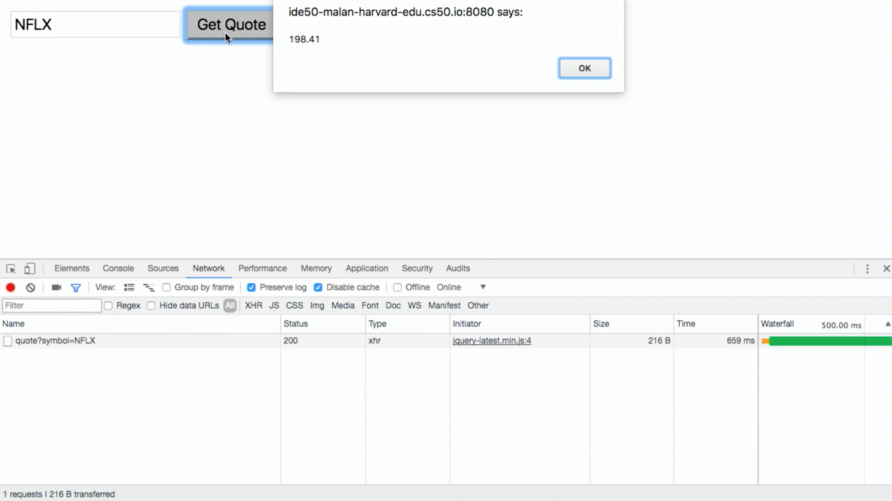

:author: Cheng Gong

= Lecture 11

[t=0m0s]
== MVC

* Last time, we looked at the pattern called MVC, Model-View-Controller, a type of programming that separates the code for our web application in three categories: controllers, which contain the logic; templates, which contain the aesthetics and presentation of our application; models, which represent and store the data we need.
* Let's take a look at http://cdn.cs50.net/2017/fall/lectures/11/src11/froshims4/[`froshims4`], where we store our registrants in a database.
* Our controller code in `application.py` has a `register` route that does the following:
+
[source, python]
----
@app.route("/register", methods=["GET", "POST"])
def register():
    if request.method == "GET":
        return render_template("register.html")
    elif request.method == "POST":
        if not request.form.get("name") or not request.form.get("dorm"):
            return render_template("failure.html")
        db.execute("INSERT INTO registrants (name, dorm) VALUES(:name, :dorm)",
                   name=request.form.get("name"), dorm=request.form.get("dorm"))
        return render_template("success.html")
----
** If the request was made with the GET method, then our application returns the template for the registration form in `register.html`.
** If the request was made with the POST method, and both `name` and `dorm` were provided in the form, then we `INSERT` that data into our database with `db.execute`. Otherwise, we return `failure.html`.
** And remember that, to plug in values for our queries, we want to pass in each user-submitted argument separately, so the `execute` function can sanitize them for us.
* After we register through our web application, we can use the `sqlite3` command to interact directly with our database using SQL:
+
image::froshims4_db.png[alt="sqlite3 froshims4.db", width=600]
* The `unregister.html` template also contains a dropdown with all the registrants thus far:
+
image::unregister.png[alt="unregister", width=200]
** The form actually submits the ID number of "David from Matthews", instead of that string, since there might be multiples. But with a unique, primary key to identify records, we can be sure that we've selected the right ones.
** So in our `unregister.html` template, we have something like this, where the form's `option` has a `value` with the `id` of each `registrant`. Even though the user will see the names and dorms, the form will send just the ID back. And recall that `registrants` is a list passed in from our controller code in `application.py`.
+
[source, html]
----

    <option value="{{ registrant.id }}"/>{{ registrant.name }} from {{ registrant.dorm }}</option>

----

[t=18m15s]
== JavaScript Basics

* Now we'll introduce the last language we'll learn in CS50, JavaScript. When we wrote programs in C or Python, they mostly executed top to bottom. With Flask, our server runs in an infinite loop until we stop it, listening for requests and calling the function we defined at the right route when it gets one. So our server is an example of event-based programming. It turns out, in our browser, we have lots of events, like when our mouse moves, or when we click on a link. With JavaScript, we'll be able to listen for those events and respond to them in the user's browser, since we can write JavaScript code that the user's browser will run on their computer.
* We'll quickly look at syntax:
+
[source, javascript]
----
function foo(bar, baz)
{
    ...
}
----
** Functions are declared with the word `function`, and require curly braces.
+
[source, javascript]
----
function(bar, baz)
{
    ...
}
----
** We can even have unnamed functions, anonymous functions, that we'll soon see.
+
[source, javascript]
----
let i = 0;
----
** We create variables with the `let` keyword, without explicit data types.
+
[source, javascript]
----
do
{
    ...
}
while (true);

while (true)
{
    ...
}

for (let i = 0; i < 50; i++)
{
    ...
}

for (let value of array)
{
    ...
}

for (let key in object)
{
    ...
}
----
** Loops are quite similar to those in C, and variables are loosely typed like they are in Python, with `var` as the keyword to declare them. And `true` and `false` are lowercased.
** We can also iterate automatically over the items in an array, or list.
** JavaScript also has objects, which we've seen in Python, a type of variable that contains keys and values, like structs in C.
+
[source, javascript]
----
if (x < y)
{
    ...
}
else if (x > y)
{
    ...
}
else
{
    ...
}
----
** Boolean expressions and conditions, too, are the same as those in C.
+
[source, javascript]
----
let numbers = [4, 8, 15, 16, 23, 42];
----
** Arrays can also be declared, but we don't specify the type of variable that we'll store. And like lists in Python, they automatically grow and shrink.
+
[source, javascript]
----
let quote = {
    name: "Netflix, Inc.",
    price: 199.32,
    symbol: "NFLX"
};
----
** Objects, like dictionaries in Python, have key-value pairs, that we can access.
** For strings, single and double quotes are also both usable, as long as they are opened and closed the same way.
* JSON, JavaScript Object Notation, is a format for storing data in a hierarchy, and that looks like this:
+
[source, javascript]
----
{
    "name": "Netflix, Inc.",
    "price": 199.32,
    "symbol": "NFLX"
}
----

[t=29m35s]
== DOM

* Recall that a DOM, Document Object Model, is the tree that can represent an HTML page:
+
image::dom.png[alt="DOM of simple page", width=600]
* Thus far, we've written HTML and Python code that can generate HTML. Now, we can write JavaScript that changes the HTML, after it's been sent to the user.
* Let's look at http://cdn.cs50.net/2017/fall/lectures/11/src11/dom0.html.src[`dom0.html`]:
+
[source, html]
----
<!DOCTYPE html>

<html>
    <head>
        <script>

            function greet()
            {
                alert(`hello, ${document.getElementById("name").value}!`);
            }

        </script>
        <title>dom0</title>
    </head>
    <body>
        <form id="demo" onsubmit="greet(); return false;">
            <input autocomplete="off" autofocus id="name" placeholder="Name" type="text"/>
            <input type="submit"/>
        </form>
    </body>
</html>
----
** In the body of the page, we create a simple form with a text input with an ID of `name`. Then, we specify that the `onsubmit` event handler for the form will call `greet()`, and we use `return false;` to prevent the browser from trying to submit the form by default. We also use `autocomplete="off"` to turn off the autocomplete dropdown in the form's input, and `autofocus` to automatically bring the cursor into the form field, so we don't need to click into the box before we can type in it.
** In the head of the page, we use the `<script>` tag to write JavaScript code. We declare the function `greet` and call the `alert` function with the name from the form when `greet` is called. To get the name in the form, we use `document`, a global variable that contains the entire page, and the built-in `getElementById` function of it, to select the element with ID of `name`. That element, an input text box, has a `value` attribute, which is the value inside it. And finally, we substitute that into our string with backticks, `````, as shown.
* Instead of having code mixed in our HTML form, we can do the following:
+
[source, html]
----
<!DOCTYPE html>

<html>
    <head>
        <title>dom1</title>
    </head>
    <body>
        <form id="demo">
            <input autocomplete="off" autofocus id="name" placeholder="Name" type="text"/>
            <input type="submit"/>
        </form>
        <script>

            document.getElementById("demo").onsubmit = function() {
                alert("hello, " + document.getElementById("name").value + "!"");
                return false;
            };

        </script>
    </body>
</html>
----
** This way, our code is more readable, and we can have different people working on different areas of our application.
** We've moved our `<script>` tag to the bottom of the page, so our code only runs after the rest of the page has loaded.
** And we can again use `document`, a global variable that contains the entire page, and the built-in `getElementById` function of it, to select the element with ID `demo`, which is our form. Then we set the `onsubmit` event handler of `demo` with our script to an anonymous function, inside which we write the code from earlier.
** Alternatively, we could have set the event handler to call another function:
+
[source, javascript]
----
...
function greet()
{
    alert("hello, world");
}

document.getElementById("demo").onsubmit = greet;
...
----
*** Notice that we didn't set it to `greet()`, which would call the function immediately. Instead, we only want to point `onsubmit` to `greet`, so it can be called when the form is actually submitted.
* We look at a few more demos:
** http://cdn.cs50.net/2017/fall/lectures/11/src11/form1.html[`form1.html`], where user input is validated before it's sent to the server, so they'll get quicker feedback
** http://cdn.cs50.net/2017/fall/lectures/11/src11/ajax0.html[`ajax0.html`], where we can make requests from the browser, and retrieve data without going to another route or refreshing the page
** http://cdn.cs50.net/2017/fall/lectures/11/src11/map.html[`map.html`], where we can display an interactive map that we can add markers and data to
* Let's take a closer look at `form1.html`:
+
[source, html]
----
<!DOCTYPE html>

<html>
    <head>
        <title>form1</title>
    </head>
    <body>
        <form action="/register" id="registration" method="get">
            <input autocomplete="off" autofocus name="email" placeholder="Email" type="text"/>
            <input name="password" placeholder="Password" type="password"/>
            <input name="confirmation" placeholder="Password (again)" type="password"/>
            <input name="agreement" type="checkbox"/> I agree
            <input type="submit" value="Register"/>
        </form>
        <script>

            let form = document.getElementById("registration");
            form.onsubmit = function() {

                if (!form.email.value)
                {
                    alert("missing email");
                    return false;
                }
                else if (!form.password.value)
                {
                    alert("missing password");
                    return false;
                }
                else if (form.password.value != form.confirmation.value)
                {
                    alert("passwords don't match");
                    return false;
                }
                else if (!form.agreement.checked)
                {
                    alert("checkbox unchecked");
                    return false;
                }
                return true;

            };

        </script>
   </body>
</html>
----
** Our `form` element is standard, with some fields we want to collect as inputs, and to validate the input before it's sent to the server (since we do have an `action` for the form to be submitted to now), we write the script below.
** First, we get the `form` element in the HTML page by its ID of `registration`, and name it `form` as a variable in our script. When the submit button is clicked, we want to call an anonymous function, and that function will check each of the inputs for a value. If there is no value (with the `!` as the "not" operator), then we `return false;`, which stops the form from being submitted. And if all checks pass, our function returns true, which allows the form to be submitted.
* We can further factor out our script with a tag that links to another file, inside of which we have our script's code:
+
[source, html]
----
<!DOCTYPE html>

<html>
    <head>
        <script src="form1.js"></script>
        <title>form1</title>
    </head>
...
----
* A popular library in JavaScript is called jQuery, which includes helpful functions that make certain things easier. The interactive features of Bootstrap, for example, require jQuery. We can use one such function in http://cdn.cs50.net/2017/fall/lectures/11/src11/form2.html.src[`form2.html`]:
+
[source, html]
----
<!DOCTYPE html>

<html>
    <head>
        <script src="https://code.jquery.com/jquery-latest.min.js"></script>
        <script>

            $(document).ready(function() {

                $("#registration").submit(function() {

                    if (!$("#registration input[name=email]").val())
                    {
                        alert("missing email");
                        return false;
                    }
                    else if (!$("#registration input[name=password]").val())
                    {
                        alert("missing password");
                        return false;
                    }
                    else if ($("#registration input[name=password]").val() != $("#registration input[name=confirmation]").val())
                    {
                        alert("passwords don't match");
                        return false;
                    }
                    else if (!$("#registration input[name=agreement]").is(":checked"))
                    {
                        alert("checkbox unchecked");
                        return false;
                    }
                    return true;

                });

            });

        </script>
        <title>form2</title>
    </head>
...
----
** The syntax is a bit different now, but the first line of our new script is `$(document).ready(function() {`. The `$` is now a global variable that's defined by the jQuery library, which we linked to in the line above. `$(document)` selects the entire page from the browser and wraps it with additional functionality. `ready` is one such feature, which allows us to call another function as soon as the page is ready, since a page might need to load lots of different pieces.
** Below that, we use syntax like `$("\#registration")` to select elements on the page based on their ID, and use `.submit` to attach a function to be called when the form is submitted. The ``#`` syntax comes from CSS, and we can use more complex selectors like `$("#registration input[name=email]")`, to select the element with a name of `email`, of type `input`, within the `registration` element.

[t=1h6m53s]
== Ajax

* When we visit https://www.google.com/maps, we see a section of a map near where we are. But our browser hasn't downloaded all map areas of the world. Instead, when we drag around the map, we will see a delay where we might see areas that are just gray, until that piece has been loaded. We can see this with the Network tab of the Developer Tools:
+
image::google_maps.png[alt="Network requests for Google Maps", width=600]
* The technology that a browser uses to make requests dynamically is called Ajax, and it allows our browser to make additional special HTTP requests, after the initial one, to get more data from a server.
* Let's look at http://cdn.cs50.net/2017/fall/lectures/11/src11/ajax0.html.src[`ajax0.html`]:
+
[source, html]
----
<!DOCTYPE html>

<html>
    <head>
        <script src="https://code.jquery.com/jquery-latest.min.js"></script>
        <script>

            function quote()
            {
                $.getJSON("/quote", {symbol: $("#symbol").val()}, function(data) {
                    alert(data.price);
                });
            }

        </script>
        <title>ajax0</title>
    </head>
    <body>
        <form onsubmit="quote(); return false;">
            <input autocomplete="off" autofocus id="symbol" placeholder="Symbol" type="text"/>
            <input type="submit" value="Get Quote"/>
        </form>
    </body>
</html>
----
** We can visit the page and see that we got an alert with new data, and a new request in our Network tab:
+

** And we can click on the request itself to see that it is an object in JSON, JavaScript Object Notation, like a dictionary in Python.
** To get this feature, we have a simple HTML form where we can input a symbol, and we use the `onsubmit` attribute of the form to call the `quote` function. `quote`, in turn, uses the jQuery library's `getJSON` function.
** The first argument we pass to `getJSON` is `"/quote"`, which means that the browser will use that URL to get data from our server.
** The second argument is a JSON object that we want to give to the server as part of our request. In this case, we are passing it an object with a key of `symbol`, the value of which is the value the user typed into the text box. The `getJSON` function of the jQuery library adds this to the GET request it sends to the server.
** And the last argument is an anonymous function. This time, the anonymous function takes an argument of `data`. Furthermore, it is a callback function because it will only be called when the data comes back from the server. And that function, when it does get called with the data, simply alerts us to the `price` attribute of that object.
* In `ajax1.html`, we implement the same functionality a bit more cleanly, by factoring out our JavaScript code:
+
[source, html]
----
<!DOCTYPE html>

<html>
    <head>
        <script src="https://code.jquery.com/jquery-latest.min.js"></script>
        <script>

            $(document).ready(function() {

                $("#quote").submit(function() {

                    $.getJSON("/quote", {symbol: $("#symbol").val()}, function(data) {
                        alert(data.price);
                    });
                    return false;

                });

            });

        </script>
        <title>ajax1</title>
    </head>
    <body>
        <form id="quote">
            <input autocomplete="off" autofocus id="symbol" placeholder="Symbol" type="text"/>
            <input type="submit" value="Get Quote"/>
        </form>
    </body>
</html>
----
* Thus far, the code we've written in C have been synchronous, meaning that our code executed top to bottom, waiting for each function call to return before proceeding. With callbacks in JavaScript, we're able to write asynchronous code, meaning that our program can do many things while waiting for some function, like an Ajax request, to return.
* We can also use a built-in feature of our browser to get the user's location in http://cdn.cs50.net/2017/fall/lectures/11/src11/geolocation.html.src[`geolocation.html`]:
+
[source, html]
----
<!DOCTYPE html>

<html>
    <head>
        <title>geolocation</title>
    </head>
    <body>
        <script>

            navigator.geolocation.getCurrentPosition(function(position) {
                document.write(position.coords.latitude + ", " + position.coords.longitude);
            });

        </script>
    </body>
</html>
----
** The `navigator` global variable is provided by the browser, and includes various pieces of functionality. With `geolocation.getCurrentPosition`, we can get the user's latitude and longitude. But notice that the argument to that function is an anonymous function, which writes the coordinates to the page, and that function will only be called once the location is determined. Our code doesn't need to wait before moving on to the next line, if we wanted to add other functionality to the page.
* We can also have our pages be more animated with JavaScript, as in http://cdn.cs50.net/2017/fall/lectures/11/src11/blink.html.src[`blink.html`]:
+
[source, html]
----
<!DOCTYPE html>

<html>
    <head>
        <script>

            // toggles visibility of greeting
            function blink()
            {
                let div = document.getElementById("greeting");
                if (div.style.visibility == "hidden")
                {
                    div.style.visibility = "visible";
                }
                else
                {
                    div.style.visibility = "hidden";
                }
            }

            // blink every 500ms
            window.setInterval(blink, 500);

        </script>
        <title>blink</title>
    </head>
    <body>
        <div id="greeting">
            hello, world
        </div>
    </body>
</html>
----
** By changing the `visibility` attribute of the `greeting` `div`, we can make it appear and disappear. We write a `blink` function that toggles that attribute, and we call it with `window.setInterval`, which calls some function every so often. Here, we've specified `500` for every 500ms, or every half-second. And `window.setInterval` is another example of asynchronous code, since our own code can move on and do something else, rather than be in some infinite loop that calls `blink` over and over.
* Finally, let's see how we can use a third-party API, Application Programming Interface, in http://cdn.cs50.net/2017/fall/lectures/11/src11/map.html.src[`map.html`]:
+
[source, html]
----
<!DOCTYPE html>

<html>
    <head>
        <style>

            html, body, #map
            {
                height: 100%;
                margin: 0;
            }

        </style>
        <title>map</title>
    </head>
    <body>
        <div id="map"></div>
        <script>

            function initMap() {
                let map = new google.maps.Map(document.getElementById("map"), {
                    center: {lat: 39.833, lng: -98.583},
                    zoom: 4
                });
                new google.maps.Marker({
                    map: map,
                    position: {lat: 42.3762, lng: -71.1158}
                });
                new google.maps.Marker({
                    map: map,
                    position: {lat: 41.3104, lng: -72.9289}
                });
            }

        </script>
        <script src="https://maps.googleapis.com/maps/api/js?key=KEY&callback=initMap"></script>
    </body>
</html>
----
** An Application Programming Interface is just some way to build a program on top of some other software. In this example, Google Maps provides an API through which we can write code that embeds a map into our own webpage, and even customize it.
** At the bottom of our code, we embed Google's JavaScript file that calls our `initMap` function when it's loaded.
** In `initMap`, we first create a Google Maps `Map` object, placing it into the `div` with ID `map` that we have in our HTML page, and specifying some parameters for this map. We know how to do this only by reading https://developers.google.com/maps/documentation/javascript/[the documentation that Google's provided].
** Then we add some markers, another feature provided by the Google Maps API. By looking at the documentation for this, and other features, we can create more and more interesting applications.
** With our next Problem Set, we'll create maps of our own, displaying local news for cities around the world.
