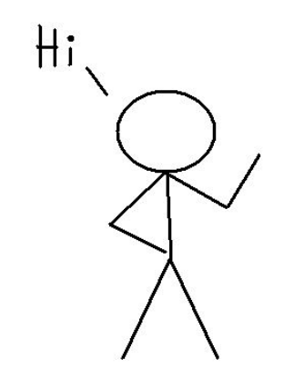

:author: Cheng Gong

= Lecture 12

[t=0m0s]
== Themes

* We watch https://www.youtube.com/watch?v=YuubOQFB9kk[a video] revisiting how Harvard was pranked at the annual Harvard-Yale football game.
* We also play https://scratch.mit.edu/projects/12352154/[Ivy's Hardest Game] with a volunteer.
* We thank the staff with https://www.youtube.com/embed/w9u6sJeUKpc?autoplay=1&rel=0[a video] as well.
* It turns out, after 12 weeks, all of us now rate ourselves as "Somewhere in Between" or "More Comfortable", with no one less comfortable anymore!
* And realize that you, too, can teach and learn CS by joining the staff and https://cs50.harvard.edu/apply[applying here]!
* CS50 also works with high schools and colleges around the world, where CS teachers adopt the curriculum, tools, and software we use here.
* We share http://cdn.cs50.net/2017/fall/lectures/12/lecture12.pdf[a few slides] showing the data we've gathered from you about the problem sets and lectures.
* Recall that this course has been less about programming, but rather problem solving, and use the foundations we've built to learn new languages or tools that we might need in the future.
* Problem solving, as we discussed in week 0, was taking some input, or problem, and using some algorithm to produce some output, or solution.
* Another theme has been tradeoffs, where, for example, we might sacrifice time for elegancy in the algorithms we design.
* Abstraction, too, has been a recurring topic where we build or borrow smaller, reusable pieces that we can layer to solve more and more complex problems.
* We also learned the strategy of using pseudocode to sketch out an algorithm, before we fully implement them.
* We have a demo, where our volunteer Amy has to "program" the audience to draw a graphic only she can see:
+
image::cube.png[alt="Cube", width=200]
** She describes a cube, with three faces that we can see.
** We collect drawings from the audience, and some were more accurate than others.
* Now we reverse the roles, with our audience guiding a volunteer Dylan to draw the following:
+

* With a few undos and clarifications, our volunteer draws the stick figure closely!
* But we can see through these exercises, that even communicating instructions to humans can be challenging, let alone programs. And there is a tradeoff in abstraction, where saying a high-level statement like "draw a stick figure" means we lose some control over the smaller details, like how long the arms should be.
* After CS50, you're empowered to take courses in any direction of CS, whether it be software, hardware, mathematics, or machine learning. And certainly, you should be empowered to teach yourself new topics with or without the structure of a course.
* We can also install command-line tools on own own Mac or PC, so that we can have a development environment like the CS50 IDE on our own computers.
* Git is another tool we can learn. Git is a version control software, which allows us to save different versions of our code and switch between them, and track all the changes we've made over time.
* Another tool we might want is a text editor for code, such as https://www.sublimetext.com/[Sublime Text] or https://atom.io/[Atom], which have features like syntax highlighting, autocomplete, and smart indentation.
* A more advanced, command-line text editor is https://en.wikipedia.org/wiki/Vim_(text_editor)[Vim].
* And https://cs50.io/ can be used to host web applications, at least for some time. Other platforms, like https://www.heroku.com/platform[Heroku] or https://aws.amazon.com/education/awseducate/[AWS], offer more hosting options. And students can get a free domain name from https://nc.me/[Namecheap], along with other free services from https://education.github.com/pack[GitHub].
* We share https://www.destroyallsoftware.com/talks/wat[a talk] where weird parts of languages like Ruby and JavaScript are exposed.
* Soon, we'll host the CS50 Hackathon, where you and classmates will work together on final projects and enjoy the company of each other, as well as a photobooth, Milo, and pancakes.
* Finally, we'll host the CS50 Fair where students, staff, and visitors will share and explore each other's final projects.
* We have a friendly contest between staff and students, where we have a Jeopardy-style game with the quiz review questions that you submitted.
* See you at the Hackathon and Fair!
