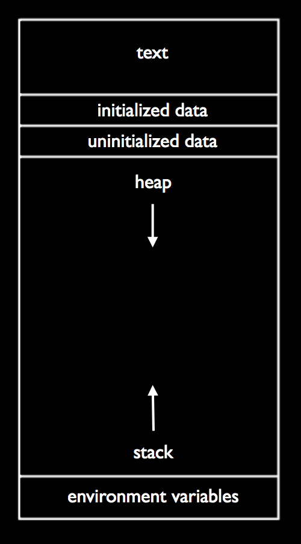
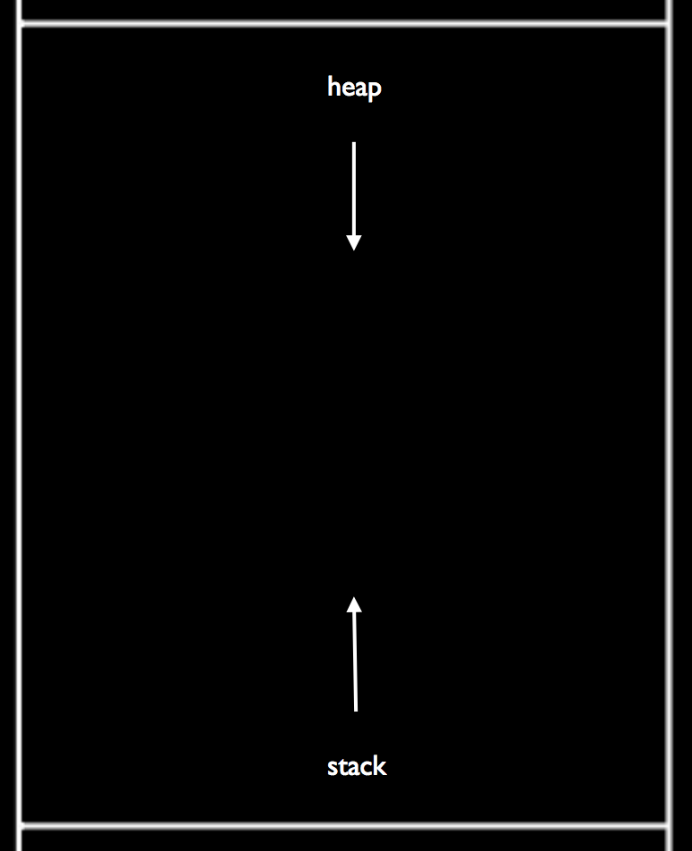
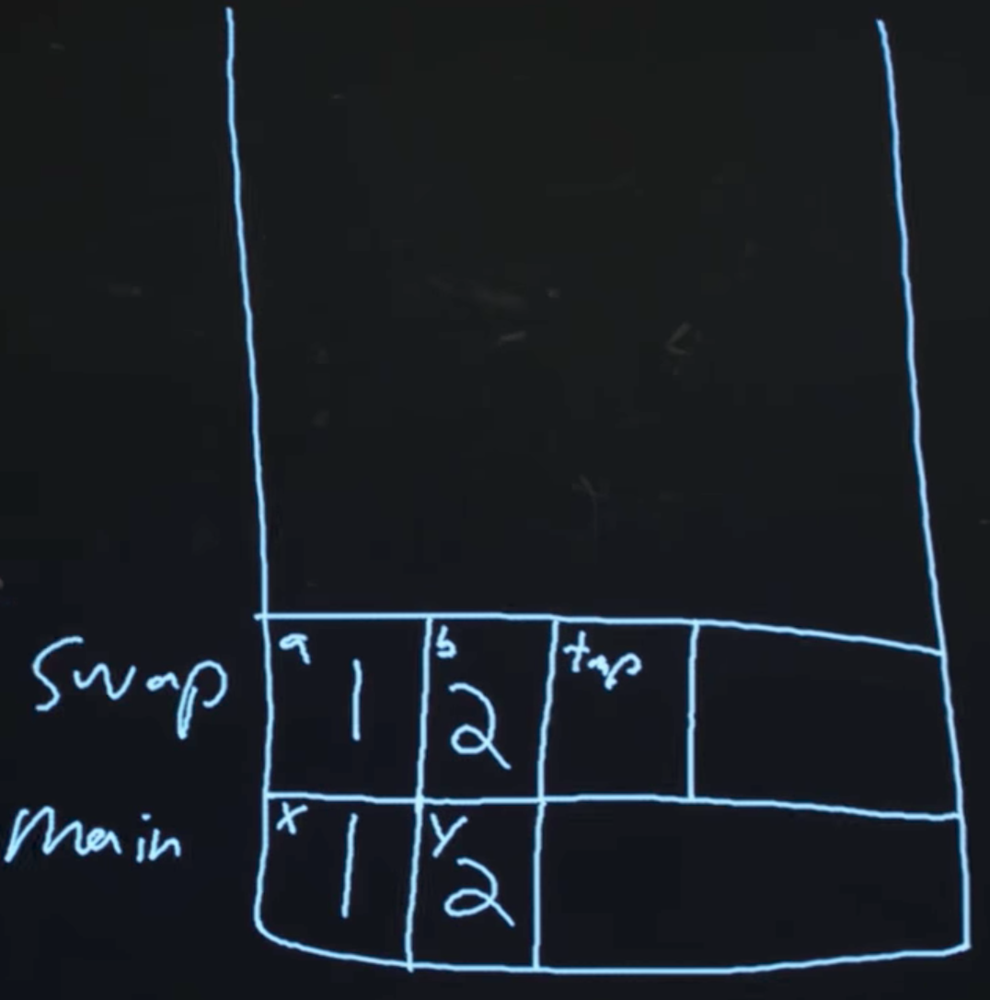
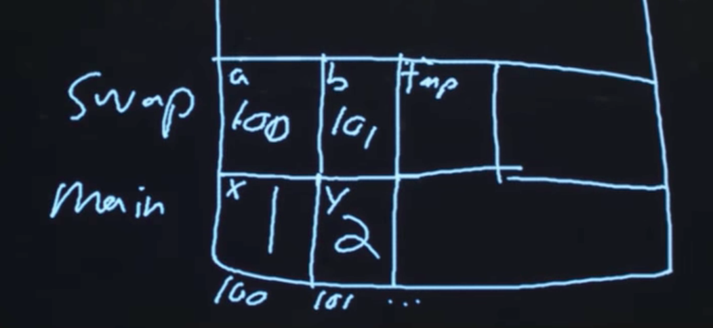
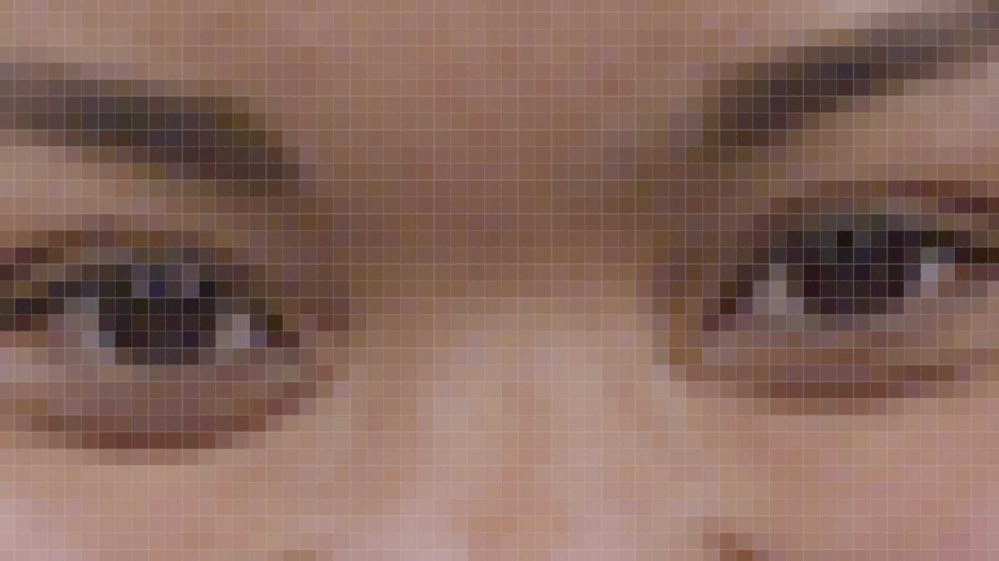
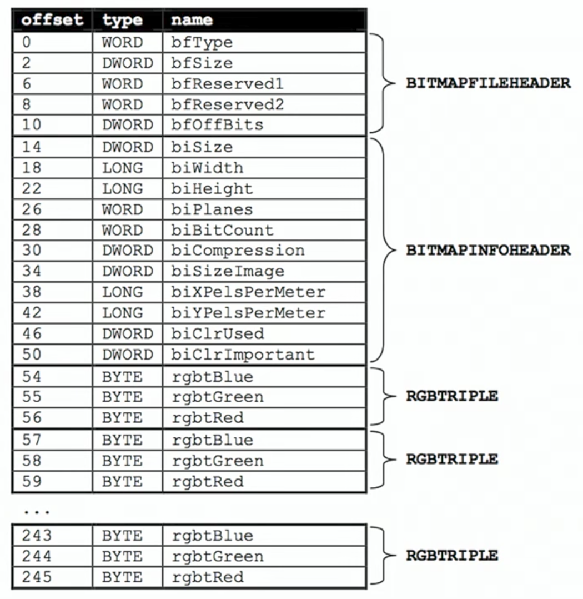

:author: Cheng Gong

= Lecture 4

[t=0m0s]
== Last Time

* We talked last time about arrays, contiguous locations in memory where we can store the same type of data for indexed access. There are other data structures we can build, too.
* We also looked at how we might search and sort arrays, with algorithms like:
** linear search
** binary search
** bubble sort
** selection sort
** insertion sort
** merge sort
* We started using basic terms to describe running time (in units of steps taken), like:
** _n_^2^
** _n_ log _n_
** _n_
** log _n_
** 1
** ...
* And the notation for theoretical running time includes:
** _O_, worst-case running time, or upper bound
** Ω, best-case running time, or lower bound
** Θ, if both of those are the same

[t=0m0s]
== Swapping

* In the C programming language, `string` is actually not a real type. Instead, the keywork is provided by the CS50 Library.
* But first, let's think about how we might swap two liquids in two cups. We would need a third cup to hold one of the liquids. Similarly, in programming, to swap the values of two variables, we need some kind of temporary storage.
* Let's take a look at the `swap` function:
+
[source, c]
----
void swap(int a, int b)
{
    int tmp = a;
    a = b;
    b = tmp;
}
----
** First, we put the value of `a` into a temporary variable called `tmp`, then set `a` to the value of `b`, and finally set `b` to the value of `tmp`, which was the original value of `a`.
* Now let's look at this program:
+
[source, c]
----
#include <stdio.h>

void swap(int a, int b);

int main(void)
{
    int x = 1;
    int y = 2;

    printf("x is %i, y is %i\n", x, y);
    swap(x, y);
    printf("x is %i, y is %i\n", x, y);
}

void swap(int a, int b)
{
    int tmp = a;
    a = b;
    b = tmp;
}
----
** Our `main` function here will call the `swap` function, the same as what we looked at just now, and print out the values of `x` and `y` before and after the swap.
* But when we run this program, it doesn't swap the values of `x` and `y` in `main`.
* It turns out that, while our algorithm for swapping is correct, our implementation in code doesn't do what we want for a subtle reason.

[t=0m0s]
== Strings

* Recall that bytes in memory can be visualized as a grid, with each location having some numerical address indicating its position:
+
image::memory_chip.png[alt="Memory chip", width=300]
* Our computer, or more precisely our programs written in C, have some structure to how that memory is used:
+

* We'll discuss the other areas later, but for now notice we have an area labeled `heap` at the top and `stack` at the bottom.
* Before we get any further, let's see what we can find out about addresses with http://cdn.cs50.net/2017/fall/lectures/4/src4/compare0.c.src[`compare0.c`]:
+
[source, c]
----
#include <cs50.h>
#include <stdio.h>

int main(void)
{
    // get two strings
    string s = get_string("s: ");
    string t = get_string("t: ");

    // compare strings' addresses
    if (s == t)
    {
        printf("same\n");
    }
    else
    {
        printf("different\n");
    }
}
----
** We get two strings from the user, but no matter what we type in, our program only prints out `different`.
* Let's try http://cdn.cs50.net/2017/fall/lectures/4/src4/copy0.c.src[`copy.c`]:
+
[source, c]
----
#include <cs50.h>
#include <ctype.h>
#include <stdio.h>
#include <string.h>

int main(void)
{
    // get a string
    string s = get_string("s: ");

    // copy string's address
    string t = s;

    // capitalize first letter in string
    if (strlen(t) > 0)
    {
        t[0] = toupper(t[0]);
    }

    // print string twice
    printf("s: %s\n", s);
    printf("t: %s\n", t);
}
----
** We get a string from the user, `s`, and copy it to `t`. Then, only if the string is long enough, we capitalize the first letter of the string.
** Hmm, `s` and `t` are printed out the same, too, with both of them capitalized even though we tried to capitalize just `t`.
* It turns out, `string` is just a synonym for `char *`.
* What does this mean? Well, let's look at http://cdn.cs50.net/2017/fall/lectures/4/src4/compare1.c.src[`compare1.c`]:
+
[source, c]
----
#include <cs50.h>
#include <stdio.h>
#include <string.h>

int main(void)
{
    // get two strings
    char *s = get_string("s: ");
    char *t = get_string("t: ");

    // compare strings for equality
    if (strcmp(s, t) == 0)
    {
        printf("same\n");
    }
    else
    {
        printf("different\n");
    }
}
----
** We've removed the training wheels of using `string`, and we now use a library function, `strcmp`, to compare the strings, for our program to work as intended.
* But that doesn't quite explain why we can't just compare `s` and `t`. In the past, when we wrote a line like `string s = get_string("s: ");`, we were actually creating a variable in memory called `s`:
+
[source]
----
s [    ]
----
* Then, whatever the user typed in was stored in some bytes in memory elsewhere:
+
[source]
----
| S | t | e | l | i | o | s | \0 |
----
* And since we know bytes in memory has a location, or addresses, we can return the location of the first character in the array of characters we just created:
+
[source]
----
| S | t | e | l | i | o | s | \0 |
 100 101 102 103 104 105 106 107
----
* Assuming that these bytes are numbered something like the above, `s` will contain the value `100`, essentially pointing to the first character. And recall that we know where the string ends, thanks to the use of our NUL character, `\0`.
* Now, we understand why comparing `s` and `t` will always show that they're different, since they're two different addresses. Each time we call `get_string`, it stores the input from the user in a different location in memory. So `s` might have a value like `100`, while `t` has a value like `300`, or wherever the second string was stored.
* So, to come full circle, `s` is not actually a `string`, but a ``char *``, the address of a specific character.
* And in C, we call variables that store addresses of other variables *pointers*. (The `*` symbol indicates that a variable is a pointer to some other variable type, so we could have `int *` in addition to `char *` and others.)
* `strcmp`, we can now infer, must be comparing strings character by character, by going to the addresses that `s` and `t` point to.
* And in `copy0`, when we created our variable `t` and set it to what `s` was, we were just creating another pointer that pointed to the same string in memory. So when we tried to capitalize `t`, we were capitalizing the one string that both `s` and `t` pointed to.

[t=0m0s]
== Memory

* Let's look at a program that actually copies strings, http://cdn.cs50.net/2017/fall/lectures/4/src4/copy1.c.src[`copy1.c`]:
+
[source, c]
----
#include <cs50.h>
#include <ctype.h>
#include <stdio.h>
#include <string.h>

int main(void)
{
    // get a string
    char *s = get_string("s: ");
    if (!s)
    {
        return 1;
    }

    // allocate memory for another string
    char *t = malloc((strlen(s) + 1) * sizeof(char));
    if (!t)
    {
        return 1;
    }

    // copy string into memory
    for (int i = 0, n = strlen(s); i <= n; i++)
    {
        t[i] = s[i];
    }

    // capitalize first letter in copy
    if (strlen(t) > 0)
    {
        t[0] = toupper(t[0]);
    }

    // print strings
    printf("s: %s\n", s);
    printf("t: %s\n", t);

    // free memory
    free(t);
    return 0;
}
----
** We get a string, `s`, and make sure that `s` is actually a valid string with `if (!s)`. If `get_string` failed for some reason, perhaps because the computer ran out of memory to store a really long string, then it returns a special value, `NULL` (not to be confused with NUL), indicating that there is no actual location in memory that `s` can point to. We can also write `if (s == NULL)`, but since `NULL` is equal to `0`, we can just write `if (!s)`. Finally, `main` itself also returns an `int`, to indicate whether the program as a whole worked or failed. In the event of success, `0` is implicitly or explicitly returned, and in the event of failure, some non-zero number can be returned to indicate that.
** Now for `t`, we call a function `malloc`, (short for memory allocation), which finds some amount of memory that we can use and returns an address to the beginning of a chunk of memory, that is of the size we pass in. When we get that address back, the values stored inside that newly allocated chunk of memory are *garbage values*, or values we didn't set and don't know the meaning of, since some other program might have just used it for something else before it didn't need it anymore.
** And the amount of memory we want to allocate in this case is `(strlen(s) + 1) * sizeof(char)`, which is the number of characters in `s` (plus 1 for the NUL terminator), times the size of a character, to get the total number of bytes that we want. We use the `sizeof` function to get the size of a type of variable.
** We check that `t` was not `NULL`, since `malloc` could also fail and not find as much memory as we asked for.
** Now we can copy the string ourselves, one character at a time, with a familiar `for` loop. Notice that, if we use `i <= n`, with `n = strlen(s)`, then the NUL character at the end of the string will also be copied.
** Finally, we'll only be capitalizing `t`, and print out two different strings as we wanted.
* Let's look at http://cdn.cs50.net/2017/fall/lectures/4/src4/string0.c.src[`string0.c`]:
+
[source, c]
----
#include <cs50.h>
#include <stdio.h>
#include <string.h>

int main(void)
{
    // get a string
    char *s = get_string("string: ");
    if (!s)
    {
        return 1;
    }

    // print string, one character per line
    for (int i = 0, n = strlen(s); i < n; i++)
    {
        printf("%c\n", s[i]);
    }
    return 0;
}
----
** We get a string, check that `s` is not `NULL`, and print it one character at a time with `s[i]`, to get the character at each index `i`.
* We can replace the loop with `printf` to read:
+
[source, c]
----
...
for (int i = 0, n = strlen(s); i < n; i++)
{
    printf("%c\n", *(s + i));
}
...
----
** Here, at each index `i`, we are adding that number to `s`, to create an address with a higher value than `s`, so we can get to each character in the string directly with those values. And we have to use the `*` notation around that address to get the value stored at that address.
** (`*` is also used, confusingly, when declaring a variable that the variable should be a pointer. But in this case, and other cases, it is used to go to some address and read the value there.)
* We can now start to slowly take away our training wheels of `get_int` by writing something like this:
+
[source, c]
----
#include <stdio.h>

int main(void)
{
    int x;
    printf("x: ");
    scanf("%i", &x);
    printf("x: %i\n", x);
}
----
** `scanf` is a function in C's standard I/O library, that reads from the user's keyboard. The arguments it takes are like ``printf``'s, but instead of printing to the screen it stores values to variables. Here, we are telling it to look for something that matches a `%i`, integer, and to store it in `&x`. `x` is an `int` we initialized in our program, and `&` gets us the address of a variable. So we are passing in the address of `x` to `scanf`, so it can store the value a user types, into `x`:
+
[source]
----
int x [   ]
       500
----
* We need to pass in the address of `x`, which we imagined to be something like `500` in the above example.
* Going back to our friend `noswap.c`, we can add lines to our `swap` function to show that it is indeed working within the function:
+
[source]
----
...
void swap(int a, int b)
{
    eprinf("a is %i, b is %i\n", a, b);
    int tmp = a;
    a = b;
    b = tmp;
    eprinf("a is %i, b is %i\n", a, b);
}
...
----
* Let's think back to the closeup of how memory is organized for our program:
+

** The heap, at top, is where memory for `malloc` comes from.
** The stack, in the bottom, is used for functions. In fact, for our C programs, the very bottom of the stack contains a chunk of memory for our `main` function, such as any local variables or arguments.
** Then, on top of that, the next function called, such as `swap`, will have its own chunk of memory, called a *stack frame*:
+

** `x` was copied into `a`, and `y` was copied into `b`, so `swap` was working with its own copy of the variables. And once `swap` returns, that entire frame of memory is marked as free to be used again.
* We now know enough to solve our problem with http://cdn.cs50.net/2017/fall/lectures/4/src4/swap.c.src[`swap.c`]:
+
[source, c]
----
#include <stdio.h>

void swap(int *a, int *b);

int main(void)
{
    int x = 1;
    int y = 2;

    printf("x is %i, y is %i\n", x, y);
    swap(&x, &y);
    printf("x is %i, y is %i\n", x, y);
}

void swap(int *a, int *b)
{
    int tmp = *a;
    *a = *b;
    *b = tmp;
}
----
** Now we're passing in pointers to our `main` function's `x` and `y`, and swapping their values directly. `swap` takes in two addresses to ``int``s, and uses the `*a` and `*b` syntax to access and change the values at those addresses:
+

* We can try to get a string, too:
+
[source, c]
----
#include <stdio.h>

int main(void)
{
    char *s;
    printf("s: ");
    scanf("%s", s);
    printf("s: %s\n", s);
}
----
** But we never set `s` to anything, so it's an address with some random value, which means we are trying to store a string at some random place in memory which might have other important things in it!
* We can create an array of 5 characters for `scanf` to use:
+
[source, c]
----
#include <stdio.h>

int main(void)
{
    char s[5];
    printf("s: ");
    scanf("%s", s);
    printf("s: %s\n", s);
}
----
* But this is also bad, because a longer string that is passed in will start overwriting memory after our array, that we haven't allocated, which might be storing other things too!
* We watch an animated video that tries to explain pointers, https://www.youtube.com/watch?v=5VnDaHBi8dM[Pointer Fun with Binky].
* Remember that David, when he was first learning about pointers, didn't understand them for a while until he was in office hours and a TF walked him through a few times.

[t=0m0s]
== Images

* When we zoom in on an image, we see something like this:
+

** Each square is a pixel, or one solid color that's the base unit in an image.
* A black and white smiley face might be represented in binary like this:
+
image::smiley.png[alt="Black and white smiley", width=400]
** With the bit `1` to represent black and `0` for white, we can create an image with a grid of bits.
* With many dots, and many more bits to represent different colors, we can store entire images.
* A JPEG file is a particular type of image file, based on a standard the world once agreed upon, that stores images in a particular format. Every JPEG file starts with the same three bytes to identify its format, the values `255 216 255`.
* Those values are stored in binary, but we can also easily represent them in *hexadecimal*, a numbering system which uses 16 symbols instead of 10. In addition to the symbols `0-9`, we use `a`, `b`, `c`, `d`, `e`, and `f`, for the higher values of 10, 11, 12, 13, 14, and 15.
* `255` in decimal is `1111 1111`, and `216` is `1101 1000`. Each of those four bits, since they can hold 16 values, map perfectly to hexadecimal. `1111` is 15 in decimal, or `f` in hexadecimal, `1101` is 13, or `d`, and `1000` is 8, also `8`. So `255` maps to `ff`, and `216` to `d8`. And it's convention to write hexadecimal as `0xff` and `0xd8`.
* So the first three bytes of a JPEG file are `0xff 0xd8 0xff`.
* Our problem set this week will involve recovering images from a file of binary data, so knowing that those bytes start a JPEG file will come in useful.
* Bitmap files, with the extension BMP, maps bits directly to pixels.
* The headers at the beginning of bitmap files are more complicated, and look like this:
+

** Files are just a sequence of bytes, and if we think of each byte as having some offset from the beginning, we can specify exactly what should be in a file for it to be valid. To write a program that reads certain types of files, we need to find documentation on those standardized file types.
** Once we get past the fields at the beginning, we notice a repeating sequence at the end, an `RGBTRIPLE` comprised of three bytes that each represent the colors red, green, and blue. With those three colors in various amounts, we can display millions of different colors. And with one `RGBTRIPLE` per pixel, we can create images, as we'll see in our problem set this week.
* We need one more new keyword to easily represent this, a `struct`. With a `struct`, we can create a more complicated data type:
+
[source, c]
----
typedef struct
{
    string name;
    string dorm;
}
student;
----
** To represent a `student`, we might want to include two pieces of information, `string name` and `string dorm`.
* With this syntax, we can group any number of other data types together, and work with them, reading and writing them to disk as well.
* In this week's problem set, we'll get to work with images and structs. See you there!
