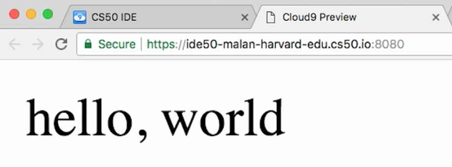
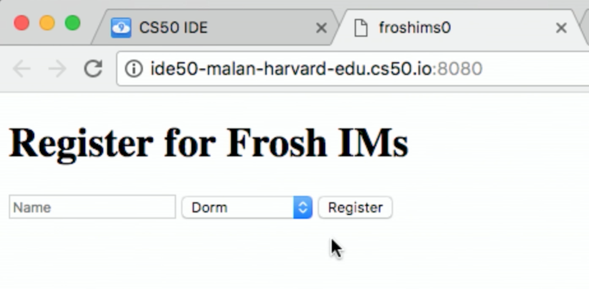
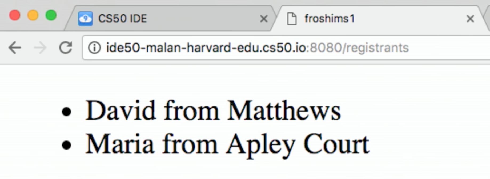

:author: Cheng Gong

= Lecture 9

[t=0m0s]
== Web Programming

* We've learned a few languages recently: HTML for marking up the structure and content of a web page, CSS for adding aesthetics and styling to our page, and Python as a high-level programming language with simple syntax focused on indentation.
* Unlike in C, Python has built-in data structures like lists and dictionaries implemented for us already, amongst other functions and libraries.
* Now we can tie everything together. Recall that, when we visit a website by typing a URL into the address bar of our browser, our browser sends a message in a virtual envelope to get data back from a server, using the `GET` verb of the HTTP protocol:
+
[source]
----
GET / HTTP/1.1
Host: www.facebook.com
...
----
* Then, the server responds with a message with the HTML file for the website, but also headers that have some response code and other metadata:
+
[source]
----
HTTP/1.1 200 OK
Content-Type: text/html
...
----
* And the HTML might have looked like this:
+
[source, html]
----
<!DOCTYPE html>

<html>
    <head>
        <title>hello, title</title>
    </head>
    <body>
        hello, body
    </body>
</html>
----
** And our browser will display the page based on the content of the HTML it gets back.
* Python is a programming language that can be used for many purposes, but today we'll use it to write a program that acts as web server, generating dynamic content.
* Let's take a look at http://cdn.cs50.net/2017/fall/lectures/9/src9/serve.py[`serve.py`] from this week's source code:
+
[source, python]
----
# Implements a web server

from http.server import BaseHTTPRequestHandler, HTTPServer

# HTTPRequestHandler class
class HTTPServer_RequestHandler(BaseHTTPRequestHandler):

    # GET
    def do_GET(self):

        # send response status code
        self.send_response(200)

        # send headers
        self.send_header("Content-type", "text/html")
        self.end_headers()

        # write message
        self.wfile.write(bytes("hello, world", "utf8"))

# configure server
port = 8080
server_address = ("0.0.0.0", port)
httpd = HTTPServer(server_address, HTTPServer_RequestHandler)

# run server
httpd.serve_forever()
----
** Recall that a web server is a program that listens for HTTP requests, and responds to those requests.
** If we look at the bottom sections, first we set the `port` that the server should listen to requests from to `8080`. Then we also set the server's address, and here we are using a new data type, a tuple, that lets us pass in any number of values at the same time.
** Next, we create an `HTTPServer` object, which is like a `struct`, that has some implementation of a web server, and call it `httpd`. Then, we call the `serve_forever` method, or function of the object, to tell it to listen and respond to requests forever.
* We can run this program with `python serve.py`, and under the CS50 IDE menu in the top left of the IDE, we can click "Web Server" to be linked to our server in another tab:
+

** Notice that the end of the URL reads `:8080`, indicating the port our browser is using to communicate with our server.
* And the content of the page, `hello, world`, comes from the middle of `serve.py`, where we specify:
+
[source, python]
----
# GET
def do_GET(self):

    # send response status code
    self.send_response(200)

    # send headers
    self.send_header("Content-type", "text/html")
    self.end_headers()

    # write message
    self.wfile.write(bytes("hello, world", "utf8"))
----
** We define a `do_GET` function to tell our program how to respond when it receives a GET request. First, we want to send the right response code, then the header for `Content-Type`, and finally just the string `hello, world`, encoded in Unicode, or UTF-8.
* This is a simple example that always returns the same page, but we can write code that returns HTML files based on the request. And while this example used Python's built-in HTTP server library to send basic responses, we'll use a framework written in Python, called Flask, to save us the work of having to implement  basic features.
* To get started with Flask, we might have searched for http://flask.pocoo.org/[its website], read through some of their http://flask.pocoo.org/docs/0.12/[documentation] and examples. Then we'd discover that we could create a Flask server object simply with:
+
[source, python]
----
app = Flask(__name__)

if request is for /
    then send back home page
else if request is for /zuck
    then send Mark's home page
else if request is for /login
    then prompt user to log in
----
** And in pseudocode, we also define routes, or URLs, so our web server knows what pages to return.
* We'll create another file with our basic HTML page and save it as `index.html`:
+
[source, html]
----
<!DOCTYPE html>

<html>
    <head>
        <title>hello, title</title>
    </head>
    <body>
        hello, body
    </body>
</html>
----
* And now we see how we can use a web server to send back pages, with pseudocode that's a little more specific:
+
[source, python]
----
app = Flask(__name__)

if request is for /
    then send back index.html
else if request is for /zuck
    then send zuck.html
else if request is for /login
    then show user login.html
----
** We can implement this functionality in Python alone, or even in C, but there would need to be many, many more lines of code. With a framework or library of code already written for us, the low-level implementation details are abstracted away.
* Indeed, the actual code to serve these pages is simply:
+
[source, python]
----
app = Flask(__name__)

@app.route("/")
def index():
    return render_template("index.html")

@app.route("/zuck")
def zuck():
    return render_template("zuck.html")

@app.route("/login")
def login():
    return render_template("login.html")
----
** We use `@app.route` to indicate what the route, or URL, should trigger the function we define below. We named it `index`, but we could have chosen some other name. Then, we call the `render_template` function built into Flask, which will return a file. And we can do this for each of the routes and pages we want to have.
** We'll save this as `application.py`.
* To make this work, we actually need a directory called `templates` where our `application.py` file is, and the `.html` files to be in that directory. (This is specified in Flask's documentation.)
* We also need to import the Flask package, or library, with the following line at the top of our `application.py` file:
+
[source, python]
----
from flask import Flask, render_template
----
** On the CS50 IDE, we've preinstalled the `flask` package, so any Python program can import it. And `Flask` is a class of objects, with variables and functions defined in the `flask` package's code. We also import `render_template`, another function we need, from the package.
* Finally, in the CS50 IDE, we can run `flask run`. (`flask` is also the name of a program that runs from the command-line, that looks for our `application.py` file and runs it for us.) Then we can visit our routes by clicking the link in the IDE, and see the pages we've created.
* If we go to `/login`, we'll see this error since we never created a `login.html` file:
+
image::login_not_found.png[alt="login.html not found", width=800]
** In Python, some errors are called exceptions, and Flask generates an HTML page that show the error and the steps that led up to it. Most importantly, we can see at the top that the error is called `TemplateNotFound`, so we have a good idea of how to fix it.

[t=31m24s]
== Frosh IMs

* Let's look at another example, a web application for intramural sports, http://cdn.cs50.net/2017/fall/lectures/9/src9/froshims0/[`froshims0`].
* We have an `application.py` file and a `templates` directory as before, but a different set of files within. In particular, we have `index.html`:
+
[source, html]
----



<h1>Register for Frosh IMs</h1>
<form action="/register" method="post">
    <input name="name" placeholder="Name" type="text"/>
    <select name="dorm">
        <option disabled selected value="">Dorm</option>
        <option value="Apley Court">Apley Court</option>
        <option value="Canaday">Canaday</option>
        <option value="Grays">Grays</option>
        <option value="Greenough">Greenough</option>
        <option value="Hollis">Hollis</option>
        <option value="Holworthy">Holworthy</option>
        <option value="Hurlbut">Hurlbut</option>
        <option value="Lionel">Lionel</option>
        <option value="Matthews">Matthews</option>
        <option value="Mower">Mower</option>
        <option value="Pennypacker">Pennypacker</option>
        <option value="Stoughton">Stoughton</option>
        <option value="Straus">Straus</option>
        <option value="Thayer">Thayer</option>
        <option value="Weld">Weld</option>
        <option value="Wigglesworth">Wigglesworth</option>
    </select>
    <input type="submit" value="Register"/>
</form>

----
** We see that it contains an `<h1>` heading and a `form` that sends information back to the server via a POST method, to the URL `/register`. POST is another HTTP verb, that sends a request not just via the URL, but form data (or other request-specific data) in other headers. If we were to use GET, the data we put in the form will be sent in the URL, and URLs also have limits to prevent larger requests like uploading a photo.
** Then, in the form itself, we collect a name via a text `input` and a dorm option via a dropdown menu created by the `<select>` element. And finally, we use `type="submit"` to create an `input` element that's a button.
* We can see this page by running `flask run` in our source directory:
+

* And we can fill out the form, or leave it blank, and see different results. If we left both blank, we'd end up at `/register` as we'd expect, but with a message telling us what we did wrong:
+
image::register.png[alt="register of froshims0", width=500]
* So let's see the logic in `application.py` that handles this:
+
[source, python]
----
from flask import Flask, render_template, request

app = Flask(__name__)

@app.route("/")
def index():
    return render_template("index.html")

@app.route("/register", methods=["POST"])
def register():
    if not request.form.get("name") or not request.form.get("dorm"):
        return render_template("failure.html")
    return render_template("success.html")
----
** First, we import some functionality from the `flask` package. Then we create an `app` and set up the route for `index.html`.
** Then we specify that the `/register` route will accept POST requests, and call the `register()` function when a user makes that request. Then, we look in the `request.form` for a `name` and `dorm`, and return `failure.html` if either are missing, or `success.html` if both are present.
* And if we look in `failure.html`, we see a bit of new syntax:
+
[source, html]
----



You must provide your name and dorm!

----
** The curly braces and percent signs are part of a templating language, where we can share the same structure amongst multiple pages.
* `layout.html` is a basic HTML page, with placeholders that are filled in:
+
[source, html]
----
<!DOCTYPE html>

<html>
    <head>
        <meta name="viewport" content="initial-scale=1, width=device-width"/>
        <title>froshims0</title>
    </head>
    <body>
        
    </body>
</html>
----
** Here, `` is a placeholder, so for `failure.html` the message `You must provide your name and dorm!` is what will be substituted into that spot in `layout.html`.
* Now let's see how we would actually store the data from the form. First, we can demo http://cdn.cs50.net/2017/fall/lectures/9/src9/froshims1/[`froshims1`] in the CS50 IDE, where we get sent to `/registrants` after we fill out the form:
+

** Each time we add someone, this list gets longer, and even if we refresh, we see the names we put in earlier.
* Let's see how this is done in `application.py`:
+
[source, python]
----
from flask import Flask, redirect, render_template, request

# Configure app
app = Flask(__name__)

# Registrants
students = []

@app.route("/")
def index():
    return render_template("index.html")

@app.route("/registrants")
def registrants():
    return render_template("registrants.html", students=students)

@app.route("/register", methods=["POST"])
def register():
    name = request.form.get("name")
    dorm = request.form.get("dorm")
    if not name or not dorm:
        return render_template("failure.html")
    students.append(f"{name} from {dorm}")
    return redirect("/registrants")
----
** Notice that we create an empty list, `students`, when our program is started. Since our server is a program that's running continuously, listening for responses, it will have that variable available while it's running. Then, in the `register()` function, we add each student as a formatted string with the `name` and `dorm` from the request. Recall that `append` is a method in Python to add an element to a list, growing it automatically.
** At the end, even though the user requested `/register`, we are using the `redirect` function to send them to `/registrants`.
** And for the `registrants` route, we still use `render_template` to return `registrants.html`, but now we are passing in `students` as an additional argument. `render_template` supports additional, optional parameters, so we pass in the `students` list and name it `students` for that function to refer to as well.
* Now, in `registrants.html`, we see an unordered list:
+
[source, html]
----




<ul>
    
    <li>{{ student }}</li>
    
</ul>


----
** We have a simple language available to us in these templates, called Jinja, to display information. We can think of it as Python code, with loops and conditions, but not much more than that. We can iterate over each string in our `students` list by saying `for student in students`, and within the loop `{{ student }}` simply substitutes that string in our `students` list into a list item, `<li>`. Then `endfor` is the keyword to end that loop.
** And if we were to View Source of that page, we'd see that list generated like so:
+
image::registrants_source.png[alt="source of registrants of froshims1", width=500]
*** Recall that the other parts of the page are from `layout.html`.
* In http://cdn.cs50.net/2017/fall/lectures/9/src9/froshims2/[`froshims2`], we'll send an email when someone actually registers. In `application.py`, we have:
+
[source, python]
----
import os
import smtplib
from flask import Flask, render_template, request

# Configure app
app = Flask(__name__)

@app.route("/")
def index():
    return render_template("index.html")

@app.route("/register", methods=["POST"])
def register():
    name = request.form.get("name")
    email = request.form.get("email")
    dorm = request.form.get("dorm")
    if not name or not email or not dorm:
        return render_template("failure.html")
    message = "You are registered!"
    server = smtplib.SMTP("smtp.gmail.com", 587)
    server.starttls()
    server.login("jharvard@cs50.net", os.getenv("PASSWORD"))
    server.sendmail("jharvard@cs50.net", email, message)
    return render_template("success.html")
----
** At the top, we have a new import, `smtplib`, a library we can use to send email. In `register()`, we first check that the user provided all three items in the form. Then, we look up the documentation for `smtplib` and create a `SMTP` (email) server with the `smtplib` library, and call it `server`. We want to connect to `smtp.gmail.com` (which will actually send the email), and to do that we have to specify:
*** the port to use, `587`, since this is a mail server (which we only know from searching and looking at documentation)
*** `starttls`, to indicate that we want the connection to be encrypted over a protocol called TLS
*** our own login information, which is `jharvard@cs50.net`, and also a `PASSWORD`, stored as an environment variable, which is like a global variable set and stored in the CS50 IDE
** Then we call the `sendmail` function, passing in the `email` the student typed in, along with the `message` string we wrote.
* Instead of sending each registrant out as an email, we can save it to a file in http://cdn.cs50.net/2017/fall/lectures/9/src9/froshims3/[`froshims3`]. `application.py` looks like:
+
[source, python]
----
from flask import Flask, render_template, request
import csv

app = Flask(__name__)

@app.route("/")
def index():
    return render_template("index.html")

@app.route("/register", methods=["POST"])
def register():
    if not request.form.get("name") or not request.form.get("dorm"):
        return render_template("failure.html")
    file = open("registrants.csv", "a")
    writer = csv.writer(file)
    writer.writerow((request.form.get("name"), request.form.get("dorm")))
    file.close()
    return render_template("success.html")
----
** We import another library, `csv`, so we can read and write to CSV, comma-separated-values, files.
** In `register()`, after we check that `name` and `dorm` both have values, we use `file = open("registrants.csv", "a")` to open a file called `registrants.csv` in the directory where our web server is running. The `a` flag allows us to append, or add, to the file, without overwriting what was already there.
** Then, we use the `writer` from the `csv` package to create a `writer` of our own (like how we created a mail server above), which we can then use to write a row to the `file` we passed in. We do that by calling the aptly-named `writerow` function, passing in a tuple of values we want for that row.
** Finally, we close the file to indicate that we're done with it.
* If we run our server now, submit a few responses (or ask the audience to), we can see `registrants.csv` in our IDE's file list. Then, we can download it and open it in Excel.

[t=1h10m48s]
== Similarities

* In Problem Set 6, we'll combine the topics of the past three lectures, using what we've learned about edit distance and web programming. We'll write a web application that compares strings character by character, or files line by line.
* We can see a live demo of the more comfortable version at http://similarities.cs50.net/more[http://similarities.cs50.net/more], where  we use Bootstrap, a CSS library, to help style the forms and buttons.
* If we type in two strings into the form, we'll see a matrix of numbers, with each of the numbers representing the cost of converting one string (up to that character) to the other (up to that character). (More on this in Week 6's lecture!) And while that number on its own might not seem that useful, we know that a high number means that the two strings are more different, while a low number means that the two strings are more similar.
* For the less comfortable version at http://similarities.cs50.net/less[http://similarities.cs50.net/less], we'll allow two files to be uploaded, and compare them in few different ways. We can compare the lines as they appear in the files, compare the sentences in the files (even if they are on different lines), or all the substrings in the files of a particular length. See http://docs.cs50.net/2017/fall/psets/6/pset6.html[Problem Set 6] for more details!
