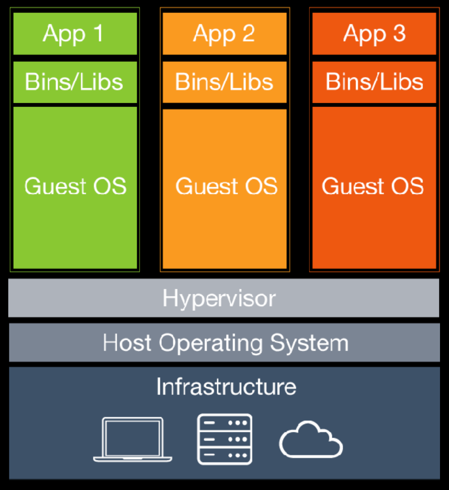

:author: Cheng Gong

= Cloud Computing

== Last Time

* We dabbled in a little web design last time, and today we'll talk about the architecture for websites.
* We also gathered some feedback from everyone, and it seems like folks are on a spectrum of understanding and pacing, so feel free to slow David down as needed! And additional resources like office hours are always available.
* We also talk about some samples of specific comments. Please try to not be distracted by technology during class, since it distracts others too.
* This class is more lecture-based in order to deliver technical content, but now that we've built a common vocabulary and cover higher-level topics, we'll see deeper and more meaningful discussions.
* And in these last weeks, we'll start talking more about managerial and business decisions as pertinent to CS. Hopefully this course will allow you to ask the right kinds of questions, speak with some understanding, and discuss tradeoffs in decisions.
* Last week Comcast actually blocked some of Cloud9's IP addresses, since some user of Cloud9 was using their account for phishing attacks. But since Cloud9's IP addresses are shared among its users' workspaces, Comcast ended up blocking all access to its services.

==  Cloud Computing

* To put ourselves online, we need at least the following steps:
** Register for a domain name
** Pay for web hosting (storage space, bandwidth, CPU)
*** This could either be *shared hosting*, where many customers of a web host are on the same servers, so one website's spike in traffic might impact the performance of others, and generally the servers are centrally managed by the web host's administrators, so a uniform set of software is installed (for better or worse) and a certain set of languages are supported.
* "Cloud computing" is actually the same concept, where customers are renting resources on servers physically elsewhere.
* There is no upfront cost, a lower time to execution, since the hardware is already set up, and no need for in-house IT.
* There's also geographic optimization (if the servers are closer to the users than your headquarters might be). We can use economies of scale to put our content all over the world.
* And while we might be gaining the expertise of someone else who can manage these resources for us, we are also trusting that they are indeed keeping our data secure.
* Providers also tend to have SLAs, Service Level Agreements, where a certain percentage of uptime (like 99.999%) is guaranteed.
* It's also more scalable quickly, since we don't need to go and buy any servers to increase our capacity. Instead, it might just take a few clicks and minutes.
* Since there's no physical infrastructure of our own, we don't need to spend as much time or effort connecting cables and such.
* Suppose that, instead, we decided to build our own data center, and a consultant proposes that we buy 10 servers at $10,000 each.
* We might ask what our uptime will be, and more specifically what kind of redundancy there is. We might want, for example, the internet connections, HVAC, and data storage to be redundant.
* For our internet connection, we might pay two providers so if one somehow goes down, we still have some connectivity, with the tradeoff being cost.
* If the AC fails, our servers are on a small enough scale that they can probably still operate without overheating.
* We might want to have multiple drives with automatic duplication, such that anything written to one drive is written to another at the same time, so if one fails we have a chance to preserve our data. One technology that helps with this is RAID, Redundant Array of Independent Disks. We might also back up all the data once a day to other media, and we might ask how long it would take to recover from any failures.
* Anothr question is to ask what our capacity is, and one way we could determine this is by running software on our own laptops that send requests over and over to our server, to see how many it can respond to at once.
* What are the costs to running these servers after the initial cost?
* We take electrical power for granted, but generally servers require a lot more energy than normal computers, so we might need to figure out our wiring too.
* We could place our servers in warehouses (also known as data centers) where we can rent space to put our own servers, and not worry about power or HVAC. We can still connect to our servers remotely with technologies like SSH (which gives us terminal access to a remote computer) or Windows/Apple Remote Desktop that shows us the graphical interface. We do give up some control over the physical security of our servers.
* To avoid downtime from scaling up our servers in the cloud, we might want to proactively select servers with more CPUs and resources, but that incurs a higher cost.
* Given the advantages of cloud computing, for almost all purposes and scales, it makes sense to at least start there.
* Dropbox, for example, only recently moved away from Amazon Web Services' storage as it finally makes financial sense for them to run their own data centers.
* CS50, too, uses a CDN that actually just points to Amazon's storage servers for static files like slides. The location we choose is Northern Virginia, since that's the closest Amazon data center to campus. And even though we only have our data in one location, we chose to not pay twice as much for redundancy, opting instead to have a short amount of downtime every once in a while.
* A service like Amazon's is in the category of IAAS, Infrastructure as a Service, where they provide the hardware and power and networking, but we need to install any software we want to run on top.
* Dropbox, by contrast, is in the category of SAAS, Software as a Service, where they write the application and we simply run and use it.
* In between, we have companies that provide PAAS, Platform as a Service. One example is Heroku, where they have servers preconfigured for languages, frameworks, databases, and scaling and infrastructure figured out for us. Then all we need to do is write our application, and not have to spend time configuring servers. The tradeoff there is control and cost.
* Switching providers or building our own infrastructure after having set up somewhere already does come with a cost, and possibly downtime. Moving customer data we've accumulated, too, might take some time.
* The following diagram shows virtualization:
+

** A hardware server is set up to run multiple software systems at once.
** Each colored stack is a different customer with their own operating systems and applications.
** Their operating systems run on a software called a hypervisor, which handles separating resources among them.
* Recently, a new trend called containerization, with software such as Docker, allows the same effect of multiple, segregated applications, with less overhead of runnning entirely different operating systems for each user.
+
image::docker.png[alt="Virtualization stack with Docker", width=400]
** Users then write software that run in a container, which is standardized, and so can easily be moved between cloud services.
** But even though our code will be simpler to move, we still have to consider our data and DNS records and other configuration to migrate.
* Both virtualization and containerization allow for multi-tenancy, where multiple customers share the same hardware server owned by some web host.
* Providers like Amazon also allow for dedicated hosts, or one hardware server per a single customer, though that costs more.
* In addition to the cost for the service, we need to take into account our human time or learning a new service.
* An application like GMail is SAAS, and they might have a team who writes the code of the webpages, and a team who works on the infrastructure. Then, with abstraction layers, they might have an interface where the code can be deployed, or uploaded, to the actual servers that run them, so each team can focus on the aspect they're responsible for.
* Finally, if we end up needing to increase capacity to support more users, we might want to increase the number of servers we're using.
* But our users from the Internet might be using either of those servers, and expect the same data on their accounts to be available all the time.
* Now we might think about a separate database server that both web servers use, but now we've created another bottleneck or single point of failure.
* More on this next time!
