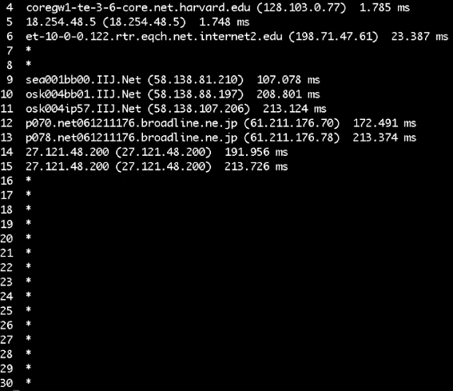
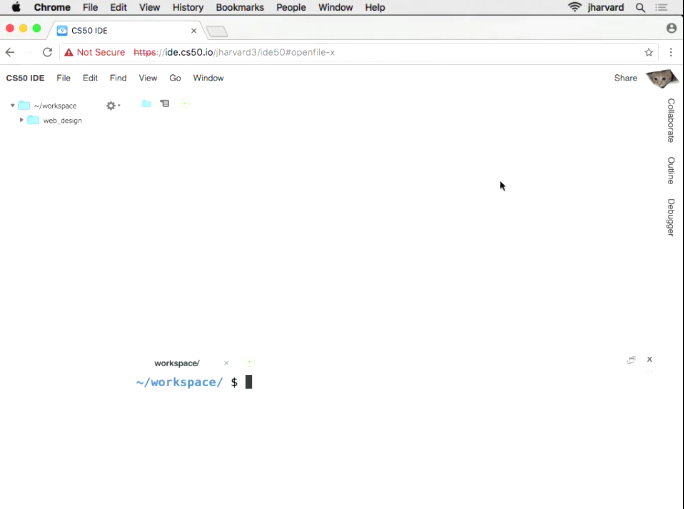
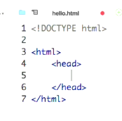
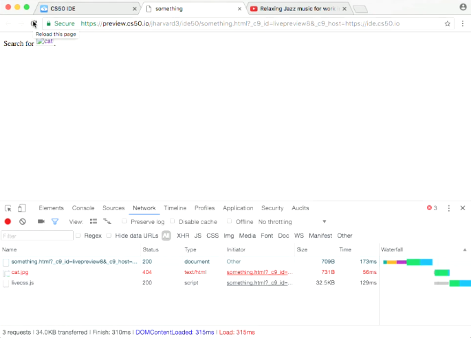
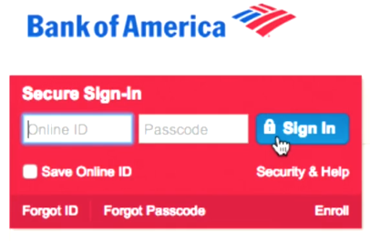
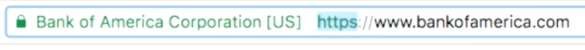

:author: Cheng Gong

= Web Design

== Last Time

* We used a Terminal window to run our commands, and it's just a place where we can type textual commands, interacting with our computers directly, and see the textual output from them.
* With it, we'll run the `traceroute` command again, this time with more hostnames shown:
+
image::traceroute.png[alt="traceroute", width=600]
** Now we can guess where each row, each of which is a router that forwards our packets along, is located.
** The first two start with `10`, so they have local IP addresses that mean they are on the local network.
** The next two are owned by Harvard, and the next two are anonymous, but routers 8 and 9 seem to be located in Chicago, from a provider with an hostname of `internet2.edu`.
** Router 10 seems to be in Denver, and our packets traveled to Salt Lake City and Los Angeles next before finally reaching Berkeley's servers.
** Remember that our packets might end up taking a different route each time, since each router decides which router to forward it to next, but hopefully they all end up at the same endpoint.
* In theory, we could have routers send information around the other side of the world, if there was something massive in between that prevented the shortest paths from working. Though the price for that would be latency, since there would be more hops before we got a response back.
* We can `traceroute` to `www.cnn.co.jp` again today, and some routers are in a "privacy mode" where they aren't responding to direct inquiries about their IP, but we see a jump in latency between routers 6 and 9:
+

* We could run this at home and the first router we'd see is the one we have at home, that we got from our ISP. That device might have a modem to connect via cable or phone line, and have wifi built-in, but those are features on top of its routing capability.
* Comcast has provided a service for all of its subscribers with a wifi network called `xfinitywifi` that's available in many places all over the country, and it actually comes from each of its customers' own routers (that Comcast provided them). In addition to each customer's private network, Comcast also configured their routers to broadcast a public network for its other customers to use.

== HTML, CSS

* Today we'll be using http://cs50.io[http://cs50.io] to explore Web Design with some hands-on activities.
* Cloud9, the underlying software for cs50.io, is an integrated development environment, a set of tools built for writing code.
* We've added features to the standard, commercial Cloud9 that lives at http://c9.io, used by professional developers, to help simplify and assist with learning to code.
* Once you log in, you can create a new workspace, and you should see a screen like the below:
+

* On the left, we have a list of our files, the top right half is our code editor where we will type code, and the bottom right panel is a terminal window where we can type commands in.
* We can start by typing in `update50` and pressing enter, to update our software.
* To get started, let's look at a simple webpage:
+
[source, html]
----
<!DOCTYPE html>

<html>
    <head>
        <title>hello</title>
    </head>
    <body>
        hello, world
    </body>
</html>
----
** This is a page written in HTML, a markup language, which has no functions or variables like a true programming language.
** Instead it has opening tags like `<title>` and closing tags like `</title>` that tell a browser how to display portions of the page.
** The first tag, `<!DOCTYPE html>`, indicates that this page is written in HTML.
** `<html>` and `</html>` indicates that everything inside is part of the HTML page.
** A webpage has two major parts, a `<head>` and a `<body>`, and we see both of those sets of tags inside. The `<head>` has information for the title bar and metadata, data describing the page but not necessarily displayed, and the `<body>` contains what should be displayed on the page itself.
** We see a `<title>` tag tells the browser what the title of the page is, and a closing tag for it after.
** In the `<body>` tag we just have some plain text that reads `hello, world`.
* We notice symmetry in the page, as well as a notion like a tree, with indentation and line breaks that help us humans read the page more easily. The browser doesn't take the whitespace into account, but it's part of our own style of coding to have our code be https://en.wikipedia.org/wiki/Prettyprint["pretty-printed"]
* We'll head back to our cs50.io workspace, where we'll use the plus sign to create a new file and save it as `hello.html`:
+
image::new_file.png[alt="cs50.io new file", width=300]
* We can start typing into that file, and our IDE is smart enough to automatically put a closing tag for us, as well as helping us indent when we press enter:
+

* We can right click that file now, and click `preview`, to see it opened as HTML:
+
image::preview.png[alt="preview of hello.html", width=400]
* Then we can click the `Browser` tab on the right, and it will show us our page in our own browser. We can change our title, save the file, and see the page updated when we refresh it.
* These days webpages are typcially generated by other software or programs we write ourselves in programming languages like Python, but we'll start by learning some more basic concepts.
* We can make a new file, save it as `paragraphs.html` with the following code, and view it:
+
[source, html]
----
<!DOCTYPE html>

<html>
    <head>
        <title>paragraphs</title>
    </head>
    <body>
        

            Lorem ipsum dolor sit amet, consectetur adipiscing elit. Nullam in tincidunt augue. Duis imperdiet, justo ac iaculis rhoncus, erat elit dignissim mi, eu interdum velit sapien nec risus. Praesent ullamcorper nibh at volutpat aliquam. Nam sed aliquam risus. Nulla rutrum nunc augue, in varius lacus commodo in. Ut tincidunt nisi a convallis consequat. Fusce sed pulvinar nulla.
        

        

            Ut tempus rutrum arcu eget condimentum. Morbi elit ipsum, gravida faucibus sodales quis, varius at mi. Suspendisse id viverra lectus. Etiam dignissim interdum felis quis faucibus. Integer et vestibulum eros, non malesuada felis. Pellentesque porttitor eleifend laoreet. Duis sit amet pellentesque nisi. Aenean ligula mauris, volutpat sed luctus in, consectetur id turpis. Phasellus mattis dui ac metus blandit volutpat. Donec lorem arcu, sollicitudin in risus a, imperdiet condimentum augue. Ut at facilisis mauris. Curabitur sagittis augue in dictum gravida. Integer sed sem sed justo tempus ultrices eu non magna. Phasellus semper eros erat, a posuere nisi auctor et. Praesent dignissim orci aliquam laoreet scelerisque.
        

        

            Mauris eget erat arcu. Maecenas ac ante vel ipsum bibendum varius. Nunc tristique nulla eget tincidunt molestie. Morbi sed mauris eu lectus vehicula iaculis ac id lacus. Etiam sit amet magna massa. In pulvinar sapien ac mi ultrices, quis consequat nisl hendrerit. Aliquam pharetra nec sem non vehicula. In et risus leo. Ut tristique ornare nisl et lacinia.
        

    </body>
</html>
----
** We needed to use the `
` tag to explicitly indicate to the browser that we want each group of text to be paragraphs, separated by whitespace. And if we were to add spaces ourselves, the browser would ignore it and normalize them all to one space.
* In the http://cdn.cs50.net/2017/mba/classes/web_design/web_design.zip[source code ZIP file], we open and look at a few more examples, such as `headings.html`.
* In particular we notice:
** Code that starts with `<!--` and ending in `-->` are comments, or notes that programmers can leave for other humans reading the code, but not for the program or browser to actually use or display.
** We add `lang="en"` to the inside of our opening `<html>` tags, so browsers don't try to translate them.
** We can add headings, links, and images to our webpages with the right tags.
** A link to search for `cats` on Google might look like `https://www.google.com/search?q=cats`, and it seems like we can replace the `cats` portion of the URL with anything we want to look for. The base URL is `https://www.google.com/search`, and the `?` allows us to pass in specific input to web servers. `q` probably stands for "query", and what we want for that particular parameter is `cats`, so we pass that along.
** Different browsers have slightly different implementations of various elements, since the standards for HTML might be ambiguous or open to interpretation.
** An `` tag has no closing tag, since it's just a single image each time, so instead it's closed with a `/` at the end, as in ``. This tag also has attributes of `alt` and `src`, describing the alternate text (for screen readers and the like) and source of the image respectively. We'd only know what the list of these attributes of tags would be from looking up examples and documentation. The `cat.jpg` reference in the `src` attribute also needs to be in the same folder as our page, but we can specify a full URL of an image elsewhere on the web too. Finally, the `title` attribute allows us to display text when a user hovers over the image.
** If we needed to host lots of images and videos, we might need to find services separate from our web host, like a content-delivery network.
* We combine two tags, to make an image link to another page, by nesting two tags:
+
[source]
----
....

....
----
* But for some reason, this doesn't work:
+

** To try and debug this, we can right click the page, click `Inspect`, then look in the `Network` tab.
** We see that `something.html`, our main HTML page, was returned with status 200, which means OK, but `cat.jpg` had a status of 404, whichs not found.
** It turns out, if we look in our list of files in our IDE, `cat.jpg` is actually in a folder called `web_design`, not the root folder where `something.html` is.
** We can change the image tag to have `src="web_design/cat.jpg"`, and that will fix our image.
** We can also add a `width` attribute to our `img` tag, to specify how big the image should be.
* Now we can do something like this:
+
[source, html]
----
<!DOCTYPE html>

<html>
    <head>
        <title>PayPal</title>
    </head>
    <body>
        Confirm your password at <a href="http://somedomainIownandiamahacker.com">paypal.com.</a>
    </body>
</html>
----
** Now if we weren't paying attention and clicked that link, we might have been phished, or tricked to putting in our password into a fake website.
* Websites like Bank of America's also sometimes have a padlock icon:
+

** But we now know that anyone can just add an image of a lock anywhere on a webpage, so it doesn't really mean that the website is any more secure.
* Instead, we want to check that the website has `https`, so that the connection is secure, and is operated by who we think is operating it:
+

* Since the browser needs to have the source code of a webpage in order to display it, we can also view it and copy it on our own page. Even though some links might not work, it could easily trick users.
* When sending emails to customers, including links in them might condition them to trust links from emails, even if they are not legitimate emails or links to fake websites.
* We take a look at `list.html` and `table.html` in the source code folder as examples of more features of HTML.
* CSS is another language used to style webpages. In `css0.html`, we see inline CSS:
+
[source, html]
----
<!DOCTYPE html>

<html lang="en">
    <head>
        <title>css0</title>
    </head>
    <body>
        <header style="font-size: large; text-align: center;">
            John Harvard
        </header>
        <main style="font-size: medium; text-align: center;">
            Welcome to my home page!
        </main>
        <footer style="font-size: small; text-align: center;">
            Copyright &#169; John Harvard
        </footer>
    </body>
</html>
----
** We have new tags, `header`, `main`, and `footer`, and each of them have a `style` attribute now. Within that attribute, we've added styles (that we can look up online with examples of documentation) that change the font-size and alignment.
** `font-size`, for example, is a CSS property that we've assigned the value of `large` for `header`.
* But now our data is mixed with our styles, and we might want to separate it out so that we're not repeating these styles everywhere, and be able to work on different aspects separately.
* In `css1.html`, we factor out one property, `text-align`, to apply to the entire `body` element, as opposed to applying it to each element individually.
* In `css2.html`, we've added the `class` attribute to each our elements, and added an entire `style` section to the `head` element of our page.
* In `css3.html`, we apply the styles to each element directly.
* Finally, `css4.html` has our styles extracted to a different file altogether, `css4.css`, cleaning up our page even further.
* We take a look at `search.html`, where we built a form that takes us directly to Google's search based on what we typed in there.
* Next time we'll explore how to build a back-end that can return results dynamically.
