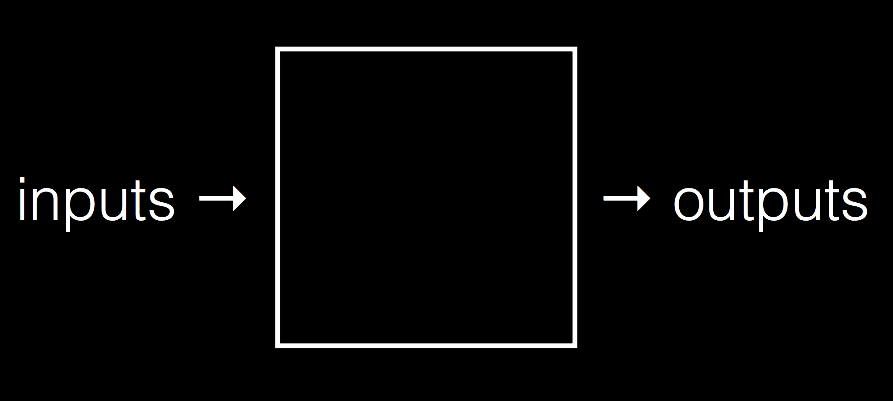

:author: Cheng Gong

= Computational Thinking

== Algorithms

* Welcome to CS50 for MBAs, based on Harvard College's CS50 for undergraduates, focusing more on design decisions and technological vocabulary.
* First, we start with an activity where everyone follows these steps:
** 0 Stand up and think of the number 1.
** 1 Pair off with someone standing. Add your numbers together.
** 2 One of you should then sit down. If you're still standing, go back to step 1.
* These steps are called an algorithm, a series of steps for solving a problem.
* As everyone followed these steps, we were left with one person standing, whose number is the number of people in the room. (Or, we were supposed to!)
* Another algorithm for solving the same problem (counting the number of people in the room) would be David counting each person, one at a time.
* We can compare the efficiency of algorithms very roughly, with a graph like the following:
+
image::efficiency.png[alt="Efficiency", width=800]
** The x-axis is the size of the problem, and the y-axis is the time it takes to solve that problem. With `n` as the size of the problem, the red line represents the algorithm where David counts everyone one at a time. The time to solve, then, increases linearly with the size of the problem.
** The yellow line is a better algorithm, where David counts two at a time, which, though twice as fast, still increases linearly with the size of the problem.
** The green line represents the algorithm we attempted in class. Since half of the people sat down at each step, the line will have a *logarithmic slope* that increases more and more slowly as the problem gets larger. With larger sets, these algorithms are essential.
* A good algorithm will solve a problem correctly and efficiently, and there is a tradeoff with the effort it takes to write an algorithm, and how efficient it is.

== Classes

* The course's https://cs50.github.io/hbs/syllabus[syllabus] includes a list of our upcoming classes and topics.
* Along the way, we'll also have optional https://cs50.github.io/hbs/seminars[seminars] led by various teaching fellows, covering additional topics or hands-on activities for those interested. The calendar there will include each seminar's time and location!
* After each class, we'll have some homework, whether they are short assignments due by the next class, or larger projects due over a longer timeframe.

== Computational Thinking

* We can think of "computing", or solving a problem, as taking some inputs (like some people in a room or a file of data), and producing some outputs (like counting the number of people, or deeper analysis of a dataset):
+

* The "black box" in between is our topic of interest.

=== ASCII, binary

* *Binary* is a system of counting that uses two symbols, ``0``s and ``1``s. Humans typically use decimal, with ten symbols, ``0`` through ``9``.
* Computers, at a very basic level, take in electricity as input, whether from an outlet or a battery.
* In decimal, `123` is one hundred and twenty-three. And if we think way back to grade school, that's because each column has a place value, and we add them up like so:
+
[source, subs=quotes]
----
    100         10          1

      *1*          *2*          *3*

100 x 1     10 x 2      1 x 3
----
* Binary represents numbers in the same pattern, but using powers of 2 instead of powers of 10 that decimal uses. The first row shows the value of each column, like the 100, 10, and 1 above, and the second row is our current binary number.
+
[source, subs=quotes]
----
      4          2          1

      *0*          *0*          *0*
----
* To represent a 1, we simply place a `1` in the ones column:
+
[source, subs=quotes]
----
      4          2          1

      *0*          *0*          *1*

             1 x 1
----
* And a 2 like so:
+
[source, subs=quotes]
----
      4          2          1

      *0*          *1*          *0*

             2 x 1
----
* And a 3 by combining the previous two steps:
+
[source, subs=quotes]
----
      4          2          1

      *0*          *1*          *1*

             2 x 1      1 x 1
----
* We can continue this pattern:
+
[source, subs=quotes]
----
      4          2          1

      *1*          *0*          *0*

  4 x 1
----
+
[source, subs=quotes]
----
      4          2          1

      *1*          *0*          *1*

  4 x 1                 1 x 1
----
+
[source, subs=quotes]
----
      4          2          1

      *1*          *1*          *0*

  4 x 1      2 x 1
----
+
[source, subs=quotes]
----
      4          2          1

      *1*          *1*          *1*

  4 x 1      2 x 1      1 x 1
----
** Notice that with 3 bits, we have 2^3, or 8 possible values, but since 0 is one of them, 7 is the highest we can count to with 3 bits.
* But once we have used up all the places, we need more *bits*, or binary digits, each of which can store a `0` or `1`. With additional digits, we can represent larger numbers like 8:
+
[source, subs=quotes]
----
      8          4          2          1

      *1*          *0*          *0*          *0*

  8 x 1
----
* So our computer has many many switches (called transistors) that can be turned on or off given electricity, and a switch that is on represents a 1 and a switch that is off represents a 0.
* A CPU, central processing unit, is a chip inside computers with billions of these transistors, that constantly turn on and off to store information, count, and perform other numeric operations.
* So far we've represented numbers, but we also know that computers can represent letters of the alphabet. Some years ago the world decided on a standard mapping of numbers to letters, called http://en.wikipedia.org/wiki/ASCII[*ASCII*].
* In ASCII, the letter `A` is the decimal number 65, `B` 66, `C` 67, and so on. And lowercase letters are another set of numbers. Numbers, too, that you type, would be represented as different binary numbers according to the standard.
* Initially, only 8 bits were allocated for one character, so the maximum number of different characters that could be represented in that number of bits is 2^8 = 256. (Remember that one of those values is 0, so the maximum decimal number that can be stored in 8 bits is 255.) And computers generally use 8 bits at a time by convention, so 8 bits is a byte.
* A message like `HI!` would be represented with 3 bytes, and the bytes would have the values of ``72``, ``73``, and ``33``.
* We can also represent colors using a system called https://en.wikipedia.org/wiki/RGB_color_model[*RGB*], where three values each represent the amount of red, green, and blue that mixes together to represent some color. It turns out, if you combine ``72`` units of red (out of a maximum of 255), ``73`` units of green, and ``33`` units of blue, you end up with a dark yellow shade.
* So our computer screens, if you lean in really close, are made up of lots and lots of dots, or pixels, each with some RGB value that together form a picture or text.
* So far, we've seen a few examples of abstraction, where the low-level implementation detail is abstracted away, such that a more useful, interesting concept is layered on top of a more basic idea. Letters and pictures are represented ultimately with binary in a computer's memory, but we no longer need to consider how that happens once we accept that it can be done.

== Abstraction

* We can demonstrate this with an activity. Everyone is given a sheet of paper, and a volunteer describes a picture with four shapes for everyone to draw.
* With short instructions like "draw a square, after that draw a circle", we get a variety of sizes and interpretations:
+
image::drawing1.png[alt="Drawing 1", width=300]
+
image::drawing2.png[alt="Drawing 2", width=200]
* But we notice that everyone knew what a "square" and "circle" was, demonstrating the use of abstraction in the instructions our volunteer gave. She didn't need to specify that a "square" was made up of four lines at right angles to each other, etc.
* Without more precise instructions, none of these drawings are wrong, but they don't all match the original intention. Similarly, when programming, we often need to be very specific with our code.
* Next, we show a picture of a cube, and the audience instructs a volunteer to draw it on the board. First, she draws the Y shape that is the center of the cube, and completes each side with more specific instructions of lines and how to connect them.
* We noticed that a high-level abstraction, like "draw a cube", was insufficient for our volunteer. But now that we've taught her to "draw a cube", we can extend that with instructions like "draw a cube half as big", without having to redescribe how to draw an original cube. On the other extreme, we might have told our volunteer very specific instructions like "put the chalk on the board, and move it at a 45 degree angle".
* When writing software, deciding the level of abstraction is an important decision: a developer can write everything from the ground up, use an open source project as a starting point, or adapt some other software that's almost exactly what's needed.

* Another example of a problem is finding someone in a phone book. We have a phone book of names and numbers as our inputs, and the output we would like is the number matching someone like Mike Smith. One algorithm is to open the phone book to the first page, look for Mike Smith, and then the second page, and then the third page, and so on, until we find Mike Smith. This algorithm is correct, since we'll either find him or reach the end of the phone book, but it's not very efficient.
* We can flip two pages at a time, and that would be twice as fast as the previous algorithm. We might miss him if he is on an odd page, so we'll need to go back once if we reach a letter that's past Smith, and then we'll have an algorithm that's correct.
* Instead of either of those, we can go straight to the middle, and find ourselves in the M section. Then we'll know that Mike Smith is in the right half of the book, and be able to throw the left half away. We can repeat this again and again, and eventually find one page. With 1000 pages, it would only take about 10 steps of division to reach that one page. This algorithm is called binary search, as we divide the problem in half each time.
* But the downside of this algorithm is that the phone book had to be sorted already, and if we only want to search it one time, it might make more sense to use our first algorithm of searching one page at a time, rather than spend more time sorting all the names. The human time it takes, too, to write a more sophisticated and efficient algorithm, also needs to be considered. And *technical debt* is a term to describe this tradeoff of taking some shortcuts in writing software, for short-term benefits (such as a quicker development time), in exchange for long-term needs (like a faster algorithm or maintainable code).
* We can write algorithms in *pseudocode*, not actual code but more specific words than typical English. For finding a name in a phone book, we might write pseudocode like the following:
+
[source, pseudocode]
----
 0   pick up phone book
 1   open to middle of phone book
 2   look at names
 3   if Smith is among names
 4       call Mike
 5   else if Smith is earlier in book
 6       open to middle of left half of book
 7       go back to step 2
 8   else if Smith is later in book
 9       open to middle of right half of book
10       go back to step 2
11   else
12       quit
----
* Notice that there is a structure, with indentation indicating what we might do under certain conditions.
* Some of these lines are actions we might take, like `pick up` or `open to` or `look at` or `call`. We'll call these functions.
* `if`, `else if`, and `else` are leading to branches, or decision points, based on whether or not the expression, like `Smith is among names`, is true. If we forgot to include the last `else` condition, we'd end up with undefined behavior that we might have experienced before, when a program on our computer hangs or crashes.
* These expressions are called Boolean expressions (named after someone with the last name Bool), and can either be true or false, to use as conditions to decide which paths to follow.
* We also have lines like `go back to step 2` that induce a loop, where there is a cycle that does something over and over again. Hopefully, our program eventually exits, but in some cases (like for a clock), we might want a loop to run forever.
* And in the world of web browsers, where web standard specifications are written in English, different interpretations by different companies lead to websites being displayed slightly differently in different browsers, if there are ambiguous or undefined cases.
* Finally, we know that computers have a finite amount of memory called RAM, Random Access Memory. And that memory is further divided into smaller sections, each of which is allocated by the computer to store some value. But if the value a program tries to store is larger than that section of memory can hold, the program will have a bug, or problem, called *integer overflow*.
* With 8 bits, for example, we can store a value of 254:
+
[source]
----
11111110
----
* We can add one, and store 255:
+
[source]
----
11111111
----
* But now if we add one more to that value, we'll start from the right and add 1 to each place, getting 0 and carrying the 1 to the next place:
+
[source]
----
00000000
----
** But when we get all the way to the left, there's no place to put the final 1.
* And this was the cause of the Y2K problem, where two-digit years became 00 in the year 2000, and so 2000 was ambiguous with 1900.
* In video games, and aircraft electronics, counters that overflow can lead to undesired behavior too.
* In today's assignment, you'll explore a similar concept, floating-point imprecision. 1/3, for example, is 0.333... with an infinite number of threes. But we can't represent all of them, so at some point we lose precision in our decimal numbers.
* See you next time!
