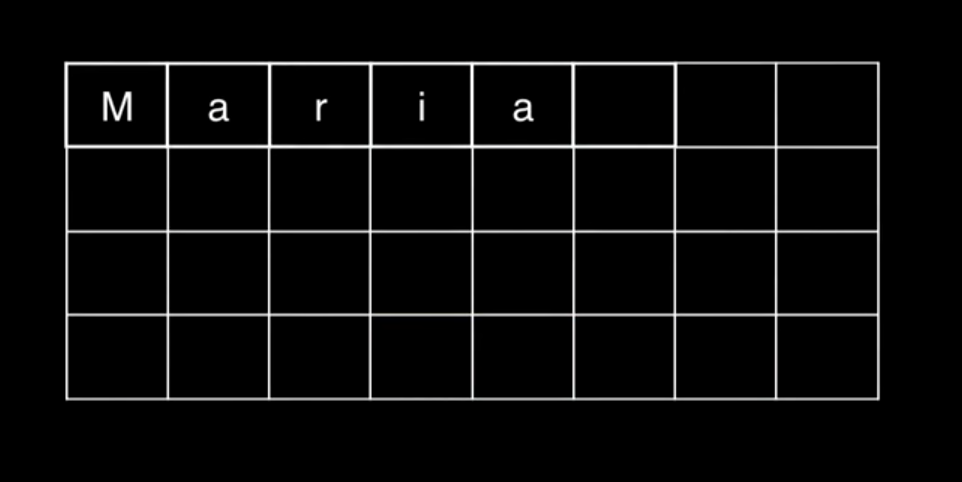
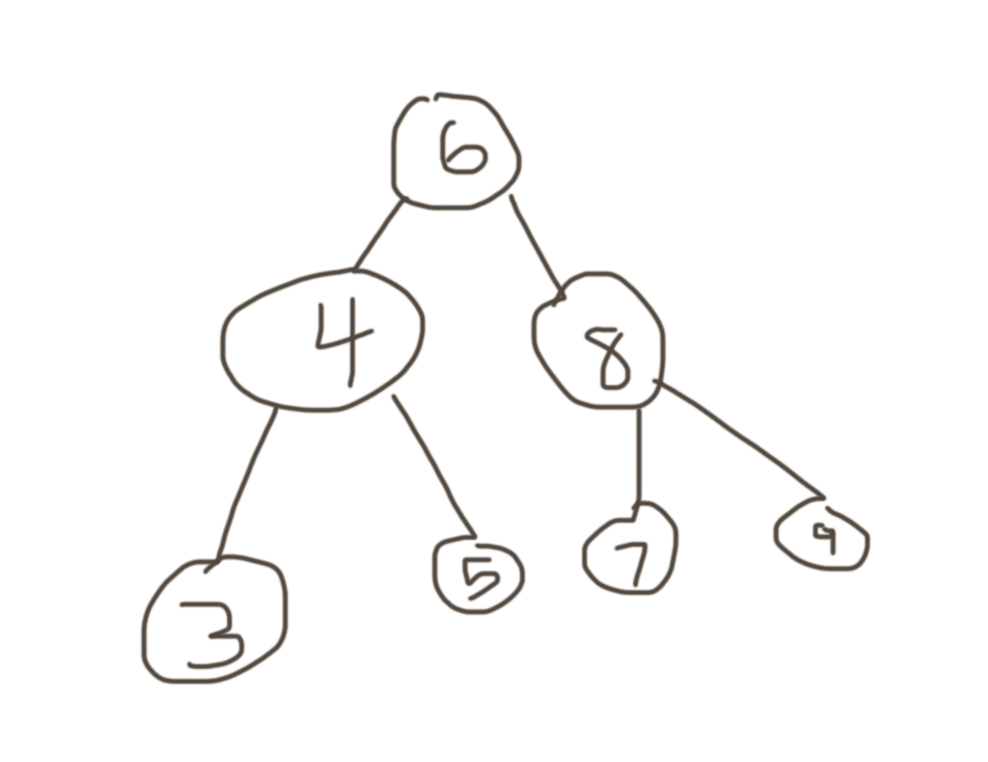
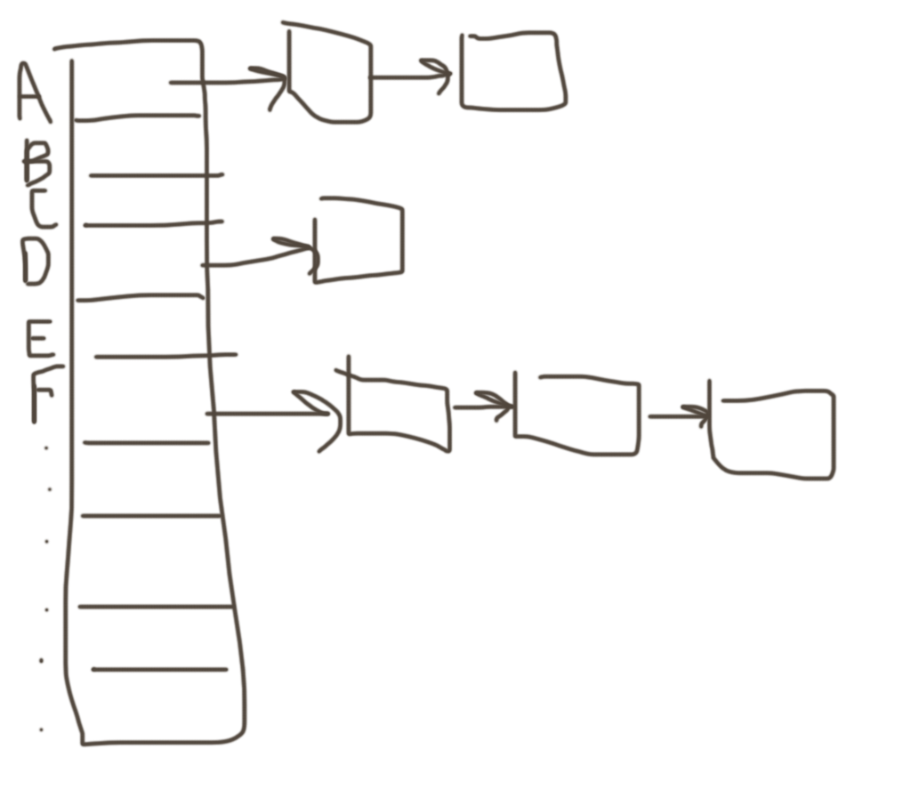

:author: Cheng Gong

= Algorithms, Data Structures

== Last Time

* Don't forget that we have a https://cs50.ly/hbs50[Slack] channel for asking questions, and https://cs50.github.io/hbs/hours[office hours] for smaller discussion about course material or anything related.
* Scratch is a graphical programming language, where we can drag together building blocks to make a program. Each building block is a component of programming, such as a function, loop, or variable.
* We also got to see other programming languages, including C, which needed to be compiled. And we saw how abstraction can allow us to build something complex, by using layers and layers of simpler concepts.

== Algorithms

* We've seen this chart before, depicting the efficiency of algorithms:
+
image::efficiency.png[alt="Efficiency", width=800]
** The green curve represents algorithms that, among other strategies, might use divide and conquer to reduce a problem in half each time.
** All of these algorithms might be correct, but efficiency is inherent in better designs.
* Computer scientists use a special symbol to denote *running time*  of algorithm: *big _O_*, _O_. This represents the number of steps an algorithm might take to solve a problem.
* For example, if we were to count the number of handshakes that are needed for everyone in a room to shake hands with each other, we might start with using _n_ to represent the number of people in the room. Then, each person will shake _n_ - 1 hands, for a total of _n_(_n_ - 1) shakes. (It's actually half that in actuality, but that constant doesn't matter.) Since that muliplies out to _n_^2^ - _n_, and we know that _n_ is relatively small compared to _n_^2^, especially as _n_ gets big, we simplify the terms so that only the biggest one is left. So shaking hands has _O_(_n_^2^), "big _O_ of _n_ squared", or a running time "on the order of _n_ squared".
* Ω, Omega, is also used sometimes to denote the lower bound of an algorithm, though this is less useful since it describes the best case. For example, if David wanted to find someone in a room, the big _O_ running time might be _n_ steps, since he has to check each person in a group of _n_ people. But he might get lucky and find that person immediately, with only 1 step, so his algorithm would have Ω(1).
* And if an algorithm's upper bound is the same as its lower bound, then it also has a Θ, theta. Counting the number of people in a room one at a time, for example, would have Θ(_n_) since in every case it would take _n_ steps.
* We have a volunteer try to find a number in a list of random numbers behind doors, and the best algorithm is to look randomly. With a list of sorted numbers, we'd use the binary search algorithm, checking the middle number and going to the left or right side as appropriate.
* To sort a list of numbers, we might have various strategies.
* A computer, when sorting a list, has to look at each number, one at a time.
* Let's say we have the following numbers:
+
[source]
----
4  2  7  5  6  8  3  1
----
* We can compare numbers next to each other, and swap them:
+
[source, subs="macros"]
----
+++<u>4</u>+++  +++<u>2</u>+++  7  5  6  8  3  1
+++<u>2</u>+++  +++<u>4</u>+++  7  5  6  8  3  1
----
* Then we keep going:
+
[source, subs="macros"]
----
2  +++<u>4</u>+++  +++<u>7</u>+++  5  6  8  3  1
2  4  +++<u>7</u>+++  +++<u>5</u>+++  6  8  3  1
2  4  +++<u>5</u>+++  +++<u>7</u>+++  6  8  3  1
----
* When we get to the end of the row, we have:
+
[source, subs="macros"]
----
2  4  5  6  7  3  1  8
----
* So we need to do this process _n_ more times, since `8` is now all the way to the right, but we need to finish moving all the other numbers. And each time we go through the row, we look at _n_ - 1 pairs of numbers, which simplifies to a running time of _n_^2^. This algorithm is called *bubble sort*.
* We can try a different algorithm. Each time, we'll find the smallest number in the list, and swap it with the number at the beginning of the list:
+
[source]
----
4  2  7  5  6  8  3  1
1  2  7  5  6  8  3  4
----
* We need to make this a swap, and not just move the `1` to somewhere else, since we might not have extra memory to store an entire sorted list.
* We'll repeat this with the rest of the list until it's completely sorted, but finding the smallest element each time takes _n_ steps, and there are _n_ elements to move, so the running time is _n_^2^ again. And this algorithm is called *selection sort*.
* The pseudocode might look like this:
+
[source]
----
for i from 0 to n-1
    find smallest element between i'th and n-1'th
    swap smallest with i'th element
----
* And for bubble sort:
+
[source]
----
repeat until no swaps
    for i from 0 to n-2
        if i'th and i+1'th elements out of order
            swap them
----
* In both cases, `i` is the index in the list, and since we start with index `0`, we go up to `n - 1` or, in the case of bubble sort, the ``n - 2``th element (the second to last element, since we compare it to the last element).
* To calculate the running time of these algorithms more precisely, we'll consider the number of steps.
* If we have a list with _n_ elements, we would compare (_n_ - 1) pairs in our first pass.
* And after our first pass, the largest element will have been swapped all the way to the right. So in our second pass, we'll only need (_n_ - 2) comparisons.
* By the end, we'll have made a total of (_n_ - 1) + (_n_ - 2) + ... + 1 comparisons. And this one actually adds up to _n_(_n_ - 1)/2. And that multiplies out to (_n_^2^ - _n_)/2.
* When comparing running time, we generally just want the term with the biggest order of magnitude, since that's the only one that really matters when _n_ gets really big. And we can even get rid of the factor of 1/2.
* We can look at an example (not a proof!) to help us understand this. Imagine we had 1,000,000 numbers to sort. Then bubble sort will take 1,000,000^2^/2 - 1,000,000/2 steps, and if we multiply that out, we get 500,000,000,000 - 500,000 = 499,999,500,000. Which is awfully close to just the first number.
* So when we have an expression like (_n_^2^ - _n_)/2, we can say it is on the order of, _O_(_n_^2^). But in the real world, the algorithm that's slightly faster, even if academically or theoretically they are the same, might make a difference.
* The lower bound for a sorting algorithm would be Ω(_n_), since we have to at least look at each element to make sure the list is completely in order.
* And we can visualize different sorting algorithms with sites like https://www.cs.usfca.edu/~galles/visualization/ComparisonSort.html[https://www.cs.usfca.edu/~galles/visualization/ComparisonSort.html] or https://www.toptal.com/developers/sorting-algorithms[https://www.toptal.com/developers/sorting-algorithms].
* Merge sort, one other algorithm, divides the list of numbers in half over and over and sorts them individually before merging them, leading to a fundamentally better running time of _O_(_n_ log _n_).
* Recall that RAM is fast, but temporary storage for data. In the hardware, we can think of these memory chips as divided into a grid of bytes, stored next to each other. And we might visualize a string of bytes like so:
+

** A computer is only able to store bytes into a grid like so, but we are able to use the memory it has in different ways. And each byte in the grid is labeled with some address, like 0, 1, 2, and so on.
** And to end a string, so that we can store another string in the memory right after, we would store a byte of all 0 bits.
* If we were to fill each byte (or number of bytes) in memory with numbers, like from our unsorted lists from earlier, we'd be using an *array*, a list elements stored next to each other in a pre-defined, contiguous area of memory. We can't easily add elements to an array, though, since we'd need to increase the size of the list, and shift all the other elements out of the way.
* We could place our items randomly in memory (in locations we knew we could use), but that requires linking together each element somehow:
+
image::linked_list.png[alt="Linked list", width=400]
** An array is one type of data structure, and the data structure above is a *linked list*.
* We can better represent this with the following diagram:
+
image::linked_list_2.png[alt="Linked list 2", width=400]
** The gaps between the boxes represent the fact that the boxes can be located anywhere in memory.
* Each box will now contain two items, the first being the value that we want to store, and the second being a reference to the next box. This reference would be the address in memory of that box, since we can assign absolute addresses of all boxes (bytes) in memory globally. In C, these references are called pointers.
* Now we have the advantage of being able to grow and shrink and reorder this list easily, just by changing the references. But now we need more space in memory we need per element, and we can no longer randomly access elements, so searching for a single element will take _O_(_n_). And we won't be able to use binary search, either, since we won't be able to jump to the middle of the list.
 There are yet more data structures, like a binary tree:
+

* Now each element has at most two children, with its left one being strictly smaller and the right one being greater.
* If we had built up this data structure correctly, with the lines between elements as references to the next ones, then we can add and remove elements dynamically while still being able to do binary search. And as we add more and more elements, the tree gets twice as wide each time, so the most steps we need to take to reach an element in a tree is logarithmic.
* Finally, a hash table is an array of linked lists, where we have a fixed number of linked lists, each of which can be as long or short as we'd like:
+
image::hash_table.png[alt="Hash table", width=400]
* In the real world, with an appropriately sized hash table, we can achieve constant time searches and insertions.
* For example, if we wanted to store the name of everyone in the class, we might have each linked list be a certain letter:
+

* We'll use the first letter of a name to determine where each one will be placed, and later to find it again too. This operation of converting a value to an index in the hash table is called hashing.
* But if we have a lot of names that start with A, then we'll have a longer linked list and thus more steps for an algorithm to run after hashing.
* A good hash function, then, will distribute values more evenly across the table.
* With these algorithms, data structures, and options for building them, we see how it might be possible to design a system more efficiently, but with pros and cons with each choice.
