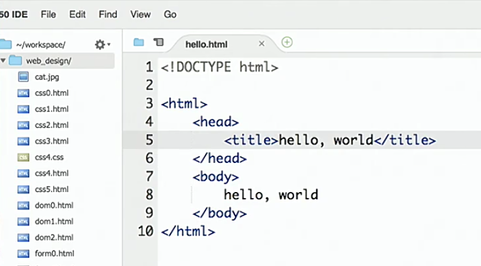
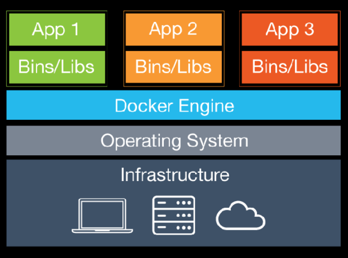

:author: Cheng Gong

= Cloud Computing

== Last Time

* We dabbled in a little web design last time, though we saved our pages to our own computers and opened them as files. Today, we'll talk about how we might put a website online.
* CS50 IDE is a website that provides an online IDE, integrated development environment, where you can write code more easily and type commands into your computer directly with a terminal window. The CS50 IDE also lets us save HTML files:
+

* And the icon of a website in the tab of the browser comes from a tag in the `<head>`, which looks something like `<link href="/hbs/favicon.ico" rel="icon">`.
* Other tags in the head might include a description of the page, or an image, and while those won't be shown within the page, other services like search engines or social networks will use or display them.
* In the CS50 IDE, we can right-click the folder called `~/workspace` in our file list to the left, and click `Serve` to have the folder be available on the internet:
+
image::serve.png[alt="Serve option in CS50 IDE", width=400]
* While this is convenient for us to develop some webpages with, we'd still need to take the steps we discussed yesterday, like buying a domain name and signing up for web hosting.
* You'll work with the IDE a bit more for this week's assignment!

==  Cloud Computing

* Cloud computing is just the ability to rent computing resources on the internet, like processing, storage space, and bandwidth from another company.
* Having one's own servers might lead to risks, whether from security or from not having backups at another site. Our own servers might also become out of date and need to be replaced more often, taking more time and effort. And there might be peak times where we need more resources, but less at other times. Local IT staff, and power, too, are expensive and finite. Cloud providers might also have servers all over the world, on which we might duplicate our website on, so users are able to load the site faster. And cloud providers are likely to follow best practices and have better on-site staff than we might be able to find or afford.
* The processing power of a computer is measured in Hz, hertz, operations per second, and is usually in GHz, gigahertz, or billions of operations per second. And each operation is a very basic operation, like adding numbers or accessing the next element in a list. Since the processing power of each server is finite, there are only so many simultaneous users that it might be able to support.
* On a computer with the Apache Bench program installed, we can run it for some website, and it will tell us information like how long it took to respond to a request and how many requests a second we were able to get back:
+
image::ab.png[alt="ApacheBench", width=400]
** While this program can send requests over and over, we are only sending them from our one computer, which limits the maximum we are able to do.
** Technically, given a high enough request rate, we would be attacking HBS (or some website's) servers, occupying their resources so that legitimate requests aren't served. And someone on the other side might implement software that blocks too many connections in a short time, from a single IP address. A DDOS, Distributed Denial of Service, is an attack where many computers on the internet, hijacked by malware, send lots of requests like this, and those are much more difficult to defend against.
* So to increase the number of users we can respond to, we might start by increasing the number of servers we have, from one to two. Then, we immediately have a cost of having to update both servers when our website changes, even if we have a program that can do it for us. And when we have a new user visiting, we need to send them to one of the servers that we have. Load balancing is the technique of sending requests to servers with lower loads. One type of load balancing is "round robin", where we simply alternate between servers for each incoming request.
* The information of a user, say, a shopping cart, might be lost if they are sent to another server in the middle of their shopping. We might have the load balancer, the program deciding where to forward a request, remember where users with cookies were sent before, and send them there. But if one of the servers we have somehow crashes, we need to stop sending users there. And servers can send what's called a heartbeat, a simple, repeated signal to the load balancer, that it's still working as before.
* At the end of the day, the decision comes down to the amount of effort and cost that some amount of reliability is worth. Based on an estimated probability of a single server failing, we might calculate what the loss for user experience might be, and decide how much that's worth to decrease.
* One final concept we need to know about is a database, another server whose primary purpose is to store and provide data to our web servers. Then, we can have many of those, as well as many load balancers, to spread our risk of downtime among many hardware devices.
* If the software on our servers are attacked, we might have intermediary firewalls within our network, monitoring traffic and preventing certain types from reaching certain servers.
* We can visit a cloud provider, like Amazon Web Services, and see their hourly pricing, compared to a hardware provider, like Dell, and see one-time pricing for an entire server that we'd then need to maintain.
* In some cases, perhaps with very sensitive financial or healthcare concerns, a company might need to run its own servers. Or a very large company might actually start saving money, if they need to have enough servers to justify a data center of their own.
* Providers also tend to have SLAs, Service Level Agreements, where a certain percentage of uptime (like 99.999%, or "five nines") is guaranteed. The higher cost, though, may not be justified depending on the business.
* The following diagram shows virtualization:
+
image::virtualization.png[alt="Virtualization stack", width=400]
** Since processing power has been increasing quickly, a single hardware server is set up to run multiple software systems at once.
** Each colored stack is a different customer with their own operating systems and applications, with their own resources isolated.
** Their operating systems run on a software called a hypervisor, which handles separating resources among them. But bugs in that software might lead to information leaking between customers.
* Recently, a new trend called containerization, with software such as Docker, allows the same effect of multiple, segregated applications, with less overhead of runnning entirely different operating systems for each user.
+

** Users write software that run in a container, which is standardized, and so can easily be moved between cloud services. And these containers share the same operating system, with the Docker Engine providing the isolation of resources and lower overhead.
* Adding more and more servers is called horizontal scaling, but we can actually increase the capability of a single server by upgrading the CPU or amount of RAM to the maximum possible, and that would be vertical scaling, though that too, is a cost. And horizontal scaling helps with redundancy.
* We can also add another layer, in front of our web servers, called a cache, that stores frequently accessed pages or data, and responds with those even more quickly than a web server would, since it would have to check the database or compute some result.
* Amazon EC2, Elastic Compute, is one service where someone might rent servers, or portions of hardware servers, in the cloud. S3, Simple Storage Service, is file storage where someone might upload data. CloudFront is a CDN offering, where some underlying S3 file is copied to servers all over the world, so users can access them more quickly.
* One big question is what the engineering team is already experienced or familiar with, and that might ultimately be more important than small cost differences between cloud providers.
