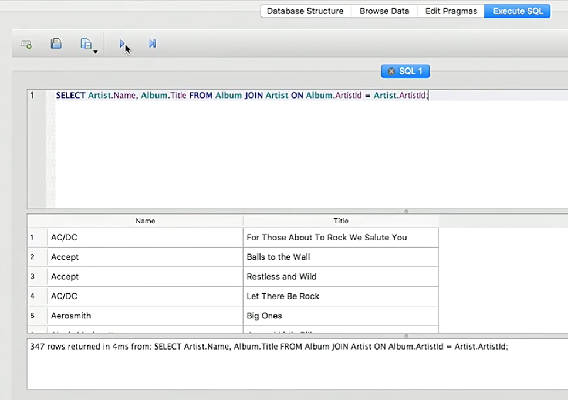
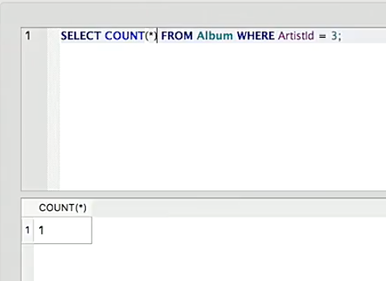
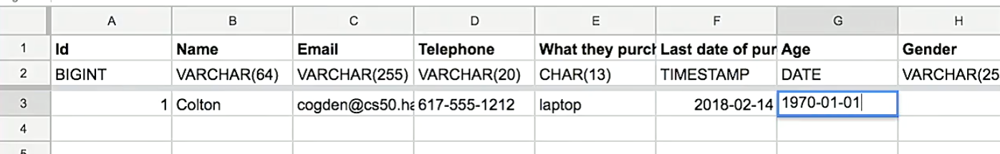
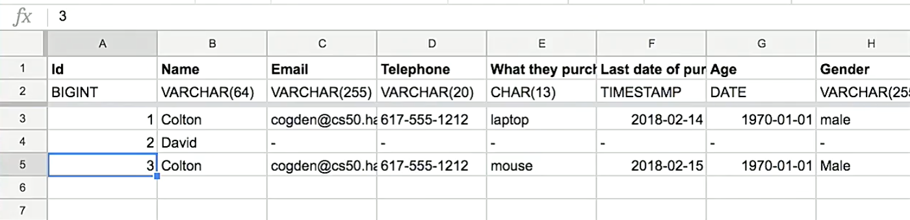

:author: Cheng Gong

= Database Design

== Last Time

* We talked about cloud computing, or just servers and computing resources we rent from someone else over the internet. There are benefits to scale, where many customers can share the high cost of a data center and staff to maintain some amount of hardware.
* There are also various levels of service:
** IAAS, or infrastructure as a service, provides the virtual hardware for engineers to use
** PAAS, or platform as a service, provides more abstraction over the layer of hardware, such that an engineer can run an application or server without knowing about networking, load balancing, or other details that IAAS exposes
** SAAS, or software as a service, is any application that's built on top of that, such as Gmail or Facebook.
* We've also taken a look at mid-quarter feedback, and we'll try to adjust pacing and topics as we can (though we can't make everyone happy!)

== Databases

=== Concepts

* We've almost certainly all used Microsoft Excel before, a program used to store data in rows and columns.
* A sheet of rows and columns is a table, and a collection of tables is a database.
* With many rows, Excel might become very slow or even crash. It's trying to load everything in the file into memory, and a particularly large file would use up too much and cause problems.
* A relational database program allows for the storage, updating, and accessing of much more data efficiently.
* SQL, Structured Query Language, is a limited programming language that is used to interact with databases.
* CRUD is an acronym for the primary operations with a database:
** create
** read
** update
** delete
* In SQL, those commands are `INSERT`, `SELECT`, `UPDATE`, and `DELETE`.

=== Tables

* We might have a spreadsheet with a table that looks like the following:
+
image::album.png[alt="Album table", width=600]
** We have various tables that might represent someone's music collection, and this table has various rows for albums.
* We can import this spreadsheet into a program we already have, called SQLite (as well as a program that provides a GUI for it), and run commands like `SELECT Title FROM Album;`, which will print out all the titles from our `Album` table.
* We can even run something like `SELECT Artist.Name, Album.Title FROM Album JOIN Artist ON Album.ArtistID = Artist.ArtistID;`. Now, even though the artist's name for each album is not a column in our `Album` table, we somehow were able to link together the tables and print out the correct artist's name:
+

* We can also run a query that counts how many rows are selected, that match some `WHERE` condition:
+

=== Types

* So to get to this point where we have a database that we can query, we need to design the tables. Each column has a fixed type, for storing data efficiently and in the correct format:
** `CHAR`, `VARCHAR`
*** Stores characters, or strings. `CHAR` is a fixed number of characters, whereas `VARCHAR` sets some upper bound for a variable number of characters.
** `SMALLINT`, `INTEGER`, `BIGINT`
*** These types store numbers with different numbers of bits, so the largest number in each increase, but the amount of space used is also higher.
** `FLOAT`, `DOUBLE PRECISION`, `DECIMAL`
*** These types store real numbers with various numbers of bits. `DECIMAL` in particular prevents floating point imprecision, by specifying the number of digits before and after the decimal point.
** `DATE`, `TIME`, `TIMESTAMP`
** ...
* To design a table, we'll need to name each of the columns, and specify their types.

=== Customers

* If we wanted to build a database of customers, we might want to design something like this:
+

** `Id`, used to identify customers, might be a `BIGINT`, in case we need more than 4 billion rows for customers.
** `Name` might be a `VARCHAR`, and we might limit the upper bound to 64 characters, but some people might have even longer names that don't fit. If we used `CHAR`, we would be using a fixed number of bytes for each name, when we don't need to, but we might get higher performance for searching the column, since the database can use a data structure like an array.
** `Email` can be `VARCHAR` too.
** And `telephone` might be a `VARCHAR` with a smaller length, but it shouldn't be a number type since a leading 0 would automatically be lost.
** `What they purchased` could be a `CHAR` if our products have a fixed identifier.
** `Last date of purchase` can be a `TIMESTAMP`.
** `Age` is better stored as a `DATE` representing the birthday of the customer, so our data won't be out of date.
** For `Gender`, we could use a type not mentioned before, `ENUM`, which is an enumerated, fixed list of choices that we can choose from for each value.
** `Geographic location` could be latitude or longitude, or an enumerated list of states or countries, or a `CHAR` with 5 digits for a US zip code.
** `Purchase price` would be `DECIMAL`, with 4 digits to the left and 2 digits to the right of the decimal.
* Now, if the same customer made another purchase, we would have duplicate data:
+

* So we might want a `customers` table, and a `purchases` table, with the rows there linking back to some row in the `customers` table.
* For `Geographic location`, too, we might want a `cities` table with additional information about a zip code.
* Returning to our music table, we might need to add multiple artists to an album. We could have an additional column for `ArtistId1` or `ArtistId2`, or we could have an additional table mapping an album's ID to any number of artist IDs.

=== Indexing

* We can also tell our database ahead of time to index our columns, which means that it will build a data structure, like a tree, as we add rows, so we can quickly search for values in the future. There are various types of attributes we can apply to our columns:
** `PRIMARY` indicates that this column will be unique and used to identify each row. Conventionally, this is the ID of the row in a table.
** `UNIQUE` is a constraint that this column will have only unique values among rows. A phone number or email might be in this category.
** `INDEX` allows for any column to be indexed, for quicker searches.
** `FULLTEXT` indexes the strings in the column, so we can search for keywords within those strings.
* The tradeoff to keep these indices are that inserts and updates will require these indices to be updated as well. Storage space will also be a consideration if our database becomes very large.

== More Concepts

* Another concept that a database offers is atomicity, where two or more operations can occur together or not at all.
* One example is having no milk in the fridge, and two roommates each coming home, seeing the state of the fridge, and going out separately to purchase additional milk.
* With a database lock, for example, your program can temporarily prevent another program from updating some table or rows while you're reading and changing that data.
* Another example is with ATM transactions, two people might use two cards linked to the same account, at two different ATMs at the exact same time. Then, each machine might check the balance at the same time, and allow money to be withdrawn before the balance is updated by the other machine.
* On a login page, too, if the web server's code was not written properly, someone could maliciously access or change data:
+
image::sql_injection.png[alt="SQL injection", width=600]
** This is called a SQL injection attack, whereby the quotes and equal signs could change a command being sent to a database.
** The original command might look like: `db.execute(f"SELECT * FROM users WHERE username = '{username}' AND password = '{password}'")`. But if the password isn't substituted correctly, the command might look like `db.execute("SELECT * FROM users WHERE username = 'me@examplemailprovider.com' AND password = '' OR '1' = '1'")`. The `OR` will select everything from the `users` table! Fortunately, we can sanitize, or escape, characters like these single quotes that change the meaning of commands.
** Our code might escape characters such that the final command looks like: `db.execute("SELECT * FROM users WHERE username = 'me@examplemailprovider.com' AND password = '\' OR  \'1\' = \'1'")`. Then, our database will interpret the quote as a character, not as ending the phrase in the command.
* Remember that last week, we talked about scaling our web servers. And now we might need to scale our databases, to have more capacity. Sharding is a way to divide our data between servers. For example, customers with names between A-M might be on the first server, with customers between N-Z on the second. But now we need multiple copies of each server, so we don't lose any pieces of data. We might have multiple primary databases which sync to each other, and also databases that are read-only, which will make syncing faster as well as provide additional capacity for reads.
* http://sqlitebrowser.org/ is what we use as a GUI to work with a local database file with SQL.
* We'll try out a few more SQL commands with our assignment for this week!
