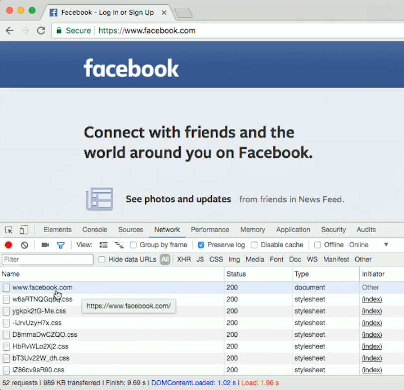
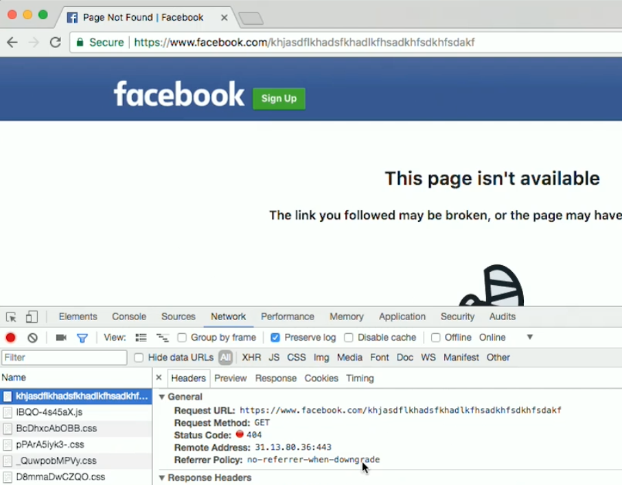

:author: Cheng Gong

= Internet Technologies

== Last Time

* We introduced data structures, ways to organize how we store bytes in the memory of a computer, so we can access our data in different ways.
* We also talked about algorithms and how to compare their efficiency with big _O_ to measure running time in terms of _n_, where _n_ is some measurement of the size of a problem.
** But realize that only pieces of an algorithm might easily be compared with this notation. A more complex piece of software would have many parts, each with different running times, not all of which are used for each feature of the overall product.
* Searching is much faster with sorted data, but sorting data in itself is a problem that can be solved in different ways.
* Data structures we looked at included:
** Arrays, data in a consecutive chunk of memory, stored side-by-side, so we can easily jump to the right place in the list, since we know where it starts and ends.
** Linked lists, where new elements can be added anywhere inside the list more easily, but there needs to be extra storage for the pointers to each of the next elements, as well as the extra time to go down the list one element at a time.
** Trees are like linked lists, but each element can point to more than one other element, and might be sorted differently.
** Hash tables are useful in the real world, since a large enough array might result in a near-constant lookup time.

== The Internet

* The internet is a network of computers connected together, and we generally think about it in terms of websites and applications, but every time we visit a website, our computer (or device) makes a connection to another computer.
** These days, modern computers that serve websites (which are called servers) are generally made in a standard dimension, so they can fit into racks in data centers, photos of which we might have seen before.
* Let's say we want to visit `facebook.com`. Our browser actually automatically completes it to `http://www.facebook.com/`.
** `www` is a conventional prefix, to indicate that we were visiting a website. These days, the `www` is either automatically added, or the raw domain name, `facebook.com`, will also just work.
** The word "internet" describes the physical connections between computers, and the "web" (world wide web) is an application on top of it.
** `http`, or more common these days, `https`, are protocols. A protocol is a procedure for two or more computers to interact, and `https` is just a secure protocol that encrypts the data that is sent. For that to work, websites and our own browsers each have keys, or mathematical numbers, with certain properties. We each have a public key and private key, and a message encrypted with the right algorithm with the public key can only be decrypted with the corresponding private key. So websites and browsers share their public keys with each other, and only the recipients of encrypted messages can read them. But the cost is that each server needs to spend longer to respond to each user, since there needs to be some computation to encrypt messages.
** Finally, the ending slash `/` just requests the default page for that address, from the server.
* We can think of protocols, like HTTP, as humans greeting each other with handshakes, since there is a series of steps that each side follows, according to certain predefined rules.
* In Chrome, we can see that with View > Developer > Developer Tools:
+
image::developer_tools.png[alt="Developer Tools in Chrome", width=600]
* Now, if we open the Network tab there and visit `https://facebook.com`, we'll see all the requests our browser makes for the page. In this case, there are 52, and the very first one is for the actual page, which includes all the other files:
+

* If we click on that first request, we see many headers that our browser sends:
+
image::facebook_request.png[alt="facebook.com request in Developer Tools in Chrome", width=600]
** The last line, ``user-agent``, tells Facebook about our browser and OS. This information is useful because mobile devices might be sent a different page, for example. Different browsers, too, made by different manufacturers, might display webpages differently because certain standards are open to interpretation. By knowing the statistics of users to your site, you might be able to make better business decisions about which platforms to optimize or test for.
* Each computer on the internet also has an IP (Internet Protocol) address, which is like an address we might write on a real envelope. That address allows messages to be sent and received by the right computers. And websites like `facebook.com` are just mappings of names that we can remember, to numeric IP addresses of servers that can respond.
* In this case, David isn't logged in, but if he had logged in, Facebook would be able to know who he is based on the `cookie` header that our browser includes with its request. A cookie is like a digital handstamp, usually a long random string, and each time our browser sends that to the server to verify who we are. Advertisers can also add cookies to their websites, or pieces from their websites that are included in other people's websites, which allows them to track people visiting different websites. (Adblockers or other browser extensions can prevent this, by refusing those cookies from advertisers.)
* To use certain services, we have to make these cost-benefit analyses:
** With photos taken on our phone, GPS coordinates might be included so we remember where they were later, but can also be used to track us
** Google Maps or Snapchat Map knows where we are if we use their services too, which is convenient for us at the cost of our privacy
* With an Incognito window, our browser doesn't keep any of the cookies it gets, but our IP address is still revealed (out of necessity).
* Our ISP, or internet service provider, also knows what we do on the sites we visit, unless we use HTTPS.
* We can also type commands into our computer's terminal to see this:
+
image::curl_facebook.png[alt="curl facebook.com", width=600]
** We can see that the response was that Facebook had `Moved Permanently` to an `https://` address.
* And if we try to follow that, we're sent to the `www` address:
+
image::curl_facebook_2.png[alt="curl facebook.com", width=600]
* Now finally, if we make a request to that address, we get a status of ``OK``:
+
image::curl_facebook_3.png[alt="curl facebook.com", width=600]
* Other HTTP status codes include:
** 302 Found
** 304 Not Modified
** 401 Unauthorized
** 403 Forbidden
** 404 Not Found
** 418 I'm a Teapot
** 500 Internal Server Error
* We can see this in the browser too. If we try to visit some random URL for `facebook.com` that doesn't exist, we see the response code for the request is ``404``:
+

* Some years ago, Verizon and other cellular providers were found to be injecting a https://arstechnica.com/information-technology/2014/10/verizon-wireless-injects-identifiers-link-its-users-to-web-requests/[tracking header] into requests made by your phone, so that other companies can track you, a business decision to sell data for profit, made possible by this technical feature.
* A VPN, virtual private network, connects you to some other server, through which all your traffic goes. So the outside world will only see the VPN's IP address, and not be able to track you as easily.
* IP, Internet Protocol, is the procedure by which computers on the internet communicate with each other. Every computer on the internet has an IP address, in the format `pass:[###.###.###.###]`. Each number must have a value between 0 and 255, so to represent 256 values we need 8 bits for each number, and thus a total size of 32 bits, or 4 bytes, for an IP address. That also implies a total of only 4 billion IP addresses, and there's actually a replacement version, IPv6, which assigns addresses with 128 bits, allowing for a lot more addresses.
** There are also private IP addresses, where everyone on the same local network has different private IP addresses, but the router hardware presents the same public IP address for everyone, and redirects traffic in some clever way. These addresses are set to be in these ranges:
*** `pass:[10.#.#.#]`
*** `pass:[172.16.#.# - 172.31.#.#]`
*** `pass:[192.168.#.#]`
** The network panel in the settings panels of most systems include this.
* DHCP, Dynamic Host Configuration Protocol, is the procedure by which a device gets an IP address when it first connects to the internet. It first connects to the local network with a temporary address, and then asks the local DHCP server for an address that it can use.
** The DHCP server also tells us the router, or gateway, that we should use to send any messages to the internet. We'll send all of our messages to that server, which will then forward them in the right directions.
* DNS, Domain Name System, is another system by which domain names are translated to IP addresses. There are root DNS servers that point to other DNS servers (for example, the one for all `.com` domains) in a hierarchy that eventually gives us an official IP address back for any registered domain.
* Our computers might cache an IP address locally, and our ISPs (Internet Service Providers) too might cache all the common domains, to speed up future requests. And an ISP could have DNS servers with fake or nonexistent records for IP addresses for certain domain names.
* We can run another program called ``traceroute``:
+
image::traceroute.png[alt="traceroute", width=600]
** We try to send a request to ``mit.edu``, and this tool shows us all the routers that are in between us. Each of them is a router with some IP address, and a table of which other routers to forward messages with certain destinations to, such that each step brings our message a little closer. And the last step is a server belonging to Akamai, a CDN (content delivery network) that MIT likely works with, to serve their website.
** And sometimes, we might not get a response back from a router in the middle, if they are not set to respond to messages themselves.
* There is https://www.youtube.com/watch?v=IlAJJI-qG2k[an animation] of undersea cables that connects continents across oceans.
* We can think of these physical network of cables, and IP in general, as some infrastructure we can abstract away. We can write our software knowing that it's available, and use the internet not just to send bytes between computers, but have more useful applications.
* QoS, or Quality of Service, is another concept where routers might limit or slow how much data you can send and receive of a certain type, in order to prioritize applications like videocalling or realtime games.
* If we were to send a large file, it would first be broken up into smaller chunks. Each of those chunks would include additional metadata like `1 of 4` or ``2 of 4``, which allows the recipient to reassemble them correctly. And if the recipient somehow did not receive a piece, they can request for that missing piece to be sent again. TCP is the protocol that allows that.
* Servers can also support other services, such as SSH (secure shell) or SMTP (for sending email). Each of these services also run on some port, or a number added to the end of an IP address in each request, so that the operating system can forward the request to the right service.
* We take a look at a few clips, where TV shows use technical terms in sometimes inaccurate ways, to portray hacking or the like.
* Now that we know the fundamentals, hopefully we can understand other related concepts. Next time we'll look at web design!
