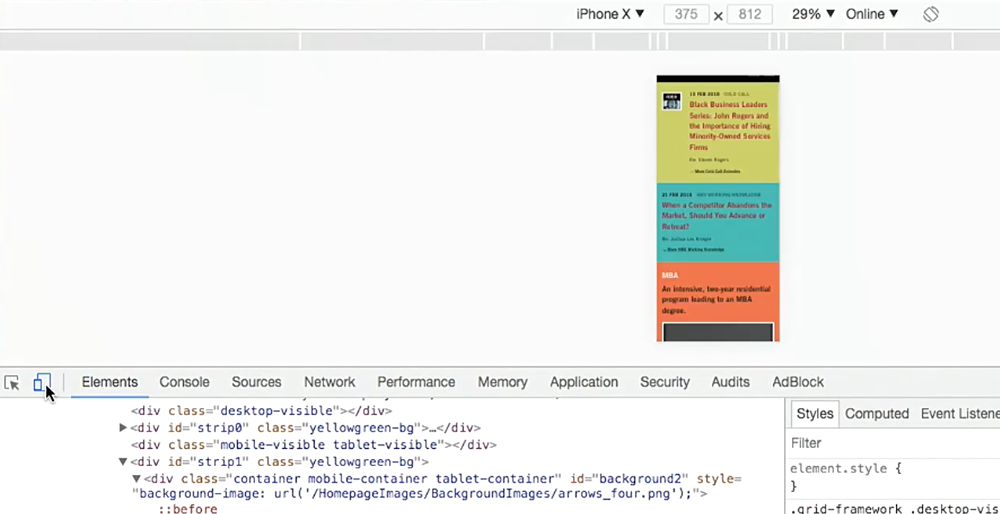
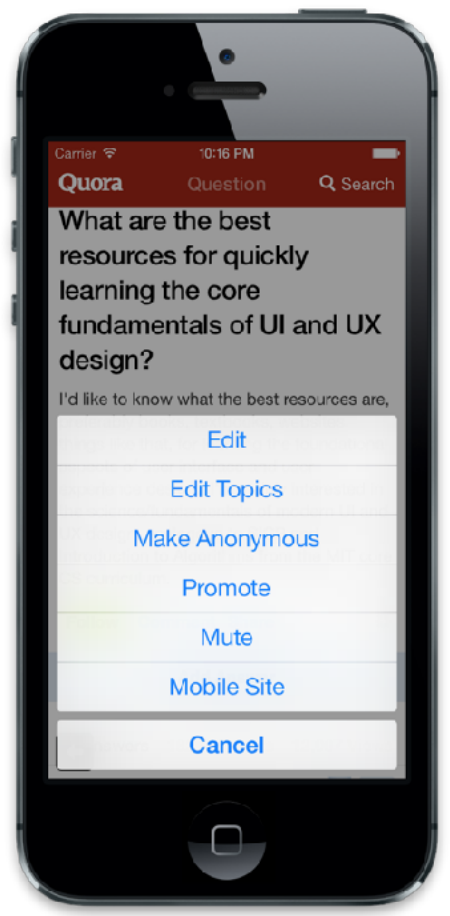

:author: Cheng Gong

= Mobile Strategies

== Hybrid, native, web apps

* Today we look at how we might build a mobile website or app.
* A *web app* is an application that's on a website, accessible by any browser. Some websites, like * https://cs50.github.io/[https://cs50.github.io/], is responsive, meaning that the layout changes as the window (or device) has different sizes. And this design could be accomplished with just special CSS.
* HBS' website, too, is responsive. We can see this with Chrome's Developer Tools, with the icon to the left of "Elements":
+

** A web server could send back different pages based on the User Agent, a string that the browser usually sends with its request as an HTTP header, telling the server what version and browser it is.
* The most common way is to change the layout based on the resolution, since some browsers may not send a useful user agent string. And CSS can be applied depending on the screen size, so a server could send back the same page and the browser would decide how to render it.
* If we look in the console, we see events being logged as we open and close the menu, and perhaps sent back to some analytics server. That would help designers decide whether certain designs are useful or effective.
* Many libraries, like Bootstrap, are designed to be responsive from the beginning, so we don't even need to write any custom code ourselves.
* With a web app, we only need to write one set of code, and run in browsers of both desktops and browsers.
* A *native app* is a standalone app that we download separately, has its own icon on the home screen, and written specifically for a platform like Android of iOS.
* Android's store has more than 2x the number of total app downloads compared to iOS', but total iOS app spend is about 2x the total of Android's.
* *Hybrid apps* are written in the same languages as web apps, HTML and JavaScript, but use a framework that allows them to act like native apps. The view in the app will be like a web browser that loads the same page for all platform, but otherwise the app will act like a native app and have its own icon.
* Our web app's files could also be embedded in the app, so offline access could be possible.
* Three such popular frameworks for hybrid apps are:
** React Native
** Titanium
** Vue
* For web apps, some pros might be:
** we only need to write code once for all platforms
** native apps might require Apple or Google to take some percentage of any purchases made from the app
** some sites like Wikipedia might see traffic mostly from search engines, so a native app doesn't really make any sense
** not having to release new versions to the app store, since our site will always be the latest when the user visits it
** the front-end and back-end can be deployed together, so we don't need to support older versions like older native apps
** we don't take up any space on the user's device
** faster iteration and lower learning curve
* Some cons might be:
** slower performance
** limited access to the device's APIs
** no visibility in the store or app icon on the home screen
* There's yet newer technology called service workers, which we can use in *progressive web apps*, web apps that run in a browser but have a few features from hybrid apps, like offline use and native notifications.
* Native apps have these pros:
** faster performance and fewer restrictions on graphics (like full-screen mode)
** integration with the mobile operating system, for features like the camera and GPS
** code that can run in the background and update information
* On the other hand:
** Swift, the programming language for iOS apps, have changed significantly and requires work to migrate older versions of apps to work with newer versions of iOS
** Android APIs, too, also change
** a slower release process
** higher learning curve
* Hybrid apps have:
** faster development time
** a slightly different look and feel
** the ability to write native code specific to each platform, if we need to
** reliance on yet another 3rd party framework
** some, but not all, API features
* The best answer will depend on the use case. A graphics-intensive game with mixed reality, for example, will almost always need to be a native app.

== Case Study: Quora

* Quora is a question-and-answers website, where once Tommy asked a question about Yelp, and the Product Design Manager at Yelp actually answered!
* Quora's app is a hybrid app, since it's mostly text and images that are frequently updated but don't require high performance.
* Push notifications and integration with search are also important features.
* If we look at the mobile app, we can see that some components, like the tabs below and buttons at the top, are native, but the center view is a web view:
+
image::quora.png[alt="Mobile app for Quora", width=600]
* On the engineering team, everyone can write mobile code, since most of the views are using web technologies.
* And the engineers who write native code, focus on writing reusable features that other engineers can easily reuse or modify.
* The organization also had to decide that their top priority was development speed, that they are okay with not having high performance, but that they do need APIs like push notifications and presence on the home screen.
* The native code on the hybrid app actually needs to communicate with the web views, and pass data back and forth.
* For example, a text editor for writing an answer would require the web view to send a message to our native code, to open our phone's keyboard and editor. So our web JavaScript might call a function like this:
+
[source, javascript]
----
var options = {
    title: 'Add Answer',
    type: 'text',
    placeholder: 'Add your answer',
};
client.sendMessageToClient(
    'invokeEditor', options
);
----
* Another native feature is an action sheet, or a list of actions:
+

** Our web code will have something like:
+
[source, javascript]
----
var options = {
    buttonTitles: [
        'Edit',
        'Edit Topics',
        ...
    ],
    callback: function(data) {
        if (data.index == 0)
            ...
    }
};
client.sendMessageToClient(
    'showActionSheet', options
);
----
*** Here, we pass in `options` as a message to the native code, which will include the button titles and the function to call when something is chosen.
* In iOS, the technology is called `window.webkit.messageHandlers`, allowing a web view to send a message to native code.
* And our native code can also run JavaScript within our web view, to send messages the other way, with `WKWebView.evaluateJavaScript()`.
* Tommy demos a hybrid app with just a few lines of his own custom code, that links to an HTML page which can use the above APIs to call a native alert. The native app can also use a button to send messages to his page. With just these building blocks, we can imagine more complex apps that change views in more interesting ways.
* If we want to support another platform for a hybrid app, all we have to do is implement the corresponding native code that handles and sends these messages accordingly. For example, the webpage might call the `openURL` function, and both the iOS and Android app will have some function named `openURL` that then calls out to the right APIs for that platform.

== A/B Testing

* With our hybrid app, we can write server-side code that sends different responses for the same request, to test different design or features with real users.
* The three main steps for A/B testing are:
** Generate a hypothesis
*** For example, it could be "It's easier to add a question (with a new layout)." We look at screenshots from Quora, with two different layouts. More buttons might make different features easier to reach, but hide more text on the screen and require more scrolling, so another hypothesis might be "There’s more UI in the
way of content".
** Implement the experiment
*** We might want 70% of users to use the current version, and show the experimental version to 30% of users, so we could have code like:
+
[source, python]
----
define_experiment('tab_bar',
    buckets=[
        (range(0, 30), True),
        (range(30, 100), False)
    ]
)

def render():
    if experiment.get('tab_bar'):
        return render_with_bar()
    else:
        return render_without_bar()
----
** Measure impact
*** There are lots of services we can use for analytics, measuring what users do, such as Fabric, Mixpanel, and Optimizely, where we can just include a library from the service.
* We might see tradeoffs in our experiments, between engagement, performance, cost, and complexity. A tutorial feature, for example, might be time-consuming to build, but helpful for first-time users to learn about the platform.
* Thanks to Tommy of Quora for joining us the past two days!
