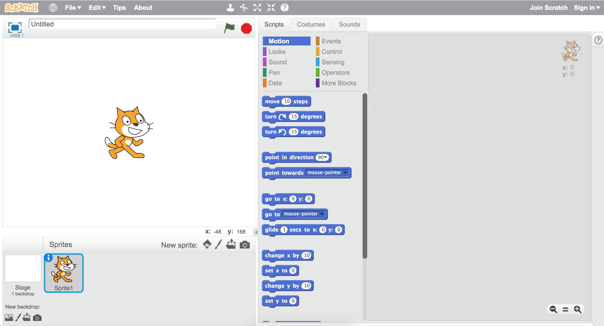
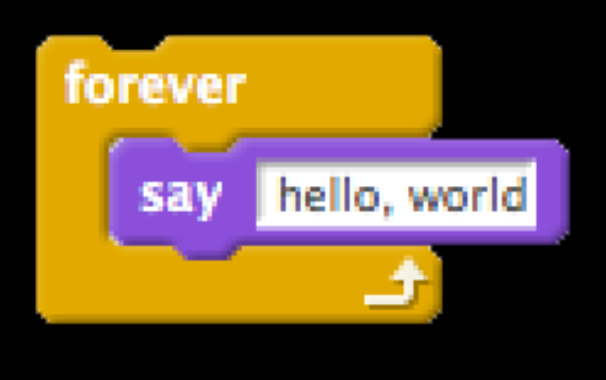

:author: Cheng Gong

= Programming Languages

== Announcements

* Feel free to use the https://cs50.ly/hbs50[CS50 Slack] to ask questions, whether during or outside of class hours.
* https://cs50.github.io/hbs/hours[Office hours] are also listed on the course's website.

== Last Time

* We talked about how we can think about problems and solutions, in a way that other people (and eventually computers) can understand.
* Problem solving can be thought of as taking some inputs, and creating some outputs with an algorithm, or a series of step-by-step instructions.
* We also talked about how some algorithms can be more efficient than others, but those algorithms may well cost more time for someone to write. In addition to correctness, the design of an algorithm is also important to consider.
* We also talked about how the limited amount of hardware memory in a computer means that each piece of data stored also has a limited amount of bits it can use. With integers, this might cause overflow, and with floating-point numbers, this might cause imprecision.
** In the Lego game, there was a programmatically set limit to the number of coins a player could collect, so the number of coins could never overflow (or increase past that limit).
** Increasing the number of bits allocated would increase what the number can be before it overflows, but it means using more and more memory.
** And floating-point imprecision might be alleviated with a special format of number, perhaps storing a flag that indicates a number should be repeated indefinitely, or using even more bits.

== Programming Languages

=== Scratch

* Our process for finding a name in a phone book might be written with pseudocode like this:
+
[source, pseudocode]
----
 0   pick up phone book
 1   open to middle of phone book
 2   look at names
 3   if Smith is among names
 4       call Mike
 5   else if Smith is earlier in book
 6       open to middle of left half of book
 7       go back to step 2
 8   else if "Smith" is later in book
 9       open to middle of right half of book
10       go back to step 2
11   else
12       quit
----
** The words `pick up` or `open to` or `look at` or `call` can all be described as functions, some self-contained pieces of functionality that do something specific.
** `if`, `else if`, and `else` are conditions, or branches, that lead to actions depending on whether certain expressions are true.
** These expressions are called Boolean expressions, and can either be true or false.
** And finally, `go back to step 2` is a loop, or cycle.
* For Project 0, we'll use a graphical programming language called Scratch. We'll drag and drop puzzle pieces that snap together, to write our program, with the https://scratch.mit.edu[editor here]:
+

** In the editor, we see the stage with Scratch (the cat) on the top left. On the bottom right, we can add additional characters that we can then use on the stage. In the middle column, we see a palette of puzzle pieces we can use. And finally, on the right, the blank canvas is where we will drag our pieces and write our program.
* The simplest program for Scratch might look like this:
+
image::hello_world.png[alt="Scratch hello world", width=300]
** We can read this quite literally, as in "when green flag clicked, say hello, world". The blocks are run from top to bottom.
* `say` is an example of a *function*:
+
image::say.png[alt="Scratch say", width=300]
** Notice that we can provide an input to the function, by typing in the message we want to be said.
* This would be a *loop*, in particular a forever loop:
+

* And we can have loops with a certain number of steps too:
+
image::repeat.png[alt="Scratch repeat", width=300]
* We can create and set variables:
+
image::set.png[alt="Scratch set", width=300]
* And have boolean expressions:
+
image::boolean.png[alt="Scratch boolean", width=300]
+
image::boolean-x.png[alt="Scratch boolean x < y", width=300]
* We can even have fancier logic:
+
image::conditions.png[alt="Scratch conditions", width=300]
* We try some of this in the editor, and use the `forever` block to have Scratch play a sound "meow" over and over. But it starts repeating the sound before it finishes playing, so we actually needed to use the `play sound [meow] until done` block. Then, we added a `wait (1) seconds` block, so that it doesn't play the sound immediately.
* With large pieces of software and thousands or even million lines of code, there are many possibilities for bugs like we've just encountered.
* We experiment a bit more, using the `move (10) steps` block and the `if on edge, bounce` block in loops. One strategy for good programming is to think of different possible cases, like positions on the screen that Scratch could be, and how our program might handle each of them.
* Decomposition is the process of taking a larger problem, and breaking it into components, like taking baby steps to a solution.
* We look at a few more projects on our https://scratch.mit.edu/studios/3003963/[studio page], where we can also see the blocks used to create each of them.
* Scratch has all of these programming features, plus:
** events, which trigger one or more other actions when something happens (like Scratch meowing when the mouse cursor touches it)
*** Browsers, for example, are constantly listening for events from the user, or the page, and updating the screen as inputs change.
** In Scratch, the `broadcast [event]` block and the `when I receive [event]` block connects two characters with an event.
** threads, where multiple things can happen at the same time, like when multiple characters on the screen are moving at the same time
* In Oscartime, we have lots of sprites, but each of them only need to check for conditions that apply to them, and change their own position or costume depending on what they are touching. The animation of the trash can, too, is just multiple costumes changing quickly, one after another.
* Modern computers have multiple cores, like mini-CPUs, each of which can do processing in parallel, and programs that are written to use multiple threads or processes can take advantage of that.
* The operating system, like macOS or Windows, also makes sure that each program doesn't use up all the processing resources on your computer.
* Random numbers are generated with mathematical sequences, or perhaps microphone noise or variations in user input (like a mouse cursor being moved around).

=== Python

* Python is a high-level, textual language, for which there are equivalent statements to Scratch blocks. For the `say [hello, world]` block, for example, the equivalent is:
+
[source, python]
----
print("hello, world")
----
** `print` is the name of the function, the quotes `"` indicate a string, or a type of variable that is a sequence of characters, and the parentheses indicate that we are passing in something to the function.
* In Python, a forever loop would be:
+
[source, python]
----
while True:
    print("hello, world")
----
** Since `True` is always true, the `while` condition will always occur, so the `print` will run over and over again.
* We can translate a `repeat` block as follows:
+
[source, python]
----
for i in range(50):
    print("hello, world")
----
* `for` is a type of loop, `i` is just a counter we won't use otherwise, and `range` creates a range of numbers up to `50`, 0 through 49, so we `print` exactly 50 times.
* And we can set variables:
+
[source, python]
----
i = 0
----
* One `=` sign is the assignment operator, which stores the value on the right into the variable on the left.
* To compare two values, we would use two equal signs. And we can make other comparisons too:
+
[source, python]
----
i < 50
----
+
[source, python]
----
x < y
----
* And we can have multiple conditions:
+
[source, python]
----
if x < y:
    print("x is less than y")
elif x > y:
    print("x is greater than y")
else:
    print("x is equal to y")
----
** `elif` is the keyword in Python that means "else if".
* Other languages include C, which might run faster but are more difficult to use. It turns out, that the code written by programmers is called source code, and not understood by computers directly as they are. Instead, software called compilers turn source code into machine code, binary 0s and 1s that CPUs can run directly.
** For C, you might use a text editor to write your source code, and a compiler called `clang` to compile your program before you can run it.
* We can write a program in C with something like this:
+
[source, c]
----
#include <stdio.h>
int main(void)
{
    printf("hello, world\n");
}
----
** `printf` is the equivalent of printing something to the screen.
* We experiment with integers and loops, and see overflow happen for ourselves.
* In Python, a program called an interpreter reads our source code and turns it into machine code line by line, running it as it reads it, without compiling it first. However, the cost is that our programs will run more slowly overall.
* Other popular and useful languages include C++, Java, Ruby, Lisp, and JavaScript.
* In Project 0, you'll make a program of your own with Scratch!
