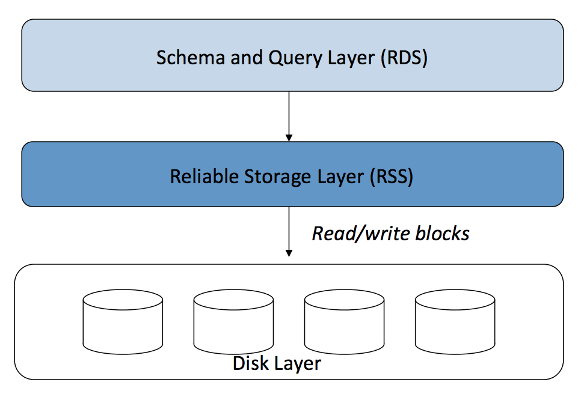
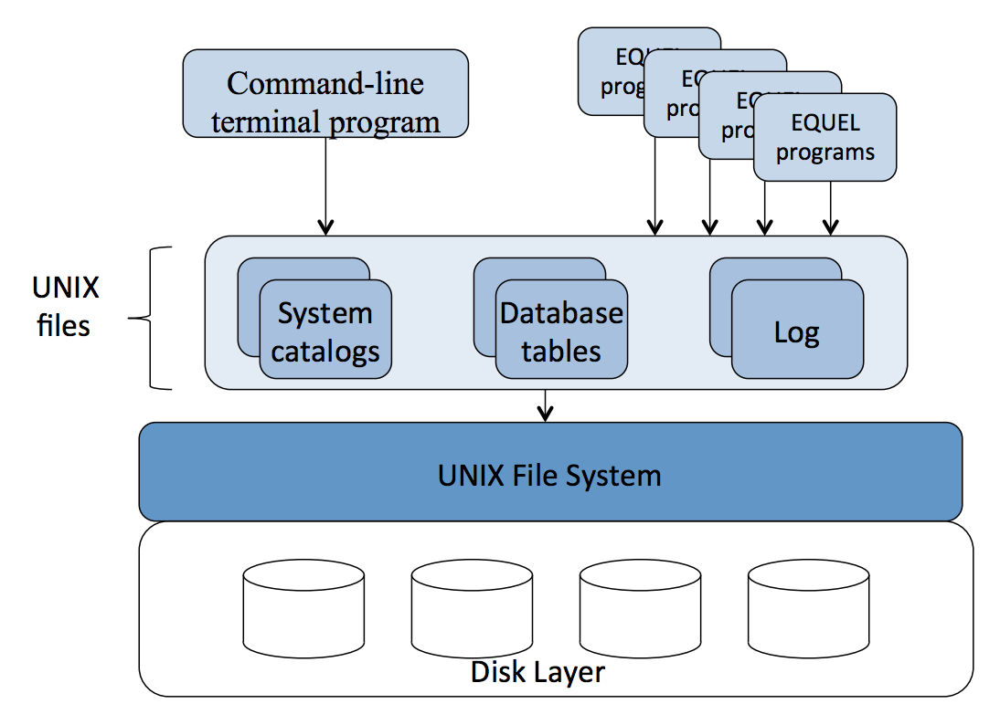

:author: Cheng Gong

= Web-Scale Data Management

== Announcements

* A big thank you to all of the course's staff who make the course possible.
* The website and videos should stay up for some time, but please stay in touch so we can hear about what you do and help in any way we can.
* We'll take a few minutes in class to fill out the evaluations, so thank you as well!
* Professor Margo Seltzer teaches CS161, an undergraduate course in operating systems, where you work with a partner to develop software components of an operating system, and David actually took the course with her many years ago.

== The Beginning

* In the 1960s, computers were large systems, and had data channels that allowed them to process data as they performed I/O, input/output, with storage.
** Persistent storage, like a hard drive or SSD, is relatively very slow.
* The first innovation to accessing this data more quickly was called ISAM, indexed sequential access method. Each record of actual data is a fixed length, at a specific location, and an index is built so that we can find records by a key wherever they may be stored.
* The network model was used to organize the data. For example, we might have records about employees, and records about departments in a company, and there would be like a pointer between each of these records as appropriate.
* Applications would navigate between these records, which would be linked together like a map:
+
image::network_model.png[alt="Network model", width=600]
* The problem was that the applications that used this set of data would have to already know the format and layout of these records, and the links would only be one way. Changing the structure was difficult as well.
* The relational model was introduced in 1968, where data was represented logically in tables, but stored on disk in some other way, with a layer of abstraction. Back then, this was groundbreaking since performance was so critical that data usually had to be laid out on disk manually.

== Relational Databases

* Two research groups started implementing this idea into software.
* A group at IBM created System R:
+

* And a group at U.C. Berkeley created Ingres:
+

* Notice that both systems have two layers. For System R, the top one, the relational, data, and schema layer, was the abstract layer about what the data was supposed to represent. Below that was a storage layer like ISAM, where indexes had keys to look up records. And finally this all happens on a system of hardware storage drives.
* For Ingres, the top layer was the programs that supported accessing and changing data, and the storage layer was the UNIX file system, where the data was stored as files on top of disks.
* The main insight for this type of database was that you could organize data in the way that makes sense for your application, but the relational system would have to use a key-value engine to look up records, and that would be abstracted away by a query language like SQL.
** An exception was COBOL, which exposed the key-value lookup.
* SQL became a standard that was agreed upon and updated every few years by the major creators of software that implemented it, and started to include more and more features, becoming large and complex.
* A relational database had the advantages of:
** a query language that separated physical storage of the data, and the logical layout of it
** the schema could be modified more easily
** support for ad hoc queries
* But had the disadvantages of:
** an overhead of query processing
** an administrator for tuning and maintenance (back in the day)
** overhead of waiting for a separate database program or server to process a query
** the schema had to be defined
** not great at hierarchical or complex relationships

== Rebirth of Key-Value Stores

* In the 90s, the birth of the internet (https://en.wikipedia.org/wiki/Capitalization_of_%22Internet%22[capitalized as Internet] back then) led to the creation of entire categories of applications like search, email, and browsing websites.
* All of these applications needed data, but in a different way than the enterprise software of before. The users interacted with applications that ran a fixed set of queries (as opposed to users running queries themselves against the database), the applications had relatively simple schemas, and performance became critical again.
* Relational databases had too many features and overhead, so a key-value store, like Berkeley DB, was invented.
** It was embedded into an application, so data could be accessed rapidly.
** There were no queries to be parsed or translated.
** It was scalable, flexible, and reliable.
* Between key-value stores and relational databases, there were clear tradeoffs:
** whether there was a high-level query language like SQL
** data types
** data relationship management
** security
** management costs
** performance
* As web applications became more popular, scalability also became more important. A single system could no longer support the needs.

== NoSQL

* Web service providers needed software to scale up to store and access more data than a single server could handle.
* Some solutions included sharding, or splitting up data, and introduced replication, copying the data between multiple servers.
* The consistency of data between these servers wasn't always required, since an infrequent crash might have been acceptable for the application.
* Relational databases supported atomicity for a transaction, meaning that a group of changes would either all happen, or not at all, so the data would always be consistent.
* For NoSQL, "Not-only-SQL", the priorities became:
** basic availability, where there were as few failures as possible (replication), affecting as little data at a time as possible (sharding)
** soft state: data could be inconsistent, and the application developers would have to handle any issues
** eventually consistent: the data between replicas might be different at some points in time, but they will eventually be consistent
* The high number of requests, need for low latency, and need for high availability led to the need for NoSQL systems.
* In the past, we had large, single machines with a lot of computing power. Now, we have lots of racks of servers, each of which has some amount of computing power, requiring us to devise some system to link hundreds or thousands of these together.
* The CAP theorem is that you can't have all three of:
** consistency: the data is always the same everywhere
** availability: the data is always available
** partition tolerance: if you lose network access to some part of the system, it can still function
* Relational databases tend to support consistency and availability, while NoSQL systems have availability and partition tolerance, or consistency and partition tolerance.
* Some papers were written about the design of various NoSQL systems, and open source projects began to implement them. Then, companies began to commercialize them by offering their own paid versions, or providing additional support.
* The technology behind NoSQL includes a distributed hash table that maps data to individual nodes that store data, and a custom storage system that's optimized for writes.
* A NoSQL system also offers various design choices:
** The local storage system, with different data structures having different characteristics: a key-value store, log-structured merged trees, or custom. We might ask whether the system has the right read and write performance for our needs.
** Distribution of our data: how they are partitioned, how many copies we keep, and whether they are all equal. For example, we might want read-only copies that makes our system less complicated.
* With NoSQL, we might structure our data differently than with a relational database. Our data values might be duplicated between records to improve performance, and reduce joins.
* One strategy is that column families, types of data that are grouped together, are used to help organize the data. For example, address information might be a column family, but not every row will have every column in address:
+
image::column_families.png[alt="Column families", width=600]
** The main idea here is that we have some structure, but maintain the flexibility we need for multiple columns or rows within a record.
* Another strategy is the document model, where the value is just some blob of data that another program can understand the format of, such as JSON, XML, PDF, etc.
* In the 2010s, Netflix moved to data centers in the cloud using a NoSQL system, Cassandra, validating the use case of these systems.

== Questions

*  Netflix probably started moving to  the cloud before offering their streaming service, since they might have anticipated the need for higher capacity and performance, but not done it all at once.
* Not having consistency is acceptable when individual pieces of data can be slightly out of date.
* In the IoT (internet of things) world, the database needs are write-heavy, where a lot of data is collected in real time, and then analyzed later, but so far it seems like most solutions are working for that need.
* The skill set needed to keep on top of new technologies and select them might be different than the skill set of someone who actually architects these systems. And Margo is skeptical of outside consultants who build systems, since that person should be a core part of the engineering team.
* Thanks for joining us this quarter!
