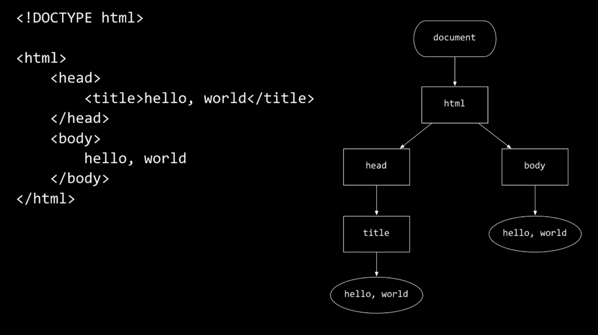
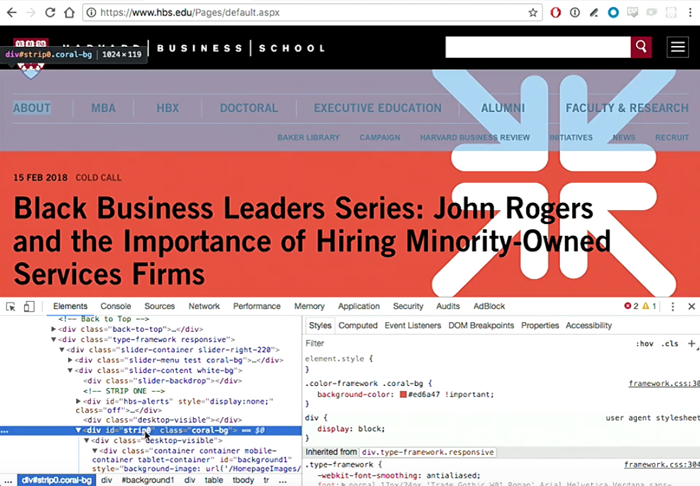

:author: Cheng Gong

= Web Programming

== Backend vs. Frontend

* Tommy MacWilliam, an engineering manager who has led various teams at Quora, will be with us today and tomorrow to discuss web programming and mobile strategies.
* We know that when we visit a website, our browser makes a request to some server, which will then respond with some content that our browser can then display.
* The *back-end* refers to the server's processing that takes place somewhere else, where we don't have much visibility into what's happening.
** The web server that we make our initial request to might not even be the only server that's working to process our request. For example, an email server or database server might have to send data to the web server to include in its response.
* The *front-end* is the webpage and code that our browser runs, including languages like HTML, CSS, and JavaScript. The only programming language of the three is JavaScript, so we'll refer to them as front-end technologies.
* We've tried a little HTML already, and have seen a basic page:
+
[source, html]
----
<!DOCTYPE html>

<html>
    <head>
        <title>hello, world</title>
    </head>
    <body>
        hello, world
    </body>
</html>
----
* We notice the symmetry of the opening and closing tags for each element, and how elements are nested inside other elements.
* In fact, web browsers represent HTML pages as a tree with the *DOM*, Document Object Model:
+

** Notice that the nesting of each element matches our HTML, with the text inside its tag inside other tags.
* We can use the Elements tab of Chrome's Developer Tools to see elements on the page as we hover over them:
+

** We can even edit individual elements from here, which will change the page in our browser's memory.
* Pages can modify their own DOM, too, with JavaScript code.
* CSS, Cascading Style Sheets, is the technology we can use to change the visual presentation of elements on our page. A CSS style is made up of a selector, which indicates which type or class of element it should affect, as well as the properties it should set on those elements. Those properties are key-value pairs, where the keys and values are predefined by the CSS specification, and we can read documentation on what possible ones we can use. Some CSS might look like this:
+
[source, css]
----
.container {
    background: some-ugly-orange;
    font-size: 24pt;
    width: 100%;
}

#homepage-topnav-about {
    text-transform: uppercase;
    text-align: left;
}
----
* And servers can tell web browsers to cache pages or images for different amounts of time.

== JavaScript

* Now that we have a page that's structured and styled, we can use a programming language, JavaScript, to build features on top.
* Google Maps, for example, might use JavaScript to make network requests after the page is loaded. As we drag the map around, the code that Google's written will make requests for more pieces of the map, that it didn't load initially. (The JavaScript code will also place those tiles on the screen, and move the rest of the map around.)
* In JavaScript, we can call a function with:
+
[source, javascript]
----
window.alert("hello, world");
----
** `window.alert` is like the Scratch equivalent of "say", a function built into browsers to create a basic alert window.
* We can have loops:
+
[source, javascript]
----
while (true)
{
    window.alert("hello, world");
}

for (var i = 0; i < 10; i++)
{
    window.alert("hello, world");
}
----
** In the `for` loop, we needed to create a variable called `i`, and repeat as long as `i < 10`. After each run, we use `i++` as shorthand for adding one to `i`, the equivalent of `i = i + 1`.
* We can create a variable and use it:
+
[source, javascript]
----
var counter = 0;
while (true)
{
    window.alert(counter);
    counter++;
}
----
* And have Boolean expressions to use in our conditions:
+
[source, javascript]
----
(x < y)
((x < y) && (y < z))

if (x < y)
{
    window.alert("x is less than y");
}
else if (x > y)
{
    window.alert("x is greater than y");
}
else
{
    window.alert("x is equal to y");
}
----
* *Events* are also important in JavaScript. The browser provides us various events, such as `onclick`, `onmouseover`, and `onkeypress`, each of which we can write code to respond to.
* In the CS50 IDE, we create a basic page:
+
[source, html]
----
<!DOCTYPE html>

<html>
    <head>
        <title>Example</title>
    </head>
    <body>
        <input id="name" />
        <button>say hello</button>
    </body>
</html>
----
* Then, we start our server in the IDE with `apache50 start .` in the terminal, and we can visit our page and try to click the button.
* But we haven't written any code for that, so we do that here:
+
[source, html]
----
<!DOCTYPE html>

<html>
    <head>
        <title>Example</title>
        
    </head>
    <body>
        <input id="name" />
        <button onclick="greet();">say hello</button>
    </body>
</html>
----
** With the `id` attribute for the text input box, we use the `getElementById` function that our browser provides, to select the element. Then, we get the value from it.
** Now, we need to attach our `greet` function to the `onclick` event of our `button`.
* We can also attach the event this way:
+
[source, html]
----
<!DOCTYPE html>

<html>
    <head>
        <title>Example</title>
    </head>
    <body>
        <input id="name" />
        <button id="button">say hello</button>

        
    </body>
</html>
----
** We had to move the `script` tag to the bottom of the `body`, after `button` was loaded on the page, so we can actually attach an event to it.
* We can use a JavaScript framework called jQuery, with utility methods that are helpful for us to not have to rewrite ourselves.
* We can include the library:
+
[source, html]
----
<!DOCTYPE html>

<html>
    <head>
        
        
        <title>dom2</title>
    </head>
    <body>
        <form id="demo">
            <input id="name" placeholder="Name" type="text"/>
            <input type="submit"/>
        </form>
  </body>
</html>
----
** `$` is the keyword to use a function from the jQuery library, and we attach a function to the `ready` event on the `document` object. This just means, once our page is loaded, our code will run.
** And in jQuery, we'll use `#submit` to select an element with an ID, and use the `submit` function to listen to that event.
* We might want to validate a form before sending it to the server (to be validated again), so let's see how we could do that:
+
[source, html]
----
<!DOCTYPE html>

<html>
    <head>
        <title>form0</title>
    </head>
    <body>
        <form method="get">
            <input name="email" placeholder="Email" type="text"/>
            <input name="password" placeholder="Password" type="password"/>
            <input name="confirmation" placeholder="Password (again)" type="password"/>
            <input name="agreement" type="checkbox"/> I agree
            <input type="submit" value="Register"/>
        </form>
    </body>
</html>
----
** Here, we have a form with a few types of text fields, a checkbox, and a submit button.
* Below our form, we can add a script:
+
[source, html]
----
        ...
        </form>
        
   </body>
</html>
----
** We get our form element by its ID, and then attach our function to the `onsubmit` event.
** We check if the values are empty, or matching, or checked, and warn or return `true` or `false`. If our function returns `true`, then all the checks passed and the form will continue to be submitted, but if we return `false`, the form won't be submitted by the browser and the user will have to try again.
* The equivalent with jQuery would look like this:
+
[source, html]
----

----
** Here, the way we select elements are different, and while in this case the syntax is about the same (or longer!) as regular JavaScript, usually jQuery takes less code to write the same functionality.
* Another useful library is Bootstrap, a CSS library that we can use in our own website to add styles to our elements without writing any CSS:
+
[source, html]
----
<!DOCTYPE html>

<html>
    <head>

        <link href="https://maxcdn.bootstrapcdn.com/bootstrap/3.3.7/css/bootstrap.min.css" rel="stylesheet"/>
        
        

        <!-- http://1000hz.github.io/bootstrap-validator/ -->
        

        <title>form3</title>

    </head>
    <body>
        

            <form action="/register" data-toggle="validator" id="registration" method="get">
                

                    <label for="email" class="control-label">Email</label>
                    <input class="form-control" id="email" required type="text"/>
                    

                

                

                    <label for="password" class="control-label">Password</label>
                    <input class="form-control" data-minlength="8" id="password" required type="password"/>
                    

                

                

                    <label for="confirmation" class="control-label">Password (again)</label>
                    <input class="form-control" data-match="#password" data-match-error="passwords don't match" id="confirmation" required type="password"/>
                    

                

                

                    

                        <label>
                            <input data-error="checkbox unchecked" id="agreement" required type="checkbox"/> I agree
                        </label>
                        

                    

                

                

                    <button class="btn btn-default" type="submit">Register</button>
                

            </form>
        

    </body>
</html>
----
** First, we include these libraries with the `link` tag, and then we add a lot of classes to each of our elements, like `btn` and `control-label` which will apply pre-written styles to them.

== APIs

* An API, Application Programming Interface, is some set of code written so that someone else can use it. For example, we can think of jQuery and Bootstrap as an API.
* We'll visit http://nifty.stanford.edu/2011/parlante-image-puzzle/[this website] as an example.
** Remember that in computers, images are made up of pixels, each of which are composed of varying values of each of three colors, red, green, and blue. The first image we see, for example, is mostly green and blue.
* The site provides us with an API to get the value of each color at a certain coordinate in an image:
+
[source]
----
getRed(x, y)
getGreen(x, y)
getBlue(x, y)
----
* Likewise, we can call these functions to set those values:
+
[source]
----
setRed(x, y, value)
setGreen(x, y, value)
setBlue(x, y, value)
----
* So for the first puzzle, we want to set all the blue and green values to `0`. And we were already given the image as the variable named `im`, and the `for` loops to go over the `x` and `y` coordinates for the entire image.
+
[source]
----
im = new SimpleImage("iron-puzzle.png");
for (x = 0; x < im.getWidth(); x++) {
  for (y = 0; y < im.getHeight(); y++) {
    im.setBlue(x, y, 0);
    im.setGreen(x, y, 0);
  }
}
print(im);
----
** Notice that we're calling the `setBlue` and `setGreen` functions to set those values to `0`.
* Now we want to multiply each red value by 10 and set it back:
+
[source]
----
var im = new SimpleImage("iron-puzzle.png");
for (x = 0; x < im.getWidth(); x++) {
  for (y = 0; y < im.getHeight(); y++) {
    im.setBlue(x, y, 0);
    im.setGreen(x, y, 0);
    var currentRed = im.getRed(x, y);
    im.setRed(x, y, currentRed * 10);
  }
}
print(im);
----
** And the value for each color can go up to 255, since there are 8 bits allocated for each color, or 24 bits total.
*  Now we'll learn to use an API for Google Maps with https://developers.google.com/maps/documentation/javascript/tutorial[this tutorial].
* In our CS50 IDE, we copy and paste the Hello, World code from the tutorial into a file called `map.html`. But we need something called an *API key*, which allows us to access the service. (We signed up for one in advance for the class, and we want to paste it into the code where it reads `YOUR_API_KEY`.)
+
[source, html]
----
<!DOCTYPE html>
<html>
  <head>
    <title>Simple Map</title>
    <meta name="viewport" content="initial-scale=1.0">
    <meta charset="utf-8">
    
  </head>
  <body>
    

    
    
  </body>
</html>
----
** In the `head`, we have some `meta` tags about the page, and some basic CSS for the `map` element.
** In the `body`, all we have is a `div` element named `map`, and a bit of code that's used to initialize the map:
+
[source]
----
function initMap() {
    map = new google.maps.Map(document.getElementById('map'), {
        center: {lat: -34.397, lng: 150.644},
        zoom: 8
    });
}
----
** By changing the variables passed in, we'll be able to change the default map. And we can find out more by looking at the documentation for Google's API.
** And at the end, we include Google Map's API library with a `script` tag, and the `callback=initMap` piece tells their library to call our `initMap` function once it's loaded.
* On the same page as the tutorial, we see a link to "Reference". And on that page, we see all the functions we could possibly call, such as `setZoom`, and learn about them.
* In Chrome's Developer Tools, we can use the "Console" tab to write code too, and we can use the `map` variable we defined on the page:
+
image::console.png[alt="console", width=600]
* The slides will have our API key, and the Google Maps tutorial also include walkthroughs of other features to try.
