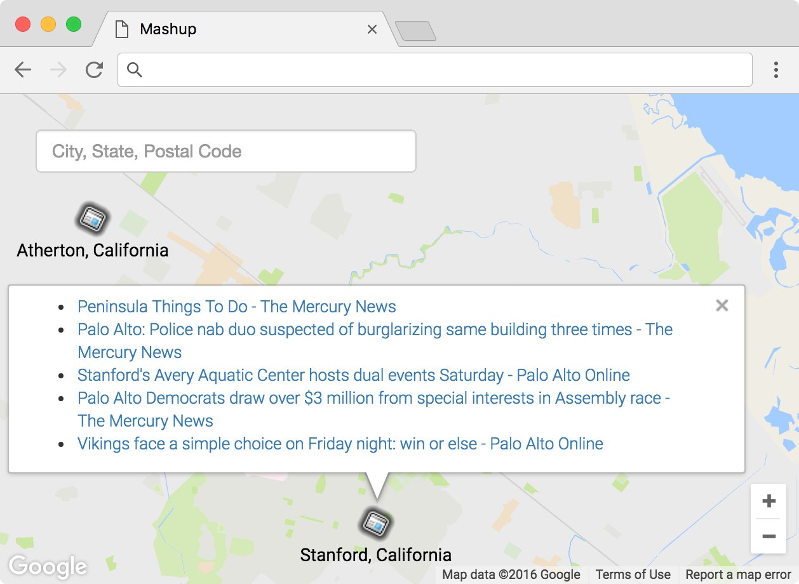

= Mashup

== tl;dr
 
Implement a website that lets users search for articles atop a map, a la the below.

== Background

A "mashup" is a web app that combines data or functionality from multiple sources. In this here mashup, you'll combine data from Google News with functionality from Google Maps!

=== Google Maps

Odds are you're already familiar, but head to Google Maps anyway at https://www.google.com/maps. Input *42.374490, -71.117185* into the search box up top, and you should find yourself at Harvard. Input *41.3163284, -72.9245318*, and you should find yourself at Yale.

Interesting! It seems Google Maps understands GPS coordinates (i.e., latitude and longitude). In fact, search for *28.410, -81.584*. Perhaps you'd rather be there? (You might need to zoom out.)

It turns out that Google Maps offers an API that allows you to embed Google's maps into your own web apps. Hey, that's one of the ingredients we need! Go ahead and familiarize yourself with https://developers.google.com/maps/documentation/javascript/[Google Maps Javascript API] by perusing the three sections below of its Developer's Guide. Read through any sample code carefully, clicking *View example* below it, if present, to see the code in action.

* https://developers.google.com/maps/documentation/javascript/tutorial[Getting Started]
* Drawing on the Map
** https://developers.google.com/maps/documentation/javascript/markers[Markers]
** https://developers.google.com/maps/documentation/javascript/infowindows[Info Windows]

=== Google News

Okay, now we need us some news. If you happen to have a Google Account (e.g., Gmail), head to https://news.google.com/ and click the Personalize button at top-right. Below the icon should appear *Personalize Google News*, down below which is *Add Any News Topic*. Input, say, *Cambridge, Massachusetts* or *New Haven, Connecticut* into that box, then click *+*. When you refresh your page you should see the new section added to your side bar. Additionally, you can search for location based news by modifying parameters in the URL, like the ones below. For a full list of parameters you can check out http://i-tweak.blogspot.com/2013/10/google-news-search-parameters-missing.html[this guide].

* https://news.google.com/news/section?cf=all&pz=1&geo=Cambridge,+Massachusetts&ned=us&redirect=true
* https://news.google.com/news/section?cf=all&pz=1&geo=New+Haven,+Connecticut&ned=us&redirect=true

Not to worry if you don't have a Google Account. Just head straight to either URL.

Interesting, it looks like our input is now the value of an HTTP parameter, `geo`, though there's a bunch of other parameters too. (Know that `+` is one way a browser can encode a space in a URL. Another way is with `%20`.) One at a time, delete each of those other key-value pairs plus an ampersand (e.g., first `cf=all&`, then `pz=1&`, then `&ned=us`, then `&redirect=true`, hitting Enter after each deletion so as to reload the page via a shorter and shorter URL. You should find that Google still returns news for Cambridge or New Haven even when the URL is either of the below?

* https://news.google.com/news/section?geo=Cambridge,+Massachusetts
* https://news.google.com/news/section?geo=New+Haven,+Connecticut

Nice. Never fear a bit of trial and error! Now try changing the value of `geo` to, say, `02138` or `06511` and then hit Enter again. You should find yourself at the URL below? The articles might change (since Cambridge and New Haven have more than one postal code each), but the news should still be about Cambridge or New Haven?

* https://news.google.com/news/section?geo=02138
* https://news.google.com/news/section?geo=06511

Very nice. Though the page you're looking at, of course, is written in HTML. And all we want, if the staff's solution is any indication, is a bulleted list of articles' titles and links. How to get those without "scraping" this page's (surely complicated) HTML? Scroll down to the page's bottom and look for *RSS*. Click that link, and you should find yourself at one of the URLs below?

* https://news.google.com/news?cf=all&hl=en&pz=1&ned=us&geo=02138&output=rss
* https://news.google.com/news?cf=all&hl=en&pz=1&ned=us&geo=06511&output=rss

As before, delete any parameters that don't feel core to the mission at hand, leaving only, say, `geo` and, now, `output`. You should find yourself at one of the (still fully functional) URLs below.

* https://news.google.com/news/feeds?geo=02138&output=rss
* https://news.google.com/news/feeds?geo=06511&output=rss

Deleting those parameters probably isn't necessary (and, who knows, their absence might break things eventually), but whittling a URL down to its essence does feel like better design, so let's stick with simple.

Now, what's all this markup that's now on your screen? It looks a bit like HTML, but you're actually looking at an "RSS feed," a flavor of XML (a tag-based markup language). For quite some time, RSS was all the rage insofar as it enabled websites to "syndicate" articles in a standard format that "RSS readers" could read. RSS isn't quite as hip anymore these days, but it's still a terrific find for us because it's "machine-readable". Because it adheres to a standard format, we can parse it (pretty easily!) with software. Here's what an RSS feed generally looks like (sans actual data):

[source,xml]
----
<rss version="2.0">
    <channel>
        <title>...</title>
        <description>...</description>
        <link>...</link>
        <item>
            <guid>...</guid>
            <title>...</title>
            <link>...</link>
            <description>...</description>
            <category>...</category>
            <pubDate>...</pubDate>
        </item>
        ...
    </channel>
</rss>
----

In other words, an RSS feed contains a root element called `rss`, the child of which is an element called `channel`.  Inside of `channel` are elements called `title`, `description`, and `link`, followed by one or more elements called `item`, each of which represents an article (or blog post or the like). Each `item`, meanwhile, contains elements called `guid`, `title`, `link`, `description`, `category`, and `pubDate`. Of course, between most of these start tags and end tags should be actual data (e.g., an article's actual title). For more details, see https://cyber.law.harvard.edu/rss/rss.html.

Ultimately, we'll parse RSS feeds from Google News using Python and then return articles' titles and links to our web app via Ajax as JSON. But more on that in a bit.

=== jQuery

Recall that http://jquery.com/[jQuery] is a popular JavaScript library that "makes things like HTML document traversal and manipulation, event handling, animation, and Ajax much simpler with an easy-to-use API that works across a multitude of browsers." To be fair, though, it's not without a learning curve. Read through a few sections of jQuery's documentation if you'd like.

* http://learn.jquery.com/using-jquery-core/document-ready/[$( document ).ready()]
* http://learn.jquery.com/using-jquery-core/selecting-elements/[Selecting Elements]
* http://learn.jquery.com/ajax/jquery-ajax-methods/[jQuery's Ajax-Related Methods]

jQuery's documentation isn't the most user-friendly, though, so odds are you'll ultimately find https://www.google.com/[Google] and http://stackoverflow.com/[Stack Overflow] handier resources.

Recall that `$` is usually (though not always) an alias for a global object that's otherwise called `jQuery`.

=== typeahead.js

Now take a look at some examples of Twitter's typeahead.js library, a jQuery "plugin" that adds support for autocompletion to HTML text fields. Play with *The Basics*, *Custom Templates*, and *Scrollable Dropdown Menu* in particular.

http://twitter.github.io/typeahead.js/examples/

And now skim the documentation for a "fork" (i.e., someone else's version) of that same library:

https://github.com/corejavascript/typeahead.js/blob/master/doc/jquery_typeahead.md

Note that Twitter hasn't updated their own version of the library for quite some time, so take care to rely on https://github.com/corejavascript/typeahead.js[github.com/corejavascript/typeahead.js], not https://github.com/twitter/typeahead.js[github.com/twitter/typeahead.js].

== Distribution

=== Downloading

[source,subs="macros"]
----
$ wget https://github.com/cs50/problems/archive/mashup.zip
$ unzip mashup.zip
$ rm mashup.zip
$ mv problems-mashup mashup
$ cd mashup
$ ls
application.py  mashup.db         static/
helpers.py      requirements.txt  templates/
$ wget http://cdn.cs50.net/2016/fall/psets/8/US.zip
$ unzip US.zip
$ rm US.zip
$ ls
application.py  mashup.db   requirements.txt  templates/
helpers.py      readme.txt  static/           US.txt
----

=== Configuring

. In a terminal window, within `mashup/`, execute
+
[source]
----
pip install --user -r requirements.txt
----
+
to install this problem's dependencies.
. If you don't already have a Google account (e.g., Gmail), sign up at https://accounts.google.com/SignUp[accounts.google.com/SignUp].
. Visit https://developers.google.com/maps/web/[developers.google.com/maps/web/], logging in if prompted, and click **GET A KEY** at top-right.
. Click *Select or create project*, click *+Create a new project*, and input *pset8* (or anything else) under *Enter new project name*.
. Click *CREATE AND ENABLE API*.
. Highlight and copy the value below *YOUR API KEY*.
. In a terminal window, execute
+
[source]
----
export API_KEY=value
----
+
where `value` is that (pasted) value, without any space immediately before or after the `=`.

If you need to find that value later (to copy and paste it again), visit https://console.developers.google.com/[console.developers.google.com] and click *Credentials* at top-left.

=== Running

. Start Flask's built-in web server (within `mashup/`):
+
[source]
----
flask run
----
+
Select *CS50 IDE > Web Server* to see the distribution code in action. You won't be able to search for news, though, just yet!
. In another terminal window, start phpLiteAdmin (within `mashup/`):
+
[source]
----
phpliteadmin mashup.db
----
+
And open the URL that `phpliteadmin` outputs in a new tab. No tables yet! Here on out, if you'd prefer a command line, you're welcome to use `sqlite3` instead of phpLiteAdmin.

=== Understanding

==== index.html

Open up `templates/index.html`, which will be your app's one and only HTML page. If you look at the page's `head`, you'll see 
all those CSS and JavaScript libraries we'll be using (plus some others). Included in HTML comments are URLs for each library's documentation if curious. 

Next take a look at the page's `body`, inside of which is `div` with a unique `id` of `map-canvas`. It's into that `div` that we'll be injecting a map. Below that `div`, meanwhile, is a `form`, inside of which is an `input` of type `text` with a unique `id` of `q` that we'll use to take input from users.

==== styles.css

Next open up `static/styles.css`. In there is a bunch of CSS that implements the mashup's default UI. Feel free to tinker (i.e., make changes, save the file, and reload the page in Chrome) to see how everything works, but best to undo any such changes for now before forging ahead.

==== scripts.js

Next open up `static/scripts.js`. Ah, the most interesting file yet! It's this file that implements the mashup's "front-end" UI, relying on Google Maps and some "back-end" Flask routes for data (that we'll soon explore). Let's walk through this one.

Atop the file are some global variables:

* `map`, which will contain a reference (i.e., a pointer of sorts) to the map we'll soon be instantiating;
* `markers`, an array that will contain references to any markers we add atop the map; and
* `info`, a reference to an "info window" in which we'll ultimately display links to articles.

Below those global variables is an anonymous function that will be called automatically by jQuery when the mashup's DOM is fully loaded (i.e., when `index.html` and all its assets, CSS and JavaScript especially, have been loaded into memory).

Atop this anonymous function is a definition of `styles`, an array of two objects that we'll use to configure our map, as per https://developers.google.com/maps/documentation/javascript/styling. Recall that `[` and `]` denote an array, while `{` and `}` denote an object. The (very pretty) indentation you see is just a stylistic convention to which it's probably ideal to adhere in your code as well.

Below `styles` is `options`, another collection of keys and values that will ultimately be used to configure the map further, as per https://developers.google.com/maps/documentation/javascript/3.exp/reference#MapOptions.

Next we define `canvas`, by using a bit of jQuery to get the DOM node whose unique `id` is `map-canvas`. Whereas `$("#map-canvas")` returns a jQuery object (that has a whole bunch of functionality built-in), `$("#map-canvas").get(0)` returns the actual, underlying DOM node that jQuery is just wrapping.

Perhaps the most powerful line yet is the next one in which we assign `map` (that global variable) a value. With 

[source,js]
----
new google.maps.Map(canvas, options);
----

we're telling the browser to instantiate a new map, injecting it into the DOM node specified by `canvas`), configured per `options`.

The line below that one, meanwhile, tells the browser to call `configure` (another function we've written) as soon as the map is loaded.

===== addMarker

Ah, a `TODO`. Ultimately, given a `place` (i.e., postal code and more), this function will need to add a marker (i.e., icon) to the map.

===== configure

This function, meanwhile, picks up where that anonymous function left off. Recall that `configure` is called as soon as the map has been loaded. Within this function we configure a number of "listeners," specifying what should happen when we "hear" certain events. For instance,

[source,js]
----
google.maps.event.addListener(map, "dragend", function() {
    update();
});
----

indicates that we want to listen for a `dragend` event on the map, calling the anonymous function provided when we hear it. That anonymous function, meanwhile, simply calls `update` (another function we'll soon see). Per https://developers.google.com/maps/documentation/javascript/3.exp/reference#Map, `dragend` is "fired" (i.e., broadcasted) "when the user stops dragging the map." 

Similarly do we listen for `zoom_changed`, which is fired "when the map zoom property changes" (i.e., the user zooms in or out).

On the other hand, upon hearing `dragstart`, we ultimately call `removeMarkers` so that all markers disappear temporarily as a user drags the map, thereby avoiding the appearance of a flicker that might otherwise happen as markers are removed and then re-added after the maps bounds (i.e., corners) have changed.

Below those listeners is our configuration of that typeahead plugin. Take another look at https://github.com/corejavascript/typeahead.js/blob/master/doc/jquery_typeahead.md if unsure what `highlight` and `minLength` do here. Most importantly, though, know that the value of `source` (i.e., `search`) is the function that the plugin will call as soon as the user starts typing so that the function can respond with an array of search results based on the user's input. For instance, if the user types `foo` into that text box, the function should ultimately return an array of all places in your database that somehow match `foo`. How to perform those matches will ultimately be left to you! The value of `templates`, meanwhile, is an object with one key, `suggestion`, whose value is a "template" that will be used to format each entry in the plugin's dropdown menu. That template is created by a call to `Handlebars.compile`, a method that comes with http://handlebarsjs.com/[Handlebars], a templating language for JavaScript similar in spirit to Jinja for Python. Right now, that template is simply `
TODO
`, which means that every entry in that dropdown will literally say `TODO`. Ultimately, you'll want to change that value to something like

[source,js]
----

{{place_name}}, {{admin_name1}}, {{postal_code}}

----

so that the plugin dynamically inserts those values (`place_name`, `admin_name1`, and `postal_code`) or some others for you. 

Next notice these lines, which are admittedly a bit cryptic at first glance:

[source,js]
----
$("#q").on("typeahead:selected", function(eventObject, suggestion, name) {
    ...
    map.setCenter({lat: parseFloat(suggestion.latitude), lng: parseFloat(suggestion.longitude)});
    ...
    update();
});
----

These lines are saying that if the HTML element whose unique `id` is `q` fires an event called `typeahead:selected`, as will happen when the user selects an entry from the plugin's dropdown menu, we want jQuery to call an anonymous function whose second argument, `suggestion`, will be an object that represents the entry selected. Within that object must be at least two properties: `latitude` and `longitude`. We'll then call `setCenter` in order to re-center the map at those coordinates, after which we'll call `update` to update any markers. 

Below those lines, meanwhile, are these:

[source,js]
----
$("#q").focus(function(eventData) {
    info.close();
});
----

If you consult http://api.jquery.com/focus/, hopefully those lines will make sense?

Below those are these:

[source,js]
----
document.addEventListener("contextmenu", function(event) {
    event.returnValue = true;
    event.stopPropagation && event.stopPropagation();
    event.cancelBubble && event.cancelBubble();
}, true);
----

Unfortunately, Google Maps disables ctrl- and right-clicks on maps, which interferes with using Chrome's (amazingly useful) *Inspect Element* feature, so these lines re-enable those.

Last up in `configure` is a call to `update` (which we'll soon look at) and a call to `focus`, this time with no arguments. See http://api.jquery.com/focus/ for why!

===== removeMarkers

Hm, a `TODO`. Ultimately, this function will need to remove any and all markers from the map!

===== search

This function is called by the typeahead plugin every time the user changes the mashup's text box, as by typing or deleting a character. The value of the text box (i.e., whatever the user has typed in total) is passed to `search` as `query`. And the plugin also passes to `search` two additional arguments, the last of which (`asyncResults`) is a "callback" function that `search` should call as soon as it's done searching for matches. In other words, this passing in of `asyncResults` empowers `search` to be "asynchronous," whereby it will only call `asyncResults` as soon as it's ready, without blocking any of the mashup's other functionality. Accordingly, `search` uses jQuery's `getJSON` method to contact `/search` asynchronously, passing in one parameter, `geo`, the value of which is `query`. Once `/search` responds (however many milliseconds or seconds later), the anonymous function passed to `done` will be called and passed `data`, whose value will be whatever JSON that `/search` has emitted. (Though if something goes wrong, `fail` is instead called.) Finally called is `asyncResults`, to which `search` passes that same `data` so that the plugin can iterate over the places therein (assuming `/search` found matches) in order to update the plugin's drop-down. Phew.

Notice that we're using ``getJSON``'s "Promise" interface, per http://api.jquery.com/jquery.getjson/. Rather than pass an anonymous function directly to `getJSON` (to be called upon success), we're instead "chaining" together calls to `getJSON`, `done` (whose argument, an anonymous function, will be called upon success), and `fail` (whose argument, another anonymous function, will be called upoon failure). See http://api.jquery.com/jquery.ajax/ for some additional details. And see https://davidwalsh.name/write-javascript-promises for an explanation of promises themselves.

Notice, too, that we're using `console.log` much like you might use `eprintf` in C to log errors for debugging's sake. You may want to do so as well! Just realize that `console.log` will log messages to the browser's console (i.e., the *Console* tab of Chrome's developer tools), not to your terminal window. See https://developer.mozilla.org/en-US/docs/Web/API/Console.log for tips.

===== showInfo

This function opens the info window at a particular marker with particular content (i.e., HTML). Though if only one argument is supplied (`marker`), `showInfo` simply displays a spinning icon (which is just an animated GIF). Notice, though, how this function is creating a string of HTML dynamically, thereafter passing it to `setContent`. Perhaps keep that technique in mind elsewhere!

===== update

Last up is `update`, which first determines the map's current bounds, the coordinates of its top-right (northeast) and bottom-left (southwest) corners. It then passes those coordinates to `/update` via a GET request (underneath the hood of `getJSON`) a la:

[source]
----
GET /update?ne=37.45215513235332%2C-122.03830380859375&q=&sw=37.39503397352173%2C-122.28549619140625 HTTP/1.1
----

The `%2C` are just commas that have been "URL-encoded." Realize that our use of commas is arbitary; we're expecting `/update` to parse and extract latitudes and longitudes from these parameters. We could have simply passed in four distinct parameters, but we felt it was semantically cleaner to pass in just one parameter per corner.

As we'll soon see, `/update` is designed to return a JSON array of places that fall within the map's current bounds (i.e., cities within view). After all, with those two corners alone can you define a rectangle, which is exactly what the map is!

As soon as `/update` responds, the anonymous function passed to `done` is called and passed `data`, the value of which is the JSON emitted by `/update`. (Though if something goes wrong, `fail` is instead called.) That anonymous function first removes all markers from the map and then iteratively adds new markers, one for each place (i.e., city) in the JSON.

Phew and phew!

==== application.py

Now open up `application.py`, which contains four routes!

===== `index`

Notice how this first route checks for an `API_KEY`, which Google Maps' JavaScript API requires. Ultimately, all this route does is pass that key to `index.html`, the app's sole template.

===== `articles`

Not much in here yet, just a `TODO`!

===== `search`

Not much in this route yet either, just another `TODO`!

===== `update`

Ah, okay, here's the "back end" that outputs a JSON array of up to 10 places (i.e., cities) that fall within the specified bounds (i.e., within the rectangle defined by those corners). You won't need to make changes to this route, but do read through it line by line, Googling any function with which you're not familiar. 

And yes, this file's SQL queries assume that the world is flat for simplicity.

==== `helpers.py`

Finally, take a look at `helpers.py`. In this file we've defined just one function, `lookup`, which queries Google News for articles for a particular geography, falling back on The Onion if none are available.

== Specification

=== `mashup.db`

Per `readme.txt`, `US.txt` is quite like a CSV file except that its fields are delimited with `\t` (a tab character) instead of a comma. Conveniently, SQLite allows you to https://www.sqlite.org/cli.html#csv_import[import CSV files] and, as it turns out, TSV (tab-separated values) files as well. But you first need a table into which to import such a file.

Using phpLiteAdmin or `sqlite3`, create a table in `mashup.db` called `places` that has these twelve fields, in this order:

. `country_code`
. `postal_code`
. `place_name`
. `admin_name1`
. `admin_code1`
. `admin_name2`
. `admin_code2`
. `admin_name3`
. `admin_code3`
. `latitude`
. `longitude`
. `accuracy`

See `readme.txt` (or `US.txt` itself) for clues as to appropriate types for these fields. Don't include an `id` field (else you can't do what we're about to do!).

Rather than `INSERT` the rows from `US.txt` into your newly created table, let's now import them in bulk as follows:

[source]
----
$ sqlite3 mashup.db
.separator "\t"
.import US.txt places
----

If you see any errors, odds are your schema for `places` isn't quite right, in which case you'll want to `ALTER` (or `DROP` and re-``CREATE``) it accordingly. To confirm that an import's successful, execute

[source]
----
wc -l US.txt
----

to count how many rows are in `US.txt`. (That command-line argument is a hyphen followed by a lowercase L.) Then execute a query like

[source]
----
SELECT COUNT(*) FROM places;
----

in `sqlite3` or phpLiteAdmin. The counts should match!

=== `application.py`

==== `articles`

Complete the implementation of `/articles` in such a way that it outputs a JSON array of objects, each of which represents an article for `geo`, whereby `geo` is passed into `/articles` as a GET parameter, as in the staff solution, below. 

* http://pset8.cs50.net/articles?geo=02138
* http://pset8.cs50.net/articles?geo=06511
* http://pset8.cs50.net/articles?geo=90210

Odds are you'll want to call `lookup`! To test `/articles`, even before your text box is operational, simply visit URLs like

* `pass:[https://ide50-username.cs50.io/articles?geo=02138]`
* `pass:[https://ide50-username.cs50.io/articles?geo=06511]`
* `pass:[https://ide50-username.cs50.io/articles?geo=90210]`

and other such variants, where `username` is your own username, to see if you get back the JSON you expect.

==== `search`

Complete the implementation of `/search` in such a way that it outputs a JSON array of objects, each of which represents a row from `places` that somehow matches the value of `q`, as in the staff solution below. 

* http://pset8.cs50.net/search?q=02138
* http://pset8.cs50.net/search?q=Cambridge
* http://pset8.cs50.net/search?q=06511
* http://pset8.cs50.net/search?q=New+Haven

The value of `q`, passed into `/search` as a GET parameter, might be a city, state, and/or postal code. We leave it to you to decide what constitutes a match and, therefore, which rows to `SELECT`. It suffices to support searching by postal codes only, but try to support searching by city and/or state as well. Odds are you'll find SQL's `LIKE` keyword helpful. If feeling adventurous, you might like (but are not required) to experiment with SQLite's support for https://www.sqlite.org/fts3.html[full-text searches].

For instance, consider the query below.

[source,sql]
----
db.execute("SELECT * FROM places WHERE postal_code = :q", q=request.args.get("q"))
----

Unfortunately, that query requires that a user's input be exactly equal to a postal code (per the `=`), which isn't all that compelling for autocomplete. How about this one instead? (Recall that `+` is Python's concatenation operator.)

[source,sql]
----
q = request.args.get("q") + "%"
db.execute("SELECT * FROM places WHERE postal_code LIKE :q", q=q)
----

Notice how this example appends `%` to the user's input, which happens to be SQL's "wildcard" character that means "match any number of characters." The effect is that this query will return rows whose postal codes match whatever the user typed followed by any number of other characters. In other words, any of `0`, `02`, `021`, `0213`, and `02138` might return rows, as might any of `0`, `06`, `065`, `0651`, and `06511`.

If you'd like to support searching by more than just postal codes, keep in mind that SQL supports `OR` and `AND`!

To test `/search`, even before your text box is operational, simply visit URLs like

* `pass:[https://ide50-username.cs50.io/search?q=02138]`
* `pass:[https://ide50-username.cs50.io/search?q=Cambridge+MA]`
* `pass:[https://ide50-username.cs50.io/search?q=Cambridge,+MA]`
* `pass:[https://ide50-username.cs50.io/search?q=Cambridge,+Massachusetts]`
* `pass:[https://ide50-username.cs50.io/search?q=Cambridge,+Massachusetts,+US]`

or

* `pass:[https://ide50-username.cs50.io/search?q=06511]`
* `pass:[https://ide50-username.cs50.io/search?q=New+Haven+CT]`
* `pass:[https://ide50-username.cs50.io/search?q=New+Haven,+CT]`
* `pass:[https://ide50-username.cs50.io/search?q=New+Haven,+Connecticut]`
* `pass:[https://ide50-username.cs50.io/search?q=New+Haven,+Connecticut,+US]`

and other such variants, where `username` is your own username, to see if you get back the JSON you expect. Again, though, we leave it to you to decide just how supportive `/search` will be of such variants. The more flexible, though, the better! Try to implement features that you yourself would expect as a user!

Feel free to tinker with the staff's solution at http://pset8.cs50.net/, inspecting its HTTP requests via Chrome's Network tab as needed, if unsure how your own code should work!

==== `scripts.js`

First, toward the top of `scripts.js`, you'll see an anonymous function, inside of which is a definition of `options`, an object, one of whose keys is `center`, the value of which is an object with two keys of its own, `lat`, and `lng`. Per the comment alongside that object, your mashup's map is currently centered on Stanford, California. (D'oh.) Change the coordinates of your map's center to Cambridge (42.3770, -71.1256) or New Haven (41.3184, -72.9318) or anywhere else! (Though be sure to choose coordinates in the US if you downloaded `US.txt`!) Once you save your changes and reload your map, you should find yourself there! Zoom out as needed to confirm visually.

As before, feel free to tinker with the staff's solution at http://pset8.cs50.net/, inspecting its HTTP requests via Chrome's Network tab as needed, if unsure how your own code should work!

==== `configure`

Now that `/search` and your text box are (hopefully!) working, modify the value of `suggestion` in `configure`, the function in `scripts.js`, so that it displays matches (i.e., `place_name`, `admin_name1`, and/or other fields) instead of `TODO`. Recall that a value like

[source,html]
----

{{place_name}}, {{admin_name1}}, {{postal_code}}

----

might do the trick.

==== `addMarker`

Implement `addMarker` in `scripts.js` in such a way that it adds a marker for `place` on the map, where `place` is a JavaScript object that represents a row from `places`. See https://developers.google.com/maps/documentation/javascript/markers for tips. Note that the latest (experimental) version of Google's API allows markers to have https://developers.google.com/maps/documentation/javascript/3.exp/reference#MarkerOptions[labels].

When a marker is clicked, it should trigger the mashup's info window to open, anchored at that same marker, the contents of which should be an unordered list of links to article for that article's location (unless `/articles` outputs an empty array)!

Not to worry if some of your markers (or labels) overlap others, assuming such is the result of imperfections in Google's API or `US.txt` and not your own code!

If you'd like to customize your markers' icon, see https://developers.google.com/maps/documentation/javascript/markers#simple_icons. For the URLs of icons built-into Google Maps, see http://www.lass.it/Web/viewer.aspx?id=4. For third-party icons, see https://mapicons.mapsmarker.com/.

==== removeMarkers

Implement `removeMarkers` in such a way that it removes all markers from the map (and deletes them). Odds are you'll need `addMarker` to modify that global variable called `markers` in order for `removeMarkers` to work its own magic!

== Walkthroughs

video::LGOXIN87giE[youtube,list=PLhQjrBD2T383MDO-WBcfAq5SIsoEfoW07]

== Testing

No `check50` for this one, but be sure to try to "break" your own site, as by

* searching for cities that don't exist,
* clicking markers for cities that don't have any articles,
* dragging and zooming in and out to update your map's markers, and
* searching with potentially dangerous characters like `'` and `;`.

== Staff's Solution

You're welcome to stylize your own app differently, but here's what the staff's solution looks like!

http://mashup.cs50.net/

It is *reasonable* to look at the staff's HTML and CSS. It is *not reasonable* to look at the staff's JavaScript.

== Hints

* You're welcome center your map on some country other than the United States, downloading http://download.geonames.org/export/zip/[some other ZIP file] instead of `US.zip`. See https://en.wikipedia.org/wiki/ISO_3166-1_alpha-2#Officially_assigned_code_elements[Wikipedia] if unfamiliar with ISO 3166-1 alpha-2 codes.

== FAQs

=== CREATE TABLE places(...) failed: duplicate column name

If you see this message upon running `.import` in `sqlite3`, odds are you haven't run `sqlite3` in the same directory as `mashup.db`. If so, exit `sqlite3` with `.exit`, `cd` to your `mashup` directory, and then re-run `sqlite3 mashup.db`.

== CHANGELOG

* 2016-11-04
** Initial release.
